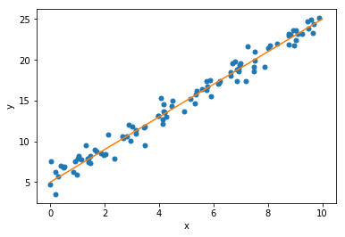

```python
#1 - #sort descending

import numpy as np
array_1 = np.array([3, 6, -21, -1 ,4])


-np.sort(-array_1)

```


    array([  6,   4,   3,  -1, -21])


```python
#2 - Calculating percent of values in an array.  Very usefult to calculate p values.

array_1 = np.array([1,0,1,3,1,0,1,1,2,1,0,1,2,0,0,0,2,0,2,2,0,1,0,0,0,1,1,1,2,1,0,0,0,0,0,2,0
,0,0,1,2,0,1,2,2,0,0,0,3,0,0,0,2,2,2,1,2,0,2,1,2,2,0,0,0,1,0,0,0,1,1,1,1,0
,0,0,1,2,0,0,2,1,0,1,2,1,2,0,2,1,2,0,0,2,2,0,3,0,0,1,2,0,2,3,2,1,1,3,1,0,1
,0,1,0,1,1,0,0,1,3,2,1,1,0,1,0,1,0,1,0,2,0,3,1,0,0,3,0,1,1,0,1,2,0,0,2,0,3
,0,1,0,0,0,1,1,2,3,1,0,2,1,0,0,1,3,1,2,2,0,1,2,1,1,3,1,2,0,0,1,1,0,0,1,2,0
,1,0,0,1,0,0,0,0,2,1,1,0,0,0,1,1,2,2,1,1,0,3,1,1,0,1,3,1,0,2,2,1,2,2,1,1,0
,0,0,1,0,0,0,0,1,4,1,2,1,1,1,1,1,2,2,2,1,0,1,0,1,1,0,0,0,2,1,1,0,0,0,2,1,1
,2,0,0,1,1,0,0,0,0,1,2,0,2,0,0,1,1,1,1,2,1,3,0,1,0,0,1,1,2,0,0,3,0,4,2,0,1
,2,0,1,1,0,0,3,1,1,2,1,2,1,0,0,2,1,0,2,0,1,2,0,0,1,0,0,4,2,2,0,1,2,0,0,0,2
,1,0,1,1,2,2,3,0,0,2,0,0,2,1,2,0,1,0,3,1,0,2,2,1,1,1,0,1,0,1,0,1,1,0,0,1,0
,1,1,2,0,1,0,0,1,1,0,2,0,3,0,2,2,1,1,1,0,1,1,3,0,2,2,0,0,0,0,2,1,1,1,0,0,4
,1,2,1,3,1,0,0,3,1,2,3,1,2,6,3,3,1,1,2,1,1,0,2,1,1,3,0,1,2,2,1,1,1,0,0,3,1
,0,0,1,0,1,1,1,0,0,0,1,1,1,2,1,2,3,1,1,1,2,1,2,1,1,0,3,2,2,0,1,0,0,0,0,1,1
,1,1,2,0,1,1,0,0,0,3,0,1,1,1,3,3,0,0,2,2,1,1,1,1,1,1,0,0,1,1,2,1,3,2,0,1,0
,2,2,1,1,0,3,1,1,0,1,0,1,1,1,3,0,1,1,2,0,0,2,1,0,0,0,4,0,3,2,1,1,1,0,1,0,0
,0,0,1,0,3,1,0,0,1,0,0,2,0,0,2,0,1,0,1,0,1,0,0,2,0,1,1,2,3,0,3,1,0,1,0,1,2
,0,1,2,0,1,1,1,2,1,3,1,0,0,1,2,0,0,1,1,1,1,1,2,0,2,1,2,2,1,2,2,1,3,1,1,1,1
,1,2,1,0,2,0,0,3,1,1,3,0,1,1,1,3,0,0,2,3,1,1,2,1,1,2,3,0,2,0,2,2,0,1,1,1,2
,0,2,1,0,1,1,1,0,3,0,1,0,0,0,2,2,3,1,3,0,0,0,0,1,1,0,0,2,3,0,2,1,0,2,1,0,1
,0,1,1,0,1,1,0,0,2,1,2,0,1,2,0,1,2,1,0,1,0,0,0,3,0,0,3,2,0,2,3,0,3,0,1,1,1
,1,1,1,4,0,1,1,1,1,0,2,0,1,1,2,0,1,2,1,2,2,2,1,0,0,1,2,0,1,1,0,1,1,1,1,1,0
,1,0,3,3,0,1,2,3,0,0,1,1,3,1,1,1,0,3,2,1,0,1,1,1,0,0,0,2,2,0,2,1,2,2,1,0,0
,0,1,0,0,0,0,2,3,2,2,1,2,2,2,3,1,0,1,3,0,0,2,2,2,0,2,2,1,0,2,1,0,2,1,2,0,1
,0,1,0,0,1,0,1,3,1,2,2,1,0,1,0,0,0,0,2,0,2,0,0,0,1,0,0,1,2,0,0,1,2,2,0,1,1
,1,1,1,1,0,1,3,1,1,2,0,0,3,1,2,0,1,0,1,3,0,1,1,2,2,3,1,1,1,4,2,0,1,1,0,1,0
,2,2,1,2,0,1,0,0,1,0,2,2,1,0,1,1,2,3,0,0,3,1,0,2,1,1,0,2,1,0,1,0,1,2,0,1,0
,3,0,0,0,2,1,0,2,0,0,0,1,2,1,1,1,1,1,1,1,0,2,0,1,1,1,1,1,1,0,1,1,0,1,1,1,0
,1])

#version1
array_sorted = np.sort(array_1)
indx = np.argmax(array_sorted > 2)
p_value = (array_sorted.size - indx)/array_sorted.size
print(p_value)


#version 2
print(np.mean(array_1 > 2))


```

    0.079
    0.079
    


```python
#3 - column-standadization and Co-variance of a data matrix
import numpy as np

#version 1
#column Standarization
array_1 = np.array(([-2.1, -1,  4.3],[3,  1.1,  0.12], [4,  6, 10] ))
array_stacked = np.column_stack(array_1)
mean_cols = [np.mean(array_stacked[i,]) for i in range(0,array_stacked.shape[0])]
std_cols = [np.std(array_stacked[i,]) for i in range(0,array_stacked.shape[0])]

#Column standardize the array
col_standardardize_array = np.array([ (array_1[i,j] -  mean_cols[j])/std_cols[j] for i in range(0,array_1.shape[0]) for j in range(0,array_1.shape[1])])                                                 
X = np.reshape(col_standardardize_array, array_1.shape)
print("Version 1 - writing your own code to column-standardize a matrix")
print(X)
print()

#Calculate the Covariance of the data matrix
print("Version 1 - Calculate the covariance of a data matrix")
print(np.matmul(X.T, X)/X.shape[0])


#Version 2
#using scikit learn to column- standardize the matrix and verify the code
from sklearn.preprocessing import StandardScaler
data = [[-2.1, -1,  4.3],[3,  1.1,  0.12], [4,  6, 10]]
scaler = StandardScaler()
print()
print()
print("Version 2 - use scikit learn to column-standardize a matrix")
scaler.fit(data)
print(scaler.transform(data))


```

    Version 1 - writing your own code to column-standardize a matrix
    [[-1.39759994 -1.03422447 -0.12512225]
     [ 0.51162141 -0.31822291 -1.15738081]
     [ 0.88597853  1.35244738  1.28250306]]
    
    Version 1 - Calculate the covariance of a data matrix
    [[1.         0.82695391 0.23966674]
     [0.82695391 1.         0.74407583]
     [0.23966674 0.74407583 1.        ]]
    
    
    Version 2 - use scikit learn to column-standardize a matrix
    [[-1.39759994 -1.03422447 -0.12512225]
     [ 0.51162141 -0.31822291 -1.15738081]
     [ 0.88597853  1.35244738  1.28250306]]
    


```python
from sklearn.metrics import log_loss
log_loss(["spam", "ham", "ham", "spam"],[[.1, .9], [.9, .1], [.8, .2], [.35, .65]])
```


    0.21616187468057912


```python
import networkx as nx
%matplotlib inline

import matplotlib
import matplotlib.pyplot as plt


degree_sequence = [d for n, d in nx.erdos_renyi_graph(100, 0.03).degree()]
plt.hist(degree_sequence, histtype="step")


degree_sequence = [d for n, d in nx.erdos_renyi_graph(100, 0.30).degree()]
plt.hist(degree_sequence, histtype="step")
```


    (array([ 2.,  4., 13., 21., 15., 25., 11.,  6.,  2.,  1.]),
     array([19. , 21.4, 23.8, 26.2, 28.6, 31. , 33.4, 35.8, 38.2, 40.6, 43. ]),
     <a list of 1 Patch objects>)


```python
from collections import Counter
favorite_colors = {
    "ankit":  "red",
    "xiaoyu": "blue",
    "mary":   "blue"
}


set(favorite_colors.values())

def frequency(chars):
    return dict(Counter(chars.values()))
    


frequency(favorite_colors)


#lendict = len(favorite_colors)
#homophily = 0
#for v in frequency(favorite_colors).values():
#    print(v)
#    homophily = homophily + (v/lendict)**2
    
#print(homophily)
```


    {'red': 1, 'blue': 2}


```python
#Generate Linear Regression data
%matplotlib inline
import numpy as np 
import scipy.stats as ss 
import matplotlib.pyplot as plt 
n = 100 
beta_0 = 5 
beta_1 = 2 
np.random.seed(1) 
x = 10 * ss.uniform.rvs(size=n) 
y = beta_0 + beta_1 * x + ss.norm.rvs(loc=0, scale = 1, size = n) 
plt.figure()
plt.plot(x,y,"o", ms= 5)
xx = np.array([0, 10])
plt.plot(xx, beta_0 + beta_1 * xx)
plt.xlabel("x")
plt.ylabel("y")
plt.show()


```




