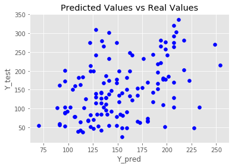
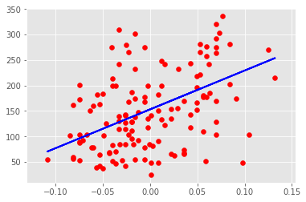
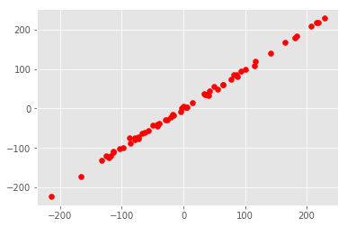
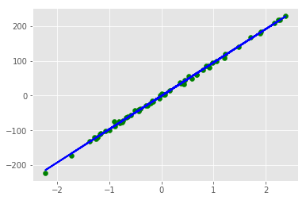

```python
%matplotlib inline
# from sklearn import *
from sklearn import datasets, linear_model
from sklearn.metrics import mean_squared_error,r2_score,accuracy_score
from matplotlib.pyplot import * 
import matplotlib.pyplot as plt
import numpy as np 
 
# from sklearn.model_selection
from sklearn.model_selection import train_test_split
# Load boston dataset
diabetes= datasets.load_diabetes()
 
# print(diabetes.keys())
#print(diabetes.DESCR)
# print(diabetes.data.shape)
 
# Define  predictor values:  All 12 features
X=diabetes.data[:,np.newaxis,3]
# print(x.shape)
 
# Define targets values:  target feature i.e. Price of Home
Y=diabetes.target
# print(y.shape)
 
# Split train and test data
X_train,X_test,Y_train,Y_test=train_test_split(X,Y,test_size=0.3)
 
# Build Regression Model
reg=linear_model.LinearRegression()
 
#Train the Model
reg.fit(X_train,Y_train)
 
#Test the Model
Y_pred=reg.predict(X_test)
 
#Find Coefficient of Regressor Line]
Coef=reg.coef_
print(Coef)
#Find Accuracy
# ACC=sum(abs((Y_test-Y_pred)/Y_test))/len(Y_test)
R2=r2_score(Y_test,Y_pred)
MSE=mean_squared_error(Y_test,Y_pred)
print(R2,MSE)
# a=list(range(127))
# print(a)
# plt.scatter(a,Y_pred, color='blue')
 
# Define Style of plot
style.use('ggplot')
#plot the results
plt.scatter(Y_pred,Y_test, color='blue')
plt.title('Predicted Values vs Real Values')
plt.xlabel('Y_pred')
plt.ylabel('Y_test')
 
# plt.xticks(())
# plt.yticks(())
plt.show()
 
plt.scatter(X_test,Y_test,color='red')
plt.plot(X_test,Y_pred,color='blue',linewidth=2)
plt.show()
```

    [760.96814311]
    0.16014449118757867 4935.756995491505
    








```python
X,Y=datasets.make_regression(n_samples=200,n_features=1,n_targets=1,random_state=0,noise=4.0)
X_train,X_test,Y_train,Y_test=train_test_split(X,Y,test_size=0.3)
reg=linear_model.LinearRegression()
reg.fit(X_train,Y_train)
Y_pred=reg.predict(X_test)
Coef=reg.coef_
R2=r2_score(Y_test,Y_pred)
MSE=mean_squared_error(Y_test,Y_pred)
print(Coef,R2,MSE)
style.use('ggplot')
plt.scatter(Y_pred,Y_test,color='red')
plt.show()
plt.scatter(X_test,Y_test,color='green')
plt.plot(X_test,Y_pred,color='blue',linewidth=2)
plt.show()
```

    [96.32149992] 0.9985467462064717 15.404080495321288
    







