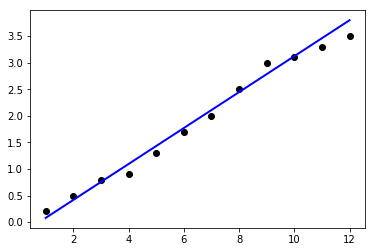

# Linear Regression Code Snippet


```python
import numpy as np
from numpy import *
import matplotlib.pyplot as plt
from sklearn import linear_model
from sklearn.metrics import mean_squared_error,r2_score
x_train = array([1,2,3,4,5,6,7,8,9,10])
y_train= array([0.2,0.5,0.8,0.9,1.3,1.7,2,2.5,3,3.1])
x_test= array([11,12])
y_test= array([3.3,3.5])
x_train=x_train.reshape(-1,1)
y_train=y_train.reshape(-1,1)
x_test=x_test.reshape(-1,1)
y_test=y_test.reshape(-1,1)
regr=linear_model.LinearRegression()
regr.fit(x_train,y_train)
y_pred=regr.predict(x_test)
acc=regr.score(x_test,y_test)
print(acc)
print('Coeff: \n', regr.coef_)
print('MSE : \n',mean_squared_error(y_test,y_pred))
print('Var: \n',r2_score(y_test,y_pred))
x=np.concatenate((x_train,x_test),axis=0)
y=np.concatenate((y_train,y_test),axis=0)
y_p=regr.predict(x)
plt.scatter(x,y, color='black')
plt.plot(x,y_p,color='blue',linewidth=2)
plt.show()
```

    -4.725619834710754
    Coeff: 
     [[0.33818182]]
    MSE : 
     0.05725619834710764
    Var: 
     -4.725619834710754
    




