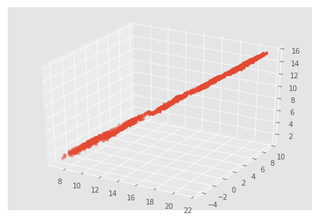
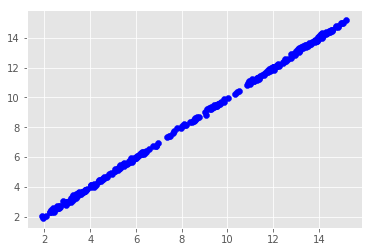
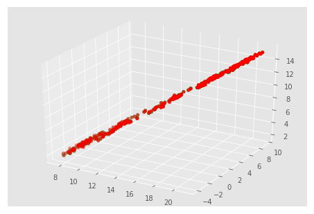
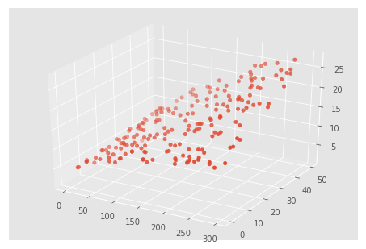
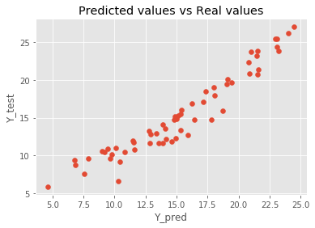
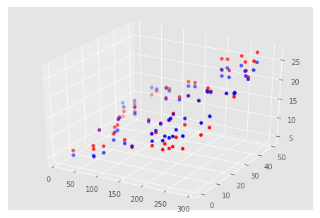
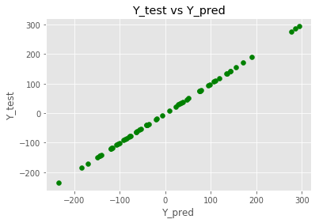
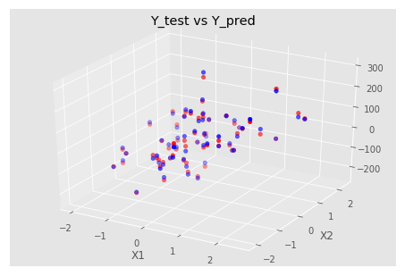

```python
%matplotlib inline

import numpy as np 
import pandas as pd 
df=pd.read_csv('C:/GlobalTemperatures.csv')
year=df.iloc[1800:,0]
# Landmax temp
X1=df.iloc[1800:,3]
#  Landmin temp
X2=df.iloc[1800:,5]
#Avg Land Temp
Y=df.iloc[1800:,1]
# print(Y.head())
#Show data
from matplotlib.pyplot import *
import matplotlib.pyplot as plt 
from mpl_toolkits.mplot3d import Axes3D 
fig=plt.figure()
ax=Axes3D(fig)
ax.scatter(X1,X2,Y)
plt.show()
X=pd.concat([X1,X2],axis=1)
# print(X.head())

#from sklearn import *
from sklearn import linear_model
from sklearn.metrics import mean_squared_error,r2_score,accuracy_score
# from sklearn.model_selection
from sklearn.model_selection import train_test_split
X_train,X_test,Y_train,Y_test=train_test_split(X,Y,test_size=0.25)
reg=linear_model.LinearRegression()
reg.fit(X_train,Y_train)
Y_pred=reg.predict(X_test)
Coef=reg.coef_
R2=r2_score(Y_test,Y_pred)
MSE=mean_squared_error(Y_test,Y_pred)
print(Coef,R2,MSE)
style.use('ggplot')
plt.scatter(Y_pred,Y_test,color='blue')
plt.show()
fig2=plt.figure()
ax2=Axes3D(fig2)
ax2.scatter(X_test['LandMaxTemperature'],X_test['LandMinTemperature'],Y_test,color='red')
ax2.scatter(X_test['LandMaxTemperature'],X_test['LandMinTemperature'],Y_pred,color='green')
plt.show()
```





    [0.580024   0.41628131] 0.9996992504790777 0.005252582245949905
    








```python
df=pd.read_csv('C:/Advertising.csv')
# print(df.head())
TV=df.iloc[:,1]
Radio=df.iloc[:,2]
Newspaper=df.iloc[:,3]
Sales=df.iloc[:,4]
fig=plt.figure()
ax=Axes3D(fig)
ax.scatter(TV,Radio,Sales)
plt.show()
X=pd.concat([TV,Radio,Newspaper],axis=1)
Y=Sales
# print(X.head())
X_train,X_test,Y_train,Y_test=train_test_split(X,Y,test_size=0.3)
reg=linear_model.LinearRegression()
reg.fit(X_train,Y_train)
Y_pred=reg.predict(X_test)
Coef=reg.coef_
R2=r2_score(Y_test,Y_pred)
MSE=mean_squared_error(Y_test,Y_pred)
print(Coef,R2,MSE)
style.use('ggplot')
plt.scatter(Y_pred,Y_test)
plt.title('Predicted values vs Real values')
plt.xlabel('Y_pred')
plt.ylabel('Y_test')
plt.show()
fig2=plt.figure()
ax2=Axes3D(fig2)
ax2.scatter(X_test['TV'],X_test['radio'],Y_test,color='red')
ax2.scatter(X_test['TV'],X_test['radio'],Y_pred,color='blue')
plt.show()
```





    [0.04614147 0.17496553 0.00084505] 0.9144040234979081 2.488069606572209
    








```python
X,Y=datasets.make_regression(n_samples=300,n_features=5,n_targets=1,random_state=0,noise=12)
X_train,X_test,Y_train,Y_test=train_test_split(X,Y,test_size=0.20)
regr=linear_model.LinearRegression()
regr.fit(X_train,Y_train)
Y_pred=regr.predict(X_test)
Coef=regr.coef_
R2=r2_score(Y_test,Y_pred)
MSE=mean_squared_error(Y_test,Y_pred)
print(Coef,R2,MSE)
style.use('ggplot')
plt.scatter(Y_test,Y_test,color='green')
plt.title('Y_test vs Y_pred')
plt.xlabel('Y_pred')
plt.ylabel('Y_test')
plt.show()
fig1=plt.figure()
ax=Axes3D(fig1)
ax.scatter(X_test[:,0],X_test[:,1],Y_test,color='blue')
ax.scatter(X_test[:,0],X_test[:,1],Y_pred,color='red')
plt.title('Y_test vs Y_pred')
plt.xlabel('X1')
plt.ylabel('X2')
plt.show()
```

    [68.92102922 12.11737824 71.82506051 -1.35766704 55.74328173] 0.9888324063838068 160.23668439916057
    







