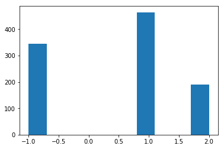
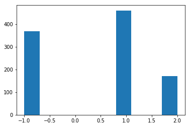

```python
import numpy as np
import random
def create_board():
    return np.zeros((3,3), dtype=int)


```


```python
def place(board, player, position):
    if board[position] == 0:
        board[position] = player
    

```


```python
def possibilities(board):
    return list(zip(*np.where(board == 0)))


```


```python

def random_place(board, player):
    selections = possibilities(board)
    if len(selections) > 0:
        choice = random.choice(selections)
        place(board, player, choice)
    return board


```


```python
def row_win(board, player):
    rowcheck = np.all(board == player, axis=1)
    return np.any(rowcheck == True)
```


```python
def col_win(board, player):
    colcheck = np.all(board == player, axis=0)
    return np.any(colcheck == True)

```


```python
def diag_win(board, player):
    diagonal = board.diagonal()
    rowcheck = np.all(diagonal == player)
    return np.any(rowcheck == True)
```


```python
def evaluate(board):
    winner = 0
    for player in [1, 2]:
        if (row_win(board, player)):
            winner = player
        elif (col_win(board, player)): 
            winner = player
        else:
            diag_win(board, player)
    # If so, store `player` as `winner`.
    if np.all(board != 0) and winner == 0:
        winner = -1
    return winner

```


```python
def play_game():
    winner = 0
    player = 1
    board = create_board()
    while(winner == 0):
        board = random_place(board, player)
        winner = evaluate(board)
        if (player == 1):
            player = 2
        else:
            player = 1
    return winner


```


```python
%matplotlib inline

import time
import matplotlib
import matplotlib.pyplot as plt
winner = []
start = time.time()
for game in range(1000):
    winner.append(play_game())

stop = time.time()
print(stop - start)

plt.hist(winner)
plt.show()
```

    0.8288955688476562
    





```python
def play_strategic_game():
    board, winner = create_board(), 0
    board[1,1] = 1
    while winner == 0:
        for player in [2,1]:
            board = random_place(board, player)
            winner = evaluate(board)
            if winner != 0:
                break
    return winner
```


```python
winner = []
start = time.time()
for game in range(1000):
    winner.append(play_strategic_game())

stop = time.time()
print(stop - start)

plt.hist(winner)
plt.show()
```

    0.7282283306121826
    




