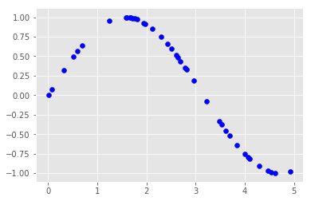
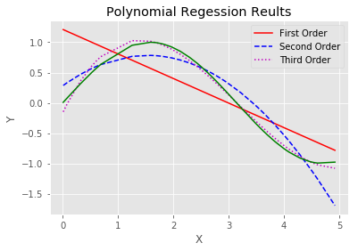

```python
from numpy import *
import numpy as np 
from scipy.interpolate import *
from scipy.stats import *
from matplotlib.pyplot import *
import matplotlib.pyplot as plt 
X=np.sort(5*np.random.rand(1,40),axis=1)
Y=np.sin(X).ravel()
# print(X,Y)
style.use('ggplot')
plt.figure(1)
plt.scatter(X,Y,color='blue')
plt.show(block=False)
X=X[0,:]
p1=polyfit(X,Y,1)
#A*X+B
print(p1)
#R2
Yfit=p1[0]*X+p1[1]
Yresid=Y-Yfit
ssresid=sum(pow(Yresid,2))
sstotal=len(Y)*var(Y)
rsq=1-ssresid/sstotal
print(rsq)
p2=polyfit(X,Y,2)
#A*X^2+B*X+C
print(p2)
#R2
Yfit=p2[0]*pow(X,2)+p2[1]*X+p2[2]
Yresid=Y-Yfit
ssresid=sum(pow(Yresid,2))
sstotal=len(Y)*var(Y)
rsq=1-ssresid/sstotal
print(rsq)
p3=polyfit(X,Y,3)
#A*X^3+B*X^2+C*X+D
print(p3)
Yfit=p3[0]*pow(X,3)+p3[1]*pow(X,2)+p3[2]*X+p3[3]
Yresid=Y-Yfit
ssresid=sum(pow(Yresid,2))
sstotal=len(Y)*var(Y)
rsq=1-ssresid/sstotal
print(rsq)
plt.figure(2)
plt.plot(X,polyval(p1,X),'r-',label='First Order')
plt.plot(X,polyval(p2,X),'b--',label='Second Order')
plt.plot(X,polyval(p3,X),'m:',label='Third Order')
plt.plot(X,Y,color='green')
plt.title('Polynomial Regession Reults')
plt.xlabel('X')
plt.ylabel('Y')
plt.legend()
plt.show()

```





    [-0.4055774   1.21235026]
    0.5835745268178202
    [-0.2153369   0.65763846  0.28154526]
    0.9040040177044294
    [ 0.09265231 -0.88186635  1.90990248 -0.16452086]
    0.993080774882336
    




