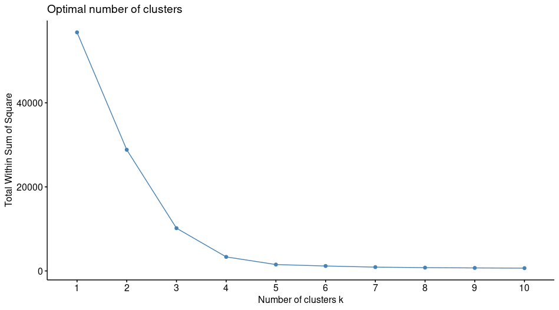
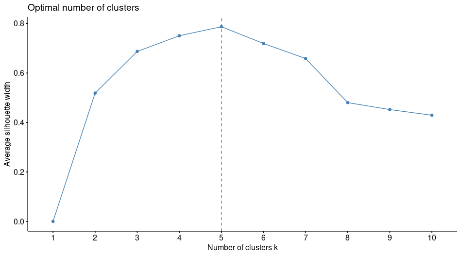
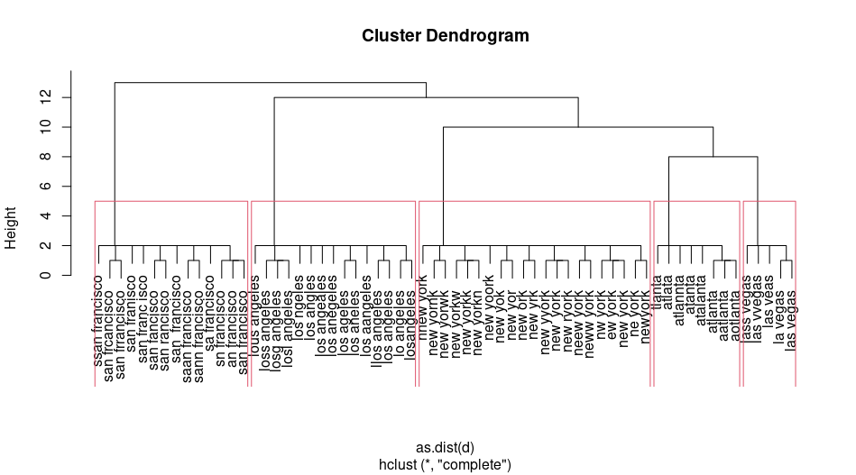

In this example I loaded a file with misspellings for 5 cities: los angeles, new york, atlanta, las vegas and san francisco.  
Wanted to cluster to see what are the best options to find clusters of misspellings.  
Here is the code and results:


```R
library(readr)
library(tidyverse)  # data manipulation
library(cluster)    # clustering algorithms
library(factoextra) # clustering visualization
library(dendextend) # for comparing two dendrograms
set.seed(1)
misspelling <- read_csv("misspelling.txt")


# Levenshtein Distance
d  <- adist(misspelling$city)

# Use elbow method to determine best clusters
fviz_nbclust(d, FUN = hcut, method = "wss")
```


```R
# Use silhouette meethod to determine best clusters
fviz_nbclust(d, FUN = hcut, method = "silhouette")
```




```R
rownames(d) <- misspelling$city
hc <- hclust(as.dist(d))
plot(hc)
rect.hclust(hc,k=5)
df <- data.frame(misspelling,cutree(hc,k=5))
```

