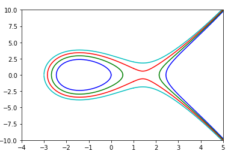

```python
# Import libraries
import matplotlib.pyplot as plt
import numpy as np
import cmath

def plotgraph(xvalues, ilist, colorlist):
    colorindex = 0
    for i in ilist:
        xvals = []
        yvals = []
        yvalsneg = []
        data = [(x,cmath.sqrt(x**3-6*x + i)) for x in xvalues]
        for item in data:
            x = item[0]
            r = item[1].real
            i = item[1].imag
            y = r

            if y != 0:
                xvals.append(x)
                yvals.append(y)
                yvalsneg.append(-y)

        ax.plot(xvals, yvals, colorlist[colorindex])
        ax.plot(xvals, yvalsneg, colorlist[colorindex])
        colorindex +=1


fig = plt.figure(figsize = (14, 8))
fig, ax = plt.subplots()
ilist = [0,3,6,9]
colorlist = ['b','g','r','c']

xvalues = np.linspace(-3, 1, 10000).tolist()
plotgraph(xvalues, ilist, colorlist)

xvalues = np.linspace(1, 5, 10000).tolist() 
plotgraph(xvalues, ilist, colorlist)
  
    
plt.xlim([-4, 5])
plt.ylim([-10, 10])
 
# Show plot
plt.show()
```



