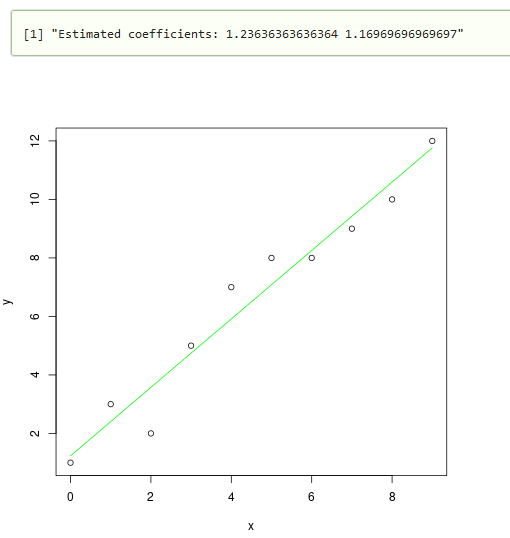

```R

estimate_coef <- function(x, y){
	# number of observations/points
	n = length(x)

	# mean of x and y vector
	m_x = mean(x)
	m_y = mean(y)

	# calculating cross-deviation and deviation about x
	SS_xy = sum(y*x) - n*m_y*m_x
	SS_xx = sum(x*x) - n*m_x*m_x

	# calculating regression coefficients
	b_1 = SS_xy / SS_xx
	b_0 = m_y - b_1*m_x

	return (list(b_0 = b_0, b_1 = b_1))
}

plot_regression_line <- function(x, y, b_0, b_1){
	# plotting the actual points as scatter plot
	plot(x, y, col = "black", type ="p", xlab = "x", ylab="y")

	# predicted response vector
	y_pred = b_0 + b_1*x

	# plotting the regression line
	lines(x, y_pred, col = "green")
}

x = c(0, 1, 2, 3, 4, 5, 6, 7, 8, 9)
y = c(1, 3, 2, 5, 7, 8, 8, 9, 10, 12)

# estimating coefficients
attach(estimate_coef(x, y))
paste("Estimated coefficients:", b_0, b_1)
## plotting regression line
plot_regression_line(x, y, b_0, b_1)

```

