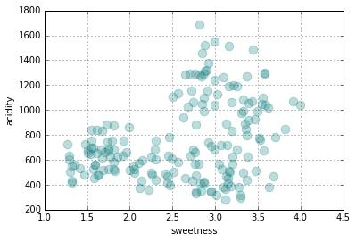

# Machine Learning Reference Project

## 01. The Dataset 


***

The dataset consists of fruits. 

The columns are:

* ``fruit_id``: 1-3, numeric id for:
* ``fruit_name``: orange, pear and apple, corresponding to ``fruit`` == 1, 2, and 3, respectively
* ``color_id``: 1-6, numeric id for:
* ``color_name``: blue, brown, green, orange, red, yellow, corresponding to ``color`` == 1-6, respectively.
* ``elongatednessness``: 0-1, continuous. A concept borrowed from the famous ``seeds`` dataset (which uses the inverse, compactness). If one were to take a two-dimensional image of the fruit (presumably in a random orientation) and make the smallest ellipse it would fit within, ``elongatednessness`` is the length of the long axis divided by the length of the short axis, minus 1. An infinitely long line has an infinite elongatedness, a perfect circle (or square, for that matter) has an elongatedness of zero.
* ``weight``: in grams
* ``sweetness``: in totally fictional units; I just took the (unit-unspecified) values for proline from ``Wines`` and fudged them a bit.
* ``acidity``: same note as ``sweetness``, except original column was OD280/315.

##### Blue fruit? 

I added some noise to this dataset by pretending the color names were assigned manually, and a certain number of people who performed the task had different sorts of color-blindedness.

Note that, like the Wines dataset, it's easy to get near- (but, unlike Wines, not totally) perfect classification. I thought the signal-to-noise ratio should be kept relatively high (but again, not perfect) for beginners.

#### 1. Import libraries and datafile


```python
from __future__ import (absolute_import, division,
                        print_function, unicode_literals)
# I only use Python 3.4.x+, hopefully the above statement will make this notebook
# work in Python 2.7.x

import sys
print(sys.version)
import pandas as pd
import numpy as np
import matplotlib.pyplot as plt
%matplotlib inline
from sklearn.ensemble import RandomForestClassifier
df = pd.read_csv('fruit.csv')

fruitnames = {1: 'Orange', 2: 'Pear', 3: 'Apple'}
colors = {1: '#e09028', 2: '#55aa33', 3: '#cc3333'}
fruitlist = ['Orange', 'Pear', 'Apple']
# It's a trifle inelegant to use both a list and a dict,
# but fruitlist is zero-indexed and fruitnames is one-indexed.

df.sort(['sweetness', 'acidity', 'weight', 'elongatedness'], inplace=True)
df.reset_index(drop=True, inplace=True)
df.tail(10)
```
<div style="max-height:1000px;max-width:1500px;overflow:auto;">
<table border="1" class="dataframe">
  <thead>
    <tr style="text-align: right;">
      <th></th>
      <th>fruit_id</th>
      <th>fruit_name</th>
      <th>color_id</th>
      <th>color_name</th>
      <th>elongatedness</th>
      <th>weight</th>
      <th>sweetness</th>
      <th>acidity</th>
    </tr>
  </thead>
  <tbody>
    <tr>
      <th>169</th>
      <td> 1</td>
      <td> orange</td>
      <td> 4</td>
      <td> orange</td>
      <td> 0.08</td>
      <td> 144</td>
      <td> 3.58</td>
      <td> 1290</td>
    </tr>
    <tr>
      <th>170</th>
      <td> 1</td>
      <td> orange</td>
      <td> 5</td>
      <td>    red</td>
      <td> 0.11</td>
      <td> 182</td>
      <td> 3.58</td>
      <td> 1295</td>
    </tr>
    <tr>
      <th>171</th>
      <td> 1</td>
      <td> orange</td>
      <td> 4</td>
      <td> orange</td>
      <td> 0.11</td>
      <td> 144</td>
      <td> 3.59</td>
      <td> 1035</td>
    </tr>
    <tr>
      <th>172</th>
      <td> 1</td>
      <td> orange</td>
      <td> 4</td>
      <td> orange</td>
      <td> 0.09</td>
      <td> 143</td>
      <td> 3.63</td>
      <td> 1015</td>
    </tr>
    <tr>
      <th>173</th>
      <td> 2</td>
      <td>   pear</td>
      <td> 6</td>
      <td> yellow</td>
      <td> 0.47</td>
      <td> 123</td>
      <td> 3.64</td>
      <td>  380</td>
    </tr>
    <tr>
      <th>174</th>
      <td> 2</td>
      <td>   pear</td>
      <td> 6</td>
      <td> yellow</td>
      <td> 0.56</td>
      <td> 126</td>
      <td> 3.69</td>
      <td>  465</td>
    </tr>
    <tr>
      <th>175</th>
      <td> 1</td>
      <td> orange</td>
      <td> 5</td>
      <td>    red</td>
      <td> 0.11</td>
      <td> 189</td>
      <td> 3.71</td>
      <td>  780</td>
    </tr>
    <tr>
      <th>176</th>
      <td> 1</td>
      <td> orange</td>
      <td> 4</td>
      <td> orange</td>
      <td> 0.19</td>
      <td> 144</td>
      <td> 3.82</td>
      <td>  845</td>
    </tr>
    <tr>
      <th>177</th>
      <td> 1</td>
      <td> orange</td>
      <td> 5</td>
      <td>    red</td>
      <td> 0.09</td>
      <td> 191</td>
      <td> 3.92</td>
      <td> 1065</td>
    </tr>
    <tr>
      <th>178</th>
      <td> 1</td>
      <td> orange</td>
      <td> 2</td>
      <td>  brown</td>
      <td> 0.15</td>
      <td> 152</td>
      <td> 4.00</td>
      <td> 1035</td>
    </tr>
  </tbody>
</table>
</div>


#### 2. Explore the dataset #

Count the instance labels:


```python
# count the instance labels
for fruit in df.fruit_id.unique():
    print("{} instances of fruit #{}, {}".format(len(df[df.fruit_id == fruit]),
                                                    fruit, fruitnames[fruit]))
```

    49 instances of fruit #3, Apple
    71 instances of fruit #2, Pear
    59 instances of fruit #1, Orange
    

Describe the four numeric features:


```python
df[['elongatedness', 'weight', 'sweetness', 'acidity']].describe()
```


<div style="max-height:1000px;max-width:1500px;overflow:auto;">
<table border="1" class="dataframe">
  <thead>
    <tr style="text-align: right;">
      <th></th>
      <th>elongatedness</th>
      <th>weight</th>
      <th>sweetness</th>
      <th>acidity</th>
    </tr>
  </thead>
  <tbody>
    <tr>
      <th>count</th>
      <td> 179.000000</td>
      <td> 179.000000</td>
      <td> 179.000000</td>
      <td>  179.000000</td>
    </tr>
    <tr>
      <th>mean</th>
      <td>   0.296369</td>
      <td> 144.340782</td>
      <td>   2.606034</td>
      <td>  745.849162</td>
    </tr>
    <tr>
      <th>std</th>
      <td>   0.161922</td>
      <td>  19.280632</td>
      <td>   0.712020</td>
      <td>  314.332206</td>
    </tr>
    <tr>
      <th>min</th>
      <td>   0.020000</td>
      <td> 105.000000</td>
      <td>   1.270000</td>
      <td>  278.000000</td>
    </tr>
    <tr>
      <th>25%</th>
      <td>   0.150000</td>
      <td> 129.000000</td>
      <td>   1.925000</td>
      <td>  501.000000</td>
    </tr>
    <tr>
      <th>50%</th>
      <td>   0.280000</td>
      <td> 143.000000</td>
      <td>   2.780000</td>
      <td>  672.000000</td>
    </tr>
    <tr>
      <th>75%</th>
      <td>   0.430000</td>
      <td> 156.000000</td>
      <td>   3.170000</td>
      <td>  985.000000</td>
    </tr>
    <tr>
      <th>max</th>
      <td>   0.690000</td>
      <td> 198.000000</td>
      <td>   4.000000</td>
      <td> 1680.000000</td>
    </tr>
  </tbody>
</table>
</div>


View a crosstab of colors and fruit. See introductory note if you're confused about the blue pears.


```python
pd.crosstab(df.fruit_name, df.color_name)
```


<div style="max-height:1000px;max-width:1500px;overflow:auto;">
<table border="1" class="dataframe">
  <thead>
    <tr style="text-align: right;">
      <th>color_name</th>
      <th>blue</th>
      <th>brown</th>
      <th>green</th>
      <th>orange</th>
      <th>red</th>
      <th>yellow</th>
    </tr>
    <tr>
      <th>fruit_name</th>
      <th></th>
      <th></th>
      <th></th>
      <th></th>
      <th></th>
      <th></th>
    </tr>
  </thead>
  <tbody>
    <tr>
      <th>apple</th>
      <td> 3</td>
      <td>  1</td>
      <td> 15</td>
      <td>  0</td>
      <td> 16</td>
      <td> 14</td>
    </tr>
    <tr>
      <th>orange</th>
      <td> 0</td>
      <td>  8</td>
      <td>  1</td>
      <td> 37</td>
      <td> 13</td>
      <td>  0</td>
    </tr>
    <tr>
      <th>pear</th>
      <td> 2</td>
      <td> 12</td>
      <td>  9</td>
      <td>  3</td>
      <td>  2</td>
      <td> 43</td>
    </tr>
  </tbody>
</table>
</div>


View all pairwise plots of features in a scatterplot matrix:


```python
_ = pd.scatter_matrix(df, figsize=(14,14), diagonal='kde', alpha=0.6, color=[colors[x] for x in list(df.fruit_id)])
```


From the above, it appears ``sweetness`` and ``acidity`` should be a good candidate for clustering:


```python
df.plot(kind='scatter', x='sweetness', y='acidity', color='#228888', s=92, alpha=0.3)
```


    <matplotlib.axes._subplots.AxesSubplot at 0xa7eb3c8>





... but not *too* good. Also, the labels do not perfectly correspond with the clusters (see how there are green dots inside the red and orange regions?), making it a good candidate to demonstrate classification.


```python
for i in range(3):
    plt.scatter(df[df.fruit_id == i+1].sweetness, df[df.fruit_id == i+1].acidity, 
                s=44, c=[colors[x] for x in list(df[df.fruit_id == i+1].fruit_id)], 
                alpha=0.5, label=fruitnames[i+1])
plt.xlabel('Sweetness')
plt.ylabel('Acidity')
plt.legend()
plt.show()
```


To see the other continuous numeric variables, let's plot Sweetness vs. Weight.


```python
for i in range(3):
    plt.scatter(df[df.fruit_id == i+1].weight, df[df.fruit_id == i+1].elongatedness, 
                s=44, c=[colors[x] for x in list(df[df.fruit_id == i+1].fruit_id)], 
                alpha=0.5, label=fruitnames[i+1])
plt.xlabel('Weight')
plt.ylabel('Sweetness')
plt.legend()
plt.show()
```


