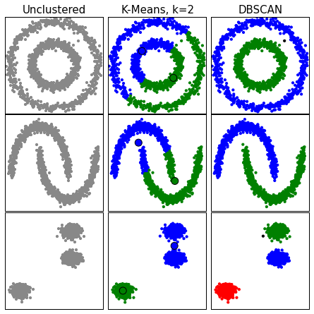
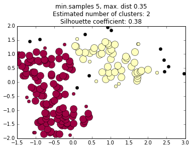
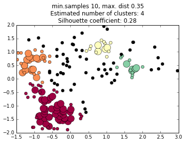
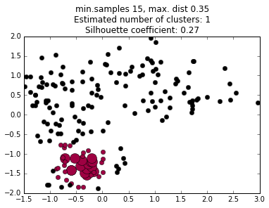
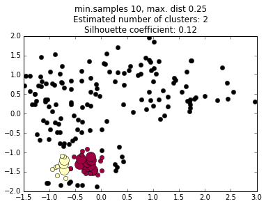
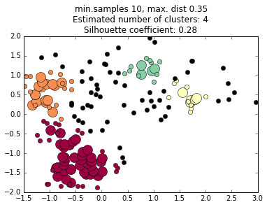
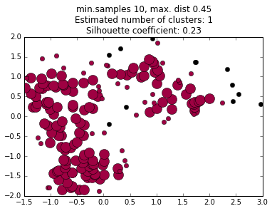
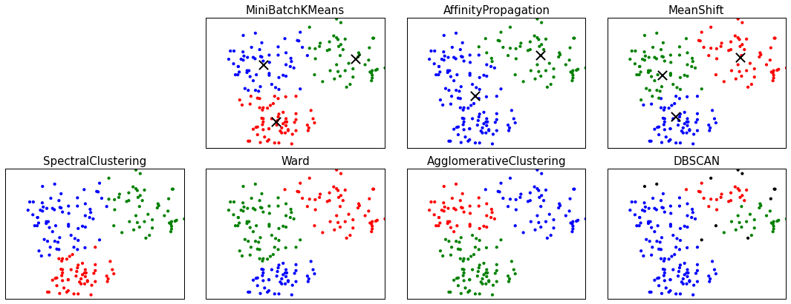

## 03. Clustering algorithms 

#### 1. Import libraries and load data #


```python
import pandas as pd
import numpy as np
from sklearn import cluster
import matplotlib.pyplot as plt
%matplotlib inline
from scipy import stats
import time
from sklearn.cluster import DBSCAN
from sklearn import metrics
from sklearn import cluster, datasets
from sklearn.metrics import euclidean_distances
from sklearn.neighbors import kneighbors_graph
from sklearn.preprocessing import StandardScaler

df = pd.read_csv('fruit.csv')
# Since this is unsupervised, drop the labels
df = df.drop(['fruit_id', 'fruit_name'], axis=1)
df.sort(['sweetness', 'acidity', 'weight', 'elongatedness'], inplace=True)
# normalize the two features we will use, as we did in the last notebook.
col1 = 'acidity_normal'
col2 = 'sweetness_normal'
df['sweetness_normal'] = (df.sweetness - df.sweetness.mean()) / df.sweetness.std()
df['acidity_normal'] = (df.acidity - df.acidity.mean()) / df.acidity.std()
# Create numpy array of (x,y) data of the two features
data = np.array([list(df[col1]), list(df[col2])]).T
data.shape
```


    (179, 2)


#### 2. Compare results of K-Means and DBSCAN on three toy datasets #

This shows DBSCAN is a 'neighborhood grower', instead of being centroid-based like K-Means

*Note: this code is adapted from code on the scikit-learn website http://scikit-learn.org/stable/auto_examples/cluster/plot_cluster_comparison.html. This example code was not updated along scikit-learn's source code, so it throws a deprecation warning.*


```python
np.random.seed(0)

# Generate datasets. We choose the size big enough to see the scalability
# of the algorithms, but not too big to avoid too long running times
n_samples = 1500
noisy_circles = datasets.make_circles(n_samples=n_samples, factor=.5,
                                      noise=.05)
noisy_moons = datasets.make_moons(n_samples=n_samples, noise=.05)
blobs = datasets.make_blobs(n_samples=n_samples, random_state=8)
colors = np.array([x for x in 'bgrcmykbgrcmykbgrcmykbgrcmyk'])
colors = np.hstack([colors] * 20)

plt.figure(figsize=(6, 6))
plt.subplots_adjust(left=.001, right=.999, bottom=.001, top=.96, wspace=.05,
                    hspace=.01)
plot_num = 1
for i_dataset, dataset in enumerate([noisy_circles, noisy_moons, blobs]):
    X, y = dataset
    # normalize dataset for easier parameter selection
    X = StandardScaler().fit_transform(X)

    two_means = cluster.MiniBatchKMeans(n_clusters=2)
    dbscan = cluster.DBSCAN(eps=.2)

    for name, algorithm in [('Unclustered', dbscan),
                            ('K-Means, k=2', two_means),
                            ('DBSCAN', dbscan)]:
        # predict cluster memberships
        algorithm.fit(X)
        if hasattr(algorithm, 'labels_'):
            y_pred = algorithm.labels_.astype(np.int)
        else:
            y_pred = algorithm.predict(X)

        
        if name == 'Unclustered':
            subplot_color = '#888888'
        else:
            subplot_color = colors[y_pred].tolist()
        plt.subplot(3, 3, plot_num)
        if i_dataset == 0:
            plt.title(name, size=15)
        plt.scatter(X[:, 0], X[:, 1], color=subplot_color, s=10)
        if hasattr(algorithm, 'cluster_centers_'):
            centers = algorithm.cluster_centers_
            center_colors = colors[:len(centers)]
            plt.scatter(centers[:, 0], centers[:, 1], s=100, c=center_colors)
        plt.xlim(-2, 2)
        plt.ylim(-2, 2)
        plt.xticks(())
        plt.yticks(())
        plot_num += 1

plt.show()
```

    C:\Users\David\Anaconda3\envs\current\lib\site-packages\sklearn\datasets\samples_generator.py:612: DeprecationWarning: using a non-integer number instead of an integer will result in an error in the future
      y = np.hstack([np.zeros(n_samples_in, dtype=np.intp),
    





#### 3. Compare DBSCAN with different minimum sample and maximum distance values #

DBSCAN takes two parameters that can sometimes be tricky to optimize: eps (the maximum distance between core points), and min_samples (the minimum number of points to determine a core).

Core points are shown as large colored circles, core-reachable (non-core but determined to be in the same cluster) as small colored circles, and 'noise' (points which are not assigned to a cluster) as small black circles.

We define a function to make the plot, and then plot three different eps values.


```python
def do_dbscan(X, min_samples, max_dist):
    
    # Code adapted from http://scikit-learn.org/stable/auto_examples/cluster/plot_dbscan.html
    db = DBSCAN(eps=max_dist, min_samples=min_samples).fit(X)
    core_samples_mask = np.zeros_like(db.labels_, dtype=bool)
    core_samples_mask[db.core_sample_indices_] = True
    labels = db.labels_

    # Number of clusters in labels, ignoring noise if present.
    n_clusters_ = len(set(labels)) - (1 if -1 in labels else 0)
    # silhouette coefficient
    silco = metrics.silhouette_score(X, labels)

    # Black removed and is used for noise instead.
    unique_labels = set(labels)
    colors = plt.cm.Spectral(np.linspace(0, 1, len(unique_labels)))
    for k, col in zip(unique_labels, colors):
        if k == -1:
            #Black used for noise.
            col = 'k'

        class_member_mask = (labels == k)

        xy = X[class_member_mask & core_samples_mask]
        plt.plot(xy[:, 0], xy[:, 1], 'o', markerfacecolor=col,
                 markeredgecolor='k', markersize=14)

        xy = X[class_member_mask & ~core_samples_mask]
        plt.plot(xy[:, 0], xy[:, 1], 'o', markerfacecolor=col,
                 markeredgecolor='k', markersize=6)

    plt.title('min.samples {}, max. dist {}\nEstimated number of clusters: {}\nSilhouette coefficient: {:.2f}'.format(min_samples, max_dist, n_clusters_, silco))
    plt.show()

do_dbscan(data, 5, 0.35)
do_dbscan(data, 10, 0.35)
do_dbscan(data, 15, 0.35)

```











Now compare three different max. dist values


```python
do_dbscan(data, 10, 0.25)
do_dbscan(data, 10, 0.35)
do_dbscan(data, 10, 0.45)
```











#### 4. Compare seven different clustering algorithms #

This compares clustering of our dataset using seven different algorithms, three centroid-based, then two heirarchical, then two neighborhood growers.


```python
# adapted from http://scikit-learn.org/stable/auto_examples/cluster/plot_cluster_comparison.html

part1 = []
for i in range(len(df.acidity_normal)):
    part1.append([list(df.acidity_normal)[i], list(df.sweetness_normal)[i]])
ds = (np.array(part1))

colors = np.array([x for x in 'bgrcmykbgrcmykbgrcmykbgrcmyk'])
colors = np.hstack([colors] * 20)

plt.figure(figsize=(15, 6))
plt.subplots_adjust(left=.001, right=.999, bottom=.001, top=.96, wspace=.05,
                    hspace=.01)

plot_num = 1
for i_dataset, dataset in enumerate([ds]):
    X = dataset
    # normalize dataset for easier parameter selection
    X = StandardScaler().fit_transform(X)

    # estimate bandwidth for mean shift
    bandwidth = cluster.estimate_bandwidth(X, quantile=0.3)

    # connectivity matrix for structured Ward
    connectivity = kneighbors_graph(X, n_neighbors=10)
    # make connectivity symmetric
    connectivity = 0.5 * (connectivity + connectivity.T)

    # Compute distances
    distances = euclidean_distances(X)

    # create clustering estimators
    ms = cluster.MeanShift(bandwidth=bandwidth, bin_seeding=True)
    two_means = cluster.MiniBatchKMeans(n_clusters=3)
    ward = cluster.AgglomerativeClustering(n_clusters=3,
                    linkage='ward', connectivity=connectivity)
    spectral = cluster.SpectralClustering(n_clusters=3,
                                          eigen_solver='arpack',
                                          affinity="nearest_neighbors")
    dbscan = cluster.DBSCAN(eps=.3)
    affinity_propagation = cluster.AffinityPropagation(damping=.8,
                                                       preference=-200)
    average_linkage = cluster.AgglomerativeClustering(linkage="average",
                            affinity="cityblock", n_clusters=3) #,
                            #connectivity=connectivity)

    for name, algorithm in [
                            ('MiniBatchKMeans', two_means),
                            ('AffinityPropagation', affinity_propagation),
                            ('MeanShift', ms),
                            ('SpectralClustering', spectral),
                            ('Ward', ward),
                            ('AgglomerativeClustering', average_linkage),
                            ('DBSCAN', dbscan)
                           ]:
        # predict cluster memberships
        algorithm.fit(X)
        if hasattr(algorithm, 'labels_'):
            y_pred = algorithm.labels_.astype(np.int)
        else:
            y_pred = algorithm.predict(X)

        # plot
        plt.subplot(2, 4, plot_num+1)
        plt.tight_layout()
        if i_dataset == 0:
            plt.title(name, size=15)
        plt.scatter(X[:, 0], X[:, 1], color=colors[y_pred].tolist(), s=10)

        if hasattr(algorithm, 'cluster_centers_'):
            centers = algorithm.cluster_centers_
            center_colors = colors[:len(centers)]
            plt.scatter(centers[:, 0], centers[:, 1], marker='x', s=150, c='#000000', linewidths=2)
        plt.xlim(-2, 2)
        plt.ylim(-2, 2)
        plt.xticks(())
        plt.yticks(())
        plot_num += 1

plt.show()
```





```python
y_pred
```


    array([ 0,  0,  0,  0,  0,  0,  0,  0,  0,  0,  0,  0,  0,  0,  0,  0,  0,
            0,  0,  0,  0,  0,  0,  0,  0,  0,  0,  0,  0,  0,  0,  0,  0,  0,
            0,  0,  0,  0,  0,  0,  0,  0,  0,  0,  0,  0,  0,  0,  0,  0,  0,
            0,  0,  0,  0,  0,  0,  0,  0,  0,  0,  0,  0,  0,  0,  0,  0,  0,
           -1,  0,  0, -1,  0,  0,  2,  2,  0,  2,  2,  2,  0,  2,  0,  0,  2,
            0,  0,  2,  0,  0,  0, -1,  0,  2, -1,  0,  0,  2,  2,  2,  0,  0,
            2,  2,  2,  2, -1,  2,  2,  0,  2,  0,  0,  0,  0,  2,  2, -1,  0,
            2,  0,  0,  0,  0,  2,  0,  0,  0,  1,  0,  0,  0,  0,  2, -1,  0,
            0,  1,  1,  0,  0,  2,  0,  2,  0,  0,  0,  1,  0,  1,  1,  1,  1,
           -1,  0,  1,  0,  1,  1,  1, -1,  1,  0,  1,  1,  1,  1,  1,  1, -1,
           -1,  1,  1, -1, -1,  1, -1, -1, -1])


