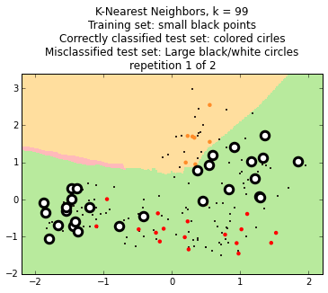

## 04. Classification with k-Nearest Neighbors ##

***

We will confine ourselves to the normalized ``sweetness`` and ``acidity`` columns for ease and convenience.

#### 1. Import libraries and load data #


```python
import pandas as pd
import numpy as np
import matplotlib.pyplot as plt
%matplotlib inline
from matplotlib.colors import ListedColormap
from sklearn import neighbors
from random import uniform as random_uniform

df = pd.read_csv('fruit.csv')
fruitnames = {1: 'Orange', 2: 'Pear', 3: 'Apple'}
colors = {1: '#e09028', 2: '#55aa33', 3: '#cc3333'}

# normalize sweetness and acidity
df['sweetness_normal'] = ( df.sweetness - df.sweetness.mean() ) / df.sweetness.std()
df['acidity_normal'] = ( df.acidity - df.acidity.mean() ) / df.acidity.std()

# Create numpy arrays for classifier
X = []
y = []
for i, row in df.iterrows():
    X.append([row.sweetness_normal, row.acidity_normal])
    y.append(row.fruit_id)
X = np.array(X)
y = np.array(y)
```

Let's have a look at the numpy arrays; they are usually referred to as ``X`` and ``y`` (case sensitive) in ``scikit-learn``.


```python
print(X[:10,:]) # x (small x) and y values normalized sweetness vs acidity
print("   ... etc.")
print(y) # fruit labels, 1 to 3
```

    [[ 1.33980306  1.11077017]
     [ 1.01677839  1.06304996]
     [ 1.95776329  0.91988932]
     [ 0.55330822 -0.20948907]
     [ 0.11792715  0.8721691 ]
     [ 1.32575851  0.95170279]
     [ 1.01677839  0.76082194]
     [ 0.38477361  2.44693615]
     [ 0.79206558  1.39709145]
     [ 0.59544187  1.19030386]]
       ... etc.
    [1 1 1 1 1 1 1 1 1 1 1 1 1 1 1 1 1 1 1 1 1 1 1 1 1 1 1 1 1 1 1 1 1 1 1 1 1
     1 1 1 1 1 1 1 1 1 1 1 1 1 1 1 1 1 1 1 1 1 1 2 2 2 2 2 2 2 2 2 2 2 2 2 2 2
     2 2 2 2 2 2 2 2 2 2 2 2 2 2 2 2 2 2 2 2 2 2 2 2 2 2 2 2 2 2 2 2 2 2 2 2 2
     2 2 2 2 2 2 2 2 2 2 2 2 2 2 2 2 2 2 2 3 3 3 3 3 3 3 3 3 3 3 3 3 3 3 3 3 3
     3 3 3 3 3 3 3 3 3 3 3 3 3 3 3 3 3 3 3 3 3 3 3 3 3 3 3 3 3 3 3]
    

#### 2. View k-nearest neighbor decision surfaces for various values of k of our entire dataset (i.e. not yet split into testing and training sets) #


```python
# adapted from http://scikit-learn.org/0.11/auto_examples/neighbors/plot_classification.html
for k in [1, 3, 5, 7, 9, 11, 99, 131, 177]:
    h = 0.02  # step size in the mesh
    # Create color maps
    cmap_light = ListedColormap(['#ffde9e', '#b8ea9d', '#ffbaba'])
    cmap_bold = ListedColormap(['#ff8c28', '#11bb11', '#ff0000'])
    # create an instance of Neighbours Classifier and fit the data.
    clf = neighbors.KNeighborsClassifier(k)
    clf.fit(X, y)
    # Plot the decision boundary. For that, we will assign a color to each
    # point in the mesh [x_min, m_max]x[y_min, y_max].
    x_min, x_max = X[:, 0].min() - 1, X[:, 0].max() + 1
    y_min, y_max = X[:, 1].min() - 1, X[:, 1].max() + 1
    xx, yy = np.meshgrid(np.arange(x_min, x_max, h),
                         np.arange(y_min, y_max, h))
    Z = clf.predict(np.c_[xx.ravel(), yy.ravel()])
    # Put the result into a color plot
    Z = Z.reshape(xx.shape)
    plt.figure()
    plt.pcolormesh(xx, yy, Z, cmap=cmap_light)
    # Plot the data points
    plt.scatter(X[:, 0], X[:, 1], s=40, c=y, cmap=cmap_bold)
    plt.xlim(-2.2, 2.2) # hardcoded
    plt.ylim(-2, 3.4)
    plt.title("K-nearest neighbors of entire dataset (k = %i)"
              % (k))

    plt.show()
```


#### 3. A function to show decision surfaces of a randomly chosen 70% training set and correct classifications and misclassifications of the remaining test set. #


```python
# Divide 70:30 train:test

def kNN_test(k=15, reps=1, prop_test=0.3, plot=True):
    """ Function to run k-nearest neighbors on df with given value of k, repeated 'reps' times.
        prop_test: the proportion of instances to sequester for the test set. All the rest are training set.
        plot: if True, outputs charts. If false, returns tuple of (training set error rate, test set error rate)
        Only test set is shown on chart, with misclassified instances larger."""
    
    assert 0<prop_test<1
    
    for rep in range(reps):
        df['is_train'] = np.random.uniform(0, 1, len(df)) <= (1-prop_test)
        train, test = df[df['is_train']==True], df[df['is_train']==False]

        X = []
        y = []
        for i, row in train.iterrows():
            X.append([row.sweetness_normal, row.acidity_normal])
            y.append(row.fruit_id)
        X = np.array(X)
        y = np.array(y)

        h = 0.02  # step size in the mesh
        # Create color maps
        cmap_light = ListedColormap(['#ffde9e', '#b8ea9d', '#ffbaba'])
        cmap_bold = ListedColormap(['#ff8c28', '#11bb11', '#ff0000'])

        # we create an instance of Neighbours Classifier and fit the data.
        clf = neighbors.KNeighborsClassifier(k)

        clf.fit(X, y)

        # Plot the decision boundary. For that, we will assign a color to each
        # point in the mesh [x_min, m_max]x[y_min, y_max].
        x_min, x_max = X[:, 0].min() - 1, X[:, 0].max() + 1
        y_min, y_max = X[:, 1].min() - 1, X[:, 1].max() + 1
        xx, yy = np.meshgrid(np.arange(x_min, x_max, h),
                             np.arange(y_min, y_max, h))
        Z = clf.predict(np.c_[xx.ravel(), yy.ravel()])

        # Put the result into a color plot
        Z = Z.reshape(xx.shape)


        #evaluate the training points
        trainpred = clf.predict(train[['sweetness_normal', 'acidity_normal']])
        train['pred'] = [x for x in trainpred]
        train['correct'] = 0
        for idx, row in train.iterrows():
            if row.fruit_id == row.pred:
                train.loc[idx, 'correct'] = True
            else:
                train.loc[idx, 'correct'] = False

        # Predict on the testing points
        preds = clf.predict(test[['sweetness_normal', 'acidity_normal']])
        test['pred'] = [x for x in preds]
        test['correct'] = 0
        for idx, row in test.iterrows():
            if row.fruit_id == row.pred:
                test.loc[idx, 'correct'] = True
            else:
                test.loc[idx, 'correct'] = False  

        if plot:
            plt.figure()
            plt.pcolormesh(xx, yy, Z, cmap=cmap_light)
            plt.scatter(train.sweetness_normal, train.acidity_normal, s=1, c="#ff0000")
            plt.scatter(test[test.correct==True].sweetness_normal, test[test.correct==True].acidity_normal, 
                        s=20, c=test[test.correct==True].pred, cmap=cmap_bold, linewidth=0)
            plt.scatter(test[test.correct==False].sweetness_normal, test[test.correct==False].acidity_normal, 
                        s=90, c="#ffffff", linewidth=3)
            # plt.xlim(xx.min(), xx.max()) # hardcoded instead to be prettier
            # plt.ylim(yy.min(), yy.max())
            plt.xlim(-2.2, 2.2) # hardcoded
            plt.ylim(-2, 3.4)
            if reps == 1:
                plt.title("K-Nearest Neighbors, k = {}\nTraining set: small black points\n"
                          "Correctly classified test set: colored cirles\nMisclassified test set: "
                          "Large black/white circles".format(k))
            else:
                plt.title("K-Nearest Neighbors, k = {}\nTraining set: small black points\n"
                          "Correctly classified test set: colored cirles\nMisclassified test set: "
                          "Large black/white circles\nrepetition {} of {}".format(k, rep+1, reps))
            plt.show()
        
        else:
            train_error_rate = len(train[train.correct==False]) / (len(train[train.correct==True])+len(train[train.correct==False]))
            test_error_rate = len(test[test.correct==False]) / (len(test[test.correct==True])+len(test[test.correct==False]))
            return train_error_rate, test_error_rate
```

#### 4. View two repetitions of train/test classification with k=1, k=9 and k=99 to show overfitting, proper fitting and underfitting.#

Misclassified testing instances are shown as larger circles.

The SettingWithCopyWarning can be ignored in this case.


```python
kNN_test(k=1, reps=2, plot=True)
kNN_test(k=9, reps=2, plot=True)
kNN_test(k=99, reps=2, plot=True)
```





#### 5. Create a learning curve of 100 repetitions of our data with varying values of k. #

Warning: the first cell takes over an hour to run on my home computer.

SettingWithCopy warnings can be ignored.


```python
%%time

import csv
with open('kNN_test_train.csv', 'w', newline='') as csvfile:
    csvwriter = csv.writer(csvfile, delimiter=',')
    for k in [1,3,5,7,9,11,15,19,23,27,31,37,41,47,51,57,61,71,81,91,111]:
        for i in range(20):
            scores = kNN_test(k=k, reps=1, plot=False)
            csvwriter.writerow([k, scores[0], scores[1]])
```

    -c:47: SettingWithCopyWarning: 
    A value is trying to be set on a copy of a slice from a DataFrame.
    Try using .loc[row_indexer,col_indexer] = value instead
    
    See the the caveats in the documentation: http://pandas.pydata.org/pandas-docs/stable/indexing.html#indexing-view-versus-copy
    -c:48: SettingWithCopyWarning: 
    A value is trying to be set on a copy of a slice from a DataFrame.
    Try using .loc[row_indexer,col_indexer] = value instead
    
    See the the caveats in the documentation: http://pandas.pydata.org/pandas-docs/stable/indexing.html#indexing-view-versus-copy
    C:\Users\David\Anaconda3\envs\current\lib\site-packages\pandas\core\indexing.py:415: SettingWithCopyWarning: 
    A value is trying to be set on a copy of a slice from a DataFrame.
    Try using .loc[row_indexer,col_indexer] = value instead
    
    See the the caveats in the documentation: http://pandas.pydata.org/pandas-docs/stable/indexing.html#indexing-view-versus-copy
      self.obj[item] = s
    

    Wall time: 1h 2min 46s
    

    -c:57: SettingWithCopyWarning: 
    A value is trying to be set on a copy of a slice from a DataFrame.
    Try using .loc[row_indexer,col_indexer] = value instead
    
    See the the caveats in the documentation: http://pandas.pydata.org/pandas-docs/stable/indexing.html#indexing-view-versus-copy
    -c:58: SettingWithCopyWarning: 
    A value is trying to be set on a copy of a slice from a DataFrame.
    Try using .loc[row_indexer,col_indexer] = value instead
    
    See the the caveats in the documentation: http://pandas.pydata.org/pandas-docs/stable/indexing.html#indexing-view-versus-copy
    

Load the csv file created above and visualize the learning curve.


```python
dftest = pd.read_csv('kNN_test_train.csv', names=['k', 'train_error', 'test_error'])
ks = list(dftest.k.unique())
ks.sort()
xs = []
ys_train = []
ys_test = []
for i, k in enumerate(ks):
    xs.append(len(ks) - i)
    ys_train.append(dftest[dftest.k==k].train_error.mean())
    ys_test.append(dftest[dftest.k==k].test_error.mean())
    
fig = plt.figure(figsize=(12,5))
ax = fig.add_subplot(111)
ax.set_title('Testing and training error rate average of 20 repetitions')
ax.plot(xs, ys_train, 'b-', label="training set")
ax.plot(xs, ys_test, 'r-', label="test set")
ax.set_xlim(0, 22)
ax.set_ylabel('Error rate')
ax.set_xlabel('k')
ax.set_xticks(range(1,22))
ax.legend()
ax.set_xticklabels(ks)
```


