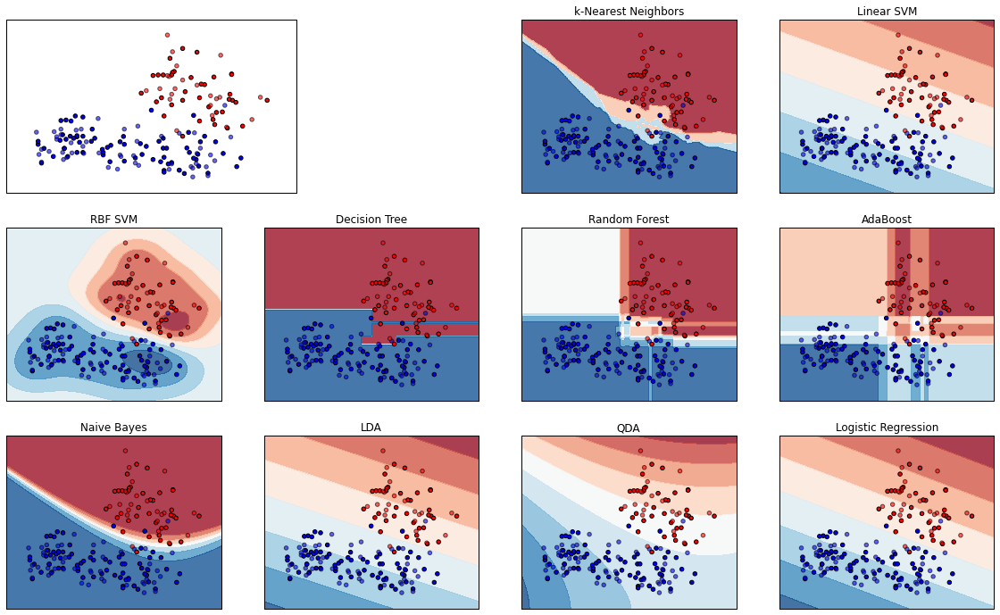

# Introduction to data analysis using machine learning #

## 05. Comparison of Classification Algorithms ##

by David Taylor, [www.prooffreader.com](http://www.prooffreader.com) (blog) [www.dtdata.io](http://dtdata.io) (hire me!)

For links to more material including a slideshow explaining all this stuff in further detail, please see the front page of [this GitHub repo.](https://github.com/Prooffreader/intro_machine_learning)

This is notebook 5 of 8. The next notebook is: [[06. Classification with Decision Trees]](http://nbviewer.ipython.org/github/Prooffreader/intro_machine_learning/blob/master/06_Classification_Decision_Trees.ipynb)

[[01]](http://nbviewer.ipython.org/github/Prooffreader/intro_machine_learning/blob/master/01_The_Dataset.ipynb) [[02]](http://nbviewer.ipython.org/github/Prooffreader/intro_machine_learning/blob/master/02_Clustering_KMeans.ipynb) [[03]](http://nbviewer.ipython.org/github/Prooffreader/intro_machine_learning/blob/master/03_Clustering_OtherAlgos.ipynb) [[04]](http://nbviewer.ipython.org/github/Prooffreader/intro_machine_learning/blob/master/04_Classification_kNN.ipynb) **[05]** [[06]](http://nbviewer.ipython.org/github/Prooffreader/intro_machine_learning/blob/master/06_Classification_Decision_Trees.ipynb) [[07]](http://nbviewer.ipython.org/github/Prooffreader/intro_machine_learning/blob/master/07_Classification_Random_Forest.ipynb) [[08]](http://nbviewer.ipython.org/github/Prooffreader/intro_machine_learning/blob/master/08_Dimensionality_Reduction.ipynb)

***

We compare ten different classification algorithms, including the k-Nearest Neighbors we looked at in the [previous notebook](http://nbviewer.ipython.org/github/Prooffreader/intro_machine_learning/blob/master/04_Classification_kNN.ipynb)). Again, we restrict the algorithm to the normalized ``sweetness`` and ``acidity`` columns, and for ease of visualization, the three classes (``orange``, ``pear`` and ``apple``) have been condensed to two (``citrus`` and ``non-citrus``, the latter the union of ``pear`` and ``apple``).


```python
import pandas as pd
import numpy as np
import matplotlib.pyplot as plt
%matplotlib inline
df = pd.read_csv('fruit.csv')
def fruit_recode(row):
    if row.fruit_id == 1:
        return 0
    else:
        return 1
df['fruit_recode'] = df.apply(fruit_recode, axis=1)
part1 = []
for i in range(len(df.acidity)):
    part1.append([list(df.sweetness)[i], list(df.acidity)[i]])
ds = (np.array(part1), np.array(df.fruit_recode))
```


```python
# Code source: Gaël Varoquaux
#              Andreas Müller
# Modified for documentation by Jaques Grobler
# License: BSD 3 clause
import numpy as np
import matplotlib.pyplot as plt
%matplotlib inline
from matplotlib.colors import ListedColormap
from sklearn.cross_validation import train_test_split
from sklearn.preprocessing import StandardScaler
from sklearn.datasets import make_moons, make_circles, make_classification
from sklearn.neighbors import KNeighborsClassifier
from sklearn.svm import SVC
from sklearn.tree import DecisionTreeClassifier
from sklearn.ensemble import RandomForestClassifier, AdaBoostClassifier
from sklearn.naive_bayes import GaussianNB
from sklearn.lda import LDA
from sklearn.qda import QDA
from sklearn.linear_model import LogisticRegression

h = .02  # step size in the mesh

names = ["k-Nearest Neighbors", "Linear SVM", "RBF SVM", "Decision Tree",
         "Random Forest", "AdaBoost", "Naive Bayes", "LDA", "QDA", "Logistic Regression"]
classifiers = [
    KNeighborsClassifier(3),
    SVC(kernel="linear", C=0.025),
    SVC(gamma=2, C=1),
    DecisionTreeClassifier(max_depth=5),
    RandomForestClassifier(max_depth=5, n_estimators=10, max_features=1),
    AdaBoostClassifier(),
    GaussianNB(),
    LDA(),
    QDA(),
    LogisticRegression()]

X, y = make_classification(n_features=2, n_redundant=0, n_informative=2,
                           random_state=1, n_clusters_per_class=1)
rng = np.random.RandomState(2)
X += 2 * rng.uniform(size=X.shape)
linearly_separable = (X, y)

figure = plt.figure(figsize=(16, 16))

# preprocess dataset, split into training and test part
X, y = ds
X = StandardScaler().fit_transform(X)
X_train, X_test, y_train, y_test = train_test_split(X, y, test_size=.4)

x_min, x_max = X[:, 0].min() - .5, X[:, 0].max() + .5
y_min, y_max = X[:, 1].min() - .5, X[:, 1].max() + .5
xx, yy = np.meshgrid(np.arange(x_min, x_max, h),
                     np.arange(y_min, y_max, h))

# just plot the dataset first
cm = plt.cm.RdBu
cm_bright = ListedColormap(['#FF0000', '#0000FF'])
ax = plt.subplot(4, 3, 1)
# Plot the training points
ax.scatter(X_train[:, 0], X_train[:, 1], c=y_train, cmap=cm_bright)
# and testing points
ax.scatter(X_test[:, 0], X_test[:, 1], c=y_test, cmap=cm_bright, alpha=0.6)
ax.set_xlim(xx.min(), xx.max())
ax.set_ylim(yy.min(), yy.max())
ax.set_xticks(())
ax.set_yticks(())

plotnum = 0
# iterate over classifiers
for name, clf in zip(names, classifiers):
    plotnum += 1
    ax = plt.subplot(4, 4, plotnum+2)
    clf.fit(X_train, y_train)
    score = clf.score(X_test, y_test)

    # Plot the decision boundary. For that, we will assign a color to each
    # point in the mesh [x_min, m_max]x[y_min, y_max].
    if hasattr(clf, "decision_function"):
        Z = clf.decision_function(np.c_[xx.ravel(), yy.ravel()])
    else:
        Z = clf.predict_proba(np.c_[xx.ravel(), yy.ravel()])[:, 1]

    # Put the result into a color plot
    Z = Z.reshape(xx.shape)
    ax.contourf(xx, yy, Z, cmap=cm, alpha=.8)

    # Plot also the training points
    ax.scatter(X_train[:, 0], X_train[:, 1], c=y_train, cmap=cm_bright)
    # and testing points
    ax.scatter(X_test[:, 0], X_test[:, 1], c=y_test, cmap=cm_bright,
               alpha=0.6)

    ax.set_xlim(xx.min(), xx.max())
    ax.set_ylim(yy.min(), yy.max())
    ax.set_xticks(())
    ax.set_yticks(())
    ax.set_title(name)

figure.subplots_adjust(left=.02, right=.98)
plt.show()
```





Note the different shapes of the decision surfaces, as well as different shades of confidence.
