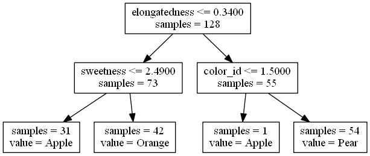
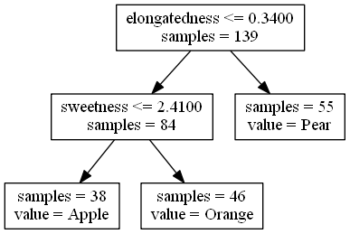
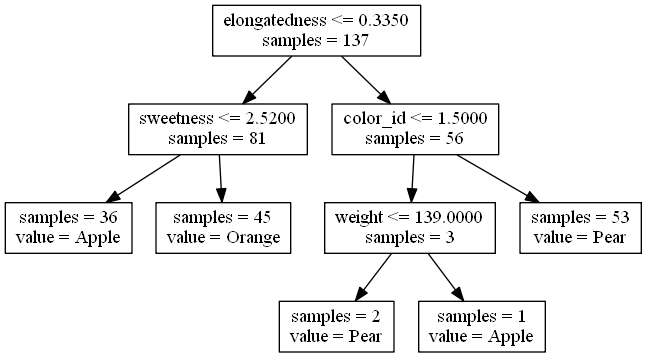

# Introduction to data analysis using machine learning #

## 06. Classification with Decision Trees ##

by David Taylor, [www.prooffreader.com](http://www.prooffreader.com) (blog) [www.dtdata.io](http://dtdata.io) (hire me!)

For links to more material including a slideshow explaining all this stuff in further detail, please see the front page of [this GitHub repo.](https://github.com/Prooffreader/intro_machine_learning)

This is notebook 6 of 8. The next notebook is: [[07. Classification with Random Forest]](http://nbviewer.ipython.org/github/Prooffreader/intro_machine_learning/blob/master/07_Classification_Random_Forest.ipynb)

[[01]](http://nbviewer.ipython.org/github/Prooffreader/intro_machine_learning/blob/master/01_The_Dataset.ipynb) [[02]](http://nbviewer.ipython.org/github/Prooffreader/intro_machine_learning/blob/master/02_Clustering_KMeans.ipynb) [[03]](http://nbviewer.ipython.org/github/Prooffreader/intro_machine_learning/blob/master/03_Clustering_OtherAlgos.ipynb) [[04]](http://nbviewer.ipython.org/github/Prooffreader/intro_machine_learning/blob/master/04_Classification_kNN.ipynb) [[05]](http://nbviewer.ipython.org/github/Prooffreader/intro_machine_learning/blob/master/05_Classification_OtherAlgos.ipynb) **[06]** [[07]](http://nbviewer.ipython.org/github/Prooffreader/intro_machine_learning/blob/master/07_Classification_Random_Forest.ipynb) [[08]](http://nbviewer.ipython.org/github/Prooffreader/intro_machine_learning/blob/master/08_Dimensionality_Reduction.ipynb)

***

We look further at one of the classification algorithms we saw in the [previous notebook](http://nbviewer.ipython.org/github/Prooffreader/intro_machine_learning/blob/master/05_Classification_OtherAlgos.ipynb). Again, this is an algorithm that is not used a lot in practice, but is very intuitively useful for beginners. Don't worry, the [next algorithm](http://nbviewer.ipython.org/github/Prooffreader/intro_machine_learning/blob/master/07_Classification_Random_Forest.ipynb) is one that's used a lot!

For the first time, we encounter an algorithm that is convenient to visualize with all five of our features, not just two that we can see in a scatter plot.

#### 1. Import libraries and load data #


```python
import pandas as pd
import numpy as np
import matplotlib.pyplot as plt
%matplotlib inline
from sklearn import tree
from sklearn.externals.six import StringIO
import re

df = pd.read_csv('fruit.csv')
fruitnames = {1: 'Orange', 2: 'Pear', 3: 'Apple'}
colors = {1: '#e09028', 2: '#55aa33', 3: '#cc3333'}
fruitlist = ['Orange', 'Pear', 'Apple']

df.sort('fruit_id', inplace=True) # This is important because the factorizer assigns numbers
    # based on the order the first label is encountered, e.g. if the first instance had
    # fruit = 3, the y value would be 0.

```

#### 2. Classify with a Decision Tree and view Confusion Matrix #

With all five features used, the confusion matrix should be a perfect or near-perfect classifier on the testing set.


```python
df['is_train'] = np.random.uniform(0, 1, len(df)) <= .75 # randomly assign training and testing set
train, test = df[df['is_train']==True], df[df['is_train']==False]
features = ['color_id', 'elongatedness', 'weight', 'sweetness', 'acidity']
y, _ = pd.factorize(train['fruit_id'])
clf = tree.DecisionTreeClassifier()
clf = clf.fit(train[features], y)
preds = clf.predict(test[features])
test_result = pd.crosstab(np.array([fruitnames[x] for x in test['fruit_id']]), 
                      np.array([fruitnames[x+1] for x in preds]), rownames=['actual'], colnames=['predicted'])
test_result
```


<div style="max-height:1000px;max-width:1500px;overflow:auto;">
<table border="1" class="dataframe">
  <thead>
    <tr style="text-align: right;">
      <th>predicted</th>
      <th>Apple</th>
      <th>Orange</th>
      <th>Pear</th>
    </tr>
    <tr>
      <th>actual</th>
      <th></th>
      <th></th>
      <th></th>
    </tr>
  </thead>
  <tbody>
    <tr>
      <th>Apple</th>
      <td> 11</td>
      <td>  0</td>
      <td>  0</td>
    </tr>
    <tr>
      <th>Orange</th>
      <td>  1</td>
      <td> 13</td>
      <td>  0</td>
    </tr>
    <tr>
      <th>Pear</th>
      <td>  0</td>
      <td>  0</td>
      <td> 15</td>
    </tr>
  </tbody>
</table>
</div>


#### 3. View several different trees, each produced on a different randomly selected 70% training set. #

Observe the differences between each.

Note:

1. You will need [Graphviz](http://www.graphviz.org/Download..php) installed and in the PATH environmental variable to visualize the graphs.

2. I did not make this code block a function because of the IPython magic shell call and call to Image.

3. I had some issues getting Pydot to work in Python 3, which is why I ran Graphviz in the shell and did a somewhat clunky regex sub to adjust the trees.


```python
# Repetition 1

df['is_train'] = np.random.uniform(0, 1, len(df)) <= .75 # randomly assign training and testing set
train, test = df[df['is_train']==True], df[df['is_train']==False]
features = ['color_id', 'elongatedness', 'weight', 'sweetness', 'acidity']
y, _ = pd.factorize(train['fruit_id'])
clf = tree.DecisionTreeClassifier()
clf = clf.fit(train[features], y)
dot_data = StringIO() 
tree.export_graphviz(clf, out_file=dot_data) 
tree_string = dot_data.getvalue()
# replace feature numbers with feature names
tree_string = re.sub('gini = 0\.[0-9]+\\\\n', '', tree_string)
for i, feature in enumerate(features):
    tree_string = re.sub('X\[{}\]'.format(i), feature, tree_string)
# repace lists of numeric label assignments with label name
for result in re.finditer('\[[ ]+([\d]+)\.[ ]+([\d]+)\.[ ]+([\d]+)\.\]', tree_string):
    nums = []
    for i in range(0,3):
        nums.append(int(result.group(i+1)))
    if nums[0] > nums[1]:
        if nums[0] > nums[2]:
            tree_string = re.sub('\[[ ]+{}\.[ ]+{}\.[ ]+{}\.\]'.format(nums[0], nums[1], nums[2]), fruitlist[0], tree_string)
        else:
            tree_string = re.sub('\[[ ]+{}\.[ ]+{}\.[ ]+{}\.\]'.format(nums[0], nums[1], nums[2]), fruitlist[2], tree_string)
    elif nums[1] > nums[2]:
        tree_string = re.sub('\[[ ]+{}\.[ ]+{}\.[ ]+{}\.\]'.format(nums[0], nums[1], nums[2]), fruitlist[1], tree_string)
    else:
        tree_string = re.sub('\[[ ]+{}\.[ ]+{}\.[ ]+{}\.\]'.format(nums[0], nums[1], nums[2]), fruitlist[2], tree_string)
with open('simple.dotfile', 'w+') as f:
    f.write(tree_string)
# normally this would be done with libraries like pydot or networkx, but
# I'm having trouble getting them to work in Python 3.4.2 under Windows,
# so I'll just call the shell executable directly
!dot.exe -Tpng simple.dotfile > simpletree.png
from IPython.core.display import Image
Image( filename ='simpletree.png')
```





```python
# Repetition 2

df['is_train'] = np.random.uniform(0, 1, len(df)) <= .75 # randomly assign training and testing set
train, test = df[df['is_train']==True], df[df['is_train']==False]
features = ['color_id', 'elongatedness', 'weight', 'sweetness', 'acidity']
y, _ = pd.factorize(train['fruit_id'])
clf = tree.DecisionTreeClassifier()
clf = clf.fit(train[features], y)
dot_data = StringIO() 
tree.export_graphviz(clf, out_file=dot_data) 
tree_string = dot_data.getvalue()
# replace feature numbers with feature names
tree_string = re.sub('gini = 0\.[0-9]+\\\\n', '', tree_string)
for i, feature in enumerate(features):
    tree_string = re.sub('X\[{}\]'.format(i), feature, tree_string)
# repace lists of numeric label assignments with label name
for result in re.finditer('\[[ ]+([\d]+)\.[ ]+([\d]+)\.[ ]+([\d]+)\.\]', tree_string):
    nums = []
    for i in range(0,3):
        nums.append(int(result.group(i+1)))
    if nums[0] > nums[1]:
        if nums[0] > nums[2]:
            tree_string = re.sub('\[[ ]+{}\.[ ]+{}\.[ ]+{}\.\]'.format(nums[0], nums[1], nums[2]), fruitlist[0], tree_string)
        else:
            tree_string = re.sub('\[[ ]+{}\.[ ]+{}\.[ ]+{}\.\]'.format(nums[0], nums[1], nums[2]), fruitlist[2], tree_string)
    elif nums[1] > nums[2]:
        tree_string = re.sub('\[[ ]+{}\.[ ]+{}\.[ ]+{}\.\]'.format(nums[0], nums[1], nums[2]), fruitlist[1], tree_string)
    else:
        tree_string = re.sub('\[[ ]+{}\.[ ]+{}\.[ ]+{}\.\]'.format(nums[0], nums[1], nums[2]), fruitlist[2], tree_string)
with open('simple.dotfile', 'w+') as f:
    f.write(tree_string)
# normally this would be done with libraries like pydot or networkx, but
# I'm having trouble getting them to work in Python 3.4.2 under Windows,
# so I'll just call the shell executable directly
!dot.exe -Tpng simple.dotfile > simpletree.png
from IPython.core.display import Image
Image( filename ='simpletree.png')
```





```python
# Repetition 3

df['is_train'] = np.random.uniform(0, 1, len(df)) <= .75 # randomly assign training and testing set
train, test = df[df['is_train']==True], df[df['is_train']==False]
features = ['color_id', 'elongatedness', 'weight', 'sweetness', 'acidity']
y, _ = pd.factorize(train['fruit_id'])
clf = tree.DecisionTreeClassifier()
clf = clf.fit(train[features], y)
dot_data = StringIO() 
tree.export_graphviz(clf, out_file=dot_data) 
tree_string = dot_data.getvalue()
# replace feature numbers with feature names
tree_string = re.sub('gini = 0\.[0-9]+\\\\n', '', tree_string)
for i, feature in enumerate(features):
    tree_string = re.sub('X\[{}\]'.format(i), feature, tree_string)
# repace lists of numeric label assignments with label name
for result in re.finditer('\[[ ]+([\d]+)\.[ ]+([\d]+)\.[ ]+([\d]+)\.\]', tree_string):
    nums = []
    for i in range(0,3):
        nums.append(int(result.group(i+1)))
    if nums[0] > nums[1]:
        if nums[0] > nums[2]:
            tree_string = re.sub('\[[ ]+{}\.[ ]+{}\.[ ]+{}\.\]'.format(nums[0], nums[1], nums[2]), fruitlist[0], tree_string)
        else:
            tree_string = re.sub('\[[ ]+{}\.[ ]+{}\.[ ]+{}\.\]'.format(nums[0], nums[1], nums[2]), fruitlist[2], tree_string)
    elif nums[1] > nums[2]:
        tree_string = re.sub('\[[ ]+{}\.[ ]+{}\.[ ]+{}\.\]'.format(nums[0], nums[1], nums[2]), fruitlist[1], tree_string)
    else:
        tree_string = re.sub('\[[ ]+{}\.[ ]+{}\.[ ]+{}\.\]'.format(nums[0], nums[1], nums[2]), fruitlist[2], tree_string)
with open('simple.dotfile', 'w+') as f:
    f.write(tree_string)
# normally this would be done with libraries like pydot or networkx, but
# I'm having trouble getting them to work in Python 3.4.2 under Windows,
# so I'll just call the shell executable directly
!dot.exe -Tpng simple.dotfile > simpletree.png
from IPython.core.display import Image
Image( filename ='simpletree.png')
```





