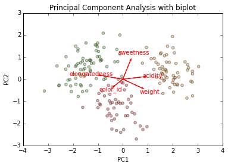

# Introduction to data analysis using machine learning #

## 08. Dimensionality reduction with Principal Component Analysis (PCA) ##

by David Taylor, [www.prooffreader.com](http://www.prooffreader.com) (blog) [www.dtdata.io](http://dtdata.io) (hire me!)

For links to more material including a slideshow explaining all this stuff in further detail, please see the front page of [this GitHub repo.](https://github.com/Prooffreader/intro_machine_learning)

This is notebook 8 of 8. 

[[01]](http://nbviewer.ipython.org/github/Prooffreader/intro_machine_learning/blob/master/01_The_Dataset.ipynb) [[02]](http://nbviewer.ipython.org/github/Prooffreader/intro_machine_learning/blob/master/02_Clustering_KMeans.ipynb) [[03]](http://nbviewer.ipython.org/github/Prooffreader/intro_machine_learning/blob/master/03_Clustering_OtherAlgos.ipynb) [[04]](http://nbviewer.ipython.org/github/Prooffreader/intro_machine_learning/blob/master/04_Classification_kNN.ipynb) [[05]](http://nbviewer.ipython.org/github/Prooffreader/intro_machine_learning/blob/master/05_Classification_OtherAlgos.ipynb) [[06]](http://nbviewer.ipython.org/github/Prooffreader/intro_machine_learning/blob/master/06_Classification_Decision_Trees.ipynb) [[07]](http://nbviewer.ipython.org/github/Prooffreader/intro_machine_learning/blob/master/07_Classification_Random_Forest.ipynb) **[08]**
***

In the [previous notebook](http://nbviewer.ipython.org/github/Prooffreader/intro_machine_learning/blob/master/07_Classification_Random_Forest.ipynb), we finished our look at Supervised Learning. Now we see a way to address the Curse of Dimensionality by reducing our features using PCA.

#### 1. Import libraries and load data #


```python
import pandas as pd
import matplotlib.pyplot as plt
%matplotlib inline
import numpy as np
from statsmodels.sandbox.tools.tools_pca import pcasvd
from sklearn.ensemble import RandomForestClassifier

df = pd.read_csv('fruit.csv')

fruitnames = {1: 'Orange', 2: 'Pear', 3: 'Apple'}
colors = {1: '#e09028', 2: '#55aa33', 3: '#cc3333'}
fruitlist = ['Orange', 'Pear', 'Apple']

numerical_columns = ['elongatedness', 'weight', 'sweetness', 'acidity', 'color_id']
```

#### 2. Run PCA #

Scikit-learn has a PCA module, but instead I'm using statsmodels's ``pcasvd`` function in order to make a biplot.


```python
# code taken from http://okomestudio.net/biboroku/?p=2292

import matplotlib.pyplot as plt
import numpy as np
import pandas as pd


def biplot(plt, pca, labels=None, colors=None,
           xpc=1, ypc=2, scale=1):
    """Generate biplot from the result of pcasvd of statsmodels.

    Parameters
    ----------
    plt : object
        An existing pyplot module reference.

    pca : tuple
        The result from statsmodels.sandbox.tools.tools_pca.pcasvd.

    labels : array_like, optional
        Labels for each observation.

    colors : array_like, optional
        Colors for each observation.

    xpc, ypc : int, optional
        The principal component number for x- and y-axis. Defaults to
        (xpc, ypc) = (1, 2).

    scale : float
        The variables are scaled by lambda ** scale, where lambda =
        singular value = sqrt(eigenvalue), and the observations are
        scaled by lambda ** (1 - scale). Must be in [0, 1].

    Returns
    -------
    None.

    """
    xpc, ypc = (xpc - 1, ypc - 1)
    xreduced, factors, evals, evecs = pca
    singvals = np.sqrt(evals)
 
    # data
    xs = factors[:, xpc] * singvals[xpc]**(1. - scale)
    ys = factors[:, ypc] * singvals[ypc]**(1. - scale)
 
    colors = 'k' if colors is None else colors
    plt.scatter(xs, ys, c=colors, marker='o', alpha=0.4)
 
    # variables
    tvars = np.dot(np.eye(factors.shape[0], factors.shape[1]),
                   evecs) * singvals**scale
 
    for i, col in enumerate(xreduced.columns.values):
        x, y = tvars[i][xpc], tvars[i][ypc]
        plt.arrow(0, 0, x, y, color='r',
                  width=0.002, head_width=0.05)
        plt.text(x* 1.4, y * 1.4, col, color='r', ha='center', va='center')
    
    plt.title('Principal Component Analysis with biplot')
    plt.xlabel('PC{}'.format(xpc + 1))
    plt.ylabel('PC{}'.format(ypc + 1))
 
    return xs, ys 
```


```python
columns = ['elongatedness', 'weight', 'sweetness', 'acidity', 'color_id']

data = df[columns]
classes = df['fruit_id']
data = (data - data.mean()) / data.std() # pca data must be normalized
pca = pcasvd(data, keepdim=0, demean=False)

colors = [['#e09028', '#55aa33', '#cc3333'][i-1] for i in classes]

plt.figure(1)
xs, ys = biplot(plt, pca, labels=classes, colors=colors,
       xpc=1, ypc=2)
plt.show()
```





#### 3. Do 100 runs of Random Forest Classifier using two principal components and show confusion matrix #


```python
df_pca = pd.DataFrame({'PC1': xs,
                       'PC2': ys,
                       'fruit_id': classes})
df_pca.sort('fruit_id', inplace=True)

# parameters
# I did not make a function because I wanted to preserve the 
# IPython output of the confusion matrix in the same cell.
reps=100
features = ['PC1', 'PC2']
title_suffix='with two principal components'

import time
start = time.time()
for i in range(reps):
    df_pca['is_train'] = np.random.uniform(0, 1, len(df_pca)) <= .75 # randomly assign training and testing set
    train, test = df_pca[df_pca['is_train']==True], df_pca[df_pca['is_train']==False]
    y, _ = pd.factorize(train['fruit_id'])
    clf = RandomForestClassifier(n_jobs=2)
    clf = clf.fit(train[features], y)
    preds = clf.predict(test[features])
    test_result = pd.crosstab(np.array([fruitnames[x] for x in test['fruit_id']]), 
                          np.array([fruitnames[x+1] for x in preds]), rownames=['actual'], colnames=['predicted'])
    if i == 0:
        final_result = test_result[:]
    else:
        final_result += test_result
confmatrix = np.array(final_result)
correct = 0
for i in range(confmatrix.shape[0]):
    correct += confmatrix[i,i]
accuracy = correct/confmatrix.sum()
print('{} runs {}\nFeatures: {}\nAccuracy: {}\ntime: {} sec'.format(reps, title_suffix, features, accuracy, int(time.time()-start)))
final_result
```

    100 runs with two principal components
    Features: ['PC1', 'PC2']
    Accuracy: 0.9665188470066519
    time: 23 sec
    


<div style="max-height:1000px;max-width:1500px;overflow:auto;">
<table border="1" class="dataframe">
  <thead>
    <tr style="text-align: right;">
      <th>predicted</th>
      <th>Apple</th>
      <th>Orange</th>
      <th>Pear</th>
    </tr>
    <tr>
      <th>actual</th>
      <th></th>
      <th></th>
      <th></th>
    </tr>
  </thead>
  <tbody>
    <tr>
      <th>Apple</th>
      <td> 1146</td>
      <td>    8</td>
      <td>   92</td>
    </tr>
    <tr>
      <th>Orange</th>
      <td>    8</td>
      <td> 1481</td>
      <td>    1</td>
    </tr>
    <tr>
      <th>Pear</th>
      <td>   42</td>
      <td>    0</td>
      <td> 1732</td>
    </tr>
  </tbody>
</table>
</div>


