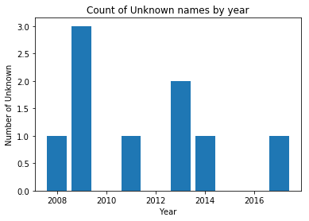
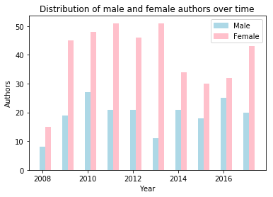

## 1. Sound it out!
<p>Grey and Gray. Colour and Color. Words like these have been the cause of many heated arguments between Brits and Americans. Accents (and jokes) aside, there are many words that are pronounced the same way but have different spellings. While it is easy for us to realize their equivalence, basic programming commands will fail to equate such two strings. </p>
<p>More extreme than word spellings are names because people have more flexibility in choosing to spell a name in a certain way. To some extent, tradition sometimes governs the way a name is spelled, which limits the number of variations of any given English name. But if we consider global names and their associated English spellings, you can only imagine how many ways they can be spelled out. </p>
<p>One way to tackle this challenge is to write a program that checks if two strings sound the same, instead of checking for equivalence in spellings. We'll do that here using fuzzy name matching.</p>


```python
# Importing the fuzzy package
import fuzzy

# Exploring the output of fuzzy.nysiis
print(fuzzy.nysiis("Francisco"))

# Testing equivalence of similar sounding words
fuzzy.nysiis('him') == fuzzy.nysiis('hymn')
```

    FRANCASC


    True


```python
%%nose
import sys

def test_fuzzy_is_loaded():
    assert 'fuzzy' in sys.modules, \
    'The fuzzy module should be loaded'
```


    1/1 tests passed


## 2. Authoring the authors
<p>The New York Times puts out a weekly list of best-selling books from different genres, and which has been published since the 1930’s.  We’ll focus on Children’s Picture Books, and analyze the gender distribution of authors to see if there have been changes over time. We'll begin by reading in the data on the best selling authors from 2008 to 2017.</p>


```python
# Importing the pandas module
import pandas as pd

# Reading in datasets/nytkids_yearly.csv, which is semicolon delimited.
author_df = pd.read_csv("datasets/nytkids_yearly.csv", sep = ";")

# Looping through author_df['Author'] to extract the authors first names
first_name = []
for name in author_df['Author'] :
    first_name.append(name.split(" ")[0])

# Adding first_name as a column to author_df
author_df['first_name'] = pd.Series(first_name).values

# Checking out the first few rows of author_df
author_df.head()
```


<div>
<style scoped>
    .dataframe tbody tr th:only-of-type {
        vertical-align: middle;
    }

    .dataframe tbody tr th {
        vertical-align: top;
    }

    .dataframe thead th {
        text-align: right;
    }
</style>
<table border="1" class="dataframe">
  <thead>
    <tr style="text-align: right;">
      <th></th>
      <th>Year</th>
      <th>Book Title</th>
      <th>Author</th>
      <th>Besteller this year</th>
      <th>first_name</th>
    </tr>
  </thead>
  <tbody>
    <tr>
      <th>0</th>
      <td>2017</td>
      <td>DRAGONS LOVE TACOS</td>
      <td>Adam Rubin</td>
      <td>49</td>
      <td>Adam</td>
    </tr>
    <tr>
      <th>1</th>
      <td>2017</td>
      <td>THE WONDERFUL THINGS YOU WILL BE</td>
      <td>Emily Winfield Martin</td>
      <td>48</td>
      <td>Emily</td>
    </tr>
    <tr>
      <th>2</th>
      <td>2017</td>
      <td>THE DAY THE CRAYONS QUIT</td>
      <td>Drew Daywalt</td>
      <td>44</td>
      <td>Drew</td>
    </tr>
    <tr>
      <th>3</th>
      <td>2017</td>
      <td>ROSIE REVERE, ENGINEER</td>
      <td>Andrea Beaty</td>
      <td>38</td>
      <td>Andrea</td>
    </tr>
    <tr>
      <th>4</th>
      <td>2017</td>
      <td>ADA TWIST, SCIENTIST</td>
      <td>Andrea Beaty</td>
      <td>28</td>
      <td>Andrea</td>
    </tr>
  </tbody>
</table>
</div>


```python
%%nose
    
def test_check_authors():
    len_auth = len(author_df['first_name'])
    all_names = list(author_df['first_name'])
    assert ('Shel' in all_names and len_auth==603), \
    'first_name column does not contan the correct first names of authors'
```


    1/1 tests passed


## 3. It's time to bring on the phonics... _again_!
<p>When we were young children, we were taught to read using phonics; sounding out the letters that compose words. So let's relive history and do that again, but using python this time. We will now create a new column or list that contains the phonetic equivalent of every first name that we just extracted. </p>
<p>To make sure we're on the right track, let's compare the number of unique values in the <code>first_name</code> column and the number of unique values in the nysiis coded column. As a rule of thumb, the number of unique nysiis first names should be less than or equal to the number of actual first names.</p>


```python
# Importing numpy
import numpy as np

# Looping through author's first names to create the nysiis (fuzzy) equivalent
nysiis_name = []
for name in author_df['first_name'] :
    nysiis_name.append(fuzzy.nysiis(name))

# Adding nysiis_name as a column to author_df
author_df['nysiis_name'] = pd.Series(nysiis_name).values

# Printing out the difference between unique firstnames and unique nysiis_names:
np.unique(author_df['first_name']).size - np.unique(author_df['nysiis_name']).size
```


    25


```python
%%nose

import numpy as np

def test_check_nysiis_list():
    assert len( np.unique(author_df['nysiis_name']) ) == 145, \
        'The nysiis_name column does not contan the correct entries'
```


    1/1 tests passed


## 4. The inbetweeners
<p>We'll use <code>babynames_nysiis.csv</code>, a dataset that is derived from <a href="https://www.ssa.gov/oact/babynames/limits.html">the Social Security Administration’s baby name data</a>, to identify author genders. The dataset contains unique NYSIIS versions of baby names, and also includes the percentage of times the name appeared as a female name (<code>perc_female</code>) and the percentage of times it appeared as a male name (<code>perc_male</code>). </p>
<p>We'll use this data to create a list of <code>gender</code>. Let's make the following simplifying assumption: For each name, if <code>perc_female</code> is greater than <code>perc_male</code> then assume the name is female, if <code>perc_female</code> is less than <code>perc_male</code> then assume it is a male name, and if the percentages are equal then it's a "neutral" name.</p>


```python
# Reading in datasets/babynames_nysiis.csv, which is semicolon delimited.
babies_df = pd.read_csv("datasets/babynames_nysiis.csv", sep = ";")

babies_df.loc[1,'perc_female']

# Looping through babies_df to and filling up gender
gender = []
for idx in range(len(babies_df)):
    if (babies_df.loc[idx,'perc_female'] <  babies_df.loc[idx,'perc_male']):
        gender.append('M')
    elif (babies_df.loc[idx,'perc_female'] >  babies_df.loc[idx,'perc_male']):  
        gender.append('F')
    elif (babies_df.loc[idx,'perc_female'] ==  babies_df.loc[idx,'perc_male']):  
        gender.append('N')    

# Adding a gender column to babies_df
babies_df['gender'] = pd.Series(gender).values

# Printing out the first few rows of babies_df
babies_df.head()


```


<div>
<style scoped>
    .dataframe tbody tr th:only-of-type {
        vertical-align: middle;
    }

    .dataframe tbody tr th {
        vertical-align: top;
    }

    .dataframe thead th {
        text-align: right;
    }
</style>
<table border="1" class="dataframe">
  <thead>
    <tr style="text-align: right;">
      <th></th>
      <th>babynysiis</th>
      <th>perc_female</th>
      <th>perc_male</th>
      <th>gender</th>
    </tr>
  </thead>
  <tbody>
    <tr>
      <th>0</th>
      <td>NaN</td>
      <td>62.50</td>
      <td>37.50</td>
      <td>F</td>
    </tr>
    <tr>
      <th>1</th>
      <td>RAX</td>
      <td>63.64</td>
      <td>36.36</td>
      <td>F</td>
    </tr>
    <tr>
      <th>2</th>
      <td>ESAR</td>
      <td>44.44</td>
      <td>55.56</td>
      <td>M</td>
    </tr>
    <tr>
      <th>3</th>
      <td>DJANG</td>
      <td>0.00</td>
      <td>100.00</td>
      <td>M</td>
    </tr>
    <tr>
      <th>4</th>
      <td>PARCAL</td>
      <td>25.00</td>
      <td>75.00</td>
      <td>M</td>
    </tr>
  </tbody>
</table>
</div>


```python
%%nose

def test_gender_distribution():
    assert len([i for i, x in enumerate(babies_df['gender']) if x == 'N']) == 1170,\
        'gender column does not contain the correct number of Male, Female and Neutral names, which are 7031, 8939 and 1170 respectively'
```


    1/1 tests passed


## 5. Playing matchmaker
<p>Now that we have identified the likely genders of different names, let's find author genders by searching for each author's name in the <code>babies_df</code> DataFrame, and extracting the associated gender. </p>


```python
# This function returns the location of an element in a_list.
# Where an item does not exist, it returns -1.
def locate_in_list(a_list, element):
    loc_of_name = a_list.index(element) if element in a_list else -1
    return(loc_of_name)

# Looping through author_df['nysiis_name'] and appending the gender of each
# author to author_gender.
author_gender = []
for name in author_df['nysiis_name'] :
    idx = locate_in_list(list(babies_df['babynysiis']), name)
    if (idx == -1):
        author_gender.append('Unknown')
    else:    
        author_gender.append(babies_df.loc[idx,'gender'])

# Adding author_gender to the author_df
author_df['author_gender'] = pd.Series(author_gender).values
print(author_df.head())
# Counting the author's genders
author_df['author_gender'].value_counts()
```

       Year                        Book Title                 Author  \
    0  2017                DRAGONS LOVE TACOS             Adam Rubin   
    1  2017  THE WONDERFUL THINGS YOU WILL BE  Emily Winfield Martin   
    2  2017          THE DAY THE CRAYONS QUIT           Drew Daywalt   
    3  2017            ROSIE REVERE, ENGINEER           Andrea Beaty   
    4  2017              ADA TWIST, SCIENTIST           Andrea Beaty   
    
       Besteller this year first_name nysiis_name author_gender  
    0                   49       Adam        ADAN             M  
    1                   48      Emily       ENALY             F  
    2                   44       Drew          DR             M  
    3                   38     Andrea        ANDR             M  
    4                   28     Andrea        ANDR             M  


    F          395
    M          191
    Unknown      9
    N            8
    Name: author_gender, dtype: int64


```python
%%nose

def len_authors():
    return len(author_df[author_df.author_gender == "M"])

def test_num_males():
    assert len_authors() == 191, \
        'The number of Males (M) and Females (F) appear to be wrong. These are 191 and 395 respectively'
```


    1/1 tests passed


## 6. Tally up
<p>From the results above see that there are more female authors on the New York Times best seller's list than male authors. Our dataset spans 2008 to 2017. Let's find out if there have been changes over time.</p>


```python
# Creating a list of unique years, sorted in ascending order.
years = np.unique(author_df['Year'])

# Initializing lists
males_by_yr = []
females_by_yr = []
unknown_by_yr = []

# Looping through years to find the number of male, female and unknown authors per year
for year in years:
    males_by_yr.append(len( author_df[ (author_df['author_gender']=='M') & (author_df['Year'] == year)] ))
    females_by_yr.append(len( author_df[(author_df['author_gender']=='F') & (author_df['Year'] == year)] ))
    unknown_by_yr.append(len( author_df[ (author_df['author_gender']=='Unknown') & (author_df['Year'] == year)] ))


    
# Printing out yearly values to examine changes over time
data = np.array([males_by_yr, females_by_yr, unknown_by_yr])
headers=['males', 'females', 'unknowns']
pd.DataFrame(data, headers, years)
```


<div>
<style scoped>
    .dataframe tbody tr th:only-of-type {
        vertical-align: middle;
    }

    .dataframe tbody tr th {
        vertical-align: top;
    }

    .dataframe thead th {
        text-align: right;
    }
</style>
<table border="1" class="dataframe">
  <thead>
    <tr style="text-align: right;">
      <th></th>
      <th>2008</th>
      <th>2009</th>
      <th>2010</th>
      <th>2011</th>
      <th>2012</th>
      <th>2013</th>
      <th>2014</th>
      <th>2015</th>
      <th>2016</th>
      <th>2017</th>
    </tr>
  </thead>
  <tbody>
    <tr>
      <th>males</th>
      <td>8</td>
      <td>19</td>
      <td>27</td>
      <td>21</td>
      <td>21</td>
      <td>11</td>
      <td>21</td>
      <td>18</td>
      <td>25</td>
      <td>20</td>
    </tr>
    <tr>
      <th>females</th>
      <td>15</td>
      <td>45</td>
      <td>48</td>
      <td>51</td>
      <td>46</td>
      <td>51</td>
      <td>34</td>
      <td>30</td>
      <td>32</td>
      <td>43</td>
    </tr>
    <tr>
      <th>unknowns</th>
      <td>1</td>
      <td>3</td>
      <td>0</td>
      <td>1</td>
      <td>0</td>
      <td>2</td>
      <td>1</td>
      <td>0</td>
      <td>0</td>
      <td>1</td>
    </tr>
  </tbody>
</table>
</div>


```python
%%nose

def test_years():
    correct_years = list(np.unique(author_df.Year))
    assert list(years) == correct_years, \
    'years should be the unique years in author_df["Year"] sorted in ascending order.'

def test_gender_by_yr():
    assert sum(males_by_yr)==191, \
    'At least one of the lists (males_by_yr, females_by_yr, unknown_by_yr) contains an incorrect value.'
```


    2/2 tests passed


## 7. Foreign-born authors?
<p>Our gender data comes from social security applications of individuals born in the US. Hence, one possible explanation for why there are "unknown" genders associated with some author names is because these authors were foreign-born. While making this assumption, we should note that these are only a subset of foreign-born authors as others will have names that have a match in <code>baby_df</code> (and in the social security dataset). </p>
<p>Using a bar chart, let's explore the trend of foreign-born authors with no name matches in the social security dataset.</p>


```python
# Importing matplotlib
import matplotlib.pyplot as plt

# This makes plots appear in the notebook
%matplotlib inline

# Plotting the bar chart
plt.bar(x = years, height = unknown_by_yr)


# [OPTIONAL] - Setting a title, and axes labels
plt.title("Count of Unknown names by year")
plt.xlabel("Year")
plt.ylabel("Number of Unknown")    
plt.show()
```





```python
%%nose

# It's hard to test plots.
def test_nothing():
    assert True, ""

#def test_pos():
#    assert  pos ==list(range(len(unknown_by_yr))) or pos== range(len(unknown_by_yr)) or pos==years, \
#    'pos should be a list containing integer values with the same length as unknown_by_yr '
```


    1/1 tests passed


## 8. Raising the bar
<p>What’s more exciting than a bar chart is a grouped bar chart. This type of chart is good for displaying <em>changes</em> over time while also <em>comparing</em> two or more groups. Let’s use a grouped bar chart to look at the distribution of male and female authors over time.</p>


```python
import matplotlib.patches as mpatches
# Creating a new list, where 0.25 is added to each year
years_shifted = years + 0.25

# Plotting males_by_yr by year
plt.bar(x = years, height = males_by_yr, width=0.25, color='lightblue')

# Plotting females_by_yr by years_shifted
plt.bar(x = years_shifted, height = females_by_yr, width=0.25, color='pink')

# [OPTIONAL] - Adding relevant Axes labels and Chart Title
plt.title("Distribution of male and female authors over time")
plt.xlabel("Year")
plt.ylabel("Authors")  
lightblue_patch = mpatches.Patch(color='lightblue', label='Male')
pink_patch = mpatches.Patch(color='pink', label='Female')
plt.legend(handles=[lightblue_patch, pink_patch])
plt.show()
```





```python
%%nose

def test_years_shifted():
    correct_years_shifted = [year + 0.25 for year in years]
    assert list(years_shifted) == correct_years_shifted, \
    'years_shifted should be like years but with 0.25 added to each year.'
```


    1/1 tests passed


