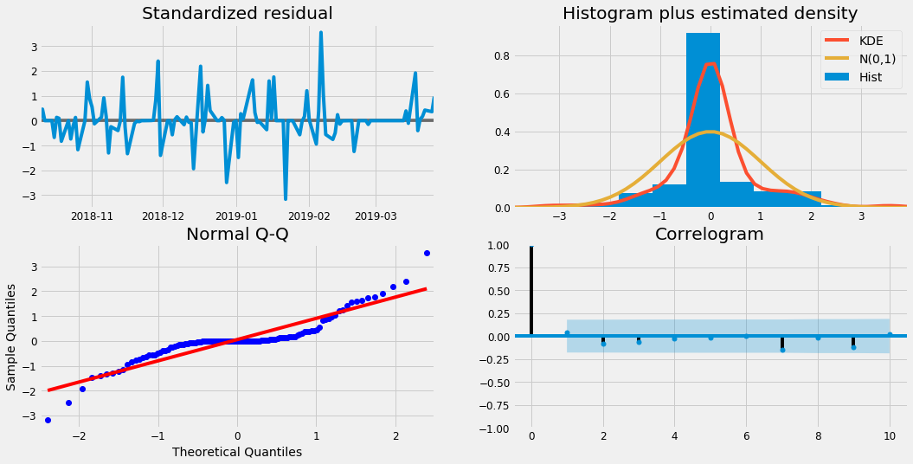

#Ongoing Project.

# Python
### LocalLibrary:
* Library uses the OS and shell utilities.
* ROOT refers to the source file's working folder.
* _selectBaseData grabs all values from the massdata table.
* _selectColumnHeaders is a common call to grab the values and timestamps from the specific metric tables.
* Functions:
  1. OutputToFileNameQuery(fileName): outputs information to the /dump/ folder based off of the root defined earlier and creates a .csv file with the filename specified via the parameter given. This function is used for the modeling and forecasting.
  2. DeleteCSVFile(f): deletes the /dump/ files if they exist - if the data is constantly updated, then it would make sense to delete the old CSV files. Duplicates are not intended.
  3. SelectMetric(metricName): selects all records from the specific metric name, ordered by the timestamp value.
  4. GetMetrics(): returns the list of metric variables to watch.
  5. InsertForecast(): inserts dynamic data to be inserted into the forecasted data table.
  6. ClearForecast(): Truncates (drops/deletes all rows) the table 'forecastdata'.
  7. DeleteImageFolder(path): clears all images in the folder that were created. The reasoning behind this method is that there should be new images generated any time a new model gets created, and thus there should be new images that correspond to it.

### DataTransmitter:
* Imports locallibrary and the mysql connector.
* _VARIABLES refer to the global values for the database connection or the email information containers.
* Note that when setting up the MySQL server, this information is critical to have match with the credentials set up during set-up. Complete access is required for the script, thus privileges need to be set in order for this to work.
* Functions
  1. Class DatabaseClient:
     1. init: creates a connection to the server given the details, and sets up the cursor.
     2. setQuery(self, newQ): sets query to newQ.
     3. getQuery(self): returns the query that is currently set.
     4. performQuery(self): executes the current query on the database.
     5. getCursor(self): returns the cursor.
     6. getPreparsedCursor(self): returns the cursor that is prepared for multiple statement executions at once.
     7. close(self): closes the cursor and connection.
     8. comm(self): commits multiple SQL executions, used in tandem with getPreparedCursor(self).
  2. SendEmails(): sends informations regarding the current report to the recipients stored in the database table 'emails'. uses MIME libraries to allow multiple images and recipients and message parts. Reads images from the /images/ folder.
  3. addEmailText(strToAdd): adds string strToAdd to the email body before being sent.
  4. addEmailImage(imgName): adds imgName to the image attachments for the email to be sent.

### DataModeler:
* All of the magic happens here!
* When running the program for the first time on boot, it takes a while to perform the imports on all of the libraries. The first ~20 lines are all imports and are required for the program to work.
* The program executes in the following manner:
  * Set up database client and get the metrics we are following
  * loop through metric variables and do the following:
    * delete any existing CSV files that were used for prior models
    * sets a query to grab the relevant information for the current metric (from specific metric table) - exports this data to a CSV
    * adds the query to the email if needed to be sent
    * read the data with pandas into a trainSet
    * calls on the functions DataPlot, SARIMAXPlot, DataAnalysis, and UploadForecast
    * deletes the images created
    * go to next metric
  * clears the forecast table in the database
  * closes the database connection
* Functions:
  1. DataPlot(dataSet): This function sets the plot and sampling of the data taken in through dataSet. It strips the ' UTC' portion of the string from the timestamp (as UTC is not part of a proper timestamp), and sets it to be an index. Next it plots the data as a line over time. It returns the sampled data on a hourly (may change) rate by the values column.
  2. SARIMAXPlot(dataSet, iterator, predictionDate): This function trains a model and creates a predicted mean plot with some statistical graphics. Initially, it takes in the dataSet in the SARIMAX function and the results get fitted. Next it saves an image of the graph it created and then shows it. It saves the images based on the name, which is iterator. Afterwards, it gets a prediction with a confidence reading and plots it as a function of time. The prediction is made from the predictionDate and onwards. This is the one step ahead forecast, which is saved and added in the email. The return values are the predicted means, and the results.
  3. DataAnalysis(dataSet, results, iterator, stepsAhead, startDate): This function creates a forecast for stepsAhead steps past the startDate. Documented is the MSE and RMSE, which is attached to the email. Next we create a graph and predict the next stepsAhead steps. We save this image and attach it to the email as well. Afterwords we reccord the predicted mean and standard deviation. The lower the deviation the better. After all of this is done, we determine if an email should be sent. Currently, no statistical analysis is done for this portion, only a broad 'guess'. A for loop iterates through the predicted means (in the forecasted values), and for each value, it compares itself to the predicted mean - .5 standard deviations. If one of the rows meets this value (which is approximately a 17% dip from the average), we send out an email for the timestamp it was found in. The return values are the predicted mean and the conf_int of the pred_uc.
  4. Upload Forecast(predData1, predData2, metric, steps): This function adds the forecast data to the table forecasteddata in the database. it loops through all of the data in predData1 and 2 and adds it to an array. Next, it loops through the entire array, and adds each row as a new record to the table.


```python
#LocalLibrary.py
import os, shutil
ROOT = os.path.abspath("").replace('\\', '/')
####_selectBaseData = "SELECT * FROM odendata.massdata "
####_selectColumnHeaders = "Select \"values\", \"timestamp\" union all "
#_outputToFile = "INTO OUTFILE '" + ROOT + "/test.csv' FIELDS TERMINATED BY ',' ENCLOSED BY '\"' LINES TERMINATED BY '\n';"
def OutputToFileNameQuery(fileName):
    _outputToFile = "INTO OUTFILE '" + ROOT + "/dump/" + fileName + ".csv' FIELDS TERMINATED BY ',' ENCLOSED BY '\"' LINES TERMINATED BY '\n';"
    return _outputToFile

def DeleteCSVFile(f):
    f = "dump/" + f + ".csv"
    if os.path.exists(f):
        os.remove(f)
    return

def SelectMetric(metricName):
    return "SELECT * FROM " + metricName + " order by timestamp asc "

def GetMetrics():
    return "SELECT metricName FROM criticalmetrics;"

def InsertForecast():
    #q = "INSERT INTO forecasteddata (predictedValue, predictedDate, predictedLowerValue, predictedUpperValue, metricName) VALUES ( %s, %s, %s, %s, %s);"
    q = "INSERT INTO forecasteddata (predictedValue, predictedDate, predictedLowerValue, predictedUpperValue, metricName) VALUES ( ?, ?, ?, ?, ?);"
    return q
def ClearForecast():
    q = "TRUNCATE TABLE forecasteddata;"
    return q
def GetEmails():
    q = "SELECT email from emails;"
    return q
# deletes the images stored in the folder path given
def DeleteImageFolder(path):
    for the_file in os.listdir(path):
        file_path = os.path.join(path, the_file)
        try:
            if os.path.isfile(file_path):
                os.unlink(file_path)
            #elif os.path.isdir(file_path): shutil.rmtree(file_path)
        except Exception as e:
            print(e)
```


```python
#LocalTransmitter.py
###import LocalLibrary as ll
####import mysql.connector
import pyodbc

####_userName = "####"
####_password = "####"
_records = []
_recipients = []
_emailData = "Forecasting summary/information:"
_emailImages = []
_databaseName = ""


####_host = "127.0.0.1"
class DatabaseClient:
    def __init__(self):
        self._currentQuery = ""
        ####self._conn = mysql.connector.connect(user = _userName, password= _password, host = _host)
        self._conn = pyodbc.connect('DRIVER={ODBC Driver 13 for SQL Server}; SERVER=######; DATABASE=#####; Trusted_Connection=yes')
        self._mycursor = self._conn.cursor()
    # sets the query to the desired string to perform
    def setQuery(self, newQ):
        self._currentQuery = newQ
        return

    def getQuery(self):
        return self._currentQuery

    # performs the current query
    def performQuery(self):
        # execute query
        self._mycursor.execute(self._currentQuery)
        return

    #returns the cursor
    def getCursor(self):
        return self._mycursor
    #returns the cursor - prepared
    def getPreparedCursor(self):
        ####return self._conn.cursor(prepared = True)
        return self._conn.cursor()

    def close(self):
        self._mycursor.close()
        self._conn.close()
        return
    def comm(self):
        self._conn.commit()
# ---------------- Send email portion of transmitter -------------
def SendEmails():
    import smtplib
    import os
    from email.mime.text import MIMEText
    from email.mime.image import MIMEImage
    from email.mime.multipart import MIMEMultipart
    #server = smtplib.SMTP('smtp.gmail.com', 587)
    server = smtplib.SMTP('#######', 25)
    ###server.starttls()
    # credentials
    fromEmail = "#######"
    ###fromPass = "######"
    # who receives email
    recipients = _recipients
    # login
    ###server.login(fromEmail, fromPass)
    # set message details
    msg = MIMEMultipart()
    text = MIMEText(_emailData)
    global _emailImages
    for img in _emailImages:
        img_data = open(img, 'rb').read()
        msg.attach(MIMEImage(img_data, name=os.path.basename(img)))
    _emailImages = []
    msg.attach(text)
    msg['Subject'] = "Predicted downtime"
    msg['From'] = fromEmail
    msg['To'] = ", ".join(recipients)
    #send email
    server.sendmail(fromEmail, recipients, msg.as_string())
    server.quit()

def AddEmailText(strToAdd):
    global _emailData
    _emailData = _emailData + "\n" + strToAdd

def AddEmailImage(imgName):
    global _emailImages
    _emailImages.append(imgName)

def AddEmailRecipients(arr):
    global _recipients
    for em in arr:
        _recipients.append(em)
```


```python
#LocalModeler.py
# Connection lib to mysql server
###import mysql.connector
from sqlalchemy import create_engine
import urllib


# Used for plotting data
import matplotlib
import matplotlib.pyplot as plt
# Project files
###import LocalLibrary as ll
###import DataTransmitter as dt

# Machine learning libraries
import numpy as np
import pandas as pd
from pandas.plotting import scatter_matrix
import warnings
import itertools
import os
import datetime
warnings.filterwarnings("ignore")
plt.style.use('fivethirtyeight')
import statsmodels.api as sm

#needed to use panda's read_sql functionality.  FP 6/12/2019
quoted = urllib.parse.quote_plus('DRIVER={ODBC Driver 13 for SQL Server}; SERVER=us-mersql05; DATABASE=odendata; Trusted_Connection=yes')
engine = create_engine('mssql+pyodbc:///?odbc_connect={}'.format(quoted))

# setting the plot settings
matplotlib.rcParams['axes.labelsize'] = 14
matplotlib.rcParams['xtick.labelsize'] = 12
matplotlib.rcParams['ytick.labelsize'] = 12
matplotlib.rcParams['text.color'] = 'k'

# Plots the data in the table for the given metric
def DataPlot(dataSet):
    # Gets rid of the ' UTC' ending of the timestamp values
    dataSet['timestamp'] = dataSet['timestamp'].map(lambda x : x.lstrip('').rstrip(' UTC'))
    # Sets the dataframe's indexing to the timestamp
    dataSet = dataSet.set_index(pd.DatetimeIndex(dataSet['timestamp']))
    dataSet.index
    # Column 0 is the value, Column 1 is the timestamp
    dataSet.head()
    dataSet.describe()
    dataSet.info()
    # Look at the graph that shows the line trend of data
    dataSet.plot(kind = "line")
    #
    #plt.show()
    # the y axis will be the values sampled at a frequency of hours 'H', averaged or business days 'B'
    # THIS SHOULD BY DYNAMIC AS DESIRED. 
    # https://pandas.pydata.org/pandas-docs/stable/reference/api/pandas.DataFrame.resample.html
    # https://stackoverflow.com/questions/17001389/pandas-resample-documentation
    y = dataSet['value'].resample('B').mean()
    #y = y.dropna()
    #print(y['2018':])

    # Show the plot of the data we have
    y.plot(figsize=(14,8))
    #plt.show()
    return y

# Plots sarimax graphs. Dataset is what the graph reads in to train. iterator is the metric it is viewing. predictionDate is the date to start forecasting from.
def SARIMAXPlot(dataSet, iterator, predictionDate):
    #perform SARIMAX analysis, seasonal autoregressive integrated moving average
    # TODO - make ARIMA analysis
    #p = q = d = range(0,2)
    #pdq = list(itertools.product(p,d,q))
    #seasonal_pdq = [(x[0], x[1], x[2], 12) for x in list(itertools.product(p,d,q))]
    mod = sm.tsa.statespace.SARIMAX(dataSet, order = (1,1,1), seasonal_order=(1,1,0,12), enforce_stationarity=False, enforce_invertibility=False)

    #mod = ARMA(y, order = (1,1,1))
    results = mod.fit()
    print(results.summary().tables[1])
    results.plot_diagnostics(figsize=(16,8))
    plt.savefig("images/" + metrics[iterator] + " - SARIMAX.png")
    AddEmailImage("images/" + metrics[iterator] + " - SARIMAX.png")
    plt.show()

    #validate forecasts
    # TODO - start datetime will change in future as data is fed in, the forecast will be using newer timedate
    pred = results.get_prediction(start=pd.to_datetime(predictionDate), dynamic=False)
    pred_ci = pred.conf_int()
    ax = y[str(datetime.datetime.strptime(predictionDate, '%Y-%m-%d').year):].plot(label='observed')
    #TODO THIS WILL BE A DYNAMIC RANGE - NOT HARD SET
    ax.set_xlim('2019-03-01', '2019-04-20')
    pred.predicted_mean.plot(ax=ax, label='One-Step ahead forecast', alpha = 7, figsize=(14,8))
    ax.fill_between(pred_ci.index, pred_ci.iloc[:,0], pred_ci.iloc[:,1], color = 'k', alpha = .2)
    ax.set_xlabel('Date')
    ax.set_ylabel(metrics[iterator] + ' Values')
    plt.legend()
    #exports
    plt.savefig("images/" + metrics[iterator] + " - one-step ahead forecast.png")
    AddEmailImage("images/" + metrics[iterator] + " - one-step ahead forecast.png")
    plt.show()
    return pred.predicted_mean, results

# Performs an analysis of stepsAhead intervals, where the sampling rate is set in DataPlot(). dataSet is what is used to graph,
# results is what the forecast is drawn from. startDate is the sample start date to begin forecasting at.
def DataAnalysis(dataSet, results, iterator, stepsAhead, startDate):
    # get a forecasted value
    y_forecasted = dataSet
    y_truth = y[startDate:]
    # Mean squared error, and RMSE
    mse = ((y_forecasted - y_truth) ** 2).mean()
    # estimator of the average squared difference between the estimated values and what is estimated
    AddEmailText('The Mean Squared Error of our forecasts is {}'.format(round(mse, 2)))
    #print('The Mean Squared Error of our forecasts is {}'.format(round(mse, 2)))
    # RMSE - that our model was able to forecast the average values in the test set within x of the real values.
    #print('The Root Mean Squared Error of our forecasts is {}'.format(round(np.sqrt(mse), 2)))
    AddEmailText('The Root Mean Squared Error of our forecasts is {}'.format(round(np.sqrt(mse), 2)))
    # Producing and visualizing forecasts
    pred_uc = results.get_forecast(steps=stepsAhead)
    pred_ci = pred_uc.conf_int()
    ax = y.plot(label='observed', figsize=(14, 8))
    #TODO THIS WILL BE A DYNAMIC RANGE - NOT HARD SET
    ax.set_xlim('2019-03-01', '2019-04-20')
    pred_uc.predicted_mean.plot(ax=ax, label='Forecast')
    ax.fill_between(pred_ci.index,
                    pred_ci.iloc[:, 0],
                    pred_ci.iloc[:, 1], color='k', alpha=.25)
    ax.set_xlabel('Date')
    ax.set_ylabel('Value')
    plt.legend()
    plt.savefig("images/" + metrics[iterator] + " - " + str(stepsAhead) + " step ahead.png")
    AddEmailImage("images/" + metrics[iterator] + " - " + str(stepsAhead) + " step ahead.png")
    plt.show()

    pred_mean = np.mean(pred_uc.predicted_mean)
    pred_sd = np.std(pred_uc.predicted_mean)
    #print('Predicted mean = ' + str(pred_mean))
    #print('Predicted standard deviation = ' + str(pred_sd))
    AddEmailText('Predicted mean = ' + str(pred_mean))
    AddEmailText('Predicted standard deviation = ' + str(pred_sd))
    sendEmail = False
    i = 0
    # SENDING EMAILS PORTION IF WE FIND A < .5 SD FROM AVERAGE
    for row in pred_uc.predicted_mean:
        if (row < (pred_mean - pred_sd/2)):
            lowPoint = row
            break
        i = i + 1
    if (lowPoint is not None):
        j = 0
        for row in pred_ci.itertuples():
            if(i == j):
                print('Sensed instability for future date: {}'.format(row[0]))
                AddEmailText('Sensed instability for future date: {}'.format(row[0]))
                sendEmail = True
                break
            j = j + 1
    if (sendEmail):
        recip = []
        dataT.setQuery(GetEmails())
        dataT.performQuery()
        for x in cursor:
            x = ''.join(x)
            recip.append(x)
        AddEmailRecipients(recip)
        SendEmails()
    return pred_uc.predicted_mean, pred_ci

# uploads the forcasted information to the server
# predData1 contains the actual forecastetd value, predData2 contains the date, lower and upper value
def UploadForecast(predData1, predData2, metric, steps):
    # vals = [steps][5]
    # steps refers to the amount of stepsAhead that was forecasted
    vals =[[0 for x in range( 5 )] for y in range( steps )]
    # grabs the value
    for i in range(0, len(predData1)):
        vals[i][0]= predData1.iloc[i]
    i = 0
    # gets timestamp, lower value, upper value, metric name
    for row in predData2.itertuples():
        vals[i][1] = '{}'.format(row[0])
        vals[i][2] = row[1]
        vals[i][3] = row[2]
        vals[i][4] = metric
        i = i + 1
    # loop through arrayt and upload to server
    c = dataT.getPreparedCursor()
    for row in vals:
        dataT.setQuery(InsertForecast())
        # parameterized query, refer to InsertForecast()
        c.execute(dataT.getQuery(), (row[0], row[1], row[2], row[3], row[4]))
        dataT.comm()

# sets up the data transmitter, connects to server
dataT = DatabaseClient()
cursor = dataT.getCursor()
# ------------TODO------------------------
# - Retrieve the Oden data with api      -
# - Import that data to relevant table   -
# - Limit the data you want to watch     -
# - i.e. time range (say last 3 months)  -
# - Separate Below Code to new file, keep-
# - code above in dataModeler.           -
# ------- END TODO -----------------------

# We are using the oden data
dataT.setQuery("use odendata;")
dataT.performQuery()

# metric variables we track
# identified as markers that signify downtime
metrics = []
dataT.setQuery(GetMetrics())
dataT.performQuery()
for x in cursor:
    x = ''.join(x)
    metrics.append(x)
steps = 30  #24 * 15 # 24 hours * 15 days, 3 week projection
# go through all of the metric variables we are watching
for metric in range(0, len(metrics)):
    # set trainSet to be a pandas dataframe so we can work with it
    trainSet = pd.read_sql(SelectMetric(metrics[metric]),con = engine )
    # refer to the three methods above to see what each does.
    y = DataPlot(trainSet)
    pred, results = SARIMAXPlot(y, metric, '2019-01-01')
    predD1, predD2 = DataAnalysis(pred, results, metric, steps, '2019-01-01')

    # upload CSVs to database which gets read through power bi.
    UploadForecast(predD1, predD2, metrics[metric], steps)

    ###DeleteImageFolder('images/')
dataT.setQuery(ClearForecast())
dataT.performQuery()
dataT.close()
```

    <class 'pandas.core.frame.DataFrame'>
    DatetimeIndex: 525771 entries, 2018-09-04 13:32:45 to 2019-03-26 16:20:00
    Data columns (total 2 columns):
    value        525771 non-null float64
    timestamp    525771 non-null object
    dtypes: float64(1), object(1)
    memory usage: 12.0+ MB
    ==============================================================================
                     coef    std err          z      P>|z|      [0.025      0.975]
    ------------------------------------------------------------------------------
    ar.L1         -0.0099      1.217     -0.008      0.993      -2.395       2.375
    ma.L1          0.1610      1.225      0.131      0.895      -2.241       2.563
    ar.S.L12      -0.5266      0.089     -5.943      0.000      -0.700      -0.353
    sigma2      5.087e+05   5.32e+04      9.563      0.000    4.04e+05    6.13e+05
    ==============================================================================
    





    Sensed instability for future date: 2019-03-27 00:00:00
    <class 'pandas.core.frame.DataFrame'>
    DatetimeIndex: 606529 entries, 2018-10-01 19:31:41 to 2018-09-19 18:43:23
    Data columns (total 2 columns):
    value        606529 non-null float64
    timestamp    606529 non-null object
    dtypes: float64(1), object(1)
    memory usage: 13.9+ MB
    ==============================================================================
                     coef    std err          z      P>|z|      [0.025      0.975]
    ------------------------------------------------------------------------------
    ar.L1          0.6399      0.084      7.649      0.000       0.476       0.804
    ma.L1         -1.0000    204.789     -0.005      0.996    -402.380     400.380
    ar.S.L12      -0.0618      0.038     -1.646      0.100      -0.135       0.012
    sigma2        18.8748   3865.329      0.005      0.996   -7557.031    7594.780
    ==============================================================================
    


    Sensed instability for future date: 2019-03-27 00:00:00
    
