# 1 - Import Libraries


```python
from IPython.display import display, Image, SVG, Math, YouTubeVideo
import numpy as np
from io import BytesIO
from keras.preprocessing.image import ImageDataGenerator
from keras.models import Sequential
from keras.layers import Dropout, Flatten, Dense
from keras import applications
from sklearn.metrics import pairwise_distances
from sklearn.feature_extraction.text import CountVectorizer
import matplotlib.pyplot as plt
from matplotlib import gridspec
import seaborn as sns
import requests
import math
from scipy.sparse import hstack
from PIL import Image as pillow_image
import pandas as pd
import warnings
import pickle
from gensim.models import Word2Vec
from gensim.models import KeyedVectors
from IPython.display import display, Image, SVG, Math, YouTubeVideo
import plotly
import plotly.figure_factory as ff
from plotly.graph_objs import Scatter, Layout

plotly.offline.init_notebook_mode(connected=True)
warnings.filterwarnings("ignore")
```

# 2 - Load Preprocessed Data


```python
data = pd.read_pickle('pickels/16k_apperal_data_preprocessed')
model = {}

#if you do NOT have RAM >= 12GB, use the code below.
with open('word2vec_model', 'rb') as handle:
    model = pickle.load(handle)
    

```


```python
data.head()
```


<div>
<style>
    .dataframe thead tr:only-child th {
        text-align: right;
    }

    .dataframe thead th {
        text-align: left;
    }

    .dataframe tbody tr th {
        vertical-align: top;
    }
</style>
<table border="1" class="dataframe">
  <thead>
    <tr style="text-align: right;">
      <th></th>
      <th>asin</th>
      <th>brand</th>
      <th>color</th>
      <th>medium_image_url</th>
      <th>product_type_name</th>
      <th>title</th>
      <th>formatted_price</th>
    </tr>
  </thead>
  <tbody>
    <tr>
      <th>4</th>
      <td>B004GSI2OS</td>
      <td>FeatherLite</td>
      <td>Onyx Black/ Stone</td>
      <td>https://images-na.ssl-images-amazon.com/images...</td>
      <td>SHIRT</td>
      <td>featherlite ladies long sleeve stain resistant...</td>
      <td>$26.26</td>
    </tr>
    <tr>
      <th>6</th>
      <td>B012YX2ZPI</td>
      <td>HX-Kingdom Fashion T-shirts</td>
      <td>White</td>
      <td>https://images-na.ssl-images-amazon.com/images...</td>
      <td>SHIRT</td>
      <td>womens unique 100 cotton  special olympics wor...</td>
      <td>$9.99</td>
    </tr>
    <tr>
      <th>15</th>
      <td>B003BSRPB0</td>
      <td>FeatherLite</td>
      <td>White</td>
      <td>https://images-na.ssl-images-amazon.com/images...</td>
      <td>SHIRT</td>
      <td>featherlite ladies moisture free mesh sport sh...</td>
      <td>$20.54</td>
    </tr>
    <tr>
      <th>27</th>
      <td>B014ICEJ1Q</td>
      <td>FNC7C</td>
      <td>Purple</td>
      <td>https://images-na.ssl-images-amazon.com/images...</td>
      <td>SHIRT</td>
      <td>supernatural chibis sam dean castiel neck tshi...</td>
      <td>$7.39</td>
    </tr>
    <tr>
      <th>46</th>
      <td>B01NACPBG2</td>
      <td>Fifth Degree</td>
      <td>Black</td>
      <td>https://images-na.ssl-images-amazon.com/images...</td>
      <td>SHIRT</td>
      <td>fifth degree womens gold foil graphic tees jun...</td>
      <td>$6.95</td>
    </tr>
  </tbody>
</table>
</div>


```python
print(len(model))
```

    46603
    

# 3 - Build Title Word2Vec


```python
idf_title_vectorizer = CountVectorizer()
idf_title_features = idf_title_vectorizer.fit_transform(data['title'])

# idf_title_features.shape = #data_points * #words_in_corpus
# CountVectorizer().fit_transform(courpus) returns the a sparase matrix of dimensions #data_points * #words_in_corpus
# idf_title_features[doc_id, index_of_word_in_corpus] = number of times the word occured in that doc


def n_containing(word):
    # return the number of documents which had the given word
    return sum(1 for blob in data['title'] if word in blob.split())

def idf(word):
    # idf = log(#number of docs / #number of docs which had the given word)
    return math.log(data.shape[0] / (n_containing(word)))


# we need to convert the values into float
idf_title_features  = idf_title_features.astype(np.float)

for i in idf_title_vectorizer.vocabulary_.keys():
    # for every word in whole corpus we will find its idf value
    idf_val = idf(i)
    
    # to calculate idf_title_features we need to replace the count values with the idf values of the word
    # idf_title_features[:, idf_title_vectorizer.vocabulary_[i]].nonzero()[0] will return all documents in which the word i present
    for j in idf_title_features[:, idf_title_vectorizer.vocabulary_[i]].nonzero()[0]:
        
        # we replace the count values of word i in document j with  idf_value of word i 
        # idf_title_features[doc_id, index_of_word_in_courpus] = idf value of word
        idf_title_features[j,idf_title_vectorizer.vocabulary_[i]] = idf_val
```


```python
# vocab = stores all the words that are there in google w2v model
# vocab = model.wv.vocab.keys() # if you are using Google word2Vec

vocab = model.keys()
# this function will add the vectors of each word and returns the avg vector of given sentance
def build_avg_vec(sentence, num_features, doc_id, m_name):
    # sentace: its title of the apparel
    # num_features: the lenght of word2vec vector, its values = 300
    # m_name: model information it will take two values
        # if  m_name == 'avg', we will append the model[i], w2v representation of word i
        # if m_name == 'weighted', we will multiply each w2v[word] with the idf(word)

    featureVec = np.zeros((num_features,), dtype="float32")
    # we will intialize a vector of size 300 with all zeros
    # we add each word2vec(wordi) to this fetureVec
    nwords = 0
    
    for word in sentence.split():
        nwords += 1
        if word in vocab:
            if m_name == 'weighted' and word in  idf_title_vectorizer.vocabulary_:
                featureVec = np.add(featureVec, idf_title_features[doc_id, idf_title_vectorizer.vocabulary_[word]] * model[word])
            elif m_name == 'avg':
                featureVec = np.add(featureVec, model[word])
    if(nwords>0):
        featureVec = np.divide(featureVec, nwords)
    # returns the avg vector of given sentance, its of shape (1, 300)
    return featureVec
```


```python
print(len(vocab))
```

    46603
    


```python
doc_id = 0
w2v_title_weight = []
# for every title we build a weighted vector representation
for i in data['title']:
    w2v_title_weight.append(build_avg_vec(i, 300, doc_id,'weighted'))
    doc_id += 1
# w2v_title = np.array(# number of doc in courpus * 300), each row corresponds to a doc 
w2v_title_weight = np.array(w2v_title_weight)
```

# 4 - Build Brand Features


```python
# some of the brand values are empty. 
# Need to replace Null with string "NULL"
data['brand'].fillna(value="Not given", inplace=True )
# replace spaces with hypen
brands = [x.replace(" ", "-") for x in data['brand'].values]
types = [x.replace(" ", "-") for x in data['product_type_name'].values]
colors = [x.replace(" ", "-") for x in data['color'].values]

brand_vectorizer = CountVectorizer()
brand_features = brand_vectorizer.fit_transform(brands)

type_vectorizer = CountVectorizer()
type_features = type_vectorizer.fit_transform(types)

color_vectorizer = CountVectorizer()
color_features = color_vectorizer.fit_transform(colors)

extra_features = hstack((brand_features, type_features, color_features)).tocsr()
```

# 5 - Build Images Features


```python
#load the features and corresponding ASINS info.
bottleneck_features_train = np.load('16k_data_cnn_features.npy')
asins = np.load('16k_data_cnn_feature_asins.npy')
asins = list(asins)

# load the original 16K dataset
df_asins = list(data['asin'])

```

# 6 - Find Similar Products Using Title, Brand and Images 


```python
def heat_map_w2v_brand(sentance1, sentance2, url, doc_id1, doc_id2, df_id1, df_id2, model):
    
    # sentance1 : title1, input apparel
    # sentance2 : title2, recommended apparel
    # url: apparel image url
    # doc_id1: document id of input apparel
    # doc_id2: document id of recommended apparel
    # df_id1: index of document1 in the data frame
    # df_id2: index of document2 in the data frame
    # model: it can have two values, 1. avg 2. weighted
    
    #s1_vec = np.array(#number_of_words_title1 * 300), each row is a vector(weighted/avg) of length 300 corresponds to each word in give title
    s1_vec = get_word_vec(sentance1, doc_id1, model)
    #s2_vec = np.array(#number_of_words_title2 * 300), each row is a vector(weighted/avg) of length 300 corresponds to each word in give title
    s2_vec = get_word_vec(sentance2, doc_id2, model)
    
    # s1_s2_dist = np.array(#number of words in title1 * #number of words in title2)
    # s1_s2_dist[i,j] = euclidean distance between words i, j
    s1_s2_dist = get_distance(s1_vec, s2_vec)
   
    data_matrix = [['Asin','Brand', 'Color', 'Product type'],
               [data['asin'].loc[df_id1],brands[doc_id1], colors[doc_id1], types[doc_id1]], # input apparel's features
               [data['asin'].loc[df_id2],brands[doc_id2], colors[doc_id2], types[doc_id2]]] # recommonded apparel's features
    
    colorscale = [[0, '#1d004d'],[.5, '#f2e5ff'],[1, '#f2e5d1']] # to color the headings of each column 
    
    # we create a table with the data_matrix
    table = ff.create_table(data_matrix, index=True, colorscale=colorscale)
    # plot it with plotly
    plotly.offline.iplot(table, filename='simple_table')
    
    # devide whole figure space into 25 * 1:10 grids
    gs = gridspec.GridSpec(25, 15)
    fig = plt.figure(figsize=(25,5))
    
    # in first 25*10 grids we plot heatmap
    ax1 = plt.subplot(gs[:, :-5])
    # ploting the heap map based on the pairwise distances
    ax1 = sns.heatmap(np.round(s1_s2_dist,6), annot=True)
    # set the x axis labels as recommended apparels title
    ax1.set_xticklabels(sentance2.split())
    # set the y axis labels as input apparels title
    ax1.set_yticklabels(sentance1.split())
    # set title as recommended apparels title
    ax1.set_title(sentance2)

    # in last 25 * 10:15 grids we display image
    ax2 = plt.subplot(gs[:, 10:16])
    # we dont display grid lins and axis labels to images
    ax2.grid(False)
    ax2.set_xticks([])
    ax2.set_yticks([])
    
    # pass the url it display it
    display_img(url, ax2, fig)
    
    plt.show()
```

# 7 - Utility Functions


```python
# Utility functions

def get_word_vec(sentence, doc_id, m_name):
    # sentence : title of the apparel
    # doc_id: document id in our corpus
    # m_name: model information it will take two values
        # if  m_name == 'avg', we will append the model[i], w2v representation of word i
        # if m_name == 'weighted', we will multiply each w2v[word] with the idf(word)
    vec = []
    for i in sentence.split():
        if i in vocab:
            if m_name == 'weighted' and i in  idf_title_vectorizer.vocabulary_:
                vec.append(idf_title_features[doc_id, idf_title_vectorizer.vocabulary_[i]] * model[i])
            elif m_name == 'avg':
                vec.append(model[i])
        else:
            # if the word in our courpus is not there in the google word2vec corpus, we are just ignoring it
            vec.append(np.zeros(shape=(300,)))
    # we will return a numpy array of shape (#number of words in title * 300 ) 300 = len(w2v_model[word])
    # each row represents the word2vec representation of each word (weighted/avg) in given sentance 
    return  np.array(vec)

def get_distance(vec1, vec2):
    # vec1 = np.array(#number_of_words_title1 * 300), each row is a vector of length 300 corresponds to each word in give title
    # vec2 = np.array(#number_of_words_title2 * 300), each row is a vector of length 300 corresponds to each word in give title
    
    final_dist = []
    # for each vector in vec1 we caluclate the distance(euclidean) to all vectors in vec2
    for i in vec1:
        dist = []
        for j in vec2:
            # np.linalg.norm(i-j) will result the euclidean distance between vectors i, j
            dist.append(np.linalg.norm(i-j))
        final_dist.append(np.array(dist))
    # final_dist = np.array(#number of words in title1 * #number of words in title2)
    # final_dist[i,j] = euclidean distance between vectors i, j
    return np.array(final_dist)

#Display an image
def display_img(url,ax,fig):
    # we get the url of the apparel and download it
    response = requests.get(url)
    #img = Image.open(BytesIO(response.content))  #gave me an error
    #img = pillow_image.open(BytesIO(response.content))
    img = pillow_image.open(BytesIO(response.content)).convert('RGBA')
    # we will display it in notebook 
    plt.imshow(img)
  

```


```python
def plot_heatmap(keys, values, labels, url, text):
        # keys: list of words of recommended title
        # values: len(values) ==  len(keys), values(i) represents the occurence of the word keys(i)
        # labels: len(labels) == len(keys), the values of labels depends on the model we are using
                # if model == 'bag of words': labels(i) = values(i)
                # if model == 'tfidf weighted bag of words':labels(i) = tfidf(keys(i))
                # if model == 'idf weighted bag of words':labels(i) = idf(keys(i))
        # url : apparel's url

        # we will devide the whole figure into two parts
        gs = gridspec.GridSpec(2, 2, width_ratios=[4,1], height_ratios=[4,1]) 
        fig = plt.figure(figsize=(25,3))
        
        # 1st, ploting heat map that represents the count of commonly ocurred words in title2
        ax = plt.subplot(gs[0])
        # it displays a cell in white color if the word is intersection(lis of words of title1 and list of words of title2), in black if not
        ax = sns.heatmap(np.array([values]), annot=np.array([labels]))
        ax.set_xticklabels(keys) # set that axis labels as the words of title
        ax.set_title(text) # apparel title
        
        # 2nd, plotting image of the the apparel
        ax = plt.subplot(gs[1])
        # we don't want any grid lines for image and no labels on x-axis and y-axis
        ax.grid(False)
        ax.set_xticks([])
        ax.set_yticks([])
        
        # we call dispaly_img based with paramete url
        display_img(url, ax, fig)
        
        # displays combine figure ( heat map and image together)
        plt.show()
    
def plot_heatmap_image(doc_id, vec1, vec2, url, text, model):

    # doc_id : index of the title1
    # vec1 : input apparels's vector, it is of a dict type {word:count}
    # vec2 : recommended apparels's vector, it is of a dict type {word:count}
    # url : apparels image url
    # text: title of recomonded apparel (used to keep title of image)
    # model, it can be any of the models, 
        # 1. bag_of_words
        # 2. tfidf
        # 3. idf

    # we find the common words in both titles, because these only words contribute to the distance between two title vec's
    intersection = set(vec1.keys()) & set(vec2.keys()) 

    # we set the values of non intersecting words to zero, this is just to show the difference in heatmap
    for i in vec2:
        if i not in intersection:
            vec2[i]=0

    # for labeling heatmap, keys contains list of all words in title2
    keys = list(vec2.keys())
    #  if ith word in intersection(lis of words of title1 and list of words of title2): values(i)=count of that word in title2 else values(i)=0 
    values = [vec2[x] for x in vec2.keys()]
    
    # labels: len(labels) == len(keys), the values of labels depends on the model we are using
        # if model == 'bag of words': labels(i) = values(i)
        # if model == 'tfidf weighted bag of words':labels(i) = tfidf(keys(i))
        # if model == 'idf weighted bag of words':labels(i) = idf(keys(i))

    if model == 'bag_of_words':
        labels = values
    elif model == 'tfidf':
        labels = []
        for x in vec2.keys():
            # tfidf_title_vectorizer.vocabulary_ it contains all the words in the corpus
            # tfidf_title_features[doc_id, index_of_word_in_corpus] will give the tfidf value of word in given document (doc_id)
            if x in  tfidf_title_vectorizer.vocabulary_:
                labels.append(tfidf_title_features[doc_id, tfidf_title_vectorizer.vocabulary_[x]])
            else:
                labels.append(0)
    elif model == 'idf':
        labels = []
        for x in vec2.keys():
            # idf_title_vectorizer.vocabulary_ it contains all the words in the corpus
            # idf_title_features[doc_id, index_of_word_in_corpus] will give the idf value of word in given document (doc_id)
            if x in  idf_title_vectorizer.vocabulary_:
                labels.append(idf_title_features[doc_id, idf_title_vectorizer.vocabulary_[x]])
            else:
                labels.append(0)

    plot_heatmap(keys, values, labels, url, text)


# this function gets a list of wrods along with the frequency of each 
# word given "text"
def text_to_vector(text):
    word = re.compile(r'\w+')
    words = word.findall(text)
    # words stores list of all words in given string, you can try 'words = text.split()' this will also gives same result
    return Counter(words) # Counter counts the occurence of each word in list, it returns dict type object {word1:count}


def get_result(doc_id, content_a, content_b, url, model):
    text1 = content_a
    text2 = content_b
    
    # vector1 = dict{word11:#count, word12:#count, etc.}
    vector1 = text_to_vector(text1)

    # vector1 = dict{word21:#count, word22:#count, etc.}
    vector2 = text_to_vector(text2)

    plot_heatmap_image(doc_id, vector1, vector2, url, text2, model)

```

# 8 - Find Similar Products using All features


```python
def idf_w2v_all_features(doc_id, w1, w2, w3,num_results):
    # doc_id: apparel's id in given corpus
    # w1: weight for  w2v features
    # w2: weight for brand and color features
    #w3: weight for images

    # pairwise_dist will store the distance from given input apparel to all remaining apparels
    # the metric we used here is cosine, the coside distance is mesured as K(X, Y) = <X, Y> / (||X||*||Y||)
    # http://scikit-learn.org/stable/modules/metrics.html#cosine-similarity
    img_doc_id = asins.index(df_asins[doc_id])
    idf_w2v_dist  = pairwise_distances(w2v_title_weight, w2v_title_weight[doc_id].reshape(1,-1))
    ex_feat_dist = pairwise_distances(extra_features, extra_features[doc_id])
    img_pairwise_dist = pairwise_distances(bottleneck_features_train, bottleneck_features_train[doc_id].reshape(1,-1))
    pairwise_dist   = (w1 * idf_w2v_dist +  w2 * ex_feat_dist + w3 * img_pairwise_dist)/float(w1 + w2 + w3)

    # np.argsort will return indices of 9 smallest distances
    indices = np.argsort(pairwise_dist.flatten())[0:num_results]
    #pdists will store the 9 smallest distances
    pdists  = np.sort(pairwise_dist.flatten())[0:num_results]

    #data frame indices of the 9 smallest distace's
    df_indices = list(data.index[indices])
    

    for i in range(0, len(indices)):
        heat_map_w2v_brand(data['title'].loc[df_indices[0]],data['title'].loc[df_indices[i]], data['medium_image_url'].loc[df_indices[i]], indices[0], indices[i],df_indices[0], df_indices[i], 'weighted')
        print('ASIN :',data['asin'].loc[df_indices[i]])
        print('Brand :',data['brand'].loc[df_indices[i]])
        print('euclidean distance from input :', pdists[i])
        print('='*125)


```

# Test with Title weight greater than other weights


```python
idf_w2v_all_features(12566, 50, 5, 5, 20)
```
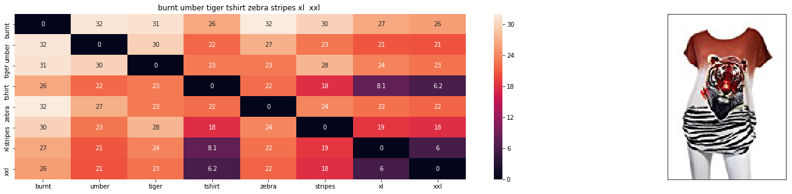


    ASIN : B00JXQB5FQ
    Brand : Si Row
    euclidean distance from input : 0.00693805615107
    =============================================================================================================================
    

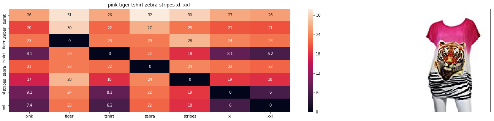


    ASIN : B00JXQASS6
    Brand : Si Row
    euclidean distance from input : 7.54691530866
    =============================================================================================================================
    


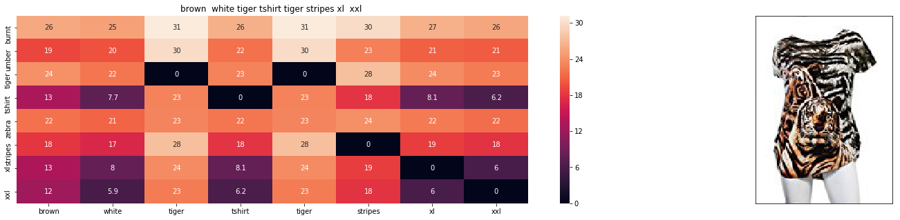


    ASIN : B00JXQCWTO
    Brand : Si Row
    euclidean distance from input : 8.60477371216
    =============================================================================================================================
    


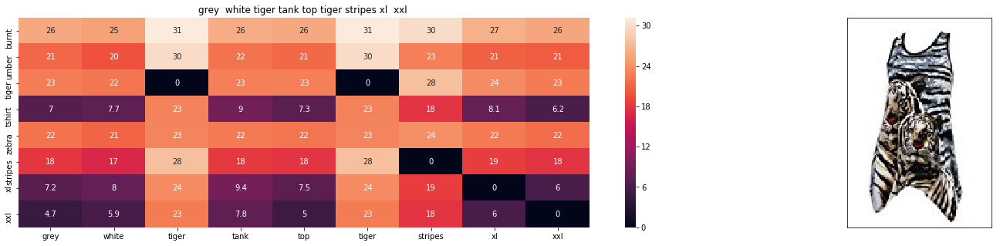


    ASIN : B00JXQAFZ2
    Brand : Si Row
    euclidean distance from input : 9.07853380842
    =============================================================================================================================
    

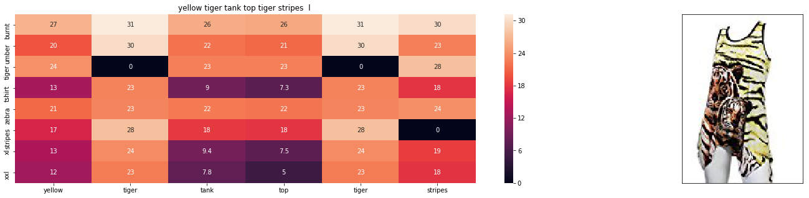


    ASIN : B00JXQAUWA
    Brand : Si Row
    euclidean distance from input : 9.31569455468
    =============================================================================================================================
    


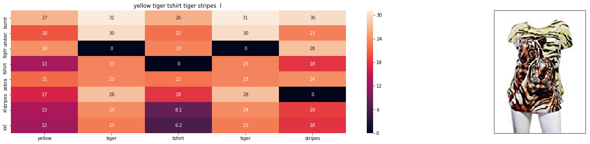


    ASIN : B00JXQCUIC
    Brand : Si Row
    euclidean distance from input : 9.37713712059
    =============================================================================================================================
    

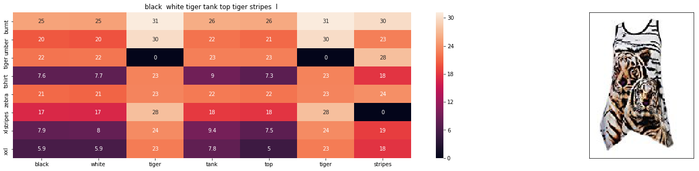


    ASIN : B00JXQAO94
    Brand : Si Row
    euclidean distance from input : 9.46448300683
    =============================================================================================================================
    

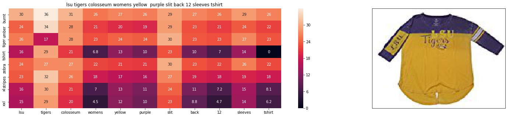


    ASIN : B073R5Q8HD
    Brand : Colosseum
    euclidean distance from input : 9.56130238587
    =============================================================================================================================
    


    ASIN : B018H5AZXQ
    Brand : Buffalo
    euclidean distance from input : 9.71686833706
    =============================================================================================================================
    

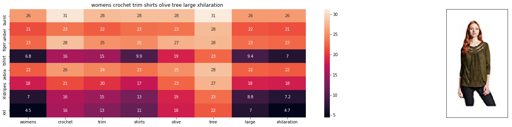


    ASIN : B06XBHNM7J
    Brand : Xhilaration
    euclidean distance from input : 9.94430592861
    =============================================================================================================================
    


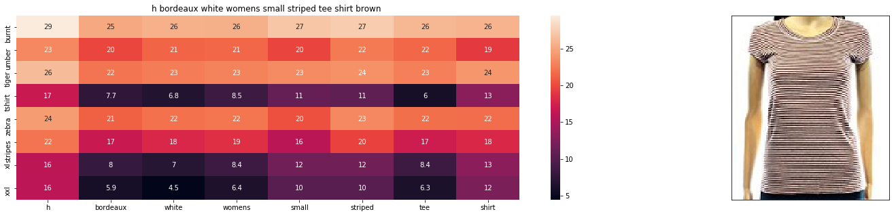


    ASIN : B072BVB47Z
    Brand : H By Bordeaux
    euclidean distance from input : 9.95612024915
    =============================================================================================================================
    


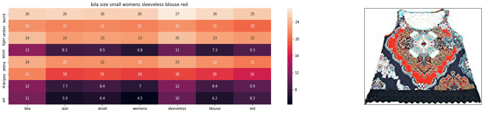


    ASIN : B01L7ROZNC
    Brand : Bila
    euclidean distance from input : 9.97532801046
    =============================================================================================================================
    


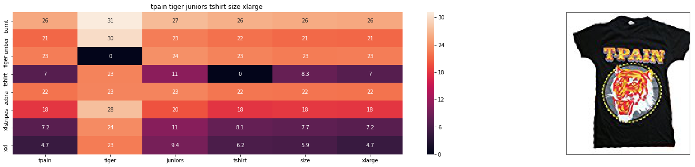


    ASIN : B01K0H02OG
    Brand : Tultex
    euclidean distance from input : 9.983423561
    =============================================================================================================================
    
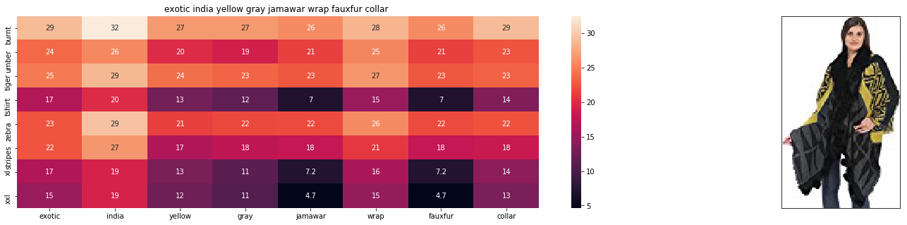


    ASIN : B073ZHRBV8
    Brand : Exotic India
    euclidean distance from input : 10.0104194642
    =============================================================================================================================
 

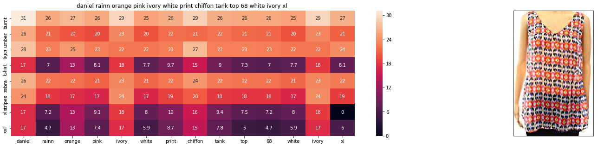


    ASIN : B01IPV1SFQ
    Brand : Daniel Rainn
    euclidean distance from input : 10.0475077311
    =============================================================================================================================
    
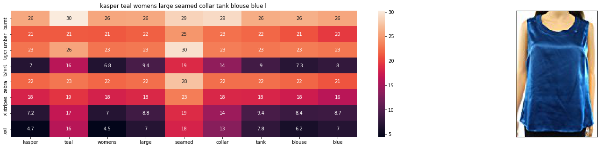


    ASIN : B0722DJVQP
    Brand : Kasper
    euclidean distance from input : 10.0659179152
    =============================================================================================================================
    
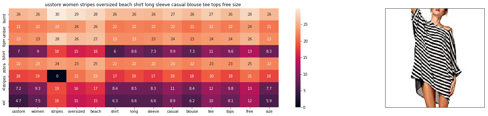


    ASIN : B01DNNI1RO
    Brand : Usstore
    euclidean distance from input : 10.0769068401
    =============================================================================================================================
    


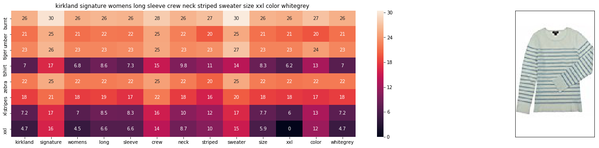


    ASIN : B06XTPC3FP
    Brand : Kirkland Signature
    euclidean distance from input : 10.0825401307
    =============================================================================================================================
    

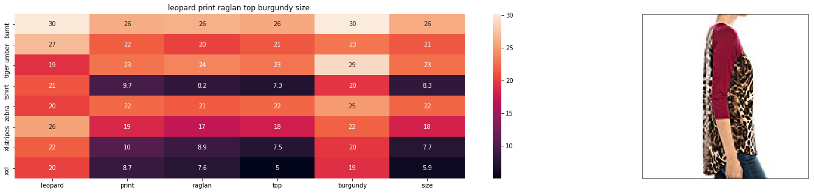


    ASIN : B01C6ORLDQ
    Brand : 1 Mad Fit
    euclidean distance from input : 10.1180061341
    =============================================================================================================================
    

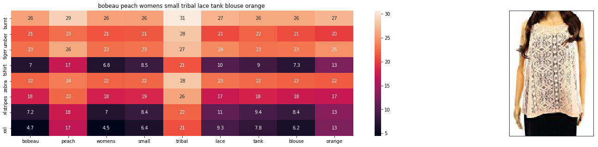


    ASIN : B072JTHCX6
    Brand : Bobeau
    euclidean distance from input : 10.1236175002
    =============================================================================================================================
    

# Test with Brand and Color weight greater than other weights


```python
idf_w2v_all_features(12566, 5, 50, 5, 20)
```


    ASIN : B00JXQB5FQ
    Brand : Si Row
    euclidean distance from input : 0.00400836865107
    =============================================================================================================================
    


    ASIN : B00JXQCWTO
    Brand : Si Row
    euclidean distance from input : 5.026567173
    =============================================================================================================================
    


    ASIN : B00JXQASS6
    Brand : Si Row
    euclidean distance from input : 5.55965906809
    =============================================================================================================================
    


    ASIN : B00JXQCUIC
    Brand : Si Row
    euclidean distance from input : 6.01771551798
    =============================================================================================================================
    


    ASIN : B00JXQAUWA
    Brand : Si Row
    euclidean distance from input : 6.10921223988
    =============================================================================================================================
    


    ASIN : B06XBHNM7J
    Brand : Xhilaration
    euclidean distance from input : 6.11696815551
    =============================================================================================================================
    


    ASIN : B00JXQAFZ2
    Brand : Si Row
    euclidean distance from input : 6.11907310516
    =============================================================================================================================
    


    ASIN : B00JXQAO94
    Brand : Si Row
    euclidean distance from input : 6.25537726115
    =============================================================================================================================
    


    ASIN : B01L7ROZNC
    Brand : Bila
    euclidean distance from input : 6.25801598768
    =============================================================================================================================
    

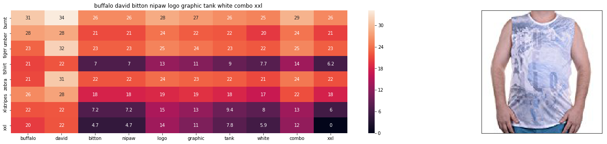


    ASIN : B018H5AZXQ
    Brand : Buffalo
    euclidean distance from input : 6.27228781442
    =============================================================================================================================
    

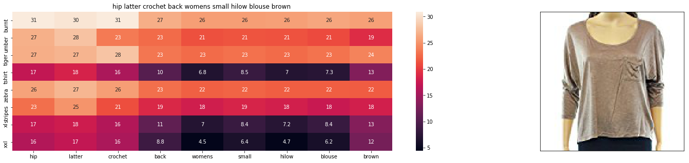


    ASIN : B074MJN1K9
    Brand : Hip
    euclidean distance from input : 6.35051232622
    =============================================================================================================================
    

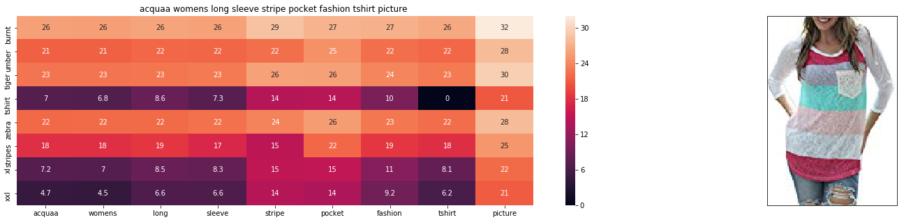


    ASIN : B06XK2ZRFH
    Brand : Acquaa
    euclidean distance from input : 6.35435606363
    =============================================================================================================================
    

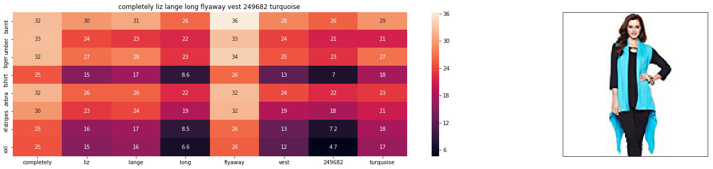


    ASIN : B074LTBWSW
    Brand : Liz Lange
    euclidean distance from input : 6.36057809254
    =============================================================================================================================
    

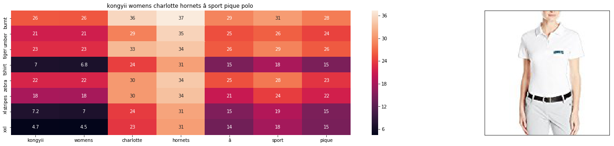


    ASIN : B01FJVZST2
    Brand : KONGYII
    euclidean distance from input : 6.37223959506
    =============================================================================================================================
    

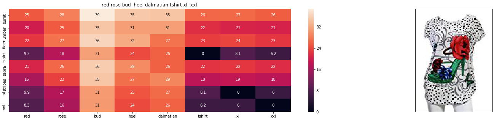


    ASIN : B00JXQABB0
    Brand : Si Row
    euclidean distance from input : 6.38037096689
    =============================================================================================================================
    

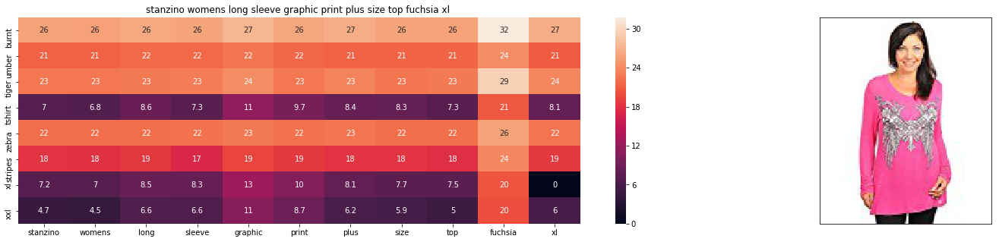


    ASIN : B00DP4VHWI
    Brand : Stanzino
    euclidean distance from input : 6.38068565269
    =============================================================================================================================
    
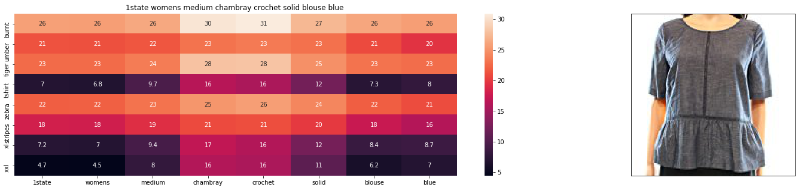


    ASIN : B074MK6LV2
    Brand : 1.State
    euclidean distance from input : 6.38333928327
    =============================================================================================================================
    

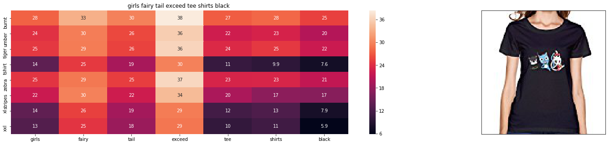


    ASIN : B01L9F153U
    Brand : ATYPEMX
    euclidean distance from input : 6.40771914065
    =============================================================================================================================
    
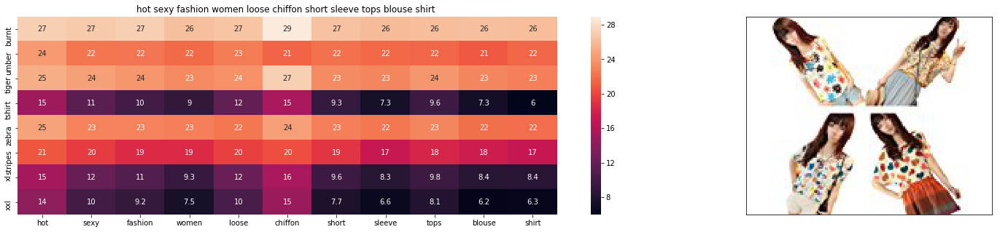


    ASIN : B00JMAASRO
    Brand : Wotefusi
    euclidean distance from input : 6.41075741987
    =============================================================================================================================
    
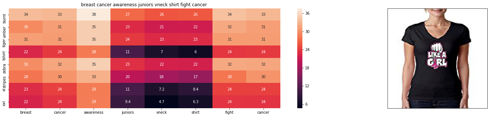


    ASIN : B016CU40IY
    Brand : Juiceclouds
    euclidean distance from input : 6.41170893252
    =============================================================================================================================
    

# Test with Image weight greater than other weights


```python
idf_w2v_all_features(12566, 5, 5, 50, 20)
```


    ASIN : B00JXQB5FQ
    Brand : Si Row
    euclidean distance from input : 0.0371539990107
    =============================================================================================================================
    


    ASIN : B06XBHNM7J
    Brand : Xhilaration
    euclidean distance from input : 31.8864978791
    =============================================================================================================================
    


    ASIN : B016CU40IY
    Brand : Juiceclouds
    euclidean distance from input : 33.162277804
    =============================================================================================================================
    

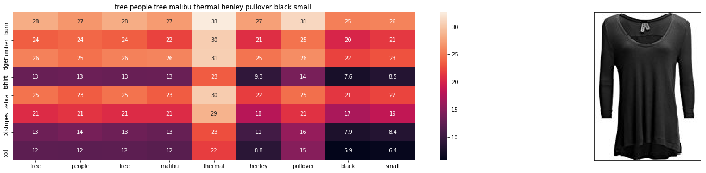


    ASIN : B074MXY984
    Brand : We The Free
    euclidean distance from input : 33.7560332616
    =============================================================================================================================
    


    ASIN : B074LTBWSW
    Brand : Liz Lange
    euclidean distance from input : 33.7623961767
    =============================================================================================================================
    


    ASIN : B018H5AZXQ
    Brand : Buffalo
    euclidean distance from input : 33.822454389
    =============================================================================================================================
    

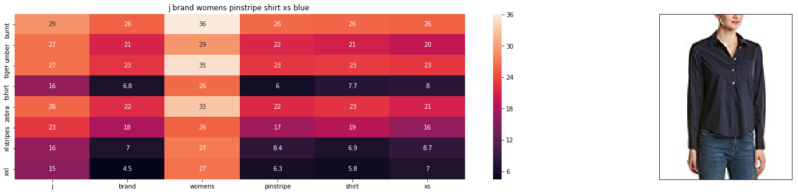


    ASIN : B06XYP1X1F
    Brand : J Brand Jeans
    euclidean distance from input : 33.931753068
    =============================================================================================================================
    

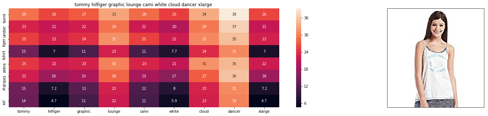


    ASIN : B01BMSFYW2
    Brand : igertommy hilf
    euclidean distance from input : 34.1204580037
    =============================================================================================================================
    


    ASIN : B01FJVZST2
    Brand : KONGYII
    euclidean distance from input : 34.9336353403
    =============================================================================================================================
    


    ASIN : B01L7ROZNC
    Brand : Bila
    euclidean distance from input : 35.0510838927
    =============================================================================================================================
    


    ASIN : B01L9F153U
    Brand : ATYPEMX
    euclidean distance from input : 35.613338417
    =============================================================================================================================
    

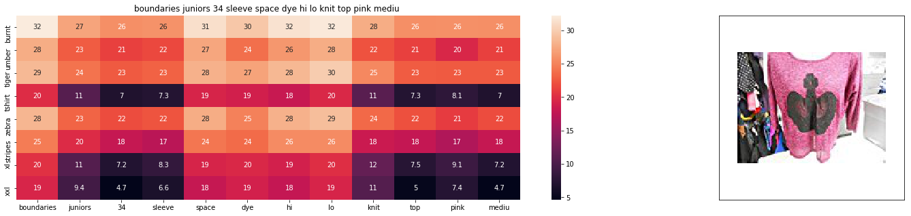


    ASIN : B01EXXFS4M
    Brand : No Boundaries
    euclidean distance from input : 35.6587108613
    =============================================================================================================================
    
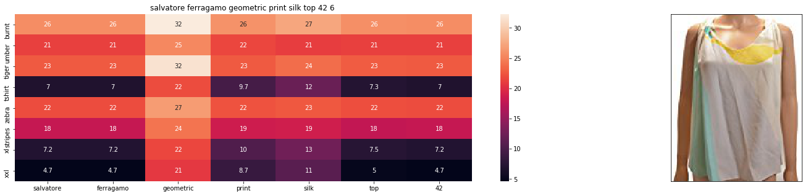


    ASIN : B0756JTS1F
    Brand : Salvatore Ferragamo
    euclidean distance from input : 35.823448054
    =============================================================================================================================
    
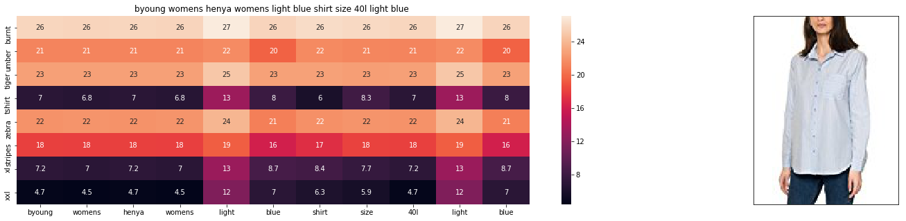


    ASIN : B06Y41MRCH
    Brand : Byoung
    euclidean distance from input : 35.8665334066
    =============================================================================================================================
    


    ASIN : B074MK6LV2
    Brand : 1.State
    euclidean distance from input : 35.9362033309
    =============================================================================================================================
    

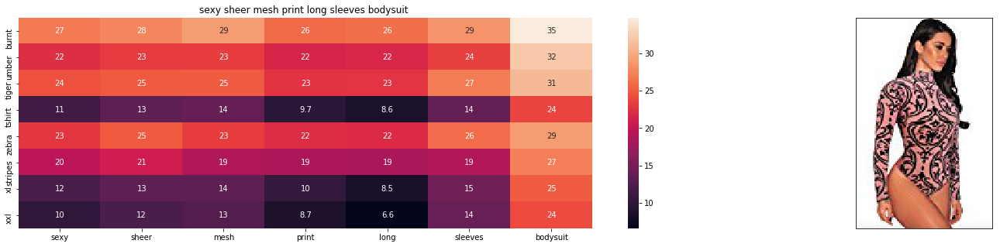


    ASIN : B074Z5C98D
    Brand : Ariella's closet
    euclidean distance from input : 36.0497951791
    =============================================================================================================================
    


    ASIN : B00DP4VHWI
    Brand : Stanzino
    euclidean distance from input : 36.178706052
    =============================================================================================================================
    

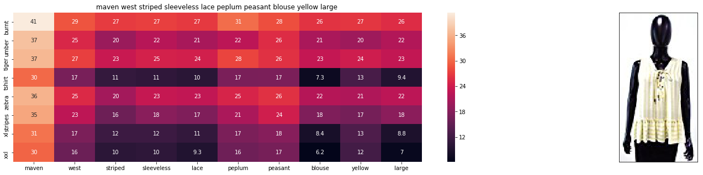


    ASIN : B01M8GB3AL
    Brand : Maven West
    euclidean distance from input : 36.2119853338
    =============================================================================================================================
    


    ASIN : B00JMAASRO
    Brand : Wotefusi
    euclidean distance from input : 36.2307064793
    =============================================================================================================================
    

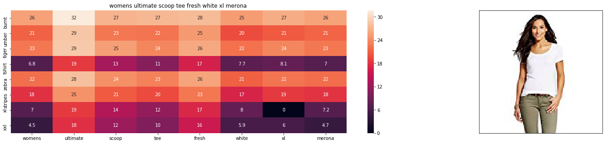


    ASIN : B01G7XE50E
    Brand : Merona
    euclidean distance from input : 36.2584209543
    =============================================================================================================================
    
