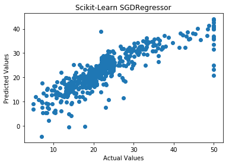
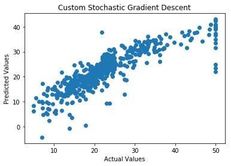

```python
import warnings
warnings.filterwarnings("ignore")
from sklearn.datasets import load_boston
from random import seed
from random import randrange
from csv import reader
from math import sqrt
from sklearn import preprocessing
import pandas as pd
import numpy as np
import matplotlib.pyplot as plt
from prettytable import PrettyTable
from sklearn.linear_model import SGDRegressor
from sklearn import preprocessing
from sklearn.metrics import mean_squared_error
```


```python
X = load_boston().data
Y = load_boston().target


```


```python
scaler = preprocessing.StandardScaler().fit(X)
X = scaler.transform(X)
```


```python
clf = SGDRegressor(verbose = True)
clf.fit(X, Y)
print(mean_squared_error(Y, clf.predict(X)))
```

    -- Epoch 1
    Norm: 4.74, NNZs: 13, Bias: 17.216615, T: 506, Avg. loss: 85.965392
    Total training time: 0.00 seconds.
    -- Epoch 2
    Norm: 5.43, NNZs: 13, Bias: 20.556504, T: 1012, Avg. loss: 18.669078
    Total training time: 0.00 seconds.
    -- Epoch 3
    Norm: 5.53, NNZs: 13, Bias: 21.680155, T: 1518, Avg. loss: 12.913783
    Total training time: 0.00 seconds.
    -- Epoch 4
    Norm: 5.66, NNZs: 13, Bias: 22.153043, T: 2024, Avg. loss: 12.049358
    Total training time: 0.00 seconds.
    -- Epoch 5
    Norm: 5.84, NNZs: 13, Bias: 22.332364, T: 2530, Avg. loss: 11.760361
    Total training time: 0.00 seconds.
    22.797038713919022
    


```python
clf.coef_
```


    array([-0.6818406 ,  0.58509938, -0.5130211 ,  0.82271903, -0.99006236,
            3.17060084, -0.1727106 , -2.13417897,  0.8694903 , -0.48261406,
           -1.81297882,  0.91678274, -3.41213093])


```python
clf
```


    SGDRegressor(alpha=0.0001, average=False, epsilon=0.1, eta0=0.01,
           fit_intercept=True, l1_ratio=0.15, learning_rate='invscaling',
           loss='squared_loss', max_iter=None, n_iter=None, penalty='l2',
           power_t=0.25, random_state=None, shuffle=True, tol=None,
           verbose=True, warm_start=False)


```python
plt.scatter(Y, clf.predict(X))
plt.title("Scikit-Learn SGDRegressor")
plt.xlabel("Actual Values")
plt.ylabel("Predicted Values")
plt.show
```


    <function matplotlib.pyplot.show(*args, **kw)>





# SGD Implementation


```python
def predict(row, coefficients, b):
    return coefficients.T.dot(row) + b
```


```python

eta0 = 0.0001
power_t=0.25
n_epochs = 100
N = 500 #sample_size  -note - close to total size because it gave a better result
W = np.random.randn(X.shape[1], 1)  #initialize weights
b = 1  #initialize intercept

def learning_rate(t):
    return eta0 / pow(t + 1, power_t)


for epoch in range(n_epochs):
    eta = learning_rate(epoch)  #change the learning rate
    for i in range(N):
        random_index = np.random.randint(N)
        xi = X[random_index:random_index + 1]
        yi = Y[random_index:random_index + 1]
        xi = xi.T
        #gradients = (2/N) * (xi.T.dot(xi.dot(M_coeff) - yi))
        gradients = (-2 * xi ).dot(yi -  W.T.dot(xi) - b) 
        
        dLb = 2 * np.sum(yi -  W.T.dot(xi) - b)
       
        W = W - eta * gradients
        b = b + eta * dLb
        
print(M_coeff)
print(b)
        
```

    [[-0.58454663]
     [ 0.41258974]
     [-0.17168432]
     [ 0.75921999]
     [-0.99529448]
     [ 3.26697514]
     [ 0.22155156]
     [-1.50019603]
     [ 0.41870803]
     [-0.12582862]
     [-1.86035507]
     [ 0.90904777]
     [-3.48647106]]
    22.209277443924492
    


```python
predictionslist = []
N = X.shape[0]
for i in range(N):
    predictionslist.extend(predict(X[i], W, b))

    
predictions = np.asarray(predictionslist)  
```


```python
print(mean_squared_error(Y, predictions))
```

    22.99339306136636
    


```python
plt.scatter(Y, predictions)
plt.title("Custom Stochastic Gradient Descent")
plt.xlabel("Actual Values")
plt.ylabel("Predicted Values")
plt.show
```


    <function matplotlib.pyplot.show(*args, **kw)>





# Comparison


```python
from prettytable import PrettyTable

# Using Loop to determine best Hyperparameters

x = PrettyTable()
x.field_names = ["Model", "MSE", ]
x.add_row(["Scikit-learn SGDRegressor", 22.79])
x.add_row(["Custom SGD Implementation", 22.99])

print(x)

```

    +---------------------------+-------+
    |           Model           |  MSE  |
    +---------------------------+-------+
    | Scikit-learn SGDRegressor | 22.79 |
    | Custom SGD Implementation | 22.99 |
    +---------------------------+-------+
    


```python
x = PrettyTable()
x.field_names = ["Scikit-learn SGDRegressor Weights", "Custom SGD Implementation Weights" ]
x.add_row([-0.6818406, -0.58454663])
x.add_row([0.58509938, 0.41258974])
x.add_row([-0.5130211, -0.17168432])
x.add_row([0.82271903, 0.75921999])
x.add_row([-0.99006236, -0.99529448])
x.add_row([3.17060084, 3.26697514])
x.add_row([-0.1727106, 0.22155156])
x.add_row([-2.13417897, -1.50019603])
x.add_row([0.8694903,  0.41870803])
x.add_row([-0.48261406, -0.12582862])
x.add_row([-1.81297882, -1.86035507])
x.add_row([0.91678274, 0.90904777])
x.add_row([-3.41213093, -3.48647106])
print(x)


```

    +-----------------------------------+-----------------------------------+
    | Scikit-learn SGDRegressor Weights | Custom SGD Implementation Weights |
    +-----------------------------------+-----------------------------------+
    |             -0.6818406            |            -0.58454663            |
    |             0.58509938            |             0.41258974            |
    |             -0.5130211            |            -0.17168432            |
    |             0.82271903            |             0.75921999            |
    |            -0.99006236            |            -0.99529448            |
    |             3.17060084            |             3.26697514            |
    |             -0.1727106            |             0.22155156            |
    |            -2.13417897            |            -1.50019603            |
    |             0.8694903             |             0.41870803            |
    |            -0.48261406            |            -0.12582862            |
    |            -1.81297882            |            -1.86035507            |
    |             0.91678274            |             0.90904777            |
    |            -3.41213093            |            -3.48647106            |
    +-----------------------------------+-----------------------------------+
    
