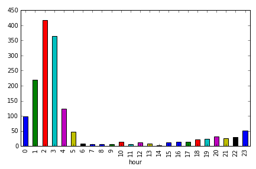
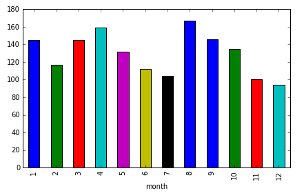
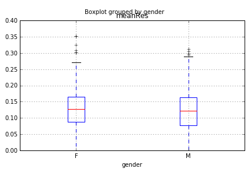
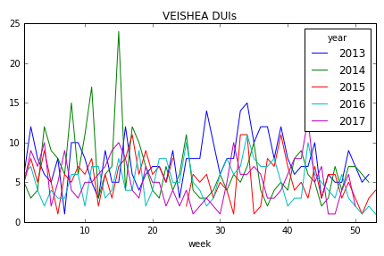

## 1. Breath alcohol tests in Ames, Iowa, USA
<p>Ames, Iowa, USA is the home of Iowa State University, a land grant university with over 36,000 students. By comparison, the city of Ames, Iowa, itself only has about 65,000 residents. As with any other college town, Ames has had its fair share of alcohol-related incidents. (For example, Google 'VEISHEA riots 2014'.) We will take a look at some breath alcohol test data from Ames that is published by the State of Iowa.</p>
<p> </p>
<p>The data file 'breath_alcohol_ames.csv' contains 1,556 readings from breath alcohol tests administered by the Ames and Iowa State University Police Departments from January 2013 to December 2017. The columns in this data set are year, month, day, hour, location, gender, Res1, Res2.</p>


```python
# import pandas
import pandas as pd

# read the data into your workspace
ba_data = pd.read_csv("datasets/breath_alcohol_ames.csv")

# quickly inspect the data
print(ba_data.head())

# obtain counts for each year 
ba_year = ba_data['year'].value_counts()
ba_year
```

       year  month  day  hour location gender   Res1   Res2
    0  2017     12   17     1  Ames PD      M  0.046  0.046
    1  2017     12   14     3   ISU PD      F  0.121  0.120
    2  2017     12   10     5   ISU PD      F  0.068  0.067
    3  2017     12   10     3   ISU PD      F  0.077  0.077
    4  2017     12    9     2   ISU PD      M  0.085  0.084


    2013    397
    2014    344
    2015    286
    2016    269
    2017    260
    Name: year, dtype: int64


```python
%%nose

import pandas as pd

# # check read file
# def test_breath_alcohol_ames():
#     correct_pulls = pd.read_csv("datasets/breath_alcohol_ames.csv")
#     assert correct_pulls.equals(breath_alcohol_ames), \
#     'Read in "datasets/breath_alcohol_ames.csv" using read_csv().'

# # check head

# # check value counts    
# def test_value_counts():
#     assert len(ba_year) == 5, \
#     'The rows are not arraged by year. Did you select the correct value to count?'

def test_task_1a():
    correct_ba_data = pd.read_csv("datasets/breath_alcohol_ames.csv")
    assert correct_ba_data.equals(ba_data), "The variable `ba_data` should contain the data in `breath_alcohol_ames.csv`"
    
def test_task_1b():
    correct_ba_year = ba_data['year'].value_counts()
    assert correct_ba_year.equals(ba_year), "The variable `ba_year` should contain the counts of years in `ba_data`. Did you use the `value_counts` method?"
```


    2/2 tests passed


## 2. What is the busiest police department in Ames?
<p>There are two police departments in the data set: the Iowa State University Police Department and the Ames Police Department. Which one administers more breathalyzer tests? </p>


```python
# use value_counts to tally up the totals for each department
pds = ba_data['location'].value_counts()
pds
```


    ISU PD     940
    Ames PD    616
    Name: location, dtype: int64


```python
%%nose

# # check value counts    
# def test_value_counts():
#     assert len(ba_year) == 2, \
#     'The rows are not arraged by location. Did you select the correct value to count?'

def test_task_2():
    correct_pds = ba_data['location'].value_counts()
    assert correct_pds.equals(pds), "The variable `pds` should contain the counts of locations in `ba_data`. Did you use the `value_counts` method?"
```


    1/1 tests passed


## 3. Nothing Good Happens after 2am
<p></p>
<p>We all know that "nothing good happens after 2am." Thus, there are inevitably some times of the day when breath alcohol tests, especially in a college town like Ames, are most and least common. Which hours of the day have the most and least breathalyzer tests?  </p>


```python
%matplotlib inline

# count by hour 
hourly = ba_data.groupby(['hour']).size()

# create a vertical bar graph of the arrest count by hour
hourly.plot.bar(x='hour')
```


    <matplotlib.axes._subplots.AxesSubplot at 0x7fd89bc6b2b0>





```python
%%nose

# groupby, count, and sort values
# check counts    
def test_sort_values():
    assert len(hourly) == 24, \
    'The rows are not arranged by hour. Did you select "hour" to group by?'
    
# no test for plots
```


    1/1 tests passed


## 4. Breathalyzer tests by month
<p>Now that we have discovered which time of day is most common for breath alcohol tests, we will determine which time of the year has the most breathalyzer tests. Which month will have the most recorded tests?</p>


```python
# count by month and arrange by descending frequency
monthly = ba_data.groupby(['month']).size()

# use plot.bar to make the appropriate bar chart
monthly.plot.bar(x='month')
```


    <matplotlib.axes._subplots.AxesSubplot at 0x7fd89becb9b0>





```python
%%nose

# groupby, count, and sort values
# check counts    
def test_sort_values():
    assert len(monthly) == 12, \
    'The rows are not arranged by month. Did you select "month" to group by?'
    
```


    1/1 tests passed


## 5. COLLEGE
<p> </p>
<p>When we think of (binge) drinking in college towns in America, we usually think of something like this image at the left. And so, one might suspect that breath alcohol tests are given to men more often than women and that men drink more than women. </p>


```python
# count by gender
counts_gender = ba_data['gender'].value_counts()

# create a dataset with no NAs in gender 
gen = ba_data.dropna(subset=['gender'])

# create a mean test result variable
mean_bas = gen.assign(meanRes=(gen.Res1 + gen.Res2)/2)

# # create side-by-side boxplots to compare the mean blood alcohol levels of men and women
mean_bas.boxplot(['meanRes'], by = 'gender')
```


    <matplotlib.axes._subplots.AxesSubplot at 0x7fd89bc98278>





```python
%%nose

# gender value_counts
def test_task_5b():
    correct_counts_gender = ba_data['gender'].value_counts()
    assert correct_counts_gender.equals(counts_gender), \
    "The variable `counts_gender` should contain the counts of gender in `ba_data`. Did you use the `value_counts` method?"

# dropna
def test_dropna():
    assert len(gen) == 1527, \
    'Did you use dropna() on `gender`?'
    
# create meanRes in mean_bas
def test_month_year_column():
    assert 'meanRes' in mean_bas, \
    "Did you create the `meanRes` column."
    
# no test for plots
```


    3/3 tests passed


## 6. Above the legal limit
<p>In the USA, it is illegal to drive with a blood alcohol concentration (BAC) above 0.08%. This is the case for <a href="https://www.dmv.org/automotive-law/dui.php">all 50 states</a>. Assuming everyone tested in our data was driving (though we have no way of knowing this from the data), if either of the results (<code>Res1</code>, <code>Res2</code>) are above 0.08, the person would be charged with DUI (driving under the influence). </p>


```python
# Filter the data
duis = ba_data[(ba_data.Res1 > 0.08) | (ba_data.Res2 > 0.08)]

# proportion of tests that would have resulted in a DUI
p_dui = duis.shape[0] / ba_data.shape[0]
p_dui
```


    0.7448586118251928


```python
%%nose

# check filter    
def test_duis():
    assert len(duis) == 1159, \
    'Did you use the logical OR operator (|) to filter ba_data?'
    
# check p_dui
def test_p_dui():
    correct_p_dui = duis.shape[0] / ba_data.shape[0]
    assert correct_p_dui == p_dui
```


    2/2 tests passed


## 7. Breathalyzer tests: is there a pattern over time?
<p>We previously saw that 2am is the most common time of day for breathalyzer tests to be administered, and August is the most common month of the year for breathalyzer tests. Now, we look at the weeks in the year over time. </p>


```python
# Create date variable
ba_data['date'] = pd.to_datetime(ba_data[['year', 'month', 'day']])

# Create a week variable
ba_data['week'] = ba_data['date'].dt.week

# Check your work
ba_data.head()
```


<div>
<style scoped>
    .dataframe tbody tr th:only-of-type {
        vertical-align: middle;
    }

    .dataframe tbody tr th {
        vertical-align: top;
    }

    .dataframe thead th {
        text-align: right;
    }
</style>
<table border="1" class="dataframe">
  <thead>
    <tr style="text-align: right;">
      <th></th>
      <th>year</th>
      <th>month</th>
      <th>day</th>
      <th>hour</th>
      <th>location</th>
      <th>gender</th>
      <th>Res1</th>
      <th>Res2</th>
      <th>date</th>
      <th>week</th>
    </tr>
  </thead>
  <tbody>
    <tr>
      <th>0</th>
      <td>2017</td>
      <td>12</td>
      <td>17</td>
      <td>1</td>
      <td>Ames PD</td>
      <td>M</td>
      <td>0.046</td>
      <td>0.046</td>
      <td>2017-12-17</td>
      <td>50</td>
    </tr>
    <tr>
      <th>1</th>
      <td>2017</td>
      <td>12</td>
      <td>14</td>
      <td>3</td>
      <td>ISU PD</td>
      <td>F</td>
      <td>0.121</td>
      <td>0.120</td>
      <td>2017-12-14</td>
      <td>50</td>
    </tr>
    <tr>
      <th>2</th>
      <td>2017</td>
      <td>12</td>
      <td>10</td>
      <td>5</td>
      <td>ISU PD</td>
      <td>F</td>
      <td>0.068</td>
      <td>0.067</td>
      <td>2017-12-10</td>
      <td>49</td>
    </tr>
    <tr>
      <th>3</th>
      <td>2017</td>
      <td>12</td>
      <td>10</td>
      <td>3</td>
      <td>ISU PD</td>
      <td>F</td>
      <td>0.077</td>
      <td>0.077</td>
      <td>2017-12-10</td>
      <td>49</td>
    </tr>
    <tr>
      <th>4</th>
      <td>2017</td>
      <td>12</td>
      <td>9</td>
      <td>2</td>
      <td>ISU PD</td>
      <td>M</td>
      <td>0.085</td>
      <td>0.084</td>
      <td>2017-12-09</td>
      <td>49</td>
    </tr>
  </tbody>
</table>
</div>


```python
%%nose

# create date var    
def test_date():
    assert 'date' in ba_data, \
    "You did not create the variable for date."
    
# create week var
def test_week():
    assert 'week' in ba_data, \
    "You did not create the variable for week."    
```


    2/2 tests passed


## 8. Looking at timelines
<p>How do the weeks differ over time? One of the most common data visualizations is the time series, a line tracking the changes in a variable over time. We will use the new <code>week</code> variable to look at test frequency over time. We end with a time series plot showing the frequency of breathalyzer tests by week in year, with one line for each year. </p>


```python
# choose and count the variables of interest  
timeline = ba_data.groupby(['week','year']).count()['Res1']

# unstack and plot
timeline.unstack().plot(title='VEISHEA DUIs', legend=True)
```


    <matplotlib.axes._subplots.AxesSubplot at 0x7fd89be3d0f0>





```python
%%nose

# check timeline  
def test_timeline():
    assert len(timeline) == 259, \
    'Did you group by week and year?'
    
# plot
```


    1/1 tests passed


## 9. The end of VEISHEA
<p>From <a href="https://en.wikipedia.org/wiki/VEISHEA">Wikipedia</a>: 
"VEISHEA was an annual week-long celebration held each spring on the campus of Iowa State University in Ames, Iowa. The celebration featured an annual parade and many open-house demonstrations of the university facilities and departments. Campus organizations exhibited products, technologies, and held fundraisers for various charity groups. In addition, VEISHEA brought speakers, lecturers, and entertainers to Iowa State. [...] VEISHEA was the largest student-run festival in the nation, bringing in tens of thousands of visitors to the campus each year."</p>
<p>This over 90-year tradition in Ames was <a href="https://www.news.iastate.edu/news/2014/08/07/veisheaend">terminated permanently</a> after <a href="https://www.desmoinesregister.com/story/news/crime-and-courts/2014/04/09/veishea-ames-car-tipping/7495935/">riots in 2014</a>, where drunk celebrators flipped over multiple vehicles and tore light poles down. This was not the first incidence of violence and severe property damage in VEISHEA's history. Did former President Leath make the right decision by canceling VEISHEA?</p>


```python
## Was it right to permanently cancel VEISHEA? TRUE or FALSE?  
canceling_VEISHEA_was_right = True
```


```python
%%nose

def test_bool():
    assert isinstance(canceling_VEISHEA_was_right, bool), "Did you assign `True` or `False` to `canceling_VEISHEA_was_right`?"

## The original R version did not have a test regarding opinion.
# def test_opinion():
#     assert canceling_VEISHEA_was_right == 'False', \
#     'The previous year, 2013, had peak DUIs around week 30, and August has the highest amounts of DUIs per month. VEISHEA was held in April.'
```


    1/1 tests passed


