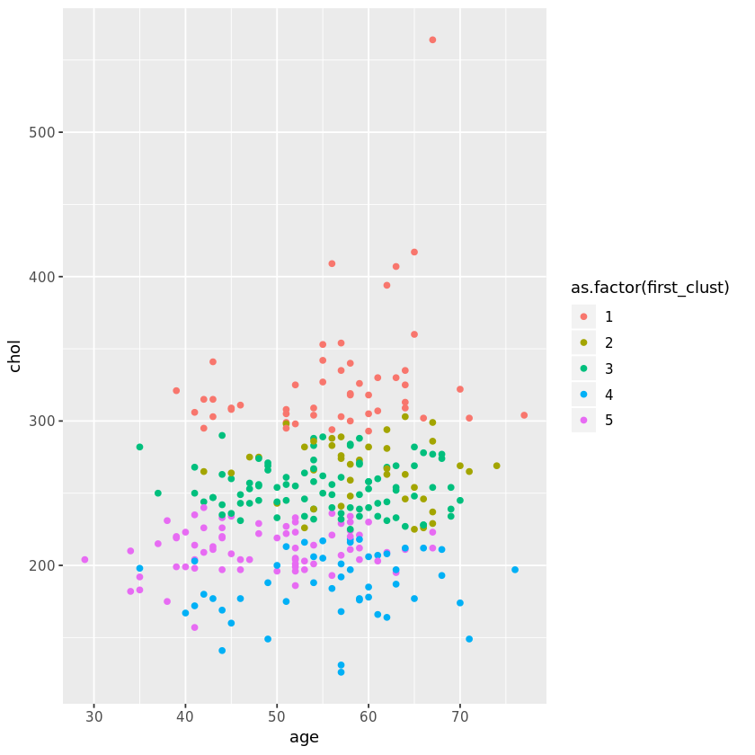

## 1. Targeting treatment for heart disease patients
<p>Clustering algorithms are used to group together items that are similar to one another. There are many industries where it would be beneficial and insightful to use an unsupervised learning algorithm - retailers want to group similar customers for targeted ad campaigns, biologists want to find plants that share similar characteristics, and more. We are going to explore if it would be appropriate to use some clustering algorithms to group medical patients. </p>
<p>We are going to look at anonymized patients who have been diagnosed with heart disease. Patients with similar characteristics might respond to the same treatments, and doctors would benefit from learning about the outcomes of patients similar to those they are treating. The data we are analyzing comes from the V.A. Medical Center in Long Beach, CA. For more information, see <a href="http://archive.ics.uci.edu/ml/machine-learning-databases/heart-disease/heart-disease.names">here</a>. </p>
<p>Before beginning a project, it is important to get an idea of what the patient data looks like. In addition, the clustering algorithms used below require that the data be numeric, so it is necessary to ensure the patient data doesn't need any transformations. You will also be brushing up on your base R skills for some analysis.</p>


```R
# loading the data
heart_disease = read.csv("datasets/heart_disease_patients.csv")

# print the first ten rows of the data set
head(heart_disease, 10)

# check that only numeric variables
lapply(heart_disease, class)
```


<table>
<thead><tr><th scope=col>id</th><th scope=col>age</th><th scope=col>sex</th><th scope=col>cp</th><th scope=col>trestbps</th><th scope=col>chol</th><th scope=col>fbs</th><th scope=col>restecg</th><th scope=col>thalach</th><th scope=col>exang</th><th scope=col>oldpeak</th><th scope=col>slope</th></tr></thead>
<tbody>
	<tr><td> 1 </td><td>63 </td><td>1  </td><td>1  </td><td>145</td><td>233</td><td>1  </td><td>2  </td><td>150</td><td>0  </td><td>2.3</td><td>3  </td></tr>
	<tr><td> 2 </td><td>67 </td><td>1  </td><td>4  </td><td>160</td><td>286</td><td>0  </td><td>2  </td><td>108</td><td>1  </td><td>1.5</td><td>2  </td></tr>
	<tr><td> 3 </td><td>67 </td><td>1  </td><td>4  </td><td>120</td><td>229</td><td>0  </td><td>2  </td><td>129</td><td>1  </td><td>2.6</td><td>2  </td></tr>
	<tr><td> 4 </td><td>37 </td><td>1  </td><td>3  </td><td>130</td><td>250</td><td>0  </td><td>0  </td><td>187</td><td>0  </td><td>3.5</td><td>3  </td></tr>
	<tr><td> 5 </td><td>41 </td><td>0  </td><td>2  </td><td>130</td><td>204</td><td>0  </td><td>2  </td><td>172</td><td>0  </td><td>1.4</td><td>1  </td></tr>
	<tr><td> 6 </td><td>56 </td><td>1  </td><td>2  </td><td>120</td><td>236</td><td>0  </td><td>0  </td><td>178</td><td>0  </td><td>0.8</td><td>1  </td></tr>
	<tr><td> 7 </td><td>62 </td><td>0  </td><td>4  </td><td>140</td><td>268</td><td>0  </td><td>2  </td><td>160</td><td>0  </td><td>3.6</td><td>3  </td></tr>
	<tr><td> 8 </td><td>57 </td><td>0  </td><td>4  </td><td>120</td><td>354</td><td>0  </td><td>0  </td><td>163</td><td>1  </td><td>0.6</td><td>1  </td></tr>
	<tr><td> 9 </td><td>63 </td><td>1  </td><td>4  </td><td>130</td><td>254</td><td>0  </td><td>2  </td><td>147</td><td>0  </td><td>1.4</td><td>2  </td></tr>
	<tr><td>10 </td><td>53 </td><td>1  </td><td>4  </td><td>140</td><td>203</td><td>1  </td><td>2  </td><td>155</td><td>1  </td><td>3.1</td><td>3  </td></tr>
</tbody>
</table>


<dl>
	<dt>$id</dt>
		<dd>'integer'</dd>
	<dt>$age</dt>
		<dd>'integer'</dd>
	<dt>$sex</dt>
		<dd>'integer'</dd>
	<dt>$cp</dt>
		<dd>'integer'</dd>
	<dt>$trestbps</dt>
		<dd>'integer'</dd>
	<dt>$chol</dt>
		<dd>'integer'</dd>
	<dt>$fbs</dt>
		<dd>'integer'</dd>
	<dt>$restecg</dt>
		<dd>'integer'</dd>
	<dt>$thalach</dt>
		<dd>'integer'</dd>
	<dt>$exang</dt>
		<dd>'integer'</dd>
	<dt>$oldpeak</dt>
		<dd>'numeric'</dd>
	<dt>$slope</dt>
		<dd>'integer'</dd>
</dl>


## 2. Quantifying patient differences
<p>It is important to conduct some exploratory data analysis to familiarize ourselves with the data before clustering. This will help us learn more about the variables and make an informed decision about whether we should scale the data. Because k-means and hierarchical clustering measures similarity between points using a distance formula, it can place extra emphasis on certain variables that have a larger scale and thus larger differences between points.</p>
<p>Exploratory data analysis helps us to understand the characteristics of the patients in the data. We need to get an idea of the value ranges of the variables and their distributions. This will also be helpful when we evaluate the clusters of patients from the algorithms. Are there more patients of one gender? What might an outlier look like?</p>


```R
# evidence that the data should be scaled?
summary(heart_disease)

# remove id
heart_disease = heart_disease[ , !(names(heart_disease) %in% c("id"))]

# scaling data and saving as a data frame
scaled = scale(heart_disease)

# what does data look like now?
summary(heart_disease)
```


           id             age             sex               cp       
     Min.   :  1.0   Min.   :29.00   Min.   :0.0000   Min.   :1.000  
     1st Qu.: 76.5   1st Qu.:48.00   1st Qu.:0.0000   1st Qu.:3.000  
     Median :152.0   Median :56.00   Median :1.0000   Median :3.000  
     Mean   :152.0   Mean   :54.44   Mean   :0.6799   Mean   :3.158  
     3rd Qu.:227.5   3rd Qu.:61.00   3rd Qu.:1.0000   3rd Qu.:4.000  
     Max.   :303.0   Max.   :77.00   Max.   :1.0000   Max.   :4.000  
        trestbps          chol            fbs            restecg      
     Min.   : 94.0   Min.   :126.0   Min.   :0.0000   Min.   :0.0000  
     1st Qu.:120.0   1st Qu.:211.0   1st Qu.:0.0000   1st Qu.:0.0000  
     Median :130.0   Median :241.0   Median :0.0000   Median :1.0000  
     Mean   :131.7   Mean   :246.7   Mean   :0.1485   Mean   :0.9901  
     3rd Qu.:140.0   3rd Qu.:275.0   3rd Qu.:0.0000   3rd Qu.:2.0000  
     Max.   :200.0   Max.   :564.0   Max.   :1.0000   Max.   :2.0000  
        thalach          exang           oldpeak         slope      
     Min.   : 71.0   Min.   :0.0000   Min.   :0.00   Min.   :1.000  
     1st Qu.:133.5   1st Qu.:0.0000   1st Qu.:0.00   1st Qu.:1.000  
     Median :153.0   Median :0.0000   Median :0.80   Median :2.000  
     Mean   :149.6   Mean   :0.3267   Mean   :1.04   Mean   :1.601  
     3rd Qu.:166.0   3rd Qu.:1.0000   3rd Qu.:1.60   3rd Qu.:2.000  
     Max.   :202.0   Max.   :1.0000   Max.   :6.20   Max.   :3.000  


          age             sex               cp           trestbps    
     Min.   :29.00   Min.   :0.0000   Min.   :1.000   Min.   : 94.0  
     1st Qu.:48.00   1st Qu.:0.0000   1st Qu.:3.000   1st Qu.:120.0  
     Median :56.00   Median :1.0000   Median :3.000   Median :130.0  
     Mean   :54.44   Mean   :0.6799   Mean   :3.158   Mean   :131.7  
     3rd Qu.:61.00   3rd Qu.:1.0000   3rd Qu.:4.000   3rd Qu.:140.0  
     Max.   :77.00   Max.   :1.0000   Max.   :4.000   Max.   :200.0  
          chol            fbs            restecg          thalach     
     Min.   :126.0   Min.   :0.0000   Min.   :0.0000   Min.   : 71.0  
     1st Qu.:211.0   1st Qu.:0.0000   1st Qu.:0.0000   1st Qu.:133.5  
     Median :241.0   Median :0.0000   Median :1.0000   Median :153.0  
     Mean   :246.7   Mean   :0.1485   Mean   :0.9901   Mean   :149.6  
     3rd Qu.:275.0   3rd Qu.:0.0000   3rd Qu.:2.0000   3rd Qu.:166.0  
     Max.   :564.0   Max.   :1.0000   Max.   :2.0000   Max.   :202.0  
         exang           oldpeak         slope      
     Min.   :0.0000   Min.   :0.00   Min.   :1.000  
     1st Qu.:0.0000   1st Qu.:0.00   1st Qu.:1.000  
     Median :0.0000   Median :0.80   Median :2.000  
     Mean   :0.3267   Mean   :1.04   Mean   :1.601  
     3rd Qu.:1.0000   3rd Qu.:1.60   3rd Qu.:2.000  
     Max.   :1.0000   Max.   :6.20   Max.   :3.000  

## 3. Let's start grouping patients
<p>Once we've figured out if we need to modify the data and made any necessary changes, we can now start the clustering process. For the k-means algorithm, it is necessary to select the number of clusters in advance.</p>
<p>It is also important to make sure that your results are reproducible when conducting a statistical analysis. This means that when someone runs your code on the same data, they will get the same results as you reported. Therefore, if you're conducting an analysis that has a random aspect, it is necessary to set a seed to ensure reproducibility.</p>
<p>Reproducibility is especially important since doctors will potentially be using our results to treat patients. It is vital that another analyst can see where the groups come from and be able to verify the results. </p>


```R
# set the seed so that results are reproducible
seed_val = 10
set.seed(seed_val)

# select a number of clusters
k = 5

# run the k-means algorithms
first_clust = kmeans(heart_disease, centers = k, nstart = 1)

# how many patients are in each group
first_clust$size
```


<ol class=list-inline>
	<li>50</li>
	<li>40</li>
	<li>91</li>
	<li>49</li>
	<li>73</li>
</ol>


## 4. Another round of k-means
<p>Because the k-means algorithm initially selects the cluster centers by randomly selecting points, different iterations of the algorithm can result in different clusters being created. If the algorithm is truly grouping together similar observations (as opposed to clustering noise), then cluster assignments will be somewhat robust between different iterations of the algorithm. </p>
<p>With regards to the heart disease data, this would mean that the same patients would be grouped together even when the algorithm is initialized at different random points. If patients are not in similar clusters with various algorithm runs, then the clustering method isn't picking up on meaningful relationships between patients. </p>
<p>We're going to explore how the patients are grouped together with another iteration of the k-means algorithm. We will then be able to compare the resulting groups of patients. </p>


```R
# set the seed
seed_val = 38
set.seed(seed_val)

# run the k-means algorithms
k = 5
second_clust = kmeans(heart_disease, centers = k, nstart = 1)

# how many patients are in each group
second_clust$size
```


<ol class=list-inline>
	<li>5</li>
	<li>66</li>
	<li>74</li>
	<li>59</li>
	<li>99</li>
</ol>


## 5. Comparing patient clusters
<p>It is important that the clusters resulting from the k-means algorithm are stable. Even though the algorithm begins by randomly initializing the cluster centers, if the k-means algorithm is the right choice for the data, then different initializations of the algorithm will result in similar clusters.</p>
<p>The clusters from different iterations may not be exactly the same, but the clusters should be roughly the same size and have similar distributions of variables. If there is a lot of change in clusters between different iterations of the algorithm, then k-means clustering is not a good choice for the data. </p>
<p>It is not possible to validate that the clusters obtained from an algorithm are ground truth are accurate since there is no true labeling for patients. Thus, it is necessary to examine how the clusters change between different iterations of the algorithm. We're going to use some visualizations to get an idea of the cluster stabilities. That way we can see how certain patient characteristics may have been used to group patients together.</p>


```R
# adding cluster assignments to the data
heart_disease["first_clust"] = first_clust$cluster
heart_disease["second_clust"] = second_clust$cluster

# load ggplot2
library(ggplot2)

# creating the plots of age and chol for the first clustering algorithm
plot_one = ggplot(heart_disease, aes(x= age, y=chol, color=as.factor(first_clust))) + geom_point()
plot_one 

# creating the plots of age and chol for the second clustering algorithm
plot_two = ggplot(heart_disease, aes(x=age, y=chol, color=as.factor(second_clust))) + geom_point()
plot_two
```




## 6. Hierarchical clustering: another clustering approach
<p>An alternative to k-means clustering is hierarchical clustering. This method works well when the data has a nested structure. It is possible that the data from heart disease patients follows this type of structure. For example, if men are more likely to exhibit certain characteristics, those characteristics might be nested inside the gender variable. Hierarchical clustering also does not require the number of clusters to be selected prior to running the algorithm. </p>
<p>Clusters can be selected by using the dendrogram. The dendrogram allows one to see how similar observations are to one another and are useful in selecting the number of clusters to group the data. It is now time for us to see how hierarchical clustering groups the data. </p>


```R
# executing hierarchical clustering with complete linkage
hier_clust_1 = hclust(dist(heart_disease), method = "complete")

# printing the dendrogram
plot(hier_clust_1)

# getting cluster assignments based on number of selected clusters
hc_1_assign <- cutree(hier_clust_1, 5)
```


## 7. Hierarchical clustering round two
<p>In hierarchical clustering, there are multiple ways to measure the dissimilarity between clusters of observations. Complete linkage records the largest dissimilarity between any two points in the two clusters being compared. On the other hand, single linkage is the smallest dissimilarity between any two points in the clusters. Different linkages will result in different clusters being formed. </p>
<p>We want to explore different algorithms to group our heart disease patients. The best way to measure dissimilarity between patients could be to look at the smallest difference between patients and minimize that difference when grouping together clusters. It is always a good idea to explore different dissimilarity measures. Let's implement hierarchical clustering using a new linkage function. </p>


```R
# executing hierarchical clustering with complete linkage
hier_clust_2 = hclust(dist(heart_disease), method = "single")

# printing the dendrogram
plot(hier_clust_2)

# getting cluster assignments based on number of selected clusters
hc_2_assign <- cutree(hier_clust_2, 5)
```


## 8. Comparing clustering results
<p>The doctors are interested in grouping similar patients together in order to determine appropriate treatments. Therefore, they want to have clusters with multiple patients to see different treatment options. While it is possible for a patient to be in a cluster by themselves, this means that the treatment they received might not be recommended for someone else in the group. </p>
<p>As with the k-means algorithm, the way to evaluate the clusters is to investigate which patients are being grouped together. Are there patterns evident in the cluster assignments or do they seem to be groups of noise? We're going to examine the clusters resulting from the two hierarchical algorithms. </p>


```R
# adding assignments of chosen hierarchical linkage
heart_disease['hc_clust'] =hc_1_assign

# remove 'sex', 'first_clust', and 'second_clust' variables
hd_simple = heart_disease[, !(names(heart_disease) %in% c("sex", "first_clust", "second_clust"))]

# getting mean and standard deviation summary statistics
clust_summary = do.call(data.frame, aggregate(. ~hc_clust, data = hd_simple, function(x) c(avg = mean(x), sd = sd(x))))
clust_summary
```


<table>
<thead><tr><th scope=col>hc_clust</th><th scope=col>age.avg</th><th scope=col>age.sd</th><th scope=col>cp.avg</th><th scope=col>cp.sd</th><th scope=col>trestbps.avg</th><th scope=col>trestbps.sd</th><th scope=col>chol.avg</th><th scope=col>chol.sd</th><th scope=col>fbs.avg</th><th scope=col>...</th><th scope=col>restecg.avg</th><th scope=col>restecg.sd</th><th scope=col>thalach.avg</th><th scope=col>thalach.sd</th><th scope=col>exang.avg</th><th scope=col>exang.sd</th><th scope=col>oldpeak.avg</th><th scope=col>oldpeak.sd</th><th scope=col>slope.avg</th><th scope=col>slope.sd</th></tr></thead>
<tbody>
	<tr><td>1        </td><td>54.83243 </td><td>8.665839 </td><td>3.210811 </td><td>0.9463269</td><td>130.3243 </td><td>16.62805 </td><td>247.4378 </td><td>28.432370</td><td>0.1405405</td><td>...      </td><td>1.0162162</td><td>0.9971463</td><td>144.9730 </td><td>22.958240</td><td>0.3675676</td><td>0.4834512</td><td>1.0356757</td><td>1.072797 </td><td>1.654054 </td><td>0.5891199</td></tr>
	<tr><td>2        </td><td>50.75000 </td><td>9.677447 </td><td>3.044118 </td><td>0.9531382</td><td>128.0735 </td><td>13.13343 </td><td>189.2353 </td><td>22.019745</td><td>0.1323529</td><td>...      </td><td>0.7647059</td><td>0.9791505</td><td>156.2941 </td><td>24.399082</td><td>0.2352941</td><td>0.4273363</td><td>0.9735294</td><td>1.275091 </td><td>1.514706 </td><td>0.6577358</td></tr>
	<tr><td>3        </td><td>57.48889 </td><td>7.984708 </td><td>3.066667 </td><td>1.0531339</td><td>142.3111 </td><td>23.37717 </td><td>309.1778 </td><td>23.675159</td><td>0.2000000</td><td>...      </td><td>1.1111111</td><td>0.9821642</td><td>157.8889 </td><td>15.681811</td><td>0.3111111</td><td>0.4681794</td><td>1.0600000</td><td>1.316055 </td><td>1.488889 </td><td>0.6613424</td></tr>
	<tr><td>4        </td><td>61.50000 </td><td>3.872983 </td><td>3.750000 </td><td>0.5000000</td><td>141.0000 </td><td> 6.63325 </td><td>406.7500 </td><td> 9.535023</td><td>0.2500000</td><td>...      </td><td>2.0000000</td><td>0.0000000</td><td>154.5000 </td><td> 3.316625</td><td>0.2500000</td><td>0.5000000</td><td>1.9750000</td><td>1.424488 </td><td>1.750000 </td><td>0.5000000</td></tr>
	<tr><td>5        </td><td>67.00000 </td><td>      NA </td><td>3.000000 </td><td>       NA</td><td>115.0000 </td><td>      NA </td><td>564.0000 </td><td>       NA</td><td>0.0000000</td><td>...      </td><td>2.0000000</td><td>       NA</td><td>160.0000 </td><td>       NA</td><td>0.0000000</td><td>       NA</td><td>1.6000000</td><td>      NA </td><td>2.000000 </td><td>       NA</td></tr>
</tbody>
</table>

## 9. Visualizing the cluster contents
<p>In addition to looking at the distributions of variables in each of the hierarchical clustering run, we will make visualizations to evaluate the algorithms. Even though the data has more than two dimensions, we can get an idea of how the data clusters by looking at a scatterplot of two variables. We want to look for patterns that appear in the data and see what patients get clustered together. </p>


```R
# plotting age and chol
plot_one = ggplot(hd_simple, aes(x=age, y=chol, color=as.factor(hc_clust))) + geom_point()
plot_one 

# plotting oldpeak and trestbps
plot_two = ggplot(hd_simple, aes(x = oldpeak,y = trestbps, color=as.factor(hc_clust))) + geom_point()
plot_two
```


## 10. Conclusion
<p>Now that we've tried out multiple clustering algorithms, it is necessary to determine if we think any of them will work for clustering our patients. For the k-means algorithm, it is imperative that similar clusters are produced for each iteration of the algorithm. We want to make sure that the algorithm is clustering signal as opposed to noise. </p>
<p>For the sake of the doctors, we also want to have multiple patients in each group so they can compare treatments. We only did some preliminary work to explore the performance of the algorithms. It is necessary to create more visualizations and explore how the algorithms group other variables. Based on the above analysis, are there any algorithms that you would want to investigate further to group patients? Remember that it is important the k-mean algorithm seems table when running multiple iterations.</p>


```R
explore_kmeans = FALSE
explore_hierarch_complete = TRUE
explore_hierarch_single = FALSE
```


```R
soln_1 = FALSE
soln_2 = TRUE
soln_3 = FALSE

