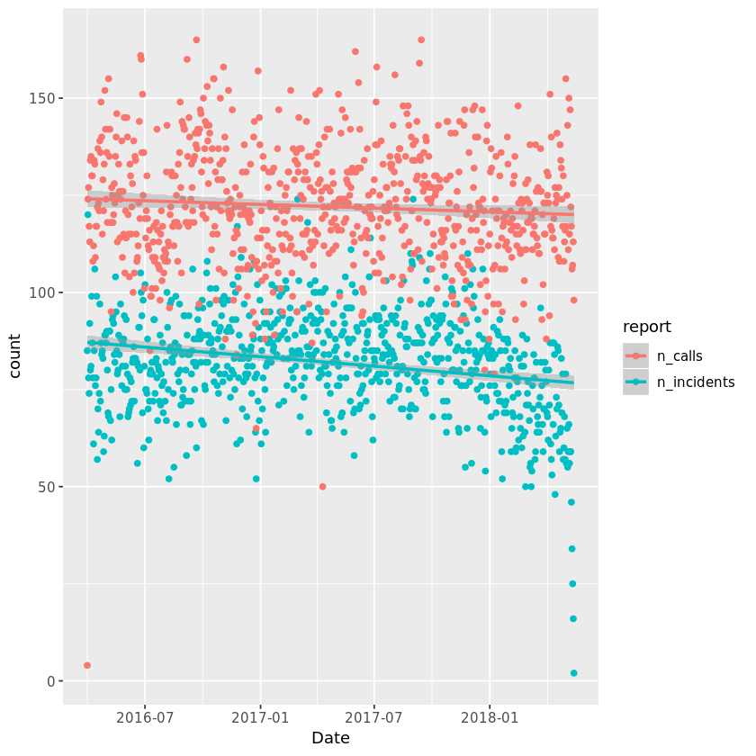
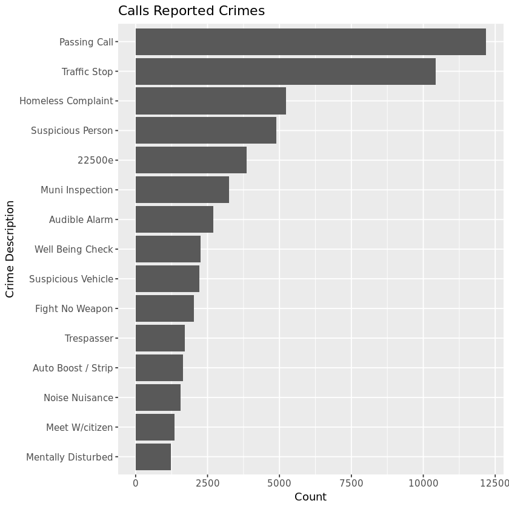
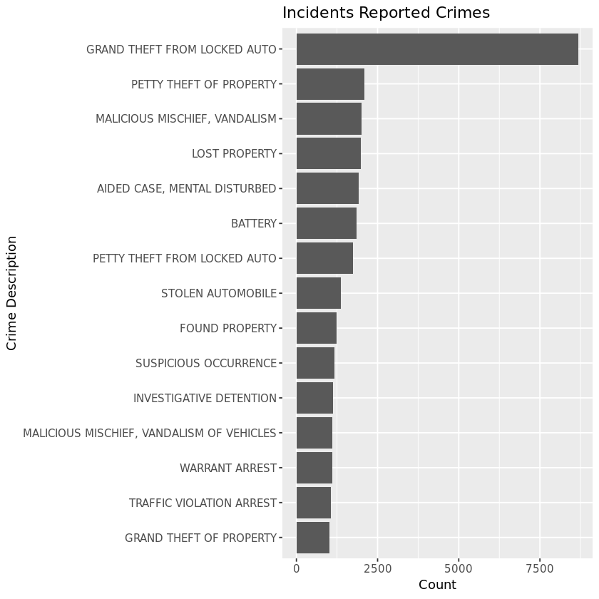
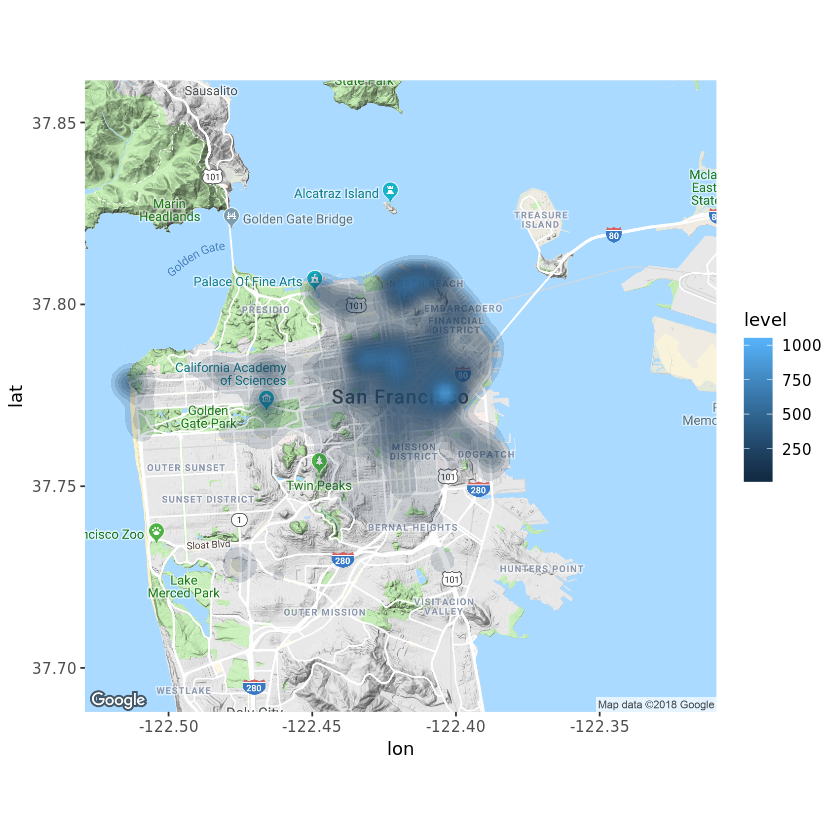

## 1.  The power of data science
<p></p>
<p>I believe a certain uncle once said to his benevolent nephew</p>
<blockquote>
  <p><em>With great power comes great responsibility</em></p>
</blockquote>
<p>This, of course, is an oft-quoted Spider-man line. I don't think any individual need bear the responsibility of a superhero, but it is important to understand the value of technical analysis skills in the context of modern social issues. Within the workplace, data science skills can greatly increase your utility as an employee or prospective applicant. What is not always  mentioned is that these same skills can be applied to positively impact your community. The concept of <strong>open science</strong> has led to new standards in <strong>open data</strong>, and there is an exciting plethora of raw information ready to be probed for insights. Organizations focused on <em>data science for social good</em> are rapidly growing, and the volunteer soup  kitchen seems to have a 21st-century rendition.</p>
<p>Many local and federal governments support access to interesting datasets; as this trend grows, the utility of open information becomes more robust. Data is begging for audacious volunteers to poke and prod it, and make use of the raw input in an impactful way. We can now fight crime as a vigilante - all from behind a computer. </p>
<p>In this notebook, we will explore San Francisco crime data in order to understand the relationship between civilian-reported incidents of crime and police-reported incidents of crime. Along the way we will use table intersection methods to subset our data, aggregation methods to calculate important statistics, and simple visualizations to understand crime trends. </p>


```R
# Load required packages
library(tidyverse)
library(lubridate)

# Read in incidents dataset
incidents <- read_csv("datasets/downsample_police-department-incidents.csv")

# Read in calls dataset
calls <- read_csv("datasets/downsample_police-department-calls-for-service.csv")

print('Done!')
```

    Parsed with column specification:
    cols(
      IncidntNum = col_double(),
      Category = col_character(),
      Descript = col_character(),
      DayOfWeek = col_character(),
      Date = col_datetime(format = ""),
      Time = col_time(format = ""),
      PdDistrict = col_character(),
      Resolution = col_character(),
      Address = col_character(),
      X = col_double(),
      Y = col_double(),
      Location = col_character(),
      PdId = col_double()
    )
    Parsed with column specification:
    cols(
      `Crime Id` = col_double(),
      `Original Crime Type Name` = col_character(),
      `Report Date` = col_datetime(format = ""),
      `Call Date` = col_datetime(format = ""),
      `Offense Date` = col_datetime(format = ""),
      `Call Time` = col_time(format = ""),
      `Call Date Time` = col_datetime(format = ""),
      Disposition = col_character(),
      Address = col_character(),
      City = col_character(),
      State = col_character(),
      `Agency Id` = col_double(),
      `Address Type` = col_character(),
      `Common Location` = col_character()
    )


    [1] "Done!"


```R
# These packages need to be loaded in the first @tests cell. 
library(testthat) 
library(IRkernel.testthat)

# Then follows one or more tests of the student's code. 
# The @solution should pass the tests.
# The purpose of the tests is to try to catch common errors and to 
# give the student a hint on how to resolve these errors.

run_tests({
    test_that("required packages are loaded", {
        for(pkg in c("tidyverse", "lubridate")) {
            expect_true(pkg %in% .packages(),
            info = sprintf("Did you load %s?", pkg))
        } 
    })
    
    test_that("incidents is loaded correctly", {
        expect_is(incidents, "tbl_df", 
            info = "Did you read the incidents dataset with read_csv (not read.csv)?")
        expect_equal(nrow(incidents), 84000,
            info = "Did you assign the correct dataset to the incidents variable?")
    })
              
    test_that("calls is loaded correctly", {
        expect_is(calls, "tbl_df", 
            info = "Did you read the incidents dataset with read_csv (not read.csv)?")
        expect_equal(nrow(calls), 100000,
            info = "Did you assign the correct dataset to the calls variable?")
    })
              
})
```


    <ProjectReporter>
      Inherits from: <ListReporter>
      Public:
        .context: NULL
        .end_context: function (context) 
        .start_context: function (context) 
        add_result: function (context, test, result) 
        all_tests: environment
        cat_line: function (...) 
        cat_tight: function (...) 
        clone: function (deep = FALSE) 
        current_expectations: environment
        current_file: some name
        current_start_time: 36.566 0.428 4512.812 0.005 0
        dump_test: function (test) 
        end_context: function (context) 
        end_reporter: function () 
        end_test: function (context, test) 
        get_results: function () 
        initialize: function (...) 
        is_full: function () 
        out: 3
        results: environment
        rule: function (...) 
        start_context: function (context) 
        start_file: function (name) 
        start_reporter: function () 
        start_test: function (context, test) 


## 2. First poke and prod
<p>First things first: we need to wrap our heads around the data in order to understand <em>what</em> we have. Let’s <code>glimpse()</code> the data to see if there are any variables in the two datasets that are the same or similar. Then we can ask an investigative question about these variables, and return a simple statistic such as a frequency count.</p>


```R
# Glimpse the structure of both datasets
glimpse(incidents) 
glimpse(calls)

# Aggregate the number of reported incidents by Date
daily_incidents <- incidents %>%
    count(Date, sort = TRUE) %>%
    rename(n_incidents = n)

# Aggregate the number of calls for police service by Call Date
daily_calls <- calls %>%
    count(`Call Date`, sort = TRUE) %>%
    rename(n_calls = n)

```

    Observations: 84,000
    Variables: 13
    $ IncidntNum <dbl> 176122807, 160569314, 160362475, 160435298, 90543656, 18...
    $ Category   <chr> "LARCENY/THEFT", "ASSAULT", "ROBBERY", "KIDNAPPING", "MI...
    $ Descript   <chr> "GRAND THEFT FROM UNLOCKED AUTO", "BATTERY", "ROBBERY, B...
    $ DayOfWeek  <chr> "Saturday", "Thursday", "Tuesday", "Friday", "Tuesday", ...
    $ Date       <dttm> 2017-05-13, 2016-07-14, 2016-05-03, 2016-05-27, 2009-05...
    $ Time       <time> 10:20:00, 16:00:00, 14:19:00, 23:57:00, 07:40:00, 18:00...
    $ PdDistrict <chr> "SOUTHERN", "MISSION", "NORTHERN", "SOUTHERN", "TARAVAL"...
    $ Resolution <chr> "NONE", "NONE", "ARREST, BOOKED", "ARREST, BOOKED", "LOC...
    $ Address    <chr> "800 Block of BRYANT ST", "MISSION ST / CESAR CHAVEZ ST"...
    $ X          <dbl> -122.4034, -122.4182, -122.4299, -122.4050, -122.4612, -...
    $ Y          <dbl> 37.77542, 37.74817, 37.77744, 37.78512, 37.71912, 37.806...
    $ Location   <chr> "{'latitude': '37.775420706711', 'human_address': '{\"ad...
    $ PdId       <dbl> 1.761228e+13, 1.605693e+13, 1.603625e+13, 1.604353e+13, ...
    Observations: 100,000
    Variables: 14
    $ `Crime Id`                 <dbl> 163003307, 180870423, 173510362, 1632728...
    $ `Original Crime Type Name` <chr> "Bicyclist", "586", "Suspicious Person",...
    $ `Report Date`              <dttm> 2016-10-26, 2018-03-28, 2017-12-17, 201...
    $ `Call Date`                <dttm> 2016-10-26, 2018-03-28, 2017-12-17, 201...
    $ `Offense Date`             <dttm> 2016-10-26, 2018-03-28, 2017-12-17, 201...
    $ `Call Time`                <time> 17:47:00, 05:49:00, 03:00:00, 17:39:00,...
    $ `Call Date Time`           <dttm> 2016-10-26 17:47:00, 2018-03-28 05:49:0...
    $ Disposition                <chr> "GOA", "HAN", "ADV", "NOM", "GOA", "ADV"...
    $ Address                    <chr> "The Embarcadero Nor/kearny St", "Ingall...
    $ City                       <chr> "San Francisco", "San Francisco", "San F...
    $ State                      <chr> "CA", "CA", "CA", "CA", "CA", "CA", "CA"...
    $ `Agency Id`                <dbl> 1, 1, 1, 1, 1, 1, 1, 1, 1, 1, 1, 1, 1, 1...
    $ `Address Type`             <chr> "Intersection", "Intersection", "Interse...
    $ `Common Location`          <chr> NA, NA, NA, NA, NA, NA, "Midori Hotel Sr...


```R
# One or more tests of the student's code. 
# The @solution should pass the tests.
# The purpose of the tests is to try to catch common errors and to 
# give the student a hint on how to resolve these errors.
run_tests({
    test_that("daily_incidents correct", {
        for(colx in c("Date", "n_incidents")) {
            expect_true(colx %in% colnames(daily_incidents),
            info = "Did you name your daily_incidents columns correctly?")
        }
        expect_equal(nrow(daily_incidents), 5525,
            info = "Did you count() the Date column?")    
    })
    
    test_that("daily_calls correct", {
        for(col in c("Call Date", "n_calls")) {
            expect_true(col %in% colnames(daily_calls),
            info = "Did you name your daily_calls columns correctly?")
        }
        expect_equal(nrow(daily_calls), 947,
            info = "Did you count() the `Call Date` column?") 
    })
})
```


    <ProjectReporter>
      Inherits from: <ListReporter>
      Public:
        .context: NULL
        .end_context: function (context) 
        .start_context: function (context) 
        add_result: function (context, test, result) 
        all_tests: environment
        cat_line: function (...) 
        cat_tight: function (...) 
        clone: function (deep = FALSE) 
        current_expectations: environment
        current_file: some name
        current_start_time: 36.629 0.428 4512.874 0.005 0
        dump_test: function (test) 
        end_context: function (context) 
        end_reporter: function () 
        end_test: function (context, test) 
        get_results: function () 
        initialize: function (...) 
        is_full: function () 
        out: 3
        results: environment
        rule: function (...) 
        start_context: function (context) 
        start_file: function (name) 
        start_reporter: function () 
        start_test: function (context, test) 


## 3. Mutating join
<p>Now that we have a better understanding of what variables are present in our information set we can see there are shared variables that will allow us to ask a wider variety of questions. We can inquire about the relationship between civilian-reported incidents and police-reported incidents by the date on which the incidents were documented. To combine this information we will perform a type of mutating join between the data frames. The new dataset structure preserves only days on which both civilians reported incidents and police encountered incidents.</p>


```R
# Join data frames to create a new "mutated" set of information
#glimpse(daily_incidents)
#glimpse(daily_calls)
shared_dates <- daily_incidents %>% inner_join(daily_calls, by = c("Date" = "Call Date") )

# Take a glimpse of this new data frame
glimpse(shared_dates)
```

    Observations: 776
    Variables: 3
    $ Date        <dttm> 2017-03-01, 2017-09-01, 2016-04-01, 2017-03-17, 2016-1...
    $ n_incidents <int> 124, 124, 120, 118, 117, 114, 111, 110, 110, 110, 109, ...
    $ n_calls     <int> 133, 138, 124, 129, 115, 120, 127, 106, 124, 108, 111, ...


```R
# One or more tests of the student's code. 
# The @solution should pass the tests.
# The purpose of the tests is to try to catch common errors and to 
# give the student a hint on how to resolve these errors.
run_tests({
    test_that("shared_dates is correct", {
        expect_true(c("Date") %in% colnames(shared_dates),
            info = "Did you include the `by =` parameter of `inner_join()` to specify correct columns to join by?")
        for(col in c("Date", "n_incidents", "n_calls")) {
            expect_true(col %in% colnames(shared_dates),
            info = "Check that you called the correct data frames in the correct order in the `inner_join()`.")
        }
        expect_equal(nrow(shared_dates), 776,
            info = "Is the correct mutating join called?")
    })

})
```


    <ProjectReporter>
      Inherits from: <ListReporter>
      Public:
        .context: NULL
        .end_context: function (context) 
        .start_context: function (context) 
        add_result: function (context, test, result) 
        all_tests: environment
        cat_line: function (...) 
        cat_tight: function (...) 
        clone: function (deep = FALSE) 
        current_expectations: environment
        current_file: some name
        current_start_time: 36.671 0.428 4512.915 0.005 0
        dump_test: function (test) 
        end_context: function (context) 
        end_reporter: function () 
        end_test: function (context, test) 
        get_results: function () 
        initialize: function (...) 
        is_full: function () 
        out: 3
        results: environment
        rule: function (...) 
        start_context: function (context) 
        start_file: function (name) 
        start_reporter: function () 
        start_test: function (context, test) 


## 4. Inspect frequency trends
<p>We now have a data frame that contains new information generated by combining datasets. In order to understand this new information we must visualize it. And I don't mean just giving the data a <code>glimpse()</code> - a table of raw information limits our comprehension of crime patterns. A picture is worth a thousand words, right? So let's try to represent the information in a concise way that will lead to other questions. We will look at the frequency of calls and incidents across time to help discern if there is a relationship between these variables.</p>
<p>Often times restructuring of data is required to perform new operations like plotting. <code>ggplot2</code> is amenable to "long format" data rather than "wide format" data. To plot time series data in <code>ggplot2</code> we would like one column to represent the dates, one column to represent the counts, and one column to map each observation to either <code>n_calls</code> or <code>n_incidents</code>. This allows us to pass a single column to each <code>x</code>, <code>y</code>, and <code>color</code> argument in <code>ggplot()</code>. We want the <code>key</code> column in <code>gather()</code> to define the columns <code>n_incidents</code> and <code>n_calls</code>. The <code>value</code> column will define the each of these variable's corresponding counts. By leaving the <code>Date</code> column out of <code>key</code>, the result is a long and narrow data frame with multiple rows for each  date observation.</p>


```R
# Gather into long format using the "Date" column to define observations
plot_shared_dates <- shared_dates %>%
  gather(key = report, value = count, -Date)

# Plot points and regression trend lines
ggplot(plot_shared_dates, aes(x = Date, y = count, color = report)) +
  geom_point() +
  geom_smooth(method = "lm", formula = y ~ x)
```





```R
# One or more tests of the student's code. 
# The @solution should pass the tests.
# The purpose of the tests is to try to catch common errors and to 
# give the student a hint on how to resolve these errors.
plot_test <- last_plot()

run_tests({
    test_that("plot_shared_dates is correct", {
        expect_true(exists("plot_shared_dates"), 
            info = "Have you assigned gathered data to plot_shared_dates?")
        for(col in c("Date", "report", "count")) {
            expect_true(col %in% colnames(plot_shared_dates),
            info = sprintf("Do you have the appropriate column `%s` defined?", col))
        }
        expect_equal(nrow(plot_shared_dates), 1552,
            info = "Did you define which variables to gather() correctly?")
    
    })

    test_that("graph is correct", {
        expect_true(plot_test$labels$x == 'Date',
            info = "Is your x-axis assigned to the `Date` column?")
        expect_true(plot_test$labels$y == 'count',
            info = "Is your y-axis assigned to the `count` column?")
        expect_true(plot_test$labels$colour == 'report',
            info = "Is the color aesthetic assigned to the `report` column?")
    })
})
```


    <ProjectReporter>
      Inherits from: <ListReporter>
      Public:
        .context: NULL
        .end_context: function (context) 
        .start_context: function (context) 
        add_result: function (context, test, result) 
        all_tests: environment
        cat_line: function (...) 
        cat_tight: function (...) 
        clone: function (deep = FALSE) 
        current_expectations: environment
        current_file: some name
        current_start_time: 37.092 0.428 4513.336 0.005 0
        dump_test: function (test) 
        end_context: function (context) 
        end_reporter: function () 
        end_test: function (context, test) 
        get_results: function () 
        initialize: function (...) 
        is_full: function () 
        out: 3
        results: environment
        rule: function (...) 
        start_context: function (context) 
        start_file: function (name) 
        start_reporter: function () 
        start_test: function (context, test) 


## 5. Correlation between trends
<p>A more quantitive way to discern the relationship between 2 variables is to calculate a correlation coefficient between vectors of data. This statistic is represented between a range from -1 to +1; specifically it represents the linear dependence between two sets of data. The correlation coefficient can be interpreted as perfect negative correlation when -1, no correlation whatsoever when 0, and perfect positive correlation when +1. We will look at 2 different but related correlation coefficients in order to understand how our interpretation of statistics can greatly influence the conclusions we come to.</p>
<p>We will first check if there is a correlation between the frequency of incidents and calls on a day-to-day basis. However, this may be too granular of a statistic as daily correlations are probably unlikely except for on big events (New Year's Eve, Halloween, Bay to Breakers). It may be helpful to take a broader view of inherent trends by summarising the data into monthly counts and calculating a correlation coefficient.</p>


```R
# Calculate correlation coefficient between daily frequencies
daily_cor <- cor(shared_dates$n_incidents, shared_dates$n_calls)
daily_cor

# Summarize frequencies by month
correlation_df <- shared_dates %>% 
  mutate(month = month(Date)) %>%
  group_by(month) %>% 
  summarize(n_incidents = sum(n_incidents),
            n_calls = sum(n_calls))

# Calculate correlation coefficient between monthly frequencies
monthly_cor <- cor(correlation_df$n_incidents, correlation_df$n_calls)
monthly_cor
```


0.146968821239074


0.970682977463344


```R
# One or more tests of the student's code.  
# The @solution should pass the tests.
# The purpose of the tests is to try to catch common errors and to 
# give the student a hint on how to resolve these errors.
run_tests({
    test_that("Daily frequency correlation coefficient is correct", {
        expect_equal(round(daily_cor, 3), 0.147, 
            info = "Have you used the shared_dates data frame to calculate the correlation coefficient between n_incidents and n_calls?")
    })
    
    test_that("correlation_df summarised correctly", {
        expect_equal(correlation_df$month, 1:12,
            info = "Did you create a new column `month` from `Date`?")
        expect_true(correlation_df[1,"month"] == 1 & correlation_df[1,"n_incidents"] == 5078 & correlation_df[1,"n_calls"] == 7210,
            info = "Did you call sum() on the columns you wish to summarize?")
    })
    
    test_that("Monthly frequencly correlation coefficient is correct", {
        expect_equal(round(monthly_cor, 3), 0.971,
            info = "Have you used the correlation_df data frame to calculate the correlation coefficient between n_incidents and n_calls?")
    })
    
})
```


    <ProjectReporter>
      Inherits from: <ListReporter>
      Public:
        .context: NULL
        .end_context: function (context) 
        .start_context: function (context) 
        add_result: function (context, test, result) 
        all_tests: environment
        cat_line: function (...) 
        cat_tight: function (...) 
        clone: function (deep = FALSE) 
        current_expectations: environment
        current_file: some name
        current_start_time: 37.144 0.428 4513.387 0.005 0
        dump_test: function (test) 
        end_context: function (context) 
        end_reporter: function () 
        end_test: function (context, test) 
        get_results: function () 
        initialize: function (...) 
        is_full: function () 
        out: 3
        results: environment
        rule: function (...) 
        start_context: function (context) 
        start_file: function (name) 
        start_reporter: function () 
        start_test: function (context, test) 


## 6. Filtering joins
<p>When working with relational datasets there are situations in which it is helpful to subset information based on another set of values. Remember mutating joins? Filtering joins are a complementary type of join which allows us to keep all specific cases within a data frame while preserving the structure of the data frame itself. It will be helpful to have all the information from each police reported incident and each civilian call on their shared dates so we can calculate similar statistics from each dataset and compare results. In this case we will use <code>shared_dates</code> to subset down both the full <code>calls</code> and <code>incidents</code> data frames.</p>


```R
# Subset calls to police by shared_dates
calls_shared_dates <- calls  %>% semi_join(shared_dates, by = c("Call Date" = "Date"))

# Perform a sanity check that we are using this filtering join function appropriately
identical(sort(unique(calls_shared_dates$`Call Date`)), sort(unique(shared_dates$Date)))

# Filter recorded incidents by shared_dates
incidents_shared_dates <- incidents  %>% semi_join(shared_dates, by = c("Date" = "Date"))


calls_shared_dates
```


TRUE


<table>
<thead><tr><th scope=col>Crime Id</th><th scope=col>Original Crime Type Name</th><th scope=col>Report Date</th><th scope=col>Call Date</th><th scope=col>Offense Date</th><th scope=col>Call Time</th><th scope=col>Call Date Time</th><th scope=col>Disposition</th><th scope=col>Address</th><th scope=col>City</th><th scope=col>State</th><th scope=col>Agency Id</th><th scope=col>Address Type</th><th scope=col>Common Location</th></tr></thead>
<tbody>
	<tr><td>163003307                    </td><td>Bicyclist                    </td><td>2016-10-26                   </td><td>2016-10-26                   </td><td>2016-10-26                   </td><td>17:47:00                     </td><td>2016-10-26 17:47:00          </td><td>GOA                          </td><td>The Embarcadero Nor/kearny St</td><td>San Francisco                </td><td>CA                           </td><td>1                            </td><td>Intersection                 </td><td>NA                           </td></tr>
	<tr><td>180870423                    </td><td>586                          </td><td>2018-03-28                   </td><td>2018-03-28                   </td><td>2018-03-28                   </td><td>05:49:00                     </td><td>2018-03-28 05:49:00          </td><td>HAN                          </td><td>Ingalls St/van Dyke Av       </td><td>San Francisco                </td><td>CA                           </td><td>1                            </td><td>Intersection                 </td><td>NA                           </td></tr>
	<tr><td>173510362                    </td><td>Suspicious Person            </td><td>2017-12-17                   </td><td>2017-12-17                   </td><td>2017-12-17                   </td><td>03:00:00                     </td><td>2017-12-17 03:00:00          </td><td>ADV                          </td><td>Howard St/4th St             </td><td>San Francisco                </td><td>CA                           </td><td>1                            </td><td>Intersection                 </td><td>NA                           </td></tr>
	<tr><td>163272811                    </td><td>911 Drop                     </td><td>2016-11-22                   </td><td>2016-11-22                   </td><td>2016-11-22                   </td><td>17:39:00                     </td><td>2016-11-22 17:39:00          </td><td>NOM                          </td><td>400 Block Of Sutter St       </td><td>San Francisco                </td><td>CA                           </td><td>1                            </td><td>Premise Address              </td><td>NA                           </td></tr>
	<tr><td>172811002                    </td><td>Drugs                        </td><td>2017-10-08                   </td><td>2017-10-08                   </td><td>2017-10-08                   </td><td>08:54:00                     </td><td>2017-10-08 08:54:00          </td><td>GOA                          </td><td>400 Block Of Leavenworth St  </td><td>San Francisco                </td><td>CA                           </td><td>1                            </td><td>Premise Address              </td><td>NA                           </td></tr>
	<tr><td>170902193                    </td><td>At Risk                      </td><td>2017-03-31                   </td><td>2017-03-31                   </td><td>2017-03-31                   </td><td>14:14:00                     </td><td>2017-03-31 14:14:00          </td><td>REP                          </td><td>200 Block Of Hyde St #612    </td><td>San Francisco                </td><td>CA                           </td><td>1                            </td><td>Common Location              </td><td>Midori Hotel Sro #612, Sf    </td></tr>
	<tr><td>172012276                    </td><td>22500f                       </td><td>2017-07-20                   </td><td>2017-07-20                   </td><td>2017-07-20                   </td><td>14:27:00                     </td><td>2017-07-20 14:27:00          </td><td>GOA                          </td><td>1700 Block Of Page St        </td><td>San Francisco                </td><td>CA                           </td><td>1                            </td><td>Premise Address              </td><td>NA                           </td></tr>
	<tr><td>170370474                    </td><td>Burglary                     </td><td>2017-02-06                   </td><td>2017-02-06                   </td><td>2017-02-06                   </td><td>06:03:00                     </td><td>2017-02-06 06:03:00          </td><td>REP                          </td><td>Block Of Jefferson St        </td><td>San Francisco                </td><td>CA                           </td><td>1                            </td><td>Premise Address              </td><td>NA                           </td></tr>
	<tr><td>171933514                    </td><td>Muni Inspection              </td><td>2017-07-12                   </td><td>2017-07-12                   </td><td>2017-07-12                   </td><td>18:22:00                     </td><td>2017-07-12 18:22:00          </td><td>HAN                          </td><td>Geneva Av/naples St          </td><td>San Francisco                </td><td>CA                           </td><td>1                            </td><td>Intersection                 </td><td>NA                           </td></tr>
	<tr><td>172632435                    </td><td>Trespasser                   </td><td>2017-09-20                   </td><td>2017-09-20                   </td><td>2017-09-20                   </td><td>14:35:00                     </td><td>2017-09-20 14:35:00          </td><td>GOA                          </td><td>1200 Block Of Jones St       </td><td>San Francisco                </td><td>CA                           </td><td>1                            </td><td>Premise Address              </td><td>NA                           </td></tr>
	<tr><td>162522112                    </td><td>Tent                         </td><td>2016-09-08                   </td><td>2016-09-08                   </td><td>2016-09-08                   </td><td>13:25:00                     </td><td>2016-09-08 13:25:00          </td><td>ADV                          </td><td>Vermont St/alameda St        </td><td>San Francisco                </td><td>CA                           </td><td>1                            </td><td>Intersection                 </td><td>NA                           </td></tr>
	<tr><td>171412395                    </td><td>Well Being Check             </td><td>2017-05-21                   </td><td>2017-05-21                   </td><td>2017-05-21                   </td><td>15:57:00                     </td><td>2017-05-21 15:57:00          </td><td>ADV                          </td><td>1200 Block Of Masonic Av     </td><td>San Francisco                </td><td>CA                           </td><td>1                            </td><td>Premise Address              </td><td>NA                           </td></tr>
	<tr><td>162841494                    </td><td>Muni Inspection              </td><td>2016-10-10                   </td><td>2016-10-10                   </td><td>2016-10-10                   </td><td>11:11:00                     </td><td>2016-10-10 11:11:00          </td><td>HAN                          </td><td>Geary Bl/6th Av              </td><td>San Francisco                </td><td>CA                           </td><td>1                            </td><td>Intersection                 </td><td>NA                           </td></tr>
	<tr><td>173181162                    </td><td>Suspicious Person            </td><td>2017-11-14                   </td><td>2017-11-14                   </td><td>2017-11-14                   </td><td>09:45:00                     </td><td>2017-11-14 09:45:00          </td><td>HAN                          </td><td>0 Block Of United Nations Pz </td><td>San Francisco                </td><td>CA                           </td><td>1                            </td><td>Premise Address              </td><td>NA                           </td></tr>
	<tr><td>171744300                    </td><td>Homeless Complaint           </td><td>2017-06-23                   </td><td>2017-06-23                   </td><td>2017-06-23                   </td><td>23:08:00                     </td><td>2017-06-23 23:08:00          </td><td>UTL                          </td><td>Ofarrell St/hyde St          </td><td>San Francisco                </td><td>CA                           </td><td>1                            </td><td>Intersection                 </td><td>NA                           </td></tr>
	<tr><td>180691119                    </td><td>Rz                           </td><td>2018-03-10                   </td><td>2018-03-10                   </td><td>2018-03-10                   </td><td>09:50:00                     </td><td>2018-03-10 09:50:00          </td><td>HAN                          </td><td>1600 Block Of Dolores St     </td><td>San Francisco                </td><td>CA                           </td><td>1                            </td><td>Premise Address              </td><td>NA                           </td></tr>
	<tr><td>170683993                    </td><td>917                          </td><td>2017-03-09                   </td><td>2017-03-09                   </td><td>2017-03-09                   </td><td>21:24:00                     </td><td>2017-03-09 21:24:00          </td><td>REP                          </td><td>1600 Block Of Geary Bl       </td><td>San Francisco                </td><td>CA                           </td><td>1                            </td><td>Premise Address              </td><td>NA                           </td></tr>
	<tr><td>172211103                    </td><td>22500e                       </td><td>2017-08-09                   </td><td>2017-08-09                   </td><td>2017-08-09                   </td><td>09:14:00                     </td><td>2017-08-09 09:14:00          </td><td>CIT                          </td><td>3500 Block Of Pierce St      </td><td>San Francisco                </td><td>CA                           </td><td>1                            </td><td>Premise Address              </td><td>NA                           </td></tr>
	<tr><td>180142855                    </td><td>518                          </td><td>2018-01-14                   </td><td>2018-01-14                   </td><td>2018-01-14                   </td><td>18:28:00                     </td><td>2018-01-14 18:28:00          </td><td>HAN                          </td><td>100 Block Of Cerritos Av     </td><td>San Francisco                </td><td>CA                           </td><td>1                            </td><td>Premise Address              </td><td>NA                           </td></tr>
	<tr><td>162652447                    </td><td>Poss/594                     </td><td>2016-09-21                   </td><td>2016-09-21                   </td><td>2016-09-21                   </td><td>14:00:00                     </td><td>2016-09-21 14:00:00          </td><td>ND                           </td><td>1800 Block Of Lake St        </td><td>San Francisco                </td><td>CA                           </td><td>1                            </td><td>Premise Address              </td><td>NA                           </td></tr>
	<tr><td>180380942                    </td><td>22500e                       </td><td>2018-02-07                   </td><td>2018-02-07                   </td><td>2018-02-07                   </td><td>09:10:00                     </td><td>2018-02-07 09:10:00          </td><td>HAN                          </td><td>0 Block Of Hartford St       </td><td>San Francisco                </td><td>CA                           </td><td>1                            </td><td>Premise Address              </td><td>NA                           </td></tr>
	<tr><td>181300076                    </td><td>Well Being Check             </td><td>2018-05-10                   </td><td>2018-05-10                   </td><td>2018-05-10                   </td><td>00:43:00                     </td><td>2018-05-10 00:43:00          </td><td>NOM                          </td><td>400 Block Of Fulton St       </td><td>San Francisco                </td><td>CA                           </td><td>1                            </td><td>Premise Address              </td><td>NA                           </td></tr>
	<tr><td>161532254                    </td><td>Suspicious Person            </td><td>2016-06-01                   </td><td>2016-06-01                   </td><td>2016-06-01                   </td><td>14:35:00                     </td><td>2016-06-01 14:35:00          </td><td>ADV                          </td><td>Fillmore St/ellis St         </td><td>San Francisco                </td><td>CA                           </td><td>1                            </td><td>Intersection                 </td><td>NA                           </td></tr>
	<tr><td>180653576                    </td><td>Fight No Weapon Dv           </td><td>2018-03-06                   </td><td>2018-03-06                   </td><td>2018-03-06                   </td><td>19:07:00                     </td><td>2018-03-06 19:07:00          </td><td>CAN                          </td><td>100 Block Of 3rd Av          </td><td>San Francisco                </td><td>CA                           </td><td>1                            </td><td>Premise Address              </td><td>NA                           </td></tr>
	<tr><td>172141842                    </td><td>Traffic Stop                 </td><td>2017-08-02                   </td><td>2017-08-02                   </td><td>2017-08-02                   </td><td>12:39:00                     </td><td>2017-08-02 12:39:00          </td><td>REP                          </td><td>20th Av/taraval St           </td><td>San Francisco                </td><td>CA                           </td><td>1                            </td><td>Intersection                 </td><td>NA                           </td></tr>
	<tr><td>162321853                    </td><td>Dw                           </td><td>2016-08-19                   </td><td>2016-08-19                   </td><td>2016-08-19                   </td><td>12:45:00                     </td><td>2016-08-19 12:45:00          </td><td>HAN                          </td><td>0 Block Of Ruth St           </td><td>San Francisco                </td><td>CA                           </td><td>1                            </td><td>Premise Address              </td><td>NA                           </td></tr>
	<tr><td>162171095                    </td><td>Suspicious Person            </td><td>2016-08-04                   </td><td>2016-08-04                   </td><td>2016-08-04                   </td><td>10:07:00                     </td><td>2016-08-04 10:07:00          </td><td>ADV                          </td><td>200 Block Of 6th St          </td><td>San Francisco                </td><td>CA                           </td><td>1                            </td><td>Premise Address              </td><td>NA                           </td></tr>
	<tr><td>162013146                    </td><td>Passing Call                 </td><td>2016-07-19                   </td><td>2016-07-19                   </td><td>2016-07-19                   </td><td>19:01:00                     </td><td>2016-07-19 19:01:00          </td><td>HAN                          </td><td>1100 Block Of Market St      </td><td>San Francisco                </td><td>CA                           </td><td>1                            </td><td>Common Location              </td><td>Civic Center Muni, Sf        </td></tr>
	<tr><td>161951390                                                            </td><td><span style=white-space:pre-wrap>H&amp;r Veh Accident  </span>       </td><td>2016-07-13                                                           </td><td>2016-07-13                                                           </td><td>2016-07-13                                                           </td><td>11:25:00                                                             </td><td>2016-07-13 11:25:00                                                  </td><td>REP                                                                  </td><td><span style=white-space:pre-wrap>South Van Ness Av/21st St    </span></td><td>San Francisco                                                        </td><td>CA                                                                   </td><td>1                                                                    </td><td><span style=white-space:pre-wrap>Intersection   </span>              </td><td><span style=white-space:pre-wrap>NA                       </span>    </td></tr>
	<tr><td>160983846                    </td><td>'S                           </td><td>2016-04-07                   </td><td>2016-04-07                   </td><td>2016-04-07                   </td><td>22:02:00                     </td><td>2016-04-07 22:02:00          </td><td>ADV                          </td><td>100 Block Of Eddy St         </td><td>San Francisco                </td><td>CA                           </td><td>1                            </td><td>Common Location              </td><td>West Hotel Sro, Sf           </td></tr>
	<tr><td>...</td><td>...</td><td>...</td><td>...</td><td>...</td><td>...</td><td>...</td><td>...</td><td>...</td><td>...</td><td>...</td><td>...</td><td>...</td><td>...</td></tr>
	<tr><td>161542806                      </td><td>Suspicious Person              </td><td>2016-06-02                     </td><td>2016-06-02                     </td><td>2016-06-02                     </td><td>17:13:00                       </td><td>2016-06-02 17:13:00            </td><td>HAN                            </td><td>600 Block Of Columbus Av       </td><td>San Francisco                  </td><td>CA                             </td><td>1                              </td><td>Common Location                </td><td>Washington Square, Sf          </td></tr>
	<tr><td>162701517                      </td><td>Suicide Attempt                </td><td>2016-09-26                     </td><td>2016-09-26                     </td><td>2016-09-26                     </td><td>11:23:00                       </td><td>2016-09-26 11:23:00            </td><td>HAN                            </td><td>500 Block Of Dewey Bl          </td><td>San Francisco                  </td><td>CA                             </td><td>1                              </td><td>Premise Address                </td><td>NA                             </td></tr>
	<tr><td>162771940                      </td><td>Rep                            </td><td>2016-10-03                     </td><td>2016-10-03                     </td><td>2016-10-03                     </td><td>12:55:00                       </td><td>2016-10-03 12:55:00            </td><td>UTL                            </td><td>6500 Block Of 3rd St           </td><td>San Francisco                  </td><td>CA                             </td><td>1                              </td><td>Premise Address                </td><td>NA                             </td></tr>
	<tr><td>171242387                      </td><td>Veh Vs Bicyclist               </td><td>2017-05-04                     </td><td>2017-05-04                     </td><td>2017-05-04                     </td><td>15:05:00                       </td><td>2017-05-04 15:05:00            </td><td>UTL                            </td><td>Precita Av/mission St          </td><td>San Francisco                  </td><td>CA                             </td><td>1                              </td><td>Intersection                   </td><td>NA                             </td></tr>
	<tr><td>170431784                      </td><td>Verbal                         </td><td>2017-02-12                     </td><td>2017-02-12                     </td><td>2017-02-12                     </td><td>13:35:00                       </td><td>2017-02-12 13:35:00            </td><td>HAN                            </td><td>2400 Block Of 40th Av          </td><td>San Francisco                  </td><td>CA                             </td><td>1                              </td><td>Premise Address                </td><td>NA                             </td></tr>
	<tr><td>162732526                      </td><td>Traffic Stop                   </td><td>2016-09-29                     </td><td>2016-09-29                     </td><td>2016-09-29                     </td><td>14:54:00                       </td><td>2016-09-29 14:54:00            </td><td>ADV                            </td><td>Kirkham St/42nd Av             </td><td>San Francisco                  </td><td>CA                             </td><td>1                              </td><td>Intersection                   </td><td>NA                             </td></tr>
	<tr><td>172043097                      </td><td>Susp 97                        </td><td>2017-07-23                     </td><td>2017-07-23                     </td><td>2017-07-23                     </td><td>18:29:00                       </td><td>2017-07-23 18:29:00            </td><td>GOA                            </td><td>600 Block Of Mendell St        </td><td>San Francisco                  </td><td>CA                             </td><td>1                              </td><td>Premise Address                </td><td>NA                             </td></tr>
	<tr><td>170221679                      </td><td>Traffic Stop                   </td><td>2017-01-22                     </td><td>2017-01-22                     </td><td>2017-01-22                     </td><td>13:08:00                       </td><td>2017-01-22 13:08:00            </td><td>ND                             </td><td>13th St/folsom St              </td><td>San Francisco                  </td><td>CA                             </td><td>1                              </td><td>Intersection                   </td><td>NA                             </td></tr>
	<tr><td>162693159                      </td><td>Homeless Complaint             </td><td>2016-09-25                     </td><td>2016-09-25                     </td><td>2016-09-25                     </td><td>18:38:00                       </td><td>2016-09-25 18:38:00            </td><td>GOA                            </td><td>Gough St/chestnut St           </td><td>San Francisco                  </td><td>CA                             </td><td>1                              </td><td>Intersection                   </td><td>NA                             </td></tr>
	<tr><td>162383512                      </td><td>Veh Accident                   </td><td>2016-08-25                     </td><td>2016-08-25                     </td><td>2016-08-25                     </td><td>20:19:00                       </td><td>2016-08-25 20:19:00            </td><td>REP                            </td><td>0 Block Of 10th St             </td><td>San Francisco                  </td><td>CA                             </td><td>1                              </td><td>Premise Address                </td><td>NA                             </td></tr>
	<tr><td>171853803                      </td><td>152 Poss                       </td><td>2017-07-04                     </td><td>2017-07-04                     </td><td>2017-07-04                     </td><td>22:10:00                       </td><td>2017-07-04 22:10:00            </td><td>ND                             </td><td>Jones St/francisco St          </td><td>San Francisco                  </td><td>CA                             </td><td>1                              </td><td>Intersection                   </td><td>NA                             </td></tr>
	<tr><td>170420290                      </td><td>Complaint Unkn                 </td><td>2017-02-11                     </td><td>2017-02-11                     </td><td>2017-02-11                     </td><td>02:05:00                       </td><td>2017-02-11 02:05:00            </td><td>HAN                            </td><td>1700 Block Of 26th Av          </td><td>San Francisco                  </td><td>CA                             </td><td>1                              </td><td>Premise Address                </td><td>NA                             </td></tr>
	<tr><td>172733242                      </td><td>Encampment                     </td><td>2017-09-30                     </td><td>2017-09-30                     </td><td>2017-09-30                     </td><td>19:16:00                       </td><td>2017-09-30 19:16:00            </td><td>ADV                            </td><td>Quincy St/pine St              </td><td>San Francisco                  </td><td>CA                             </td><td>1                              </td><td>Intersection                   </td><td>NA                             </td></tr>
	<tr><td>171410817                      </td><td>Noise Nuisance                 </td><td>2017-05-21                     </td><td>2017-05-21                     </td><td>2017-05-21                     </td><td>08:15:00                       </td><td>2017-05-21 08:15:00            </td><td>CAN                            </td><td>3600 Block Of Fillmore St      </td><td>San Francisco                  </td><td>CA                             </td><td>1                              </td><td>Premise Address                </td><td>NA                             </td></tr>
	<tr><td>162472879                      </td><td>Threats / Harassment           </td><td>2016-09-03                     </td><td>2016-09-03                     </td><td>2016-09-03                     </td><td>17:44:00                       </td><td>2016-09-03 17:44:00            </td><td>HAN                            </td><td>Buchanan St/north Point St     </td><td>San Francisco                  </td><td>CA                             </td><td>1                              </td><td>Intersection                   </td><td>NA                             </td></tr>
	<tr><td>161223766                      </td><td>Veh Accident                   </td><td>2016-05-01                     </td><td>2016-05-01                     </td><td>2016-05-01                     </td><td>21:35:00                       </td><td>2016-05-01 21:35:00            </td><td>REP                            </td><td>Franklin St/austin St          </td><td>San Francisco                  </td><td>CA                             </td><td>1                              </td><td>Intersection                   </td><td>NA                             </td></tr>
	<tr><td>171394455                      </td><td>Audible Alarm                  </td><td>2017-05-19                     </td><td>2017-05-19                     </td><td>2017-05-19                     </td><td>23:36:00                       </td><td>2017-05-19 23:36:00            </td><td>PAS                            </td><td>2600 Block Of Mission St       </td><td>San Francisco                  </td><td>CA                             </td><td>1                              </td><td>Premise Address                </td><td>NA                             </td></tr>
	<tr><td>170252042                      </td><td>Traffic Stop                   </td><td>2017-01-25                     </td><td>2017-01-25                     </td><td>2017-01-25                     </td><td>13:18:00                       </td><td>2017-01-25 13:18:00            </td><td>ADV                            </td><td>Harrison St/vassar Pl          </td><td>San Francisco                  </td><td>CA                             </td><td>1                              </td><td>Intersection                   </td><td>NA                             </td></tr>
	<tr><td>180212492                      </td><td>Traffic Stop                   </td><td>2018-01-21                     </td><td>2018-01-21                     </td><td>2018-01-21                     </td><td>17:18:00                       </td><td>2018-01-21 17:18:00            </td><td>CIT                            </td><td>Judah St/44th Av               </td><td>San Francisco                  </td><td>CA                             </td><td>1                              </td><td>Intersection                   </td><td>NA                             </td></tr>
	<tr><td>172631372                      </td><td>Meet W/citizen                 </td><td>2017-09-20                     </td><td>2017-09-20                     </td><td>2017-09-20                     </td><td>10:26:00                       </td><td>2017-09-20 10:26:00            </td><td>REP                            </td><td>1600 Block Of Oak St           </td><td>San Francisco                  </td><td>CA                             </td><td>1                              </td><td>Premise Address                </td><td>NA                             </td></tr>
	<tr><td>171611913                      </td><td>Opportunist                    </td><td>2017-06-10                     </td><td>2017-06-10                     </td><td>2017-06-10                     </td><td>14:05:00                       </td><td>2017-06-10 14:05:00            </td><td>GOA                            </td><td>9th Av/judah St                </td><td>San Francisco                  </td><td>CA                             </td><td>1                              </td><td>Intersection                   </td><td>NA                             </td></tr>
	<tr><td>171191416                      </td><td>Passing Call                   </td><td>2017-04-29                     </td><td>2017-04-29                     </td><td>2017-04-29                     </td><td>11:29:00                       </td><td>2017-04-29 11:29:00            </td><td>HAN                            </td><td>100 Block Of Music Concourse Dr</td><td>San Francisco                  </td><td>CA                             </td><td>1                              </td><td>Common Location                </td><td>Academy Of Sciences, Sf        </td></tr>
	<tr><td>163303113                      </td><td>Passing Call                   </td><td>2016-11-25                     </td><td>2016-11-25                     </td><td>2016-11-25                     </td><td>20:11:00                       </td><td>2016-11-25 20:11:00            </td><td>Not recorded                   </td><td>1100 Block Of Point Lobos Av   </td><td>San Francisco                  </td><td>CA                             </td><td>1                              </td><td>Common Location                </td><td>Cliff House                    </td></tr>
	<tr><td>172683585                      </td><td>Traffic Stop                   </td><td>2017-09-25                     </td><td>2017-09-25                     </td><td>2017-09-25                     </td><td>18:49:00                       </td><td>2017-09-25 18:49:00            </td><td>CIT                            </td><td>Balboa St/32nd Av              </td><td>San Francisco                  </td><td>CA                             </td><td>1                              </td><td>Intersection                   </td><td>NA                             </td></tr>
	<tr><td>180743115                      </td><td>Traffic Stop                   </td><td>2018-03-15                     </td><td>2018-03-15                     </td><td>2018-03-15                     </td><td>18:11:00                       </td><td>2018-03-15 18:11:00            </td><td>CIT                            </td><td>Anthony St/mission St          </td><td>San Francisco                  </td><td>CA                             </td><td>1                              </td><td>Intersection                   </td><td>NA                             </td></tr>
	<tr><td>180303838                      </td><td>Homeless Complaint             </td><td>2018-01-30                     </td><td>2018-01-30                     </td><td>2018-01-30                     </td><td>20:39:00                       </td><td>2018-01-30 20:39:00            </td><td>Not recorded                   </td><td>100 Block Of Boardman Pl       </td><td>San Francisco                  </td><td>CA                             </td><td>1                              </td><td>Premise Address                </td><td>NA                             </td></tr>
	<tr><td>161172778                      </td><td>Muni Inspection                </td><td>2016-04-26                     </td><td>2016-04-26                     </td><td>2016-04-26                     </td><td>16:48:00                       </td><td>2016-04-26 16:48:00            </td><td>Not recorded                   </td><td>Market St/3rd St               </td><td>San Francisco                  </td><td>CA                             </td><td>1                              </td><td>Intersection                   </td><td>NA                             </td></tr>
	<tr><td>172100977                      </td><td>22500e                         </td><td>2017-07-29                     </td><td>2017-07-29                     </td><td>2017-07-29                     </td><td>09:28:00                       </td><td>2017-07-29 09:28:00            </td><td>CIT                            </td><td>300 Block Of Steiner St        </td><td>San Francisco                  </td><td>CA                             </td><td>1                              </td><td>Premise Address                </td><td>NA                             </td></tr>
	<tr><td>170601412                      </td><td>Passing Call                   </td><td>2017-03-01                     </td><td>2017-03-01                     </td><td>2017-03-01                     </td><td>10:22:00                       </td><td>2017-03-01 10:22:00            </td><td>HAN                            </td><td>100 Block Of Kezar Dr          </td><td>San Francisco                  </td><td>CA                             </td><td>1                              </td><td>Common Location                </td><td>Sharon Meadow, Sf              </td></tr>
	<tr><td>170163789                      </td><td>Stay Away Violation            </td><td>2017-01-16                     </td><td>2017-01-16                     </td><td>2017-01-16                     </td><td>22:51:00                       </td><td>2017-01-16 22:51:00            </td><td>CIT                            </td><td>200 Block Of Golden Gate Av    </td><td>San Francisco                  </td><td>CA                             </td><td>1                              </td><td>Premise Address                </td><td>NA                             </td></tr>
</tbody>
</table>


```R
# One or more tests of the student's code. 
# The @solution should pass the tests.
# The purpose of the tests is to try to catch common errors and to 
# give the student a hint on how to resolve these errors.
run_tests({
    test_that("calls_shared_dates is correct", {
        expect_true(identical(colnames(calls), colnames(calls_shared_dates)), 
            info = "Check that you called the correct data frames in the correct order in the semi_join().")
        expect_equal(nrow(calls_shared_dates), 94720,
            info = "Did you use semi_join() to filter the calls data frame?")
    })
    
    test_that("sanity check is true", {
        expect_true(identical(sort(unique(shared_dates$Date)), sort(unique(calls_shared_dates$`Call Date`))),
            info = "Did you use the correct filtering join function?")
    })
    
    test_that("incidents_shared_dates is correct", {
        expect_true(identical(colnames(incidents), colnames(incidents_shared_dates)), 
            info = "Check that you called the correct data frames in the correct order in the semi_join().")
        expect_equal(nrow(incidents_shared_dates), 63587,
            info = "Did you use semi_join() to filter the incidents data frame?")
    })
})
```


    <ProjectReporter>
      Inherits from: <ListReporter>
      Public:
        .context: NULL
        .end_context: function (context) 
        .start_context: function (context) 
        add_result: function (context, test, result) 
        all_tests: environment
        cat_line: function (...) 
        cat_tight: function (...) 
        clone: function (deep = FALSE) 
        current_expectations: environment
        current_file: some name
        current_start_time: 37.635 0.428 4513.879 0.005 0
        dump_test: function (test) 
        end_context: function (context) 
        end_reporter: function () 
        end_test: function (context, test) 
        get_results: function () 
        initialize: function (...) 
        is_full: function () 
        out: 3
        results: environment
        rule: function (...) 
        start_context: function (context) 
        start_file: function (name) 
        start_reporter: function () 
        start_test: function (context, test) 


## 7. True crime
<p>Back to some data viz! Now we need to see what the data look like after joining the datasets. Previously we made a scatterplot and fit a linear model to the data to see if there was a trend in the frequency of calls and the frequency of reported incidents over time. Scatterplots are a great tool to look at overall trends of continuous data. However, to see trends in categorical data, we need to visualize the ranked order of the variables to wrap our heads around their levels of importance.</p>


```R
# Create a bar chart of the number of calls for each crime
plot_calls_freq <- calls_shared_dates %>% 
  count(`Original Crime Type Name`) %>% 
  top_n(15, n) %>% 
  ggplot(aes(x = reorder(`Original Crime Type Name`, n), y = n)) +
  geom_bar(stat = 'identity') +
  ylab("Count") +
  xlab("Crime Description") +
  ggtitle("Calls Reported Crimes") +
  coord_flip()
  

# Create a bar chart of the number of reported incidents for each crime
plot_incidents_freq <- incidents_shared_dates %>% 
  count(Descript) %>% 
  top_n(15, n)  %>% 
  ggplot(aes(x = reorder(Descript, n), y = n)) +
  geom_bar(stat = 'identity') +
  ylab("Count") +
  xlab("Crime Description") +
  ggtitle("Incidents Reported Crimes") +
  coord_flip()

# Output the plots
plot_calls_freq 
plot_incidents_freq


```








```R
# One or more tests of the student's code.
# The @solution should pass the tests.
# The purpose of the tests is to try to catch common errors and to 
# give the student a hint on how to resolve these errors.
run_tests({
    test_that("plot_calls_freq is correct", {
        expect_true(exists("plot_calls_freq"), 
            info = "Have you saved your plot as the variable `plot_calls_freq`?")
        expect_true(colnames(plot_calls_freq$data[,1]) == "Original Crime Type Name",
            info = "Did you count `calls_shared_dates` by `Original Crime Type Name`?")
        expect_equal(dim(plot_calls_freq$data), c(15,2),
            info = "Did you select the top 15 crime types of `calls_shared_dates`?")
        expect_true(plot_calls_freq$mapping$x[2] == "reorder(`Original Crime Type Name`, n)()",
            info = "Did you reorder() `Original Crime Type Name` by `n`?")
    })
    
    test_that("plot_incidents_freq is correct", {
        expect_true(exists("plot_incidents_freq"), 
            info = "Have you saved your plot as the variable `plot_incidents_freq`?")
        expect_true(colnames(plot_incidents_freq$data[,1]) == "Descript",
            info = "Did you count `incidents_shared_dates` by `Descript`?")
        expect_equal(dim(plot_incidents_freq$data), c(15,2),
            info = "Did you select the top 15 crime types of `incidents_shared_dates`?")
        expect_true(plot_incidents_freq$mapping$x[2] == "reorder(Descript, n)()",
            info = "Did you reorder() `Descript` by `n`?")
    })
})

```


    <ProjectReporter>
      Inherits from: <ListReporter>
      Public:
        .context: NULL
        .end_context: function (context) 
        .start_context: function (context) 
        add_result: function (context, test, result) 
        all_tests: environment
        cat_line: function (...) 
        cat_tight: function (...) 
        clone: function (deep = FALSE) 
        current_expectations: environment
        current_file: some name
        current_start_time: 38.243 0.432 4514.489 0.005 0
        dump_test: function (test) 
        end_context: function (context) 
        end_reporter: function () 
        end_test: function (context, test) 
        get_results: function () 
        initialize: function (...) 
        is_full: function () 
        out: 3
        results: environment
        rule: function (...) 
        start_context: function (context) 
        start_file: function (name) 
        start_reporter: function () 
        start_test: function (context, test) 


## 8. Grand theft auto
<p>Interesting - far and away the crime of highest incidence is "grand theft from locked auto". This category probably captures many crimes of opportunity where unsupervised vehicles are broken into. However, there <strong>are</strong> vigilantes out there trying to prevent crime! The 12th most civilian reported crime is "Auto Boost / Strip"! Maybe these civilians are truly helping to prevent crime. Yet, this is probably only the case where the location of a called-in-crime is similar to the location of crime incidence. Let's check to see if the locations of the most frequent civilian reported crime and police reported crime are similar.</p>


```R
# Arrange the top 10 locations of called in crimes in a new variable
location_calls <- calls_shared_dates %>%
  filter(`Original Crime Type Name` == "Auto Boost / Strip") %>% 
  count(Address) %>% 
  arrange(desc(n))%>% 
  top_n(10, n)

# Arrange the top 10 locations of reported incidents in a new variable
location_incidents <- incidents_shared_dates %>%
  filter(Descript  == 'GRAND THEFT FROM LOCKED AUTO') %>% 
  count(Address) %>% 
  arrange(desc(n))%>% 
  top_n(10, n)

# Print the top locations of each dataset for comparison
location_calls
location_incidents
```


<table>
<thead><tr><th scope=col>Address</th><th scope=col>n</th></tr></thead>
<tbody>
	<tr><td>1100 Block Of Point Lobos Av        </td><td>21                                  </td></tr>
	<tr><td>3600 Block Of Lyon St               </td><td>20                                  </td></tr>
	<tr><td>100 Block Of Christmas Tree Point Rd</td><td>18                                  </td></tr>
	<tr><td>1300 Block Of Webster St            </td><td>12                                  </td></tr>
	<tr><td>500 Block Of 6th Av                 </td><td>12                                  </td></tr>
	<tr><td>800 Block Of Vallejo St             </td><td>10                                  </td></tr>
	<tr><td>1000 Block Of Great Hy              </td><td> 9                                  </td></tr>
	<tr><td>100 Block Of Hagiwara Tea Garden Dr </td><td> 7                                  </td></tr>
	<tr><td>1100 Block Of Fillmore St           </td><td> 7                                  </td></tr>
	<tr><td>3300 Block Of 20th Av               </td><td> 7                                  </td></tr>
	<tr><td>800 Block Of Mission St             </td><td> 7                                  </td></tr>
</tbody>
</table>


<table>
<thead><tr><th scope=col>Address</th><th scope=col>n</th></tr></thead>
<tbody>
	<tr><td>800 Block of BRYANT ST      </td><td>441                         </td></tr>
	<tr><td>500 Block of JOHNFKENNEDY DR</td><td> 89                         </td></tr>
	<tr><td>1000 Block of POINTLOBOS AV </td><td> 84                         </td></tr>
	<tr><td>800 Block of MISSION ST     </td><td> 61                         </td></tr>
	<tr><td>2600 Block of GEARY BL      </td><td> 38                         </td></tr>
	<tr><td>3600 Block of LYON ST       </td><td> 36                         </td></tr>
	<tr><td>1300 Block of WEBSTER ST    </td><td> 35                         </td></tr>
	<tr><td>1100 Block of FILLMORE ST   </td><td> 34                         </td></tr>
	<tr><td>22ND ST / ILLINOIS ST       </td><td> 33                         </td></tr>
	<tr><td>400 Block of 6TH AV         </td><td> 30                         </td></tr>
</tbody>
</table>


```R
# One or more tests of the student's code. 
# The @solution should pass the tests.
# The purpose of the tests is to try to catch common errors and to 
# give the student a hint on how to resolve these errors.
run_tests({
    test_that("location_calls is correct", {
        expect_true(exists("location_calls"), 
            info = "Have you saved your plot as the variable `location_calls`?")
        expect_true(colnames(location_calls[,1]) == 'Address',
            info = "Did you count `calls_shared_dates` by `Address`?")
        expect_equal(dim(location_calls), c(11,2),
            info = "Did you select the top 10 crime types of `calls_shared_dates`?")
        expect_true(identical(as.numeric(location_calls$n), c(21,20,18,12,12,10,9,7,7,7,7)),
            info = "Did you filter `calls_shared_dates` for 'Auto Boost / Strip' appropriately?")
    })
    
    test_that("location_incidents is correct", {
        expect_true(exists("location_incidents"), 
            info = "Have you saved your plot as the variable `location_incidents`?")
        expect_true(colnames(location_incidents[,1]) == 'Address',
            info = "Did you count `incidents_shared_dates` by `Address`?")
        expect_equal(dim(location_incidents), c(10,2),
            info = "Did you select the top 10 crime types of `incidents_shared_dates`?")
        expect_true(identical(as.numeric(location_incidents$n), c(441,89,84,61,38,36,35,34,33,30)),
            info = "Did you filter `incidents_shared_dates` for 'GRAND THEFT FROM LOCKED AUTO' appropriately?")
    })
})
```


    <ProjectReporter>
      Inherits from: <ListReporter>
      Public:
        .context: NULL
        .end_context: function (context) 
        .start_context: function (context) 
        add_result: function (context, test, result) 
        all_tests: environment
        cat_line: function (...) 
        cat_tight: function (...) 
        clone: function (deep = FALSE) 
        current_expectations: environment
        current_file: some name
        current_start_time: 38.321 0.432 4514.568 0.005 0
        dump_test: function (test) 
        end_context: function (context) 
        end_reporter: function () 
        end_test: function (context, test) 
        get_results: function () 
        initialize: function (...) 
        is_full: function () 
        out: 3
        results: environment
        rule: function (...) 
        start_context: function (context) 
        start_file: function (name) 
        start_reporter: function () 
        start_test: function (context, test) 


## 9. Density map
<p>It appears the datasets share locations where auto crimes occur and are reported most frequently - such as on Point Lobos Avenue, Lyon Street, and Mission Street. It would be great to plot co-occurrence of these locations to visualize overlap, however we only have longitude and latitude data for police reported <code>incidents</code>. No matter, it will still be very valuable to inspect the frequency of auto crime occurrence on a map of San Francisco. This will give us immediate insight as to where auto crimes occur. Most importantly, this visualization will provide a powerful means of communication.</p>
<p>As we ask deeper questions it becomes obvious that many details of each dataset are not standardized (such as the <code>Address</code> variable in each data frame and the lack of exact location data in <code>calls</code>) and thus require more advanced analysis. Now this is the fun part - applying your technical creativity to difficult questions. Go forth from here, check out the <a href="https://www.kaggle.com/san-francisco/sf-police-calls-for-service-and-incidents">original dataset</a>, and ask some new questions!</p>


```R
# Load ggmap
library(ggmap)

# Read in a static map of San Francisco 
sf_map <- readRDS("datasets/sf_map.RDS")

# Filter grand theft auto incidents
auto_incidents <- incidents_shared_dates %>% 
    filter(Descript == "GRAND THEFT FROM LOCKED AUTO")

# Overlay a density plot of auto incidents on the map
ggmap(sf_map) +
  stat_density_2d(
    aes(x = X, y = Y, fill = ..level..), alpha = 0.15,
    size = 0.01, bins = 30, data = auto_incidents,
    geom = "polygon")
```





```R
# One or more tests of the student's code. 
# The @solution should pass the tests.
# The purpose of the tests is to try to catch common errors and to 
# give the student a hint on how to resolve these errors.
plot_test <- last_plot()

run_tests({
    test_that("map read correctly", {
        expect_true("ggmap" %in% .packages(), info = "Don't forget to load ggmap!")
        expect_true(exists("sf_map"), 
            info = "Have you read the map of San Francisco in and assigned to the variable `sf_map`?")
    })
    
    test_that("auto_incidents is correct", {
        expect_true(exists("auto_incidents"), 
            info = "Did you assign the filtered `incidents_shared_dates` to a new variable `auto_incidents`?")
        expect_equal(dim(auto_incidents), c(8685,13),
            info = "Did you filter `incidents_shared_dates` for 'GRAND THEFT FROM LOCKED AUTO' appropriately?")
    })
    
    test_that("graph is correct", {
        expect_true(plot_test$labels$x == 'lon',
            info = "Did you pass the `sf_map` object to `ggmap()`?")
        expect_true(plot_test$layers[[1]]$stat$retransform,
            info = "Did you pass `auto_incidents` to the `data` parameter of `stat_2d_density()`?")
    })
})
```


    <ProjectReporter>
      Inherits from: <ListReporter>
      Public:
        .context: NULL
        .end_context: function (context) 
        .start_context: function (context) 
        add_result: function (context, test, result) 
        all_tests: environment
        cat_line: function (...) 
        cat_tight: function (...) 
        clone: function (deep = FALSE) 
        current_expectations: environment
        current_file: some name
        current_start_time: 40.241 0.512 4516.681 0.005 0
        dump_test: function (test) 
        end_context: function (context) 
        end_reporter: function () 
        end_test: function (context, test) 
        get_results: function () 
        initialize: function (...) 
        is_full: function () 
        out: 3
        results: environment
        rule: function (...) 
        start_context: function (context) 
        start_file: function (name) 
        start_reporter: function () 
        start_test: function (context, test) 

