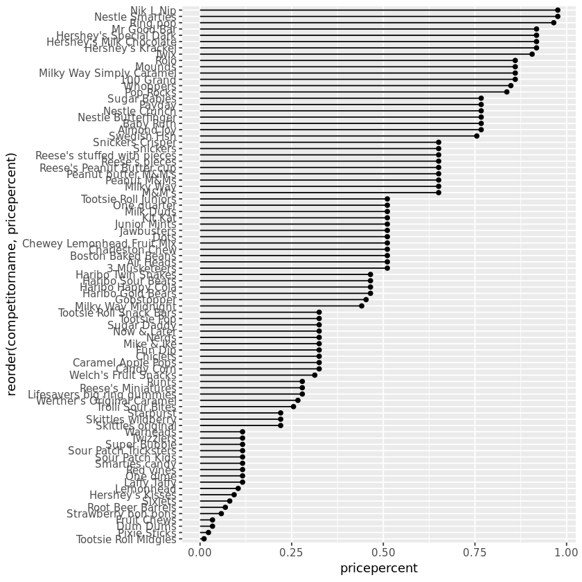

## 1. Importing packages and data
<p></p>
<p>With Halloween just around the corner, it seems like everyone has candy on the brain! There's a great dataset from <a href="https://fivethirtyeight.com/">FiveThirtyEight</a> that includes all sorts of different information about different kinds of candy. For example, is it chocolaty? Is there nougat? How does the cost compare to other candies? How many people prefer this candy over another?</p>
<p>We'll run through a whirlwind tour of this dataset and wrap up by trying some modeling techniques out on it! Specifically, we'll take a look at linear and logistic regression.</p>
<p>First things first, let's get our packages and data loaded up and take a look at exactly what we're dealing with.</p>


```R
# Load all the packages we need
library(tidyverse)
library(broom)
library(corrplot)
library(fivethirtyeight)
# Load the candy_rankings dataset from the fivethirtyeight package
data(candy_rankings)

# Look at the head() of the data
head(candy_rankings)
```


<table>
<thead><tr><th scope=col>competitorname</th><th scope=col>chocolate</th><th scope=col>fruity</th><th scope=col>caramel</th><th scope=col>peanutyalmondy</th><th scope=col>nougat</th><th scope=col>crispedricewafer</th><th scope=col>hard</th><th scope=col>bar</th><th scope=col>pluribus</th><th scope=col>sugarpercent</th><th scope=col>pricepercent</th><th scope=col>winpercent</th></tr></thead>
<tbody>
	<tr><td>100 Grand   </td><td> TRUE       </td><td>FALSE       </td><td> TRUE       </td><td>FALSE       </td><td>FALSE       </td><td> TRUE       </td><td>FALSE       </td><td> TRUE       </td><td>FALSE       </td><td>0.732       </td><td>0.860       </td><td>66.97173    </td></tr>
	<tr><td>3 Musketeers</td><td> TRUE       </td><td>FALSE       </td><td>FALSE       </td><td>FALSE       </td><td> TRUE       </td><td>FALSE       </td><td>FALSE       </td><td> TRUE       </td><td>FALSE       </td><td>0.604       </td><td>0.511       </td><td>67.60294    </td></tr>
	<tr><td>One dime    </td><td>FALSE       </td><td>FALSE       </td><td>FALSE       </td><td>FALSE       </td><td>FALSE       </td><td>FALSE       </td><td>FALSE       </td><td>FALSE       </td><td>FALSE       </td><td>0.011       </td><td>0.116       </td><td>32.26109    </td></tr>
	<tr><td>One quarter </td><td>FALSE       </td><td>FALSE       </td><td>FALSE       </td><td>FALSE       </td><td>FALSE       </td><td>FALSE       </td><td>FALSE       </td><td>FALSE       </td><td>FALSE       </td><td>0.011       </td><td>0.511       </td><td>46.11650    </td></tr>
	<tr><td>Air Heads   </td><td>FALSE       </td><td> TRUE       </td><td>FALSE       </td><td>FALSE       </td><td>FALSE       </td><td>FALSE       </td><td>FALSE       </td><td>FALSE       </td><td>FALSE       </td><td>0.906       </td><td>0.511       </td><td>52.34146    </td></tr>
	<tr><td>Almond Joy  </td><td> TRUE       </td><td>FALSE       </td><td>FALSE       </td><td> TRUE       </td><td>FALSE       </td><td>FALSE       </td><td>FALSE       </td><td> TRUE       </td><td>FALSE       </td><td>0.465       </td><td>0.767       </td><td>50.34755    </td></tr>
</tbody>
</table>


```R
# These packages need to be loaded in the first @tests cell. 
library(testthat) 
library(IRkernel.testthat)

# Then follows one or more tests of the student's code. 
# The @solution should pass the tests.
# The purpose of the tests is to try to catch common errors and to 
# give the student a hint on how to resolve these errors.

run_tests({
    test_that("Packages are loaded.", {
        expect_true("tidyverse" %in% .packages(),
                   info = "Make sure you loaded `tidyverse`.")
        expect_true("broom"  %in% .packages(),
                   info = "Make sure you loaded `broom`.")
        expect_true("corrplot" %in% .packages(),
                   info = "Make sure you loaded `corrplot`.")
        expect_true("fivethirtyeight" %in% .packages(),
                   info = "Make sure you loaded `fivethirtyeight`.")
    })
    test_that("Data is loaded.", {
        expect_equal(.GlobalEnv$candy_rankings, fivethirtyeight::candy_rankings,
                        info = "Did you call `data(candy_rankings)`?")
    })
})

```


    <ProjectReporter>
      Inherits from: <ListReporter>
      Public:
        .context: NULL
        .end_context: function (context) 
        .start_context: function (context) 
        add_result: function (context, test, result) 
        all_tests: environment
        cat_line: function (...) 
        cat_tight: function (...) 
        clone: function (deep = FALSE) 
        current_expectations: environment
        current_file: some name
        current_start_time: 31.993 0.391 3020.23 0.006 0
        dump_test: function (test) 
        end_context: function (context) 
        end_reporter: function () 
        end_test: function (context, test) 
        get_results: function () 
        initialize: function (...) 
        is_full: function () 
        out: 3
        results: environment
        rule: function (...) 
        start_context: function (context) 
        start_file: function (name) 
        start_reporter: function () 
        start_test: function (context, test) 


## 2. Explore the distributions of categorical variables
<p>Let's get started by taking a look at the distributions of each of these binary categorical variables. There are quite a few of them, so we'll have to do some data wrangling to get them in shape for plotting. We'll explore these by making a bar chart showing the breakdown of each column. This lets us get a sense of the proportion of <code>TRUE</code>s and <code>FALSE</code>s in each column. To do this you'll use the <code>gather()</code> function to get a dataset that looks something like this:</p>
<pre><code>  competitorname sugarpercent pricepercent winpercent feature   value
  &lt;chr&gt;                 &lt;dbl&gt;        &lt;dbl&gt;      &lt;dbl&gt; &lt;chr&gt;     &lt;lgl&gt;
1 100 Grand             0.732        0.860       67.0 chocolate TRUE 
2 3 Musketeers          0.604        0.511       67.6 chocolate TRUE 
3 One dime              0.011        0.116       32.3 chocolate FALSE
</code></pre>


```R
# gather() the categorical variables to make them easier to plot
candy_rankings_long <- candy_rankings %>% gather( key = feature, value = value, c(chocolate:pluribus))

# Make a bar plot showing the distribution of each variable
candy_rankings_long %>% ggplot(aes(value)) + geom_bar() + facet_wrap(~feature) 
```


```R
# One or more tests of the student's code. 
# The @solution should pass the tests.
# The purpose of the tests is to try to catch common errors and to 
# give the student a hint on how to resolve these errors.
p <- last_plot()

run_tests({
    test_that("`candy_rankings_long` is correct", {
        expect_equal(candy_rankings_long, gather(candy_rankings, "feature", "value", chocolate:pluribus),
                        info = "Make sure you created `candy_features_long` by `gathering` the correct columns.")
    })
    test_that("The plot was created correctly", {
        expect_equal(p$data, candy_rankings_long,
                        info = "Make sure you passed `candy_rankings` as the `data` argument to `ggplot()`.")
        expect_equal(p$mapping, aes(value),
                    info = "Did you map the `value` column to the `x` aesthetic?")
        expect_equal(p$layers, list(geom_bar()),
                    info = "Did you call `geom_bar()` to create a bar chart?")
        expect_equal(p$facet, facet_wrap(~feature),
                    info = "Did you create facet for each `feature`?")
    })
})
```


    <ProjectReporter>
      Inherits from: <ListReporter>
      Public:
        .context: NULL
        .end_context: function (context) 
        .start_context: function (context) 
        add_result: function (context, test, result) 
        all_tests: environment
        cat_line: function (...) 
        cat_tight: function (...) 
        clone: function (deep = FALSE) 
        current_expectations: environment
        current_file: some name
        current_start_time: 32.848 0.395 3021.088 0.006 0
        dump_test: function (test) 
        end_context: function (context) 
        end_reporter: function () 
        end_test: function (context, test) 
        get_results: function () 
        initialize: function (...) 
        is_full: function () 
        out: 3
        results: environment
        rule: function (...) 
        start_context: function (context) 
        start_file: function (name) 
        start_reporter: function () 
        start_test: function (context, test) 


## 3. Taking a look at pricepercent
<p>Next, we'll look at the <code>pricepercent</code> variable. This variable records the percentile rank of the candy's price against all the other candies in the dataset. Let's see which is the most expensive and which is the least expensive by making a lollipop chart. One of the most interesting aspects of this chart is that a lot of the candies share the same ranking, so it looks like quite a few of them are the same price.</p>


```R
# Make a lollipop chart of pricepercent
candy_rankings %>% ggplot(aes(x = reorder(competitorname, pricepercent), y = pricepercent)) + geom_segment(aes(xend =reorder(competitorname, pricepercent), yend = 0) ) +
                        geom_point() +
                        coord_flip()
```





```R
# One or more tests of the student's code. 
# The @solution should pass the tests.
# The purpose of the tests is to try to catch common errors and to 
# give the student a hint on how to resolve these errors.
p <- last_plot()

run_tests({
    test_that("The plot is correct", {
        expect_equal(p$data, candy_rankings,
                    info = "Make sure you passed `candy_rankings` as the `data` argument to `ggplot()`.")
        expect_equal(p$mapping, aes(reorder(competitorname, pricepercent), pricepercent),
                    info = "Did you pass the right aesthetics to `aes()`? Make sure to reorder `competitorname`.")
        expect_equal(p$layers, list(geom_segment(aes(xend = reorder(competitorname, pricepercent), yend = 0)), geom_point()),
                    info = "Something is wrong with your `geom`s. Double check the aesthetics in `geom_segment()`.")
        expect_equal(p$coordinates, coord_flip(),
                    info = "Did you flip the plot with `coord_flip()`?")
    })
    # You can have more than one test
})
```


    <ProjectReporter>
      Inherits from: <ListReporter>
      Public:
        .context: NULL
        .end_context: function (context) 
        .start_context: function (context) 
        add_result: function (context, test, result) 
        all_tests: environment
        cat_line: function (...) 
        cat_tight: function (...) 
        clone: function (deep = FALSE) 
        current_expectations: environment
        current_file: some name
        current_start_time: 33.212 0.395 3021.452 0.006 0
        dump_test: function (test) 
        end_context: function (context) 
        end_reporter: function () 
        end_test: function (context, test) 
        get_results: function () 
        initialize: function (...) 
        is_full: function () 
        out: 3
        results: environment
        rule: function (...) 
        start_context: function (context) 
        start_file: function (name) 
        start_reporter: function () 
        start_test: function (context, test) 


## 4. Exploring winpercent (part i)
<p>Moving on, we'll take a look at another numerical variable in the dataset: <code>winpercent</code>. This variable records the percentage of people who prefer this candy over another randomly chosen candy from the dataset. We'll start with a histogram! The distribution of rankings looks pretty symmetrical, and seems to center on about 45%. </p>


```R
# Plot a histogram of winpercent
candy_rankings %>% ggplot(aes(winpercent)) + geom_histogram()

```

    `stat_bin()` using `bins = 30`. Pick better value with `binwidth`.


```R
p <- last_plot()

run_tests({
    test_that("The histogram is plotted correctly.",{
        expect_equal(p$data, candy_rankings,
                    info = "Make sure you used `candy_rankings` as the `data` argument in your `ggplot()`.")
        expect_equal(p$mapping, aes(winpercent),
                    info = "Make sure you assigned `winpercent` to the `x` aesthetic.")
        expect_equal(p$layers, list(geom_histogram()),
                    info = "Make sure you used `geom_histogram()` to make your plot.")
    })
})
```


    <ProjectReporter>
      Inherits from: <ListReporter>
      Public:
        .context: NULL
        .end_context: function (context) 
        .start_context: function (context) 
        add_result: function (context, test, result) 
        all_tests: environment
        cat_line: function (...) 
        cat_tight: function (...) 
        clone: function (deep = FALSE) 
        current_expectations: environment
        current_file: some name
        current_start_time: 33.514 0.403 3021.774 0.006 0
        dump_test: function (test) 
        end_context: function (context) 
        end_reporter: function () 
        end_test: function (context, test) 
        get_results: function () 
        initialize: function (...) 
        is_full: function () 
        out: 3
        results: environment
        rule: function (...) 
        start_context: function (context) 
        start_file: function (name) 
        start_reporter: function () 
        start_test: function (context, test) 


## 5. Exploring winpercent (part ii)
<p>Now that we've looked at the histogram, let's make another lollipop chart to visualize the rankings. It looks like Reese's Peanut Butter Cups are the all time favorite out of this set of candies!</p>


```R
# Make a lollipop chart of winpercent
candy_rankings %>% ggplot(aes(x = reorder(competitorname, winpercent), y = winpercent)) + geom_segment(aes(xend =reorder(competitorname, winpercent), yend = 0) ) +
                        geom_point() +
                        coord_flip()
```


```R
p <- last_plot()

run_tests({
    test_that("The plot is correct", {
        expect_equal(p$data, candy_rankings,
                    info = "Make sure you passed `candy_rankings` as the `data` argument to `ggplot()`.")
        expect_equal(p$mapping, aes(reorder(competitorname, winpercent), winpercent),
                    info = "Did you pass the right aesthetics to `aes()`? Make sure to reorder `competitorname`.")
        expect_equal(p$layers, list(geom_segment(aes(xend = reorder(competitorname, winpercent), yend = 0)), geom_point()),
                    info = "Something is wrong with your `geom`s. Double check the aesthetics in `geom_segment()`.")
        expect_equal(p$coordinates, coord_flip(),
                    info = "Did you flip the plot with `coord_flip()`?")
    })
    # You can have more than one test
})
```


    <ProjectReporter>
      Inherits from: <ListReporter>
      Public:
        .context: NULL
        .end_context: function (context) 
        .start_context: function (context) 
        add_result: function (context, test, result) 
        all_tests: environment
        cat_line: function (...) 
        cat_tight: function (...) 
        clone: function (deep = FALSE) 
        current_expectations: environment
        current_file: some name
        current_start_time: 33.958 0.407 3022.229 0.006 0
        dump_test: function (test) 
        end_context: function (context) 
        end_reporter: function () 
        end_test: function (context, test) 
        get_results: function () 
        initialize: function (...) 
        is_full: function () 
        out: 3
        results: environment
        rule: function (...) 
        start_context: function (context) 
        start_file: function (name) 
        start_reporter: function () 
        start_test: function (context, test) 


## 6. Exploring the correlation structure
<p>Now that we've explored the dataset one variable at a time, we'll see how the variables interact with one another. This is important as we get ready to model the data because it gives us some intuition about which variables might be useful explanatory variables. We'll use the <code>corrplot</code> package to plot the correlation matrix. Taking a look at this plot, it looks like chocolaty candies are almost never fruity. I can certainly see why that's the case! This also allows us to check for possible <a href="https://en.wikipedia.org/wiki/Multicollinearity">multicollinearity</a>, which can be a problem for regression modeling. It looks like we're good though!</p>


```R
# Plot the correlation matrix using corrplot()
candy_rankings %>% 
  select(-competitorname) %>% 
  cor() %>% 
  corrplot()
```


```R
# One or more tests of the student's code.  
# The @solution should pass the tests.
# The purpose of the tests is to try to catch common errors and to 
# give the student a hint on how to resolve these errors.

student_cor <- .Last.value
good_cor <- candy_rankings %>%
  select(-competitorname) %>% 
  cor()
run_tests({
    test_that("The correlation matrix is created correctly", {
        expect_equal(student_cor, good_cor,
                    info = "Make sure you calculated the correlation matrix correctly.")
    })
    # You can have more than one test
})
```


    <ProjectReporter>
      Inherits from: <ListReporter>
      Public:
        .context: NULL
        .end_context: function (context) 
        .start_context: function (context) 
        add_result: function (context, test, result) 
        all_tests: environment
        cat_line: function (...) 
        cat_tight: function (...) 
        clone: function (deep = FALSE) 
        current_expectations: environment
        current_file: some name
        current_start_time: 34.15 0.411 3022.425 0.006 0
        dump_test: function (test) 
        end_context: function (context) 
        end_reporter: function () 
        end_test: function (context, test) 
        get_results: function () 
        initialize: function (...) 
        is_full: function () 
        out: 3
        results: environment
        rule: function (...) 
        start_context: function (context) 
        start_file: function (name) 
        start_reporter: function () 
        start_test: function (context, test) 


## 7. Fitting a linear model of winpercent
<p></p>
<p>Let's dive into the deep end of modeling by creating a linear model of <code>winpercent</code> using all the other variables (except <code>competitorname</code>). Because this is a categorical variable with a unique value in every row of the dataset, it's actually mathematically impossible to fit a linear model with it. Moreover, this variable doesn't actually include any information that our model could use because these names don't actually relate to any of the attributes of the candy.</p>
<p>Let's fit this model, then we can dive into exploring it shortly. Maybe this will give us an idea of why people tend to prefer one candy over another!</p>


```R
# Fit a linear model of winpercent explained by all variables 
# except competitorname
win_mod <- lm(winpercent ~ . -competitorname, data = candy_rankings)
```


```R
# One or more tests of the student's code. 
# The @solution should pass the tests.
# The purpose of the tests is to try to catch common errors and to 
# give the student a hint on how to resolve these errors.
good_mod <- lm(winpercent ~ . -competitorname, data = candy_rankings)

run_tests({
    test_that("The model is correct.", {
        expect_equal(good_mod$fitted.values, win_mod$fitted.values,
                        info = "Make sure you created the model correctly.")
    })
    # You can have more than one test
})
```


    <ProjectReporter>
      Inherits from: <ListReporter>
      Public:
        .context: NULL
        .end_context: function (context) 
        .start_context: function (context) 
        add_result: function (context, test, result) 
        all_tests: environment
        cat_line: function (...) 
        cat_tight: function (...) 
        clone: function (deep = FALSE) 
        current_expectations: environment
        current_file: some name
        current_start_time: 34.209 0.411 3022.484 0.006 0
        dump_test: function (test) 
        end_context: function (context) 
        end_reporter: function () 
        end_test: function (context, test) 
        get_results: function () 
        initialize: function (...) 
        is_full: function () 
        out: 3
        results: environment
        rule: function (...) 
        start_context: function (context) 
        start_file: function (name) 
        start_reporter: function () 
        start_test: function (context, test) 


## 8. Evaluating the linear model
<p>Let's see how we did! We'll take a look at the results of our linear model and run some basic diagnostics to make sure the output is reliable.</p>
<p>Taking a look at the coefficients, we can make some conclusions about the factors that cause people to choose one candy over another. For example, it looks like people who took this survey really like peanut butter! There are a few other significant coefficients. Which ones are these?</p>


```R
# Take a look at the summary
summary(win_mod)

# Plot the residuals vs the fitted values
augment(win_mod) %>% ggplot(aes(x = .fitted, y = .resid)) + geom_point() +geom_hline(yintercept = 0)
```


    
    Call:
    lm(formula = winpercent ~ . - competitorname, data = candy_rankings)
    
    Residuals:
         Min       1Q   Median       3Q      Max 
    -20.2244  -6.6247   0.1986   6.8420  23.8680 
    
    Coefficients:
                         Estimate Std. Error t value Pr(>|t|)    
    (Intercept)           34.5340     4.3199   7.994 1.44e-11 ***
    chocolateTRUE         19.7481     3.8987   5.065 2.96e-06 ***
    fruityTRUE             9.4223     3.7630   2.504  0.01452 *  
    caramelTRUE            2.2245     3.6574   0.608  0.54493    
    peanutyalmondyTRUE    10.0707     3.6158   2.785  0.00681 ** 
    nougatTRUE             0.8043     5.7164   0.141  0.88849    
    crispedricewaferTRUE   8.9190     5.2679   1.693  0.09470 .  
    hardTRUE              -6.1653     3.4551  -1.784  0.07852 .  
    barTRUE                0.4415     5.0611   0.087  0.93072    
    pluribusTRUE          -0.8545     3.0401  -0.281  0.77945    
    sugarpercent           9.0868     4.6595   1.950  0.05500 .  
    pricepercent          -5.9284     5.5132  -1.075  0.28578    
    ---
    Signif. codes:  0 '***' 0.001 '**' 0.01 '*' 0.05 '.' 0.1 ' ' 1
    
    Residual standard error: 10.7 on 73 degrees of freedom
    Multiple R-squared:  0.5402,	Adjusted R-squared:  0.4709 
    F-statistic: 7.797 on 11 and 73 DF,  p-value: 9.504e-09


```R
# One or more tests of the student's code.
# The @solution should pass the tests.
# The purpose of the tests is to try to catch common errors and to 
# give the student a hint on how to resolve these errors.
p <- last_plot()

run_tests({
    test_that("The plot is correct.", {
        expect_equal(p$data, augment(win_mod),
                    info = "Make sure you called `ggplot()` on the `augment()`-ed `win_mod`.")
        expect_equal(p$mapping, aes(.fitted, .resid),
                    info = "Make sure you mapped `.fitted` to the `x` aesthetic and `.resid` to the `y` aesthetic.")
        expect_equal(p$layers, list(geom_point(), geom_hline(yintercept = 0)),
                    info = "Make sure you used `geom_point()` and `geom_hline()` to make your plot.")
    })
    # You can have more than one test
})
```


    <ProjectReporter>
      Inherits from: <ListReporter>
      Public:
        .context: NULL
        .end_context: function (context) 
        .start_context: function (context) 
        add_result: function (context, test, result) 
        all_tests: environment
        cat_line: function (...) 
        cat_tight: function (...) 
        clone: function (deep = FALSE) 
        current_expectations: environment
        current_file: some name
        current_start_time: 34.485 0.411 3022.759 0.006 0
        dump_test: function (test) 
        end_context: function (context) 
        end_reporter: function () 
        end_test: function (context, test) 
        get_results: function () 
        initialize: function (...) 
        is_full: function () 
        out: 3
        results: environment
        rule: function (...) 
        start_context: function (context) 
        start_file: function (name) 
        start_reporter: function () 
        start_test: function (context, test) 


## 9. Fit a logistic regression model of chocolate
<p></p>
<p>Now let's try out logistic regression! We'll be trying to predict if a candy is chocolaty or not based on all the other features in the dataset. A logistic regression is a great choice for this particular modeling task because the variable we're trying to predict is either <code>TRUE</code> or <code>FALSE</code>. The logistic regression model will output a probability that we can use to make our decision. This model outputs a warning because a few of the features (like <code>crispedricewafer</code>) are only ever true when a candy is chocolate. This means that we can't draw conclusions from the coefficients, but we can still use the model to make predictions just fine!</p>


```R
# Fit a glm() of chocolate
choc_mod <- glm(chocolate ~ . -competitorname, data = candy_rankings, family ="binomial")
```

    Warning message:
    "glm.fit: fitted probabilities numerically 0 or 1 occurred"


```R
# One or more tests of the student's code. 
# The @solution should pass the tests.
# The purpose of the tests is to try to catch common errors and to 
# give the student a hint on how to resolve these errors.
good_mod <- glm(chocolate ~ . - competitorname, family = "binomial", data = candy_rankings)

run_tests({
    test_that("the model is correct.", {
        expect_equal(good_mod$fitted.values, choc_mod$fitted.values,
                        info = "Make sure you fit your logistic regression correctly.")
    })
    # You can have more than one test
})
```

    Warning message:
    "glm.fit: fitted probabilities numerically 0 or 1 occurred"


    <ProjectReporter>
      Inherits from: <ListReporter>
      Public:
        .context: NULL
        .end_context: function (context) 
        .start_context: function (context) 
        add_result: function (context, test, result) 
        all_tests: environment
        cat_line: function (...) 
        cat_tight: function (...) 
        clone: function (deep = FALSE) 
        current_expectations: environment
        current_file: some name
        current_start_time: 34.551 0.411 3022.824 0.006 0
        dump_test: function (test) 
        end_context: function (context) 
        end_reporter: function () 
        end_test: function (context, test) 
        get_results: function () 
        initialize: function (...) 
        is_full: function () 
        out: 3
        results: environment
        rule: function (...) 
        start_context: function (context) 
        start_file: function (name) 
        start_reporter: function () 
        start_test: function (context, test) 


## 10. Evaluate the logistic regression model
<p>Let's take our logistic regression model out for a spin! We'll start by creating a data frame of predictions we can compare to the actual values. Then we'll evaluate the model by making a confusion matrix and calculating the accuracy.</p>
<p>Looking at the summary, it looks like most of the coefficients aren't statistically significant. In this case, that's okay because we're not trying to draw any conclusions about the relationships between the predictor variables and the response. We're only trying to make accurate predictions and, taking a look at our confusion matrix, it seems like we did a pretty good job!</p>


```R
# Print the summary
summary(choc_mod)
# Make a dataframe of predictions
preds <- augment(choc_mod, type.predict = "response") %>% mutate(prediction = .fitted > .5)

# Create the confusion matrix
conf_mat <- preds %>% select(chocolate, prediction) %>% table()

# Calculate the accuracy
accuracy <- sum(diag(conf_mat))/sum(conf_mat)

print(paste("Accuracy =", accuracy))

```


    
    Call:
    glm(formula = chocolate ~ . - competitorname, family = "binomial", 
        data = candy_rankings)
    
    Deviance Residuals: 
         Min        1Q    Median        3Q       Max  
    -1.72224  -0.17612  -0.02787   0.01954   2.57898  
    
    Coefficients:
                           Estimate Std. Error z value Pr(>|z|)   
    (Intercept)           -10.29370    4.12040  -2.498  0.01248 * 
    fruityTRUE             -6.75305    2.20462  -3.063  0.00219 **
    caramelTRUE            -1.85093    1.66750  -1.110  0.26700   
    peanutyalmondyTRUE     -4.11907    2.98175  -1.381  0.16715   
    nougatTRUE            -16.74818 3520.13323  -0.005  0.99620   
    crispedricewaferTRUE   14.98331 4725.35051   0.003  0.99747   
    hardTRUE                1.83504    1.80742   1.015  0.30997   
    barTRUE                19.06799 3520.13379   0.005  0.99568   
    pluribusTRUE            0.22804    1.45457   0.157  0.87542   
    sugarpercent            0.12168    2.07707   0.059  0.95329   
    pricepercent            1.76626    2.24816   0.786  0.43208   
    winpercent              0.23019    0.08593   2.679  0.00739 **
    ---
    Signif. codes:  0 '***' 0.001 '**' 0.01 '*' 0.05 '.' 0.1 ' ' 1
    
    (Dispersion parameter for binomial family taken to be 1)
    
        Null deviance: 116.407  on 84  degrees of freedom
    Residual deviance:  25.802  on 73  degrees of freedom
    AIC: 49.802
    
    Number of Fisher Scoring iterations: 19


    [1] "Accuracy = 0.964705882352941"


```R
run_tests({
    test_that("The predictions are correct.", {
        expect_equal(augment(choc_mod, type.predict = "response") %>% mutate(prediction = .fitted > .5), preds,
                        info = "Make sure you created your predictions correctly.")
    })
    test_that("The confusion matrix is correct.", {
        expect_equivalent(preds %>% select(chocolate, prediction) %>% table(), conf_mat,
                        info = "Make sure you created the cofusion matrix correctly.")
    })
    test_that("The accuracy is correct.", {
        expect_equal(sum(diag(conf_mat))/sum(conf_mat), accuracy,
                        info = "Make sure you calculated the accuracy correctly.")
    })
})
```


    <ProjectReporter>
      Inherits from: <ListReporter>
      Public:
        .context: NULL
        .end_context: function (context) 
        .start_context: function (context) 
        add_result: function (context, test, result) 
        all_tests: environment
        cat_line: function (...) 
        cat_tight: function (...) 
        clone: function (deep = FALSE) 
        current_expectations: environment
        current_file: some name
        current_start_time: 34.622 0.411 3022.895 0.006 0
        dump_test: function (test) 
        end_context: function (context) 
        end_reporter: function () 
        end_test: function (context, test) 
        get_results: function () 
        initialize: function (...) 
        is_full: function () 
        out: 3
        results: environment
        rule: function (...) 
        start_context: function (context) 
        start_file: function (name) 
        start_reporter: function () 
        start_test: function (context, test) 

