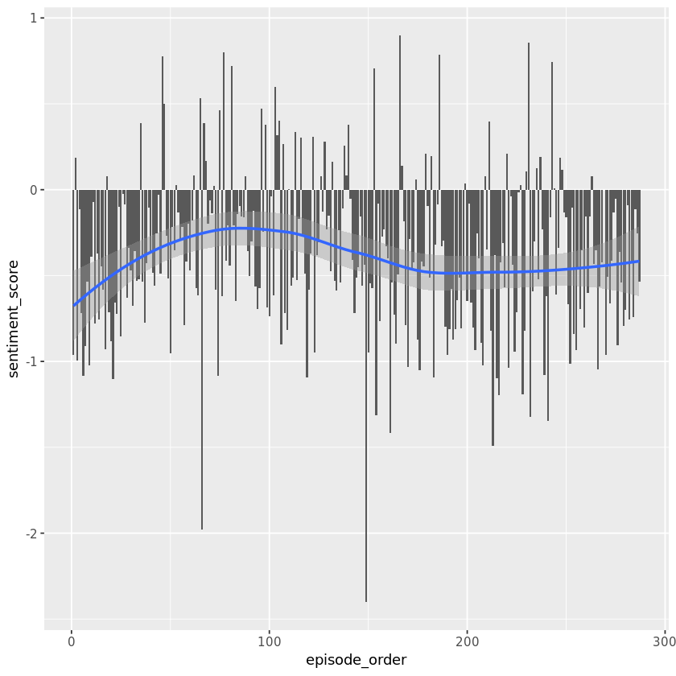

## 1. Import and explore data
<p>By <a href="https://patrio.blog/">Patrik Drhlík</a></p>
<p><em>Warning: the dataset in this project contains explicit language.</em></p>
<p></p>
<p><a href="https://en.m.wikipedia.org/wiki/South_Park">South Park</a> is a satiric American TV show. It is an adult show mainly because of its coarse language. I know every episode pretty well, but I wanted to see if I can dig up something more using text analysis.</p>
<p>That's what we will focus on. We will see how the sentiments and the popularity of episodes evolve over time. We will examine the <strong>swear words</strong> and their ratio across episodes. We will also answer some questions about the show. Do you think that naughtier episodes tend to be more popular? Is Eric Cartman, the main face of the show, really the naughtiest character? We will have answers to these and more questions soon enough.</p>
<p>We will be using two datasets. One that contains every line spoken in all the 287 episodes (first 21 seasons) of the show and another that contains mean episode ratings from <a href="https://www.imdb.com/title/tt0121955">IMDB</a>. We will be joining, summarizing and visualizing until we've answered all our questions.</p>
<p>Our best friends will be the <strong>tidyverse</strong>, <strong>tidytext</strong>, and <strong>ggplot2</strong> packages. Let's not waste any more time and get to it. We'll start slowly by loading all necessary libraries and both of the datasets.</p>


```R
# Load libraries
library(tidyverse)
library(tidytext)
library(SnowballC)
library(sweary)
library(broom)

# Load datasets
sp_lines <- read_csv("datasets/sp_lines.csv")
sp_ratings <- read_csv("datasets/sp_ratings.csv")

# Take a look at the last few observations
tail(sp_lines)
tail(sp_ratings)
```

    Parsed with column specification:
    cols(
      character = col_character(),
      text = col_character(),
      episode_name = col_character(),
      season_number = col_integer(),
      episode_number = col_integer()
    )
    Parsed with column specification:
    cols(
      season_number = col_integer(),
      episode_number = col_integer(),
      rating = col_double(),
      votes = col_integer(),
      episode_order = col_integer()
    )


<table>
<thead><tr><th scope=col>character</th><th scope=col>text</th><th scope=col>episode_name</th><th scope=col>season_number</th><th scope=col>episode_number</th></tr></thead>
<tbody>
	<tr><td>officer bright                                          </td><td>he broke free                                           </td><td>Splatty Tomato                                          </td><td>21                                                      </td><td>10                                                      </td></tr>
	<tr><td>jimbo                                                   </td><td>the president is on the loose again                     </td><td>Splatty Tomato                                          </td><td>21                                                      </td><td>10                                                      </td></tr>
	<tr><td>officer bright                                          </td><td>he'll be even more desperate now it's going to get worse</td><td>Splatty Tomato                                          </td><td>21                                                      </td><td>10                                                      </td></tr>
	<tr><td>stan                                                    </td><td>we can't destroy him can we                             </td><td>Splatty Tomato                                          </td><td>21                                                      </td><td>10                                                      </td></tr>
	<tr><td>randy                                                   </td><td>i don't know i guess it's up to the whites              </td><td>Splatty Tomato                                          </td><td>21                                                      </td><td>10                                                      </td></tr>
	<tr><td>end of splatty tomato                                   </td><td>end of splatty tomato                                   </td><td>Splatty Tomato                                          </td><td>21                                                      </td><td>10                                                      </td></tr>
</tbody>
</table>


<table>
<thead><tr><th scope=col>season_number</th><th scope=col>episode_number</th><th scope=col>rating</th><th scope=col>votes</th><th scope=col>episode_order</th></tr></thead>
<tbody>
	<tr><td>21  </td><td> 5  </td><td>7.4 </td><td>1091</td><td>282 </td></tr>
	<tr><td>21  </td><td> 6  </td><td>7.3 </td><td> 964</td><td>283 </td></tr>
	<tr><td>21  </td><td> 7  </td><td>7.4 </td><td>1008</td><td>284 </td></tr>
	<tr><td>21  </td><td> 8  </td><td>7.2 </td><td> 833</td><td>285 </td></tr>
	<tr><td>21  </td><td> 9  </td><td>7.9 </td><td> 896</td><td>286 </td></tr>
	<tr><td>21  </td><td>10  </td><td>7.1 </td><td> 906</td><td>287 </td></tr>
</tbody>
</table>


```R
# These packages need to be loaded in the first @tests cell. 
library(testthat) 
library(IRkernel.testthat)

run_tests({
    test_that("sp_lines was loaded correctly", {
        expect_equal(nrow(sp_lines), 78700, info = "`sp_lines doesn't have a correct number of rows.`")
        expect_equal(ncol(sp_lines), 5, info = "`sp_lines doesn't have a correct number of columns.")
        expect_is(sp_lines, "tbl_df")
    })
    
    test_that("sp_ratings was loaded correctly", {
        expect_equal(nrow(sp_ratings), 287, info = "`sp_ratings doesn't have a correct number of rows.")
        expect_equal(ncol(sp_ratings), 5, info = "`sp_ratings doesn't have a correct number of columns")
        expect_is(sp_ratings, "tbl_df")
    })
})
```


    <ProjectReporter>
      Inherits from: <ListReporter>
      Public:
        .context: NULL
        .end_context: function (context) 
        .start_context: function (context) 
        add_result: function (context, test, result) 
        all_tests: environment
        cat_line: function (...) 
        cat_tight: function (...) 
        clone: function (deep = FALSE) 
        current_expectations: environment
        current_file: some name
        current_start_time: 35.28 0.541 2205.949 0.004 0
        dump_test: function (test) 
        end_context: function (context) 
        end_reporter: function () 
        end_test: function (context, test) 
        get_results: function () 
        initialize: function (...) 
        is_full: function () 
        out: 3
        results: environment
        rule: function (...) 
        start_context: function (context) 
        start_file: function (name) 
        start_reporter: function () 
        start_test: function (context, test) 


## 2. Sentiments, swear words, and stemming
<p>Now that we have the raw data prepared, we will do some modifications. We'll utilize the combined powers of tidyverse and tidytext and make one great dataset that we will work with from now on.</p>
<p>We will join the dataset together. But most importantly, we will unnest the lines so <strong>every row of our data frame becomes a word</strong>. It will make our analysis and future visualizations very easy. We will also get rid of stop words (a, the, and, ...) and assign a sentiment score based on the <a href="http://www2.imm.dtu.dk/pubdb/views/publication_details.php?id=6010">AFINN lexicon</a>.</p>
<p>Our new dataset will have some great new columns that will tell us a lot more about the show!</p>


```R
# Join lines with episode ratings
sp <- inner_join(sp_lines, sp_ratings, by = c("season_number" = "season_number", "episode_number" = "episode_number"))
# Load english swear words
en_swear_words <- sweary::get_swearwords("en") %>%
    mutate(stem = wordStem(word))

# and add a swear_word logical column.
sp_words <- sp %>%
    # Unnest lines to words
    unnest_tokens(word, text) %>%
    # leave out stop words
    anti_join(stop_words) %>%
    # Add sentiment score
    left_join(get_sentiments("afinn")) %>%
    # Add word stem column
    mutate(word_stem = wordStem(word),
    # Add swear word logical column
          swear_word = word %in% en_swear_words$word  | word_stem %in% en_swear_words$stem)

tail(sp_words)


```

    Joining, by = "word"
    Joining, by = "word"


<table>
<thead><tr><th scope=col>character</th><th scope=col>episode_name</th><th scope=col>season_number</th><th scope=col>episode_number</th><th scope=col>rating</th><th scope=col>votes</th><th scope=col>episode_order</th><th scope=col>word</th><th scope=col>score</th><th scope=col>word_stem</th><th scope=col>swear_word</th></tr></thead>
<tbody>
	<tr><td>officer bright       </td><td>Splatty Tomato       </td><td>21                   </td><td>10                   </td><td>7.1                  </td><td>906                  </td><td>287                  </td><td>worse                </td><td>-3                   </td><td>wors                 </td><td>FALSE                </td></tr>
	<tr><td>stan                 </td><td>Splatty Tomato       </td><td>21                   </td><td>10                   </td><td>7.1                  </td><td>906                  </td><td>287                  </td><td>destroy              </td><td>-3                   </td><td>destroi              </td><td>FALSE                </td></tr>
	<tr><td>randy                </td><td>Splatty Tomato       </td><td>21                   </td><td>10                   </td><td>7.1                  </td><td>906                  </td><td>287                  </td><td>guess                </td><td>NA                   </td><td>guess                </td><td>FALSE                </td></tr>
	<tr><td>randy                </td><td>Splatty Tomato       </td><td>21                   </td><td>10                   </td><td>7.1                  </td><td>906                  </td><td>287                  </td><td>whites               </td><td>NA                   </td><td>white                </td><td>FALSE                </td></tr>
	<tr><td>end of splatty tomato</td><td>Splatty Tomato       </td><td>21                   </td><td>10                   </td><td>7.1                  </td><td>906                  </td><td>287                  </td><td>splatty              </td><td>NA                   </td><td>splatti              </td><td>FALSE                </td></tr>
	<tr><td>end of splatty tomato</td><td>Splatty Tomato       </td><td>21                   </td><td>10                   </td><td>7.1                  </td><td>906                  </td><td>287                  </td><td>tomato               </td><td>NA                   </td><td>tomato               </td><td>FALSE                </td></tr>
</tbody>
</table>


```R
run_tests({
    test_that("sp_words was constructed correctly", {
        expect_equal(nrow(sp_words), 310821, info = "`sp_words` doesn't have a correct number of rows.")
        expect_equal(ncol(sp_words), 11, info = "`sp_words` doesn't have a correct number of columns.")
        expect_is(sp_words, "tbl_df")
    })
})
```


    <ProjectReporter>
      Inherits from: <ListReporter>
      Public:
        .context: NULL
        .end_context: function (context) 
        .start_context: function (context) 
        add_result: function (context, test, result) 
        all_tests: environment
        cat_line: function (...) 
        cat_tight: function (...) 
        clone: function (deep = FALSE) 
        current_expectations: environment
        current_file: some name
        current_start_time: 36.263 0.557 2206.947 0.004 0
        dump_test: function (test) 
        end_context: function (context) 
        end_reporter: function () 
        end_test: function (context, test) 
        get_results: function () 
        initialize: function (...) 
        is_full: function () 
        out: 3
        results: environment
        rule: function (...) 
        start_context: function (context) 
        start_file: function (name) 
        start_reporter: function () 
        start_test: function (context, test) 


## 3. Summarize data by episode
<p>Now that the dataset is prepared, we can finally start analyzing it. Let's see what we can say about each of the episodes. I can't wait to see the different swear word ratios. What's the naughtiest one?</p>


```R
# Summarize data by episode
by_episode <- sp_words %>%
    # Group by episode name, rating, and episode order
    group_by(episode_name, rating, episode_order) %>%
    # Create a swear word ratio and episode sentiment score
    summarize(
        swear_word_ratio = sum(swear_word) / n() ,
        sentiment_score = mean(score, na.rm = TRUE)) %>%
    arrange(episode_order)

# Take a look at by_episode structure
tail(by_episode)

# What is the naughtiest episode?
( naughtiest <- by_episode[which.max(by_episode$swear_word_ratio), ] )
```


<table>
<thead><tr><th scope=col>episode_name</th><th scope=col>rating</th><th scope=col>episode_order</th><th scope=col>swear_word_ratio</th><th scope=col>sentiment_score</th></tr></thead>
<tbody>
	<tr><td>Hummels &amp; Heroin </td><td>7.4                  </td><td>282                  </td><td>0.021396396          </td><td>-0.7567568           </td></tr>
	<tr><td>Sons A Witches   </td><td>7.3              </td><td>283              </td><td>0.009221311      </td><td>-0.4285714       </td></tr>
	<tr><td>Doubling Down    </td><td>7.4              </td><td>284              </td><td>0.025583982      </td><td>-0.7413793       </td></tr>
	<tr><td>Moss Piglets     </td><td>7.2              </td><td>285              </td><td>0.029464286      </td><td>-0.1145833       </td></tr>
	<tr><td>SUPER HARD PCness</td><td>7.9              </td><td>286              </td><td>0.013993541      </td><td>-0.2562500       </td></tr>
	<tr><td>Splatty Tomato   </td><td>7.1              </td><td>287              </td><td>0.019659240      </td><td>-0.5375000       </td></tr>
</tbody>
</table>


<table>
<thead><tr><th scope=col>episode_name</th><th scope=col>rating</th><th scope=col>episode_order</th><th scope=col>swear_word_ratio</th><th scope=col>sentiment_score</th></tr></thead>
<tbody>
	<tr><td>It Hits the Fan</td><td>8.5            </td><td>66             </td><td>0.1341557      </td><td>-1.978667      </td></tr>
</tbody>
</table>


```R
run_tests({
    test_that("by_episode was constructed correctly", {
        expect_equal(nrow(by_episode), 287, info = "`by_episode` doesn't have a correct number of rows.")
        expect_equal(ncol(by_episode), 5, info = "`by_episode` doesn't have a correect number of columns.")
        expect_is(by_episode, "tbl_df")
    })
    
    test_that("naughtiest episode is It Hits the Fan", {
        expect_equal(naughtiest$episode_name, "It Hits the Fan", info = "Did you use `which.max` on `by_episode$swear_word_ratio`?")
    })
})
```


    <ProjectReporter>
      Inherits from: <ListReporter>
      Public:
        .context: NULL
        .end_context: function (context) 
        .start_context: function (context) 
        add_result: function (context, test, result) 
        all_tests: environment
        cat_line: function (...) 
        cat_tight: function (...) 
        clone: function (deep = FALSE) 
        current_expectations: environment
        current_file: some name
        current_start_time: 36.343 0.557 2207.027 0.004 0
        dump_test: function (test) 
        end_context: function (context) 
        end_reporter: function () 
        end_test: function (context, test) 
        get_results: function () 
        initialize: function (...) 
        is_full: function () 
        out: 3
        results: environment
        rule: function (...) 
        start_context: function (context) 
        start_file: function (name) 
        start_reporter: function () 
        start_test: function (context, test) 


## 4. South Park overall sentiment
<p><strong>It Hits the Fan</strong> – more than <strong>13%</strong> of swear words? Now that's a naughty episode! They say a swear word roughly <strong>every 8 seconds</strong> throughout the whole episode!</p>
<p>It also has a mean sentiment score of <strong>-2</strong>. That is pretty low on a scale from -5 (very negative) to +5 (very positive). <a href="https://en.wikipedia.org/wiki/Sentiment_analysis">Sentiment analysis</a> helps us decide what is the attitude of the document we aim to analyze. We are using a numeric scale, but there are other options. Some dictionaries can even classify words to say if it expresses <em>happiness</em>, <em>surprise</em>, <em>anger</em>, etc.</p>
<p>We can roughly get the idea of the episode atmosphere thanks to the sentiment score. Let's compare all the episodes together and plot the sentiment evolution.</p>


```R
# Set a minimal theme for all future plots
theme_set(theme_gray())

# Plot sentiment score for each episode
ggplot(by_episode, aes(episode_order, sentiment_score)) +
    # Add a column geom
    geom_col() +
    # Add a smooth geom
    geom_smooth()
```

    `geom_smooth()` using method = 'loess' and formula 'y ~ x'





```R
p <- last_plot()

run_tests({
    test_that("plot is ggplot", {
        expect_is(p, "ggplot", info = "Did you create the plot using ggplot2?")
    })
    
    test_that("plot aesthetics are correct", {
        expect_equal(deparse(p$mapping$x), "~episode_order", info = "Did you put `episode_order` on `x`?")
        expect_equal(deparse(p$mapping$y), "~sentiment_score", info = "Did you put `sentiment_score` on `y`?")
    })
    
    test_that("col and smooth layers are present", {
        expect_equal(class(p$layers[[1]]$geom)[1], "GeomCol", info = "Did you use `geom_col` to create the plot?")
        expect_equal(class(p$layers[[2]]$geom)[1], "GeomSmooth", info = "Did you add `geom_smooth` to see the trend?")
    })
    
    test_that("by_episode data is used in the plot", {
        expect_equal(by_episode, p$data %>% select(-.group), info = "Did you use `by_episode?`")
    })
})
```


    <ProjectReporter>
      Inherits from: <ListReporter>
      Public:
        .context: NULL
        .end_context: function (context) 
        .start_context: function (context) 
        add_result: function (context, test, result) 
        all_tests: environment
        cat_line: function (...) 
        cat_tight: function (...) 
        clone: function (deep = FALSE) 
        current_expectations: environment
        current_file: some name
        current_start_time: 36.698 0.557 2207.381 0.004 0
        dump_test: function (test) 
        end_context: function (context) 
        end_reporter: function () 
        end_test: function (context, test) 
        get_results: function () 
        initialize: function (...) 
        is_full: function () 
        out: 3
        results: environment
        rule: function (...) 
        start_context: function (context) 
        start_file: function (name) 
        start_reporter: function () 
        start_test: function (context, test) 


## 5. South Park episode popularity
<p>The trend in the previous plot showed us that the sentiment changes over time. We can also see that most of the episodes have a <strong>negative</strong> mean sentiment score.</p>
<p>Let's now take a look at IMDB ratings. They tell us everything we need to analyze episode popularity. There's nothing better than a nice plot to see if the show is becoming more or less popular over time.</p>


```R
# Plot episode ratings
ggplot(by_episode, aes(episode_order, rating)) +
    # Add a point geom
    geom_point() +
    # Add a smooth geom
    geom_smooth() +
    # Create a red, dashed, vertical line for episode 100
    geom_vline(xintercept = 100, color="red", linetype = "dashed")
```

    `geom_smooth()` using method = 'loess' and formula 'y ~ x'


```R
p <- last_plot()

run_tests({
    test_that("plot is ggplot", {
        expect_is(p, "ggplot", info = "Did you create the plot using ggplot2?")
    })
    
    test_that("plot aesthetics are correct", {
        expect_equal(deparse(p$mapping$x), "~episode_order", info = "Did you put `episode_order` on `x`?")
        expect_equal(deparse(p$mapping$y), "~rating", info = "Did you put `rating` on `y`?")
    })
    
    test_that("col, smooth and vline layers are present", {
        expect_equal(class(p$layers[[1]]$geom)[1], "GeomPoint", info = "Did you use `geom_point` to create the plot?")
        expect_equal(class(p$layers[[2]]$geom)[1], "GeomSmooth", info = "Did you add `geom_smooth` to see the trend?")
        expect_equal(class(p$layers[[3]]$geom)[1], "GeomVline", info = "Did you add geom_vline to see episode number 100?")
    })
    
    test_that("by_episode data is used in the plot", {
        expect_equal(by_episode, p$data %>% select(-.group), info = "Did you use `by_episode?`")
    })
    
    test_that("geom_vline style and data are correct", {
        aes <- cbind(p$layers[[3]]$aes_params, p$layers[[3]]$data)
        expect_true(aes$colour == "red", info = "Did you set `col` to red?")
        expect_true(aes$linetype == "dashed", info = "Did you set `lty` to dashed?")
        expect_true(aes$xintercept == 100, info = "Did you set `xintercept` to 100?")
    })
})
```


    <ProjectReporter>
      Inherits from: <ListReporter>
      Public:
        .context: NULL
        .end_context: function (context) 
        .start_context: function (context) 
        add_result: function (context, test, result) 
        all_tests: environment
        cat_line: function (...) 
        cat_tight: function (...) 
        clone: function (deep = FALSE) 
        current_expectations: environment
        current_file: some name
        current_start_time: 37.02 0.565 2207.711 0.004 0
        dump_test: function (test) 
        end_context: function (context) 
        end_reporter: function () 
        end_test: function (context, test) 
        get_results: function () 
        initialize: function (...) 
        is_full: function () 
        out: 3
        results: environment
        rule: function (...) 
        start_context: function (context) 
        start_file: function (name) 
        start_reporter: function () 
        start_test: function (context, test) 


## 6. Are naughty episodes more popular?
<p>South Park creators made a joke in the episode called <a href="https://en.wikipedia.org/wiki/Cancelled_(South_Park)">Cancelled</a> that a show shouldn't go past a 100 episodes. We saw that the popularity keeps dropping since then. But it's still a great show, trust me.</p>
<p>Let's take a look at something even more interesting though. I always wondered whether naughtier episodes are actually more popular. We have already prepared swear word ratio and episode rating in our <code>by_episode</code> data frame.</p>
<p><strong>Let's plot it then!</strong></p>


```R
# Plot swear word ratio over episode rating
ggplot(by_episode, aes(rating, swear_word_ratio)) +
    # Add a transparent point geom
    geom_point(alpha = 0.6, size = 3) +
    # Add a smooth geom
    geom_smooth() +
    # Display y-axis using percents
    scale_y_continuous(labels = scales::percent) +
    scale_x_continuous(breaks = seq(6, 10, 0.5)) +
    labs(
        x = "IMDB rating",
        y = "Episode swear word ratio"
)
```

    `geom_smooth()` using method = 'loess' and formula 'y ~ x'


```R
p <- last_plot()

run_tests({
    test_that("plot is ggplot", {
        expect_is(p, "ggplot", info = "Did you create the plot using ggplot2?")
    })
    
    test_that("plot aesthetics are correct", {
        expect_equal(deparse(p$mapping$x), "~rating", info = "Did you put `rating` on `x`?")
        expect_equal(deparse(p$mapping$y), "~swear_word_ratio", info = "Did you put `swear_word_ratio` on `y`?")
    })
    
    test_that("point and smooth layers are present", {
        expect_equal(class(p$layers[[1]]$geom)[1], "GeomPoint", info = "Did you use `geom_point` to create the plot?")
        expect_equal(class(p$layers[[2]]$geom)[1], "GeomSmooth", info = "Did you add `geom_smooth` to see the trend?")
    })
    
    test_that("by_episode data is used in the plot", {
        expect_equal(by_episode, p$data %>% select(-.group), info = "Did you use `by_episode?`")
    })
    
    test_that("geom_point parameters are correct", {
        aes <- p$layers[[1]]$aes_params
        expect_true(aes$alpha == 0.6, info = "Did you set `alpha` to 0.6?")
        expect_true(aes$size == 3, info = "Did you set `size` to 3?")
    })
})
```


    <ProjectReporter>
      Inherits from: <ListReporter>
      Public:
        .context: NULL
        .end_context: function (context) 
        .start_context: function (context) 
        add_result: function (context, test, result) 
        all_tests: environment
        cat_line: function (...) 
        cat_tight: function (...) 
        clone: function (deep = FALSE) 
        current_expectations: environment
        current_file: some name
        current_start_time: 37.369 0.569 2208.063 0.004 0
        dump_test: function (test) 
        end_context: function (context) 
        end_reporter: function () 
        end_test: function (context, test) 
        get_results: function () 
        initialize: function (...) 
        is_full: function () 
        out: 3
        results: environment
        rule: function (...) 
        start_context: function (context) 
        start_file: function (name) 
        start_reporter: function () 
        start_test: function (context, test) 


## 7. Comparing profanity of two characters
<p>Right now, we will create a function that will help us decide which of the two characters is naughtier. We will need a <strong>2x2 matrix</strong> for a couple to compare them. The first column has to be the <strong>number of swear words</strong> and the second the <strong>total number of words</strong>. Let's take a look at the following table. Those are real numbers for <em>Cartman</em> and <em>Butters</em>.</p>
<table>
<thead>
<tr>
<th></th>
<th>swear</th>
<th>total</th>
</tr>
</thead>
<tbody>
<tr>
<td>Cartman</td>
<td>1318</td>
<td>49434</td>
</tr>
<tr>
<td>Butters</td>
<td>100</td>
<td>11512</td>
</tr>
</tbody>
</table>
<p>The final step will be to apply a statistical test. Because we are comparing proportions, we can use a base R function made exactly for this purpose. Meet <a href="https://www.rdocumentation.org/packages/stats/versions/3.5.1/topics/prop.test">prop.test</a>.</p>


```R
compare_profanity <- function(char1, char2, words) {
    char_1 <- filter(words, character == char1)
    # Filter words for the second character
    char_2 <- filter(words, character == char2)
    char_1_summary <- summarise(char_1, swear = sum(swear_word), total = n())
    # Summarize words for the second character
    char_2_summary <- summarise(char_2, swear = sum(swear_word), total = n())
    char_both_summary <- bind_rows(char_1_summary, char_2_summary)
    # Run a proportion test
    result <- prop.test(as.matrix(char_both_summary), correct = FALSE)
    # Tidy and return the result
    return(tidy(result) %>% bind_cols(character = char1))
}
```


```R
run_tests({
    test_that("compary_profanity works", {
        cartman_cartman <- compare_profanity("cartman", "cartman", sp_words)
        cartman_stan <- compare_profanity("cartman", "stan", sp_words)
        
        expect_equal(cartman_cartman$statistic, 0, info = "Function doesn't work for two same characters (It should have a statistic = 0).")
        expect_true(cartman_stan$statistic > 0, info = "Function doesn't work - does it return a data frame?")
        expect_equal(nrow(cartman_stan), 1, info = "It should only return 1 row.")
        expect_equal(ncol(cartman_stan), 10, info = "It should return 10 columns.")
    })
})
```


    <ProjectReporter>
      Inherits from: <ListReporter>
      Public:
        .context: NULL
        .end_context: function (context) 
        .start_context: function (context) 
        add_result: function (context, test, result) 
        all_tests: environment
        cat_line: function (...) 
        cat_tight: function (...) 
        clone: function (deep = FALSE) 
        current_expectations: environment
        current_file: some name
        current_start_time: 37.402 0.569 2208.096 0.004 0
        dump_test: function (test) 
        end_context: function (context) 
        end_reporter: function () 
        end_test: function (context, test) 
        get_results: function () 
        initialize: function (...) 
        is_full: function () 
        out: 3
        results: environment
        rule: function (...) 
        start_context: function (context) 
        start_file: function (name) 
        start_reporter: function () 
        start_test: function (context, test) 


## 8. Is Eric Cartman the naughtiest character?
<p>Anyone who knows the show might suspect that <strong>Eric Cartman</strong> is the naughtiest character. This is what I think too. We will know for sure very soon. I picked the top speaking characters for our analysis. These will be the most relevant to compare with Cartman. They are stored in the <code>characters</code> vector.</p>
<p>We will now use <code>map_df()</code> from <code>purrr</code> to easily compare profanity of Cartman with every character in our vector. Our function <code>compare_profanity()</code> always returns a data frame thanks to the <code>tidy()</code> function from <code>broom</code>.</p>
<p>The best way to answer the question is to create a nice plot again.</p>


```R
# Most speaking characters of the show
characters <- c("butters", "cartman", "kenny", "kyle", "randy", "stan", "gerald", "mr. garrison",
                "mr. mackey", "wendy", "chef", "jimbo", "jimmy", "sharon", "sheila", "stephen")
# Map compare_profanity to all characters agains cartman
prop_result <- map_df(characters, compare_profanity, "cartman", sp_words)

# Plot estimate1 confidence intervals of all characters
ggplot(prop_result, aes(x = reorder(character, -estimate1), estimate1)) +
    # Add an errorbar geom and color it by p.value threshold
    geom_errorbar(aes(ymin = conf.low, ymax = conf.high, color = p.value < 0.05), show.legend = FALSE) +
    geom_hline(yintercept = 0, col = "red", linetype = "dashed") +
    theme(axis.text.x = element_text(angle = 60, hjust = 1))
```


```R
p <- last_plot()

run_tests({
    test_that("prop_result is correct", {
        expect_equal(nrow(prop_result), 16, info = "`prop_result` doesn't have 16 rows - did you use the whole `characters` vector?")
        expect_equal(ncol(prop_result), 10, info = "Does compare_profanity work? It doesn't have 10 columns.")
    })
    
    test_that("plot is ggplot", {
        expect_is(p, "ggplot", info = "Did you create the plot using ggplot2?")
    })
    
    test_that("plot aesthetics are correct", {
        expect_equal(deparse(p$mapping$x), "~reorder(character, -estimate1)", info = "Did you put `character` reordered decreasing by `estimate1` on `x`?")
        expect_equal(deparse(p$mapping$y), "~estimate1", info = "Did you put `estimate1` on `y`?")
    })
    
    test_that("errorbar and hline layers are present", {
        expect_equal(class(p$layers[[1]]$geom)[1], "GeomErrorbar", info = "Did you use `geom_errorbar` to create the plot?")
        expect_equal(class(p$layers[[2]]$geom)[1], "GeomHline", info = "Did you add `geom_hline` to see the trend?")
    })
    
    test_that("by_episode data is used in the plot", {
        expect_equal(prop_result, p$data, info = "Did you use `prop_result?`")
    })
    
    test_that("errorbar mappings are correct", {
        m <- p$layers[[1]]$mapping
        expect_true(deparse(m$colour) == "~p.value < 0.05", info = "Did you set `color` to `p.value < 0.05`")
        expect_true(deparse(m$ymin) == "~conf.low", info = "Did you set `ymin` to `conf.low`?")
        expect_true(deparse(m$ymax) == "~conf.high", info = "Did you set `ymax` to `conf.high`?")
    })
})
```


    <ProjectReporter>
      Inherits from: <ListReporter>
      Public:
        .context: NULL
        .end_context: function (context) 
        .start_context: function (context) 
        add_result: function (context, test, result) 
        all_tests: environment
        cat_line: function (...) 
        cat_tight: function (...) 
        clone: function (deep = FALSE) 
        current_expectations: environment
        current_file: some name
        current_start_time: 37.935 0.573 2208.632 0.004 0
        dump_test: function (test) 
        end_context: function (context) 
        end_reporter: function () 
        end_test: function (context, test) 
        get_results: function () 
        initialize: function (...) 
        is_full: function () 
        out: 3
        results: environment
        rule: function (...) 
        start_context: function (context) 
        start_file: function (name) 
        start_reporter: function () 
        start_test: function (context, test) 


## 9. Let's answer some questions
<p>We included Eric Cartman in our <code>characters</code> vector so that we can easily compare him with the others. There are three main things that we should take into account when evaluating the above plot:</p>
<ol>
<li><strong>Spread of the error bar:</strong> the wider, the less words are spoken.</li>
<li><strong>Color of the error bar:</strong> blue is statistically significant result (p-value &lt; 0.05).</li>
<li><strong>Position of the error bar:</strong> prop.test estimate suggesting who is naughtier.</li>
</ol>
<p>Are we able to say if <strong>naughty episodes are more popular?</strong> And what about Eric Cartman, is he really the <strong>naughtiest character in South Park?</strong> And if not, <strong>who is it?</strong></p>


```R
# Are naughty episodes more popular? TRUE/FALSE
naughty_episodes_more_popular <- FALSE
# Is Eric Cartman the naughtiest character? TRUE/FALSE
eric_cartman_naughtiest <- FALSE
# If he is, assign an empty string, otherwise write his name
who_is_naughtiest <- "kenny"
```


```R
run_tests({
    test_that("the answers are correct", {
        expect_equal(naughty_episodes_more_popular, FALSE, info = "Are you sure that naughty episodes are more popular?")
        expect_equal(eric_cartman_naughtiest, FALSE, info = "Are you sure that Eric Cartman is the naughtiest character?")
        expect_equal(who_is_naughtiest, "kenny", info = "Are you sure that the character you picked is the naughtiest character?")
    })
})
```


    <ProjectReporter>
      Inherits from: <ListReporter>
      Public:
        .context: NULL
        .end_context: function (context) 
        .start_context: function (context) 
        add_result: function (context, test, result) 
        all_tests: environment
        cat_line: function (...) 
        cat_tight: function (...) 
        clone: function (deep = FALSE) 
        current_expectations: environment
        current_file: some name
        current_start_time: 37.979 0.573 2208.675 0.004 0
        dump_test: function (test) 
        end_context: function (context) 
        end_reporter: function () 
        end_test: function (context, test) 
        get_results: function () 
        initialize: function (...) 
        is_full: function () 
        out: 3
        results: environment
        rule: function (...) 
        start_context: function (context) 
        start_file: function (name) 
        start_reporter: function () 
        start_test: function (context, test) 

