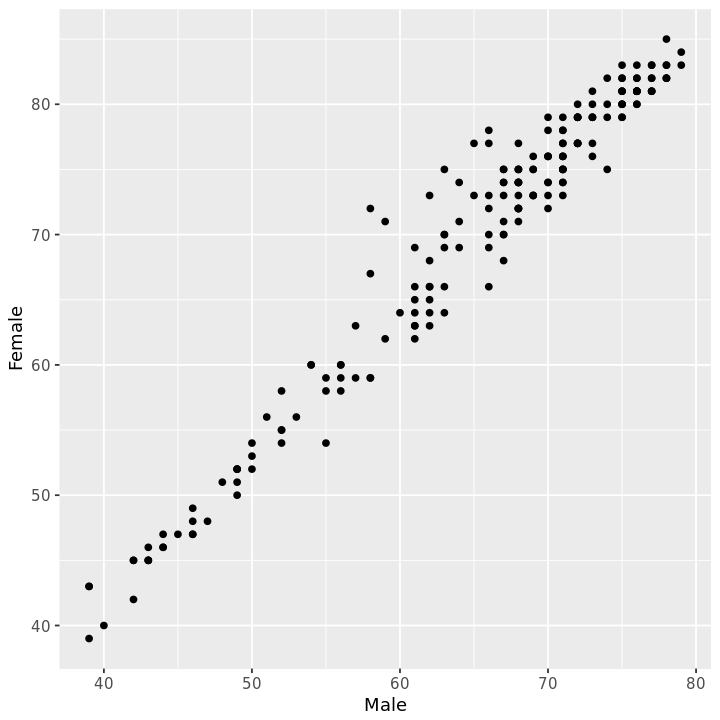
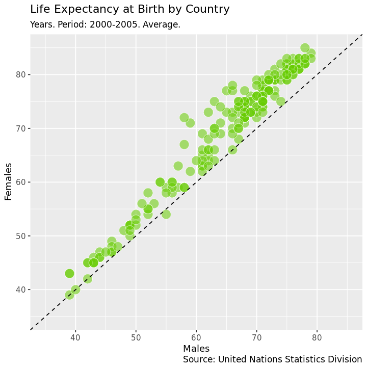
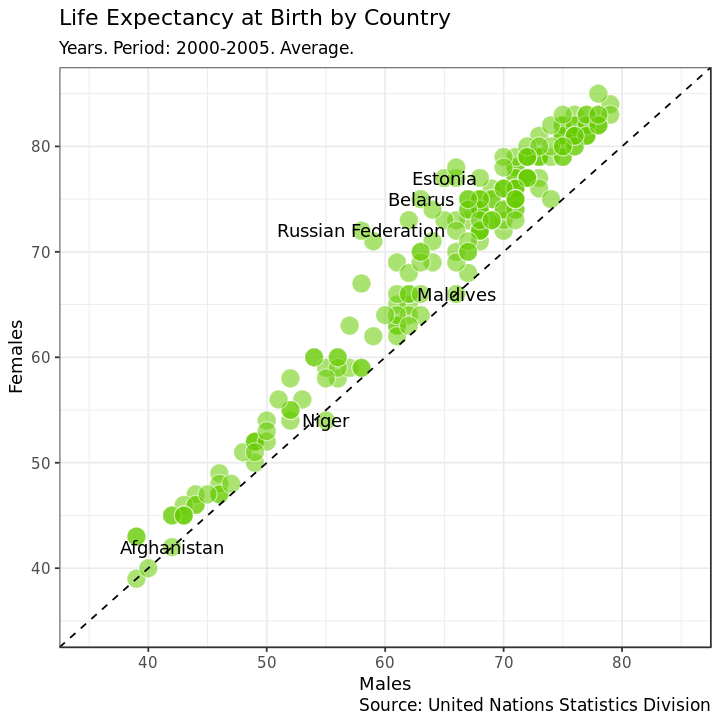
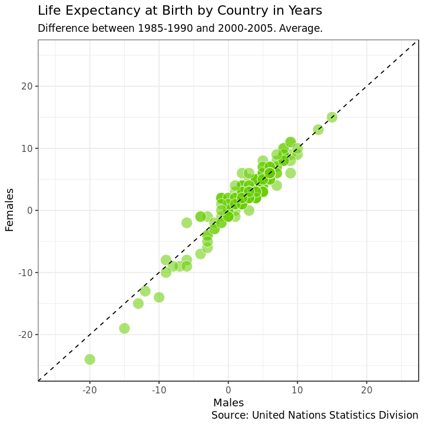
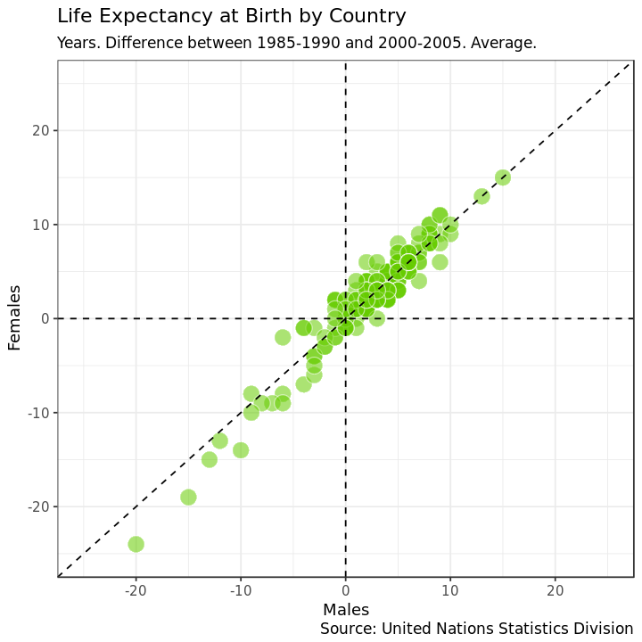
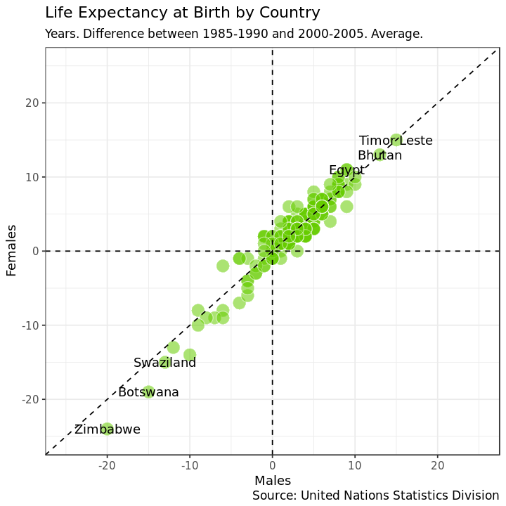

## 1. United Nations life expectancy data
<p>Life expectancy at birth is a measure of the average a living being is expected to live. It takes into account several demographic factors like gender, country, or year of birth.</p>
<p>Life expectancy at birth can vary along time or between countries because of many causes: the evolution of medicine, the degree of development of countries, or the effect of armed conflicts. Life expectancy varies between gender, as well. The data shows that women live longer that men. Why? Several potential factors, including biological reasons and the theory that women tend to be more health conscious.</p>
<p>Let's create some plots to explore the inequalities about life expectancy at birth around the world. We will use a dataset from the United Nations Statistics Division, which is available <a href="http://data.un.org/Data.aspx?d=GenderStat&f=inID:37&c=1,2,3,4,5,6&s=crEngName:asc,sgvEngName:asc,timeEngName:desc&v=1">here</a>.</p>


```R
# This sets plot images to a nice size
options(repr.plot.width = 6, repr.plot.height = 6)

# Loading packages
library(dplyr)
library(tidyr)
library(ggplot2)

# Loading data
life_expectancy <- read.csv("datasets/UNdata.csv")

# Taking a look at the first few rows
head(life_expectancy)
```


<table>
<thead><tr><th scope=col>Country.or.Area</th><th scope=col>Subgroup</th><th scope=col>Year</th><th scope=col>Source</th><th scope=col>Unit</th><th scope=col>Value</th><th scope=col>Value.Footnotes</th></tr></thead>
<tbody>
	<tr><td>Afghanistan                                                  </td><td>Female                                                       </td><td>2000-2005                                                    </td><td>UNPD_World Population Prospects_2006 (International estimate)</td><td>Years                                                        </td><td>42                                                           </td><td>NA                                                           </td></tr>
	<tr><td>Afghanistan                                                  </td><td>Female                                                       </td><td>1995-2000                                                    </td><td>UNPD_World Population Prospects_2006 (International estimate)</td><td>Years                                                        </td><td>42                                                           </td><td>NA                                                           </td></tr>
	<tr><td>Afghanistan                                                  </td><td>Female                                                       </td><td>1990-1995                                                    </td><td>UNPD_World Population Prospects_2006 (International estimate)</td><td>Years                                                        </td><td>42                                                           </td><td>NA                                                           </td></tr>
	<tr><td>Afghanistan                                                  </td><td>Female                                                       </td><td>1985-1990                                                    </td><td>UNPD_World Population Prospects_2006 (International estimate)</td><td>Years                                                        </td><td>41                                                           </td><td>NA                                                           </td></tr>
	<tr><td>Afghanistan                                                  </td><td>Male                                                         </td><td>2000-2005                                                    </td><td>UNPD_World Population Prospects_2006 (International estimate)</td><td>Years                                                        </td><td>42                                                           </td><td>NA                                                           </td></tr>
	<tr><td>Afghanistan                                                  </td><td>Male                                                         </td><td>1995-2000                                                    </td><td>UNPD_World Population Prospects_2006 (International estimate)</td><td>Years                                                        </td><td>42                                                           </td><td>NA                                                           </td></tr>
</tbody>
</table>


```R
# These packages need to be loaded in the first `@tests` cell. 
library(testthat) 
library(IRkernel.testthat)

# Then follows one or more tests of the students code. 
# The @solution should pass the tests.
# The purpose of the tests is to try to catch common errors and to 
# give the student a hint on how to resolve these errors.

run_tests({
  test_that("Test that life_expectancy exists", {
    expect_true(exists("life_expectancy"), 
                 info = "It seems that the data frame life_expectancy does not exist.")
  })

  test_that("Test that life_expectancy is loaded correctly", {
    expect_true(nrow(life_expectancy)==1571, 
                 info = "The data frame life_expectancy is not correctly loaded.")
  })

  test_that("Test that life_expectancy is loaded correctly", {
    expect_true(ncol(life_expectancy)==7, 
                 info = "The data frame life_expectancy is not correctly loaded.")
  })
})
```


    <ProjectReporter>
      Inherits from: <ListReporter>
      Public:
        .context: NULL
        .end_context: function (context) 
        .start_context: function (context) 
        add_result: function (context, test, result) 
        all_tests: environment
        cat_line: function (...) 
        cat_tight: function (...) 
        clone: function (deep = FALSE) 
        current_expectations: environment
        current_file: some name
        current_start_time: 10.009 0.199 159.28 0.003 0.002
        dump_test: function (test) 
        end_context: function (context) 
        end_reporter: function () 
        end_test: function (context, test) 
        get_results: function () 
        initialize: function (...) 
        is_full: function () 
        out: 3
        results: environment
        rule: function (...) 
        start_context: function (context) 
        start_file: function (name) 
        start_reporter: function () 
        start_test: function (context, test) 


## 2. Life expectancy of men vs. women by country
<p>Let's manipulate the data to make our exploration easier. We will build the dataset for our first plot in which we will represent the average life expectancy of men and women across countries for the last period recorded in our data (2000-2005).</p>


```R
# Subsetting and reshaping the life expectancy data
subdata <- life_expectancy  %>% 
    filter(Year == "2000-2005") %>%
    select(Country.or.Area, Subgroup, Value) %>%
    spread(Subgroup, Value)

# Taking a look at the first few rows
head(subdata)
```


<table>
<thead><tr><th scope=col>Country.or.Area</th><th scope=col>Female</th><th scope=col>Male</th></tr></thead>
<tbody>
	<tr><td>Afghanistan</td><td>42         </td><td>42         </td></tr>
	<tr><td>Albania    </td><td>79         </td><td>73         </td></tr>
	<tr><td>Algeria    </td><td>72         </td><td>70         </td></tr>
	<tr><td>Angola     </td><td>43         </td><td>39         </td></tr>
	<tr><td>Argentina  </td><td>78         </td><td>71         </td></tr>
	<tr><td>Armenia    </td><td>75         </td><td>68         </td></tr>
</tbody>
</table>


```R
# one or more tests of the students code. 
# The @solution should pass the tests.
# The purpose of the tests is to try to catch common errors and to 
# give the student a hint on how to resolve these errors.
run_tests({
  test_that("Test that subdata exists", {
    expect_true(exists("subdata"), 
                 info = "It seems that dataset subdata does not exist.")
  })

  test_that("Test that subdata is created correctly", {
    expect_true(nrow(subdata)==195, 
                 info = "It seems that subdata is not correctly created.")
  })

  test_that("Test that subdata is created correctly", {
    expect_true(ncol(subdata)==3, 
                 info = "It seems that subdata is not correctly created.")
  })

  test_that("Test that subdata is contains correct columns", {
    expect_true(sum(is.element(c("Country.or.Area", "Female", "Male"), names(subdata)))==3, 
                 info = "It seems that subdata does not contain the correct columns.")
  })
})
```


    <ProjectReporter>
      Inherits from: <ListReporter>
      Public:
        .context: NULL
        .end_context: function (context) 
        .start_context: function (context) 
        add_result: function (context, test, result) 
        all_tests: environment
        cat_line: function (...) 
        cat_tight: function (...) 
        clone: function (deep = FALSE) 
        current_expectations: environment
        current_file: some name
        current_start_time: 10.069 0.203 159.343 0.003 0.002
        dump_test: function (test) 
        end_context: function (context) 
        end_reporter: function () 
        end_test: function (context, test) 
        get_results: function () 
        initialize: function (...) 
        is_full: function () 
        out: 3
        results: environment
        rule: function (...) 
        start_context: function (context) 
        start_file: function (name) 
        start_reporter: function () 
        start_test: function (context, test) 


## 3. Visualize I
<p>A scatter plot is a useful way to visualize the relationship between two variables. It is a simple plot in which points are arranged on two axes, each of which represents one of those variables. </p>
<p>Let's create a scatter plot using <code>ggplot2</code> to represent life expectancy of males (on the x-axis) against females (on the y-axis). We will create a straightforward plot in this task, without many details. We will take care of these kinds of things shortly.</p>


```R
# Plotting male and female life expectancy
subdata %>% ggplot(aes(x = Male, y = Female)) + geom_point()

```





```R
run_tests({
  test_that("Check that a geom_point plot was plotted.", {
    expect_true( "GeomPoint" %in% class( last_plot()$layers[[1]]$geom ) , 
                 info = "Add geom_point() to produce a scatter plot.")
  })
  
  test_that("Check variables are correctly mapped.", {
    expect_true( last_plot()$mapping$x=="Male" & last_plot()$mapping$y=="Female", 
                 info = "Check that the variables are mapped to the correct axes.")
  })
  
})
```


    <ProjectReporter>
      Inherits from: <ListReporter>
      Public:
        .context: NULL
        .end_context: function (context) 
        .start_context: function (context) 
        add_result: function (context, test, result) 
        all_tests: environment
        cat_line: function (...) 
        cat_tight: function (...) 
        clone: function (deep = FALSE) 
        current_expectations: environment
        current_file: some name
        current_start_time: 10.362 0.203 159.636 0.003 0.002
        dump_test: function (test) 
        end_context: function (context) 
        end_reporter: function () 
        end_test: function (context, test) 
        get_results: function () 
        initialize: function (...) 
        is_full: function () 
        out: 3
        results: environment
        rule: function (...) 
        start_context: function (context) 
        start_file: function (name) 
        start_reporter: function () 
        start_test: function (context, test) 


## 4. Reference lines I
<p>A good plot must be easy to understand. There are many tools in <code>ggplot2</code> to achieve this goal and we will explore some of them now. Starting from the previous plot, let's set the same limits for both axes as well as place a diagonal line for reference. After doing this, the difference between men and women across countries will be easier to interpret.</p>
<p>After completing this task, we will see how most of the points are arranged above the diagonal and how there is a significant dispersion among them. What does this all mean?</p>


```R
# Adding an abline and changing the scale of axes of the previous plots
subdata %>% ggplot(aes(x = Male, y = Female)) + geom_point() +
 geom_abline(intercept = 0, slope = 1, linetype=2)+
  scale_x_continuous(limits=c(35,85))+
  scale_y_continuous(limits=c(35,85))
```


```R
for (i in 1:length(ggplot_build(last_plot())$data)) 
{
  if ("slope" %in% colnames(ggplot_build(last_plot())$data[[i]])) i1=i
}


run_tests({
    test_that("Intercept of diagonal line is equal to 0.", {
    expect_equal(ggplot_build(last_plot())$data[[i1]]$intercept, 0, 
        info = "Did you add the diagonal line correctly?")
    })
    test_that("Slope of diagonal line is equal to 1.", {
    expect_equal(ggplot_build(last_plot())$data[[i1]]$slope, 1, 
        info = "Did you add the diagonal line correctly?")
    })
    test_that("Limits of x-axis.", {
    expect_equal(length(setdiff(c(32.5, 87.5), ggplot_build(last_plot())$layout$panel_ranges[[1]]$x.range)), 0, 
        info = "The limits of x-axis is not equal to [35, 85].")
    })
    test_that("Limits of y-axis.", {
    expect_equal(length(setdiff(c(32.5, 87.5), ggplot_build(last_plot())$layout$panel_ranges[[1]]$y.range)), 0, 
        info = "The limits of y-axis is not equal to [35, 85].")
    })

})
```


    <ProjectReporter>
      Inherits from: <ListReporter>
      Public:
        .context: NULL
        .end_context: function (context) 
        .start_context: function (context) 
        add_result: function (context, test, result) 
        all_tests: environment
        cat_line: function (...) 
        cat_tight: function (...) 
        clone: function (deep = FALSE) 
        current_expectations: environment
        current_file: some name
        current_start_time: 10.712 0.207 159.989 0.003 0.002
        dump_test: function (test) 
        end_context: function (context) 
        end_reporter: function () 
        end_test: function (context, test) 
        get_results: function () 
        initialize: function (...) 
        is_full: function () 
        out: 3
        results: environment
        rule: function (...) 
        start_context: function (context) 
        start_file: function (name) 
        start_reporter: function () 
        start_test: function (context, test) 


## 5. Plot titles and axis labels
<p>A key point to make a plot understandable is placing clear labels on it. Let's add titles, axis labels, and a caption to refer to the source of data. Let's also change the appearance to make it clearer.</p>


```R
# Adding labels to previous plot
ggplot(subdata, aes(x=Male, y=Female))+
  geom_point(colour="white", fill="chartreuse3", shape=21, alpha=.55, size=5)+
  geom_abline(intercept = 0, slope = 1, linetype=2)+
  scale_x_continuous(limits=c(35,85))+
  scale_y_continuous(limits=c(35,85))+
  labs(title="Life Expectancy at Birth by Country",
       subtitle="Years. Period: 2000-2005. Average.",
       caption="Source: United Nations Statistics Division",
       x="Males",
       y="Females")
```





```R
run_tests({
    test_that("Title is correct.", {
    expect_equal(toupper(gsub("[[:space:]]", "", last_plot()$labels$title)), "LIFEEXPECTANCYATBIRTHBYCOUNTRY", 
        info = "Did you add the title correctly?")
    })

        test_that("x-axis label is correct.", {
    expect_equal(toupper(gsub("[[:space:]]", "", last_plot()$labels$x)), "MALES", 
        info = "Did you set the x-axis label correctly?")
    })

    
        test_that("y-axis label is correct.", {
    expect_equal(toupper(gsub("[[:space:]]", "", last_plot()$labels$y)), "FEMALES", 
        info = "Did you set the y-axis label correctly?")
    })

          test_that("caption is correct.", {
    expect_equal(toupper(gsub("[[:space:]]", "", last_plot()$labels$caption)), "SOURCE:UNITEDNATIONSSTATISTICSDIVISION", 
        info = "Did you set the caption correctly?")
    })

    
    
})
```


    <ProjectReporter>
      Inherits from: <ListReporter>
      Public:
        .context: NULL
        .end_context: function (context) 
        .start_context: function (context) 
        add_result: function (context, test, result) 
        all_tests: environment
        cat_line: function (...) 
        cat_tight: function (...) 
        clone: function (deep = FALSE) 
        current_expectations: environment
        current_file: some name
        current_start_time: 11.001 0.207 160.278 0.003 0.002
        dump_test: function (test) 
        end_context: function (context) 
        end_reporter: function () 
        end_test: function (context, test) 
        get_results: function () 
        initialize: function (...) 
        is_full: function () 
        out: 3
        results: environment
        rule: function (...) 
        start_context: function (context) 
        start_file: function (name) 
        start_reporter: function () 
        start_test: function (context, test) 


## 6. Highlighting remarkable countries I
<p>Now, we will label some points of our plot with the name of its corresponding country. We want to draw attention to some special countries where the gap in life expectancy between men and women is significantly high. These will be the final touches on this first plot.</p>


```R
# Subseting data to obtain countries of interest
top_male <- subdata %>% arrange(Male-Female) %>% head(3)
top_female <- subdata %>% arrange(Female-Male) %>% head(3)

countries <- as.character(unlist(c(top_male[1], top_female[1])))


# Adding text to the previous plot to label countries of interest
ggplot(subdata, aes(x=Male, y=Female, label = Country.or.Area))+
  geom_point(colour="white", fill="chartreuse3", shape=21, alpha=.55, size=5)+
  geom_abline(intercept = 0, slope = 1, linetype=2)+
  scale_x_continuous(limits=c(35,85))+
  scale_y_continuous(limits=c(35,85))+
  labs(title="Life Expectancy at Birth by Country",
       subtitle="Years. Period: 2000-2005. Average.",
       caption="Source: United Nations Statistics Division",
       x="Males",
       y="Females") +
    geom_text(data = subset(subdata, Country.or.Area %in% countries)) +
    theme_bw() 

```





```R
texts=c()
for (i in 1:length(last_plot()$layers)) texts=c(last_plot()$layers[[i]]$data$Country.or.Area %>% as.character, texts)


run_tests({
   
      test_that("Test that countries defined by top_female and top_male are correctly labeled.", {
    expect_true(length(setdiff(texts, c("Russian Federation", "Belarus", "Estonia", "Niger", "Afghanistan", "Maldives")))==0, 
                 info = "It seems that countries defined by top_female and top_male are not labeled correctly.")
  })
    
        test_that("Theme is theme_bw().", {
    expect_equal(last_plot()$theme$panel.background$fill, "white", 
        info = "It seems that your plot does not have theme_bw().")
    })


})
```


    <ProjectReporter>
      Inherits from: <ListReporter>
      Public:
        .context: NULL
        .end_context: function (context) 
        .start_context: function (context) 
        add_result: function (context, test, result) 
        all_tests: environment
        cat_line: function (...) 
        cat_tight: function (...) 
        clone: function (deep = FALSE) 
        current_expectations: environment
        current_file: some name
        current_start_time: 11.29 0.215 160.575 0.003 0.002
        dump_test: function (test) 
        end_context: function (context) 
        end_reporter: function () 
        end_test: function (context, test) 
        get_results: function () 
        initialize: function (...) 
        is_full: function () 
        out: 3
        results: environment
        rule: function (...) 
        start_context: function (context) 
        start_file: function (name) 
        start_reporter: function () 
        start_test: function (context, test) 


## 7. How has life expectancy by gender evolved?
<p>Since our data contains historical information, let's see now how life expectancy has evolved in recent years. Our second plot will represent the difference between men and women across countries between two periods: 2000-2005 and 1985-1990.</p>
<p>Let's start building a dataset called <code>subdata2</code> for our second plot. </p>


```R
# Subsetting, mutating and reshaping the life expectancy data
subdata2 <- life_expectancy %>% 
  filter(Year %in% c("1985-1990", "2000-2005")) %>% 
  mutate(Sub_Year=paste(Subgroup, Year, sep="_")) %>% 
  mutate(Sub_Year=gsub("-", "_", Sub_Year)) %>% 
  select(-Subgroup, -Year) %>%
  spread(Sub_Year, Value) %>%
  mutate(diff_Female = Female_2000_2005 - Female_1985_1990,
         diff_Male = Male_2000_2005 -Male_1985_1990)

# Taking a look at the first few rows
head(subdata2)
```


<table>
<thead><tr><th scope=col>Country.or.Area</th><th scope=col>Source</th><th scope=col>Unit</th><th scope=col>Value.Footnotes</th><th scope=col>Female_1985_1990</th><th scope=col>Female_2000_2005</th><th scope=col>Male_1985_1990</th><th scope=col>Male_2000_2005</th><th scope=col>diff_Female</th><th scope=col>diff_Male</th></tr></thead>
<tbody>
	<tr><td>Afghanistan                                                  </td><td>UNPD_World Population Prospects_2006 (International estimate)</td><td>Years                                                        </td><td>NA                                                           </td><td>41                                                           </td><td>42                                                           </td><td>41                                                           </td><td>42                                                           </td><td>1                                                            </td><td>1                                                            </td></tr>
	<tr><td>Albania                                                      </td><td>UNPD_World Population Prospects_2006 (International estimate)</td><td>Years                                                        </td><td>NA                                                           </td><td>75                                                           </td><td>79                                                           </td><td>69                                                           </td><td>73                                                           </td><td>4                                                            </td><td>4                                                            </td></tr>
	<tr><td>Algeria                                                      </td><td>UNPD_World Population Prospects_2006 (International estimate)</td><td>Years                                                        </td><td>NA                                                           </td><td>67                                                           </td><td>72                                                           </td><td>65                                                           </td><td>70                                                           </td><td>5                                                            </td><td>5                                                            </td></tr>
	<tr><td>Angola                                                       </td><td>UNPD_World Population Prospects_2006 (International estimate)</td><td>Years                                                        </td><td>NA                                                           </td><td>42                                                           </td><td>43                                                           </td><td>38                                                           </td><td>39                                                           </td><td>1                                                            </td><td>1                                                            </td></tr>
	<tr><td>Argentina                                                    </td><td>UNPD_World Population Prospects_2006 (International estimate)</td><td>Years                                                        </td><td>NA                                                           </td><td>75                                                           </td><td>78                                                           </td><td>68                                                           </td><td>71                                                           </td><td>3                                                            </td><td>3                                                            </td></tr>
	<tr><td>Armenia                                                      </td><td>UNPD_World Population Prospects_2006 (International estimate)</td><td>Years                                                        </td><td>NA                                                           </td><td>71                                                           </td><td>75                                                           </td><td>66                                                           </td><td>68                                                           </td><td>4                                                            </td><td>2                                                            </td></tr>
</tbody>
</table>


```R

run_tests({
  test_that("Test that subdata2 is created correctly.", {
    expect_true(nrow(subdata2)==195, 
                 info = "It seems that dataset subdata2 is not correctly created.")
  })

  test_that("Test that subdata2 is created correctly.", {
    expect_true(ncol(subdata2)==10, 
                 info = "It seems that dataset subdata2 is not correctly created.")
  })

  test_that("Test that subdata2 is created correctly.", {
    expect_true(length(setdiff(c('diff_Female', 'diff_Male'), names(subdata2)))==0, 
                 info = "It seems that subdata2 does not contain columns diff_Female or diff_Male.")
  })

    test_that("Test that subdata2 is created correctly.", {
    expect_true(sum(subdata2$diff_Female)==492, 
                 info = "It seems that the diff_Female column is not correctly created.")
  })  
    
  test_that("Test that subdata2 is created correctly.", {
    expect_true(sum(subdata2$diff_Male)==503, 
                 info = "It seems that the diff_Male column is not correctly created.")
  })
})
```


    <ProjectReporter>
      Inherits from: <ListReporter>
      Public:
        .context: NULL
        .end_context: function (context) 
        .start_context: function (context) 
        add_result: function (context, test, result) 
        all_tests: environment
        cat_line: function (...) 
        cat_tight: function (...) 
        clone: function (deep = FALSE) 
        current_expectations: environment
        current_file: some name
        current_start_time: 11.351 0.215 160.635 0.003 0.002
        dump_test: function (test) 
        end_context: function (context) 
        end_reporter: function () 
        end_test: function (context, test) 
        get_results: function () 
        initialize: function (...) 
        is_full: function () 
        out: 3
        results: environment
        rule: function (...) 
        start_context: function (context) 
        start_file: function (name) 
        start_reporter: function () 
        start_test: function (context, test) 


## 8. Visualize II
<p>Now let's create our second plot in which we will represent average life expectancy differences between "1985-1990" and "2000-2005" for men and women.</p>


```R
# Doing a nice first version of the plot with abline, scaling axis and adding labels
ggplot(subdata2, aes(x=diff_Male, y=diff_Female, label=Country.or.Area))+
  geom_point(colour="white", fill="chartreuse3", shape=21, alpha=.55, size=5)+
  geom_abline(intercept = 0, slope = 1, linetype=2)+
  scale_x_continuous(limits=c(-25,25))+
  scale_y_continuous(limits=c(-25,25)) + 
  labs(title="Life Expectancy at Birth by Country in Years",
       subtitle="Difference between 1985-1990 and 2000-2005. Average.",
       caption="Source: United Nations Statistics Division",
       x="Males",
       y="Females")+
theme_bw()
```





```R
run_tests({
    
#    test_that("Check that a geom_point plot was plotted.", {
#     expect_true( "GeomPoint" %in% class( last_plot()$layers[[1]]$geom ) , 
#                  info = "Add geom_point() to produce a scatter plot.")
#   })
  
  test_that("Check variables are correctly mapped.", {
    expect_true( last_plot()$mapping$x=="diff_Male" & last_plot()$mapping$y=="diff_Female", 
                 info = "Check that the variables are mapped to the correct axes.")
  })
  
    
#     test_that("Intercept of diagonal line is equal to 0.", {
#     expect_equal(ggplot_build(last_plot())$data[[2]]$intercept, 0, 
#         info = "Did you add the diagonal line correctly?")
#     })
#     test_that("Slope of diagonal line is equal to 1.", {
#     expect_equal(ggplot_build(last_plot())$data[[2]]$slope, 1, 
#         info = "Did you add the diagonal line correctly?")
#     })
    test_that("Limits of x-axis", {
    expect_equal(length(setdiff(c(-27.5, 27.5), ggplot_build(last_plot())$layout$panel_ranges[[1]]$x.range)), 0, 
        info = "Limits of x-axis is not equal to [-25, 25].")
    })
    test_that("Limits of y-axis", {
    expect_equal(length(setdiff(c(-27.5, 27.5), ggplot_build(last_plot())$layout$panel_ranges[[1]]$y.range)), 0, 
        info = "Limits of y-axis is not equal to [-25, 25]")
    })
    
#     test_that("Intercept of diagonal line is equal to 0.", {
#     expect_equal(toupper(gsub("[[:space:]]", "", last_plot()$labels$title)), "LIFEEXPECTANCYATBIRTHBYCOUNTRYINYEARS", 
#         info = "Did you add the title correctly?")
#     })
#     test_that("Slope of diagonal line is equal to 1.", {
#     expect_equal(last_plot()$theme$panel.background$fill, "white", 
#         info = "It seems that your plot does not have theme_bw().")
#     })
})
```


    <ProjectReporter>
      Inherits from: <ListReporter>
      Public:
        .context: NULL
        .end_context: function (context) 
        .start_context: function (context) 
        add_result: function (context, test, result) 
        all_tests: environment
        cat_line: function (...) 
        cat_tight: function (...) 
        clone: function (deep = FALSE) 
        current_expectations: environment
        current_file: some name
        current_start_time: 11.635 0.223 160.926 0.003 0.002
        dump_test: function (test) 
        end_context: function (context) 
        end_reporter: function () 
        end_test: function (context, test) 
        get_results: function () 
        initialize: function (...) 
        is_full: function () 
        out: 3
        results: environment
        rule: function (...) 
        start_context: function (context) 
        start_file: function (name) 
        start_reporter: function () 
        start_test: function (context, test) 


## 9. Reference lines II
<p>Adding reference lines can make plots easier to understand. We already added a diagonal line to visualize differences between men and women more clearly. Now we will add two more lines to help to identify in which countries people increased or decreased their life expectancy in the period analyzed.</p>


```R
# Adding an hline and vline to previous plots
ggplot(subdata2, aes(x=diff_Male, y=diff_Female, label=Country.or.Area))+
  geom_point(colour="white", fill="chartreuse3", shape=21, alpha=.55, size=5)+
  geom_abline(intercept = 0, slope = 1, linetype=2)+
  scale_x_continuous(limits=c(-25,25))+
  scale_y_continuous(limits=c(-25,25))+
  geom_hline(yintercept = 0, linetype=2)+
  geom_vline(xintercept = 0,  linetype=2)+
  labs(title="Life Expectancy at Birth by Country",
       subtitle="Years. Difference between 1985-1990 and 2000-2005. Average.",
       caption="Source: United Nations Statistics Division",
       x="Males",
       y="Females")+
theme_bw()
```





```R
for (i in 1:length(ggplot_build(last_plot())$data)) 
{
  if ("slope"      %in% colnames(ggplot_build(last_plot())$data[[i]])) i1=i
  if ("yintercept" %in% colnames(ggplot_build(last_plot())$data[[i]])) i2=i
  if ("xintercept" %in% colnames(ggplot_build(last_plot())$data[[i]])) i3=i
}
      

run_tests({
#     test_that("Intercept of diagonal line is equal to 0.", {
#     expect_equal(ggplot_build(last_plot())$data[[i1]]$intercept, 0, 
#         info = "Did you add the diagonal line correctly?")
#     })
#     test_that("Slope of diagonal line is equal to 1.", {
#     expect_equal(ggplot_build(last_plot())$data[[i1]]$slope, 1, 
#         info = "Did you add the diagonal line correctly?")
#     })

        test_that("Horizontal line is well defined.", {
    expect_equal(ggplot_build(last_plot())$data[[i2]]$yintercept, 0, 
        info = "Did you add the horizontal line correctly?")
    })
    test_that("Vertical line is well defined.", {
    expect_equal(ggplot_build(last_plot())$data[[i3]]$xintercept, 0, 
        info = "Did you add the vertical line correctly?")
    })
})
```


    <ProjectReporter>
      Inherits from: <ListReporter>
      Public:
        .context: NULL
        .end_context: function (context) 
        .start_context: function (context) 
        add_result: function (context, test, result) 
        all_tests: environment
        cat_line: function (...) 
        cat_tight: function (...) 
        clone: function (deep = FALSE) 
        current_expectations: environment
        current_file: some name
        current_start_time: 12.59 0.223 161.881 0.003 0.002
        dump_test: function (test) 
        end_context: function (context) 
        end_reporter: function () 
        end_test: function (context, test) 
        get_results: function () 
        initialize: function (...) 
        is_full: function () 
        out: 3
        results: environment
        rule: function (...) 
        start_context: function (context) 
        start_file: function (name) 
        start_reporter: function () 
        start_test: function (context, test) 


## 10. Highlighting remarkable countries II
<p>As we did in the first plot, let's label some points. Concretely, we will point those three where the aggregated average life expectancy for men and women increased most and those three where decreased most in the period.</p>


```R
# Subseting data to obtain countries of interest
top <- subdata2 %>% arrange(diff_Male+diff_Female) %>% head(3)
bottom <- subdata2 %>% arrange(desc(diff_Male+diff_Female)) %>% head(3)

countries2 <- as.character(unlist(c(top[1], bottom[1])))

# Adding text to the previous plot to label countries of interest
ggplot(subdata2, aes(x=diff_Male, y=diff_Female, label=Country.or.Area), guide=FALSE)+
  geom_point(colour="white", fill="chartreuse3", shape=21, alpha=.55, size=5)+
  geom_abline(intercept = 0, slope = 1, linetype=2)+
  scale_x_continuous(limits=c(-25,25))+
  scale_y_continuous(limits=c(-25,25))+
  geom_hline(yintercept=0, linetype=2)+
  geom_vline(xintercept=0, linetype=2)+
  labs(title="Life Expectancy at Birth by Country",
       subtitle="Years. Difference between 1985-1990 and 2000-2005. Average.",
       caption="Source: United Nations Statistics Division",
       x="Males",
       y="Females")+
  geom_text(data = subset(subdata2, Country.or.Area %in% countries2)) +
  theme_bw()
```





```R
texts=c()
for (i in 1:length(last_plot()$layers)) texts=c(last_plot()$layers[[i]]$data$Country.or.Area %>% as.character, texts)

run_tests({
  test_that("Test that dataset bottom exists.", {
    expect_true(exists("bottom"), 
                 info = "It seems that bottom does not exist.")
  })

  test_that("Test that dataset bottom is correctly created.", {
    expect_true(nrow(bottom)==3, 
                 info = "It seems that bottom is not correctly created.")
  })

  test_that("Test that countries defined by top and bottom are correctly labeled.", {
    expect_true(length(setdiff(texts, c("Timor Leste", "Bhutan", "Egypt", "Zimbabwe", "Botswana", "Swaziland")))==0, 
                 info = "It seems that countries defined by top and bottom are not labeled correctly.")
  })


})
```


    <ProjectReporter>
      Inherits from: <ListReporter>
      Public:
        .context: NULL
        .end_context: function (context) 
        .start_context: function (context) 
        add_result: function (context, test, result) 
        all_tests: environment
        cat_line: function (...) 
        cat_tight: function (...) 
        clone: function (deep = FALSE) 
        current_expectations: environment
        current_file: some name
        current_start_time: 13.016 0.223 162.306 0.003 0.002
        dump_test: function (test) 
        end_context: function (context) 
        end_reporter: function () 
        end_test: function (context, test) 
        get_results: function () 
        initialize: function (...) 
        is_full: function () 
        out: 3
        results: environment
        rule: function (...) 
        start_context: function (context) 
        start_file: function (name) 
        start_reporter: function () 
        start_test: function (context, test) 

