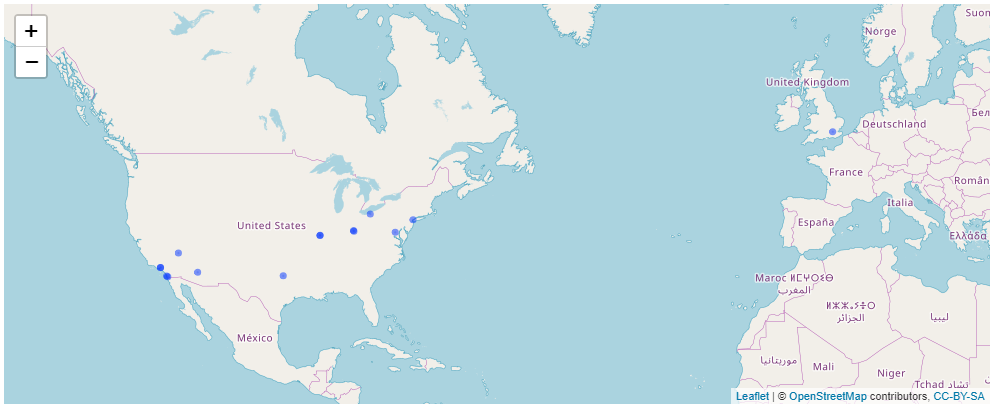
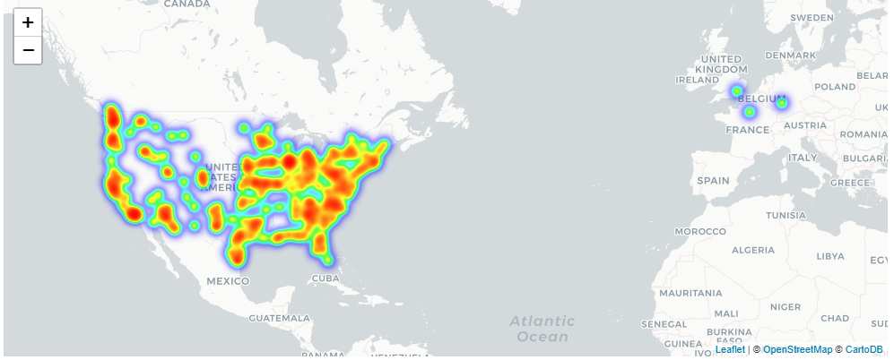
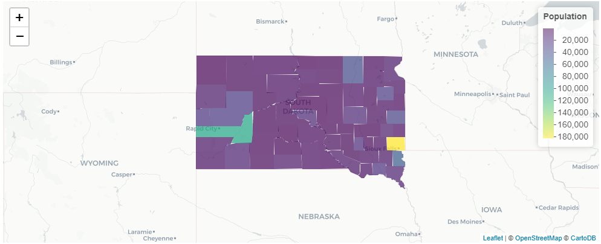
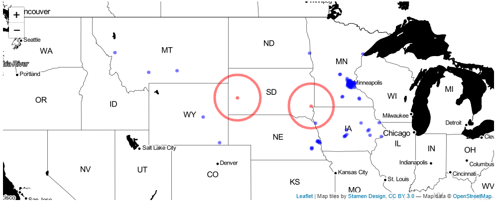
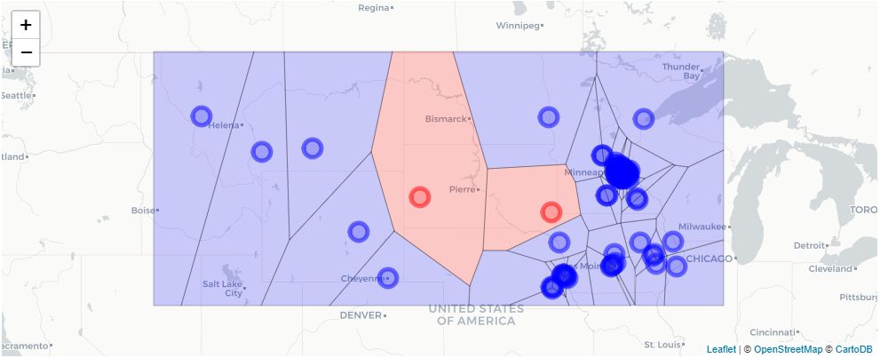

## 1. Chipotle locations from Thinknum
<p>Some of us have thought about opening a business and most of us have thought about grabbing a burrito from Chipotle. To do either of these things we need to know where the current Chipotle stores are (and are not) located. </p>
<p>In this notebook, the <code>leaflet</code> package in R and data from <a href="https://www.thinknum.com/">Thinknum</a> are used to find potential locations for new Chipotle restaurants as well as the closest place to grab a burrito. </p>
<p>Thinknum tracks thousands of websites capturing and indexing vast amounts of public data. Let's get started by loading and exploring data on every Chipotle restaurant tracked in the Thinknum data. Then we will build several <code>leaflet</code> maps that we can use to explore the data and to see where we might recommend opening a Chipotle.</p>


```R
# Load tidyverse, leaflet, and leaflet.extras
library(tidyverse)
library(leaflet)
library(leaflet.extras)
library(sf)

# Read datasets/chipotle.csv into a tibble named chipotle using read_csv
chipotle <- read_csv("datasets/chipotle.csv")

# Print out the chipotle tibble using the head function
head(chipotle)
```


<table>
<thead><tr><th scope=col>id</th><th scope=col>street</th><th scope=col>city</th><th scope=col>st</th><th scope=col>ctry</th><th scope=col>lat</th><th scope=col>lon</th><th scope=col>closed</th></tr></thead>
<tbody>
	<tr><td>1358023                 </td><td>121 N. La Cienega Blvd.,</td><td>Los Angeles             </td><td>NA                      </td><td>United States           </td><td>34.07366                </td><td>-118.37650              </td><td>t                       </td></tr>
	<tr><td>1358955                 </td><td>24369 Cedar Rd,         </td><td>Lyndhurst               </td><td>OH                      </td><td>United States           </td><td>41.50338                </td><td> -81.50298              </td><td>t                       </td></tr>
	<tr><td>1359012                 </td><td>1130 West Grove Ave.,   </td><td>Mesa                    </td><td>NA                      </td><td>United States           </td><td>33.39023                </td><td>-111.85550              </td><td>t                       </td></tr>
	<tr><td>1359490                 </td><td>6316 Delmar,            </td><td>St. Louis               </td><td>MO                      </td><td>United States           </td><td>38.65559                </td><td> -90.30255              </td><td>t                       </td></tr>
	<tr><td>1359574                 </td><td>1464 St. Louis Galleria,</td><td>St. Louis               </td><td>MO                      </td><td>United States           </td><td>38.63275                </td><td> -90.34855              </td><td>t                       </td></tr>
	<tr><td>1359575                 </td><td>8301 Westchester,       </td><td>Dallas                  </td><td>TX                      </td><td>United States           </td><td>32.86364                </td><td> -96.80657              </td><td>t                       </td></tr>
</tbody>
</table>


## 2. Do Chipotle stores ever close?
<p>First, let's make sure we don't recommend opening a location where one has already been closed. This may also prevent many a disappointing Chipotle run to closed locations. Rather than looking just at the city/state pairs in the data, we can plot all of the closed locations to see exactly where the restaurants were located. </p>
<p><code>leaflet</code> maps work with the <code>%&gt;%</code> operator so we can pipe our <code>chipotle</code> data directly into a chain of function calls to produce an interactive map. All of the Chipotle locations have already been geocoded. The <code>leaflet</code> package will scan our column names for variables that are likely lat and lon and if we use a common naming convention (e.g., lat/lon, latitude/longitude, or lat/lng), <code>leaflet</code> will automatically know which columns contain our coordinates. </p>
<p>Because of their interactive features <code>leaflet</code> maps can be especially helpful for exploratory data analyses. After we make our first map take a minute or two to zoom and pan the map to explore where Chipotle locations have closed. </p>


```R
# Create a leaflet map of all closed Chipotle stores
closed_chipotles <- 
chipotle %>% 
  # Filter the chipotle tibble to stores with a value of t for closed
  filter(closed == 't') %>% 
  leaflet() %>% 
  # Use addTiles to plot the closed stores on the default Open Street Map tile
  addTiles() %>%
  # Plot the closed stores using addCircles
  addCircles() 

# Print map of closed chipotles
closed_chipotles
```

    


## 3. How many Chipotle stores have closed?
<p>After exploring the map, the first question that comes to mind is why did these particular locations close? In fact, why would any Chipotle ever close? Unfortunately, questions like this defy logic, so after quickly counting up the closed locations, this notebook moves on to the more important question of "Where should the next Chipotle be opened?". </p>
<p>Rather than counting up all of the circles on our interactive map, we can use <code>dplyr</code> to quickly count the number of closed stores. After we note this, we'll create a new <code>tibble</code> that removes the closed locations from our data so that we do not confuse them for open locations in future maps. </p>


```R
# Use count from dplyr to count the values for the closed variable
chipotle %>% 
  count(closed == 't')

# Create a new tibble named chipotle_open that contains only open chipotle 
chipotle_open <-
  chipotle %>% 
  filter(closed == "f") %>% 
  # Drop the closed column from chipotle_open
  select(-closed)
```


<table>
<thead><tr><th scope=col>closed == "t"</th><th scope=col>n</th></tr></thead>
<tbody>
	<tr><td>FALSE</td><td>2469 </td></tr>
	<tr><td> TRUE</td><td>  15 </td></tr>
</tbody>
</table>

 


## 4. Where are (and aren't) there Chipotles?
<p>Where's the closest Chipotle? Perhaps, more interesting is a slightly different question, where aren't there Chipotles (in the US)? 
By mapping all of the Chipotle locations on an interactive <code>leaflet</code> map we can start to explore patterns in the geographic distribution of the chain's locations. </p>
<p>Since there are thousands of store locations, many of which are clustered closely together, we will start with a heatmap. Heatmaps are a popular option for mapping large amounts of points because they leverage a color scheme to represent the data rather than plotting each point individually. This enables users to quickly identify variation in the density of points and prevents tightly clustered points from overlapping. </p>
<p>The <code>addHeatmap</code> function comes from the <code>leaflet.extras</code> package, which contains many useful functions that extend the <code>leaflet</code> package.</p>
<p>Zooming and panning the map the heatmap will adjust based on the current view of the map. </p>
<p>Are there any Chipotle deserts in the United States? </p>


```R
# Pipe chipotle_open into a chain of leaflet functions
chipotle_heatmap <- 
chipotle_open %>% 
  leaflet() %>% 
  # Use addProviderTiles to add the CartoDB provider tile 
  addProviderTiles("CartoDB") %>%
  # Use addHeatmap with a radius of 8
  addHeatmap(radius = 8)

# Print heatmap
chipotle_heatmap 
```

    


## 5. Which States have the fewest Chipotles?
<p>Using the greyscale <code>CartoDB</code> provider tile with a colorful heatmap palette quickly revealed both the presence and absence of Chipotle stores throughout the United States. Using a greyscale base map is often useful for exploratory data analysis as it  makes patterns of Chipotle clusters and Chipotle deserts clearly stand out on the map. </p>
<p>For example, panning and zooming the map reveals that Chipotles are often located on horizontal or vertical lines. Zooming in further reveals that this is because stores are often located near interstate highways (check out Utah for an example). </p>
<p>Let's take a closer look at where there are not Chipotle stores by quantifying the Chipotle deserts using <code>dplyr</code> to count the number of Chipotle locations in each US state. </p>


```R
# Create a new tibble called chipotles_by_state to store the results
chipotles_by_state <- 
chipotle_open %>% 
  # Filter the data to only Chipotles in the United States
  filter(ctry == "United States") %>% 
  # Count the number of stores in chipotle_open by st
  count(st) %>% 
  # Arrange the number of stores by state in ascending order
  arrange(n)

# Print the state counts
chipotles_by_state
```


<table>
<thead><tr><th scope=col>st</th><th scope=col>n</th></tr></thead>
<tbody>
	<tr><td>MS </td><td>  1</td></tr>
	<tr><td>ND </td><td>  1</td></tr>
	<tr><td>VT </td><td>  1</td></tr>
	<tr><td>WY </td><td>  2</td></tr>
	<tr><td>MT </td><td>  3</td></tr>
	<tr><td>ME </td><td>  5</td></tr>
	<tr><td>WV </td><td>  5</td></tr>
	<tr><td>AR </td><td>  6</td></tr>
	<tr><td>DE </td><td>  6</td></tr>
	<tr><td>NH </td><td>  7</td></tr>
	<tr><td>RI </td><td>  7</td></tr>
	<tr><td>ID </td><td>  8</td></tr>
	<tr><td>NE </td><td>  9</td></tr>
	<tr><td>NM </td><td>  9</td></tr>
	<tr><td>LA </td><td> 10</td></tr>
	<tr><td>IA </td><td> 12</td></tr>
	<tr><td>OK </td><td> 12</td></tr>
	<tr><td>UT </td><td> 13</td></tr>
	<tr><td>AL </td><td> 14</td></tr>
	<tr><td>KY </td><td> 18</td></tr>
	<tr><td>WI </td><td> 19</td></tr>
	<tr><td>DC </td><td> 20</td></tr>
	<tr><td>SC </td><td> 22</td></tr>
	<tr><td>TN </td><td> 22</td></tr>
	<tr><td>CT </td><td> 24</td></tr>
	<tr><td>KS </td><td> 25</td></tr>
	<tr><td>NV </td><td> 27</td></tr>
	<tr><td>OR </td><td> 30</td></tr>
	<tr><td>IN </td><td> 36</td></tr>
	<tr><td>MI </td><td> 36</td></tr>
	<tr><td>MO </td><td> 37</td></tr>
	<tr><td>WA </td><td> 40</td></tr>
	<tr><td>GA </td><td> 49</td></tr>
	<tr><td>MA </td><td> 56</td></tr>
	<tr><td>NC </td><td> 59</td></tr>
	<tr><td>NJ </td><td> 60</td></tr>
	<tr><td>MN </td><td> 63</td></tr>
	<tr><td>CO </td><td> 75</td></tr>
	<tr><td>AZ </td><td> 80</td></tr>
	<tr><td>PA </td><td> 85</td></tr>
	<tr><td>MD </td><td> 88</td></tr>
	<tr><td>VA </td><td>101</td></tr>
	<tr><td>IL </td><td>135</td></tr>
	<tr><td>NY </td><td>142</td></tr>
	<tr><td>FL </td><td>154</td></tr>
	<tr><td>OH </td><td>177</td></tr>
	<tr><td>TX </td><td>204</td></tr>
	<tr><td>CA </td><td>417</td></tr>
</tbody>
</table>


## 6. How many States in the US?
<p>The <code>chipotle_by_state</code> tibble had 48 rows, but there are 50 fifty states in the US. Why don't we have fifty rows? Perhaps, there are two (unfortunate) states do not have a single Chipotle. Let's take a look using a couple of handy features that are included in base R. The <code>state.abb</code> vector has fifty elements, each containing a state's abbreviation. Using this vector in combination with the <code>!</code> and <code>%in%</code> operators, we can quickly and systematically determine which states do not have a Chipotle. The <code>%in%</code> operator helps us to determine which elements of one vector are present <em>in</em> another vector, while the <code>!</code> operator allows us to accomplish the inverse (i.e., finding which elements of one vector are <em>not in</em> another). </p>


```R
# Print the state.abb vector
state.abb

# Use the %in% operator to determine which states are in chipotles_by_state
state.abb %in% chipotles_by_state$st

# Use the %in% and ! operators to determine which states are not in chipotles_by_state
!state.abb %in% chipotles_by_state$st

# Create a states_wo_chipotles vector
states_wo_chipotles <- state.abb[!state.abb %in% chipotles_by_state$st]

# Print states with no Chipotles
states_wo_chipotles
```


<ol class=list-inline>
	<li>'AL'</li>
	<li>'AK'</li>
	<li>'AZ'</li>
	<li>'AR'</li>
	<li>'CA'</li>
	<li>'CO'</li>
	<li>'CT'</li>
	<li>'DE'</li>
	<li>'FL'</li>
	<li>'GA'</li>
	<li>'HI'</li>
	<li>'ID'</li>
	<li>'IL'</li>
	<li>'IN'</li>
	<li>'IA'</li>
	<li>'KS'</li>
	<li>'KY'</li>
	<li>'LA'</li>
	<li>'ME'</li>
	<li>'MD'</li>
	<li>'MA'</li>
	<li>'MI'</li>
	<li>'MN'</li>
	<li>'MS'</li>
	<li>'MO'</li>
	<li>'MT'</li>
	<li>'NE'</li>
	<li>'NV'</li>
	<li>'NH'</li>
	<li>'NJ'</li>
	<li>'NM'</li>
	<li>'NY'</li>
	<li>'NC'</li>
	<li>'ND'</li>
	<li>'OH'</li>
	<li>'OK'</li>
	<li>'OR'</li>
	<li>'PA'</li>
	<li>'RI'</li>
	<li>'SC'</li>
	<li>'SD'</li>
	<li>'TN'</li>
	<li>'TX'</li>
	<li>'UT'</li>
	<li>'VT'</li>
	<li>'VA'</li>
	<li>'WA'</li>
	<li>'WV'</li>
	<li>'WI'</li>
	<li>'WY'</li>
</ol>


<ol class=list-inline>
	<li>TRUE</li>
	<li>FALSE</li>
	<li>TRUE</li>
	<li>TRUE</li>
	<li>TRUE</li>
	<li>TRUE</li>
	<li>TRUE</li>
	<li>TRUE</li>
	<li>TRUE</li>
	<li>TRUE</li>
	<li>FALSE</li>
	<li>TRUE</li>
	<li>TRUE</li>
	<li>TRUE</li>
	<li>TRUE</li>
	<li>TRUE</li>
	<li>TRUE</li>
	<li>TRUE</li>
	<li>TRUE</li>
	<li>TRUE</li>
	<li>TRUE</li>
	<li>TRUE</li>
	<li>TRUE</li>
	<li>TRUE</li>
	<li>TRUE</li>
	<li>TRUE</li>
	<li>TRUE</li>
	<li>TRUE</li>
	<li>TRUE</li>
	<li>TRUE</li>
	<li>TRUE</li>
	<li>TRUE</li>
	<li>TRUE</li>
	<li>TRUE</li>
	<li>TRUE</li>
	<li>TRUE</li>
	<li>TRUE</li>
	<li>TRUE</li>
	<li>TRUE</li>
	<li>TRUE</li>
	<li>FALSE</li>
	<li>TRUE</li>
	<li>TRUE</li>
	<li>TRUE</li>
	<li>TRUE</li>
	<li>TRUE</li>
	<li>TRUE</li>
	<li>TRUE</li>
	<li>TRUE</li>
	<li>TRUE</li>
</ol>


<ol class=list-inline>
	<li>FALSE</li>
	<li>TRUE</li>
	<li>FALSE</li>
	<li>FALSE</li>
	<li>FALSE</li>
	<li>FALSE</li>
	<li>FALSE</li>
	<li>FALSE</li>
	<li>FALSE</li>
	<li>FALSE</li>
	<li>TRUE</li>
	<li>FALSE</li>
	<li>FALSE</li>
	<li>FALSE</li>
	<li>FALSE</li>
	<li>FALSE</li>
	<li>FALSE</li>
	<li>FALSE</li>
	<li>FALSE</li>
	<li>FALSE</li>
	<li>FALSE</li>
	<li>FALSE</li>
	<li>FALSE</li>
	<li>FALSE</li>
	<li>FALSE</li>
	<li>FALSE</li>
	<li>FALSE</li>
	<li>FALSE</li>
	<li>FALSE</li>
	<li>FALSE</li>
	<li>FALSE</li>
	<li>FALSE</li>
	<li>FALSE</li>
	<li>FALSE</li>
	<li>FALSE</li>
	<li>FALSE</li>
	<li>FALSE</li>
	<li>FALSE</li>
	<li>FALSE</li>
	<li>FALSE</li>
	<li>TRUE</li>
	<li>FALSE</li>
	<li>FALSE</li>
	<li>FALSE</li>
	<li>FALSE</li>
	<li>FALSE</li>
	<li>FALSE</li>
	<li>FALSE</li>
	<li>FALSE</li>
	<li>FALSE</li>
</ol>


<ol class=list-inline>
	<li>'AK'</li>
	<li>'HI'</li>
	<li>'SD'</li>
</ol>


## 7. Where to open a Chipotle I
<p>Wait a second...have I had this wrong all along? 48 + 3 = 51 states!?! Let's take a closer look at the values in our state variable that are not in the <code>state.abb</code> vector. </p>
<pre><code class="{r} language-{r}">chipotles_by_state$st[!chipotles_by_state$st %in% state.abb]
</code></pre>
<p>Ah! Washington, D.C. surprises me once again. DC is a district and not a state, so 51 seems ok for this notebook. </p>
<p>Let's focus on the only state in the contiguous United States that does not have a Chipotle: South Dakota. If we were to open a Chipotle location in South Dakota, how might we go about selecting proposed locations? In the following chunks of code, we look at several maps to explore how the location of current Chipotles as well as geographic, transportation, and governmental features of the state may inform this decision.  </p>
<p>First, let's take a look at how South Dakota's population is distributed across the state using data from the US Census. The <code>tidycensus</code> package in R can be used to facilitate access to census data from R. For a great example, check out [this](
https://juliasilge.com/blog/using-tidycensus/) blog post by Julia Silge.  </p>


```R
# Load south_dakota_pop.rds into an object called south_dakota_pop
south_dakota_pop <- readRDS("datasets/south_dakota_pop.rds")

# Create color palette to color map by county population estimate
pal <- colorNumeric(palette = "viridis", domain = south_dakota_pop$estimate)

sd_pop_map <-
  south_dakota_pop %>%
  leaflet() %>%
  addProviderTiles("CartoDB") %>%
  # Add county boundaries with addPolygons and color by population estimate
  addPolygons(stroke = FALSE, fillOpacity = 0.7, color = ~ pal(estimate)) %>%
  # Add a legend using addLegend 
  addLegend(pal = pal, values = ~estimate, title = "Population")

# Print map of South Dakota population by county
sd_pop_map
```


 


## 8. Where to open a Chipotle II
<p>Minnehaha and Pennington counties really stand out on population map. These counties are home to Sioux Falls and Rapid City, respectively. Let's take a closer look at each of the two largest cities in South Dakota to consider what features of the base map may be important when selecting the location of a Chipotle?</p>
<p>Sioux Falls has a larger population, but Rapid City is proximate to Badlands National park, which has a million visitors a year. Additionally, we should note that I-90, a major interstate in America, runs through both cities.  </p>
<p>Let's plot a proposed Chipotle location in each city to further our exploration. The <code>geocode</code> function from the <code>ggmap</code> package can be used to geocode locations in R. Alternatively, the <code>addReverseSearchOSM</code> function from the <code>leaflet.extras</code> package can be used to enable geocoding via mouse click on an interactive map. </p>


```R
# Load chipotle_sd_locations.csv that contains proposed South Dakota locations  
chipotle_sd_locations <- read_csv("datasets/chipotle_sd_locations.csv")

# limit chipotle store data to locations in states boardering South Dakota
chipotle_market_research <- 
  chipotle_open %>% 
  filter(st %in% c("IA", "MN", "MT", "ND", "NE", "WY")) %>% 
  select(city, st, lat, lon) %>% 
  mutate(status = "open") %>% 
  # bind the data on proposed SD locations onto the open store data
  bind_rows(chipotle_sd_locations) 

# print the market research data
chipotle_market_research
```


<table>
<thead><tr><th scope=col>city</th><th scope=col>st</th><th scope=col>lat</th><th scope=col>lon</th><th scope=col>status</th></tr></thead>
<tbody>
	<tr><td>Lincoln         </td><td>NE              </td><td>40.81311        </td><td> -96.64009      </td><td>open            </td></tr>
	<tr><td>Brooklyn Park   </td><td>MN              </td><td>45.09414        </td><td> -93.38321      </td><td>open            </td></tr>
	<tr><td>Eagan           </td><td>MN              </td><td>44.83598        </td><td> -93.15196      </td><td>open            </td></tr>
	<tr><td>Champlin        </td><td>MN              </td><td>45.15832        </td><td> -93.39078      </td><td>open            </td></tr>
	<tr><td>Woodbury        </td><td>MN              </td><td>44.94463        </td><td> -92.90468      </td><td>open            </td></tr>
	<tr><td>Columbia Heights</td><td>MN              </td><td>45.06271        </td><td> -93.24830      </td><td>open            </td></tr>
	<tr><td>Fargo           </td><td>ND              </td><td>46.85503        </td><td> -96.86172      </td><td>open            </td></tr>
	<tr><td>Iowa City       </td><td>IA              </td><td>41.65975        </td><td> -91.53489      </td><td>open            </td></tr>
	<tr><td>Minnetonka      </td><td>MN              </td><td>44.91803        </td><td> -93.50246      </td><td>open            </td></tr>
	<tr><td>Minneapolis     </td><td>MN              </td><td>44.95535        </td><td> -93.29721      </td><td>open            </td></tr>
	<tr><td>Maple Grove     </td><td>MN              </td><td>45.09568        </td><td> -93.44131      </td><td>open            </td></tr>
	<tr><td>Eagan           </td><td>MN              </td><td>44.79070        </td><td> -93.21178      </td><td>open            </td></tr>
	<tr><td>Minneapolis     </td><td>MN              </td><td>44.97353        </td><td> -93.27533      </td><td>open            </td></tr>
	<tr><td>Plymouth        </td><td>MN              </td><td>45.02058        </td><td> -93.48253      </td><td>open            </td></tr>
	<tr><td>Rochester       </td><td>MN              </td><td>44.00607        </td><td> -92.46423      </td><td>open            </td></tr>
	<tr><td>Edina           </td><td>MN              </td><td>44.87915        </td><td> -93.32056      </td><td>open            </td></tr>
	<tr><td>West Des Moines </td><td>IA              </td><td>41.56251        </td><td> -93.79929      </td><td>open            </td></tr>
	<tr><td>Minneapolis     </td><td>MN              </td><td>44.97306        </td><td> -93.24702      </td><td>open            </td></tr>
	<tr><td>Sioux City      </td><td>IA              </td><td>42.44571        </td><td> -96.34321      </td><td>open            </td></tr>
	<tr><td>Saint Paul      </td><td>MN              </td><td>44.94546        </td><td> -93.09537      </td><td>open            </td></tr>
	<tr><td>Cheyenne        </td><td>WY              </td><td>41.16074        </td><td>-104.80572      </td><td>open            </td></tr>
	<tr><td>Cottage Grove   </td><td>MN              </td><td>44.83287        </td><td> -92.95760      </td><td>open            </td></tr>
	<tr><td>Lincoln         </td><td>NE              </td><td>40.81569        </td><td> -96.70236      </td><td>open            </td></tr>
	<tr><td>Bellevue        </td><td>NE              </td><td>41.15788        </td><td> -95.93475      </td><td>open            </td></tr>
	<tr><td>Vadnais Heights </td><td>MN              </td><td>45.05199        </td><td> -93.06330      </td><td>open            </td></tr>
	<tr><td>Minneapolis     </td><td>MN              </td><td>44.98801        </td><td> -93.25691      </td><td>open            </td></tr>
	<tr><td>Crystal         </td><td>MN              </td><td>45.05509        </td><td> -93.36497      </td><td>open            </td></tr>
	<tr><td>Lincoln         </td><td>NE              </td><td>40.73930        </td><td> -96.67951      </td><td>open            </td></tr>
	<tr><td>Eden Prairie    </td><td>MN              </td><td>44.85924        </td><td> -93.44287      </td><td>open            </td></tr>
	<tr><td>Oak Park Heights</td><td>MN              </td><td>45.03565        </td><td> -92.83741      </td><td>open            </td></tr>
	<tr><td>...</td><td>...</td><td>...</td><td>...</td><td>...</td></tr>
	<tr><td>Papillion    </td><td>NE           </td><td>41.16240     </td><td> -96.02331   </td><td>open         </td></tr>
	<tr><td>Maplewood    </td><td>MN           </td><td>45.01041     </td><td> -93.02384   </td><td>open         </td></tr>
	<tr><td>St. Paul     </td><td>MN           </td><td>44.94011     </td><td> -93.13683   </td><td>open         </td></tr>
	<tr><td>Maple Grove  </td><td>MN           </td><td>45.13361     </td><td> -93.47686   </td><td>open         </td></tr>
	<tr><td>Omaha        </td><td>NE           </td><td>41.23365     </td><td> -96.19198   </td><td>open         </td></tr>
	<tr><td>St Louis Park</td><td>MN           </td><td>44.93173     </td><td> -93.34841   </td><td>open         </td></tr>
	<tr><td>Casper       </td><td>WY           </td><td>42.84809     </td><td>-106.26045   </td><td>open         </td></tr>
	<tr><td>Omaha        </td><td>NE           </td><td>41.25877     </td><td> -96.02323   </td><td>open         </td></tr>
	<tr><td>Blaine       </td><td>MN           </td><td>45.16047     </td><td> -93.23382   </td><td>open         </td></tr>
	<tr><td>Omaha        </td><td>NE           </td><td>41.23372     </td><td> -96.12033   </td><td>open         </td></tr>
	<tr><td>Ames         </td><td>IA           </td><td>42.01763     </td><td> -93.61094   </td><td>open         </td></tr>
	<tr><td>Burnsville   </td><td>MN           </td><td>44.74756     </td><td> -93.28872   </td><td>open         </td></tr>
	<tr><td>West St Paul </td><td>MN           </td><td>44.89016     </td><td> -93.08114   </td><td>open         </td></tr>
	<tr><td>Mankato      </td><td>MN           </td><td>44.14617     </td><td> -93.99405   </td><td>open         </td></tr>
	<tr><td>Ankeny       </td><td>IA           </td><td>41.70933     </td><td> -93.58078   </td><td>open         </td></tr>
	<tr><td>Dubuque      </td><td>IA           </td><td>42.49154     </td><td> -90.72009   </td><td>open         </td></tr>
	<tr><td>Golden Valley</td><td>MN           </td><td>44.98448     </td><td> -93.38111   </td><td>open         </td></tr>
	<tr><td>Minneapolis  </td><td>MN           </td><td>45.03891     </td><td> -93.21979   </td><td>open         </td></tr>
	<tr><td>Rochester    </td><td>MN           </td><td>44.06277     </td><td> -92.50010   </td><td>open         </td></tr>
	<tr><td>Blaine       </td><td>MN           </td><td>45.12729     </td><td> -93.25675   </td><td>open         </td></tr>
	<tr><td>Apple Valley </td><td>MN           </td><td>44.73114     </td><td> -93.21937   </td><td>open         </td></tr>
	<tr><td>Woodbury     </td><td>MN           </td><td>44.92473     </td><td> -92.95501   </td><td>open         </td></tr>
	<tr><td>Des Moines   </td><td>IA           </td><td>41.62889     </td><td> -93.69722   </td><td>open         </td></tr>
	<tr><td>Shoreview    </td><td>MN           </td><td>45.05809     </td><td> -93.14353   </td><td>open         </td></tr>
	<tr><td>Cedar Rapids </td><td>IA           </td><td>41.95441     </td><td> -91.71653   </td><td>open         </td></tr>
	<tr><td>Maplewood    </td><td>MN           </td><td>45.03555     </td><td> -93.01951   </td><td>open         </td></tr>
	<tr><td>Mankato      </td><td>MN           </td><td>44.16630     </td><td> -93.95140   </td><td>open         </td></tr>
	<tr><td>Waterloo     </td><td>IA           </td><td>42.46412     </td><td> -92.32460   </td><td>open         </td></tr>
	<tr><td>Rapid City   </td><td>SD           </td><td>44.08054     </td><td>-103.23100   </td><td>proposed     </td></tr>
	<tr><td>Sioux Falls  </td><td>SD           </td><td>43.54730     </td><td> -96.72833   </td><td>proposed     </td></tr>
</tbody>
</table>


## 9. Where to open a Chipotle III
<p>Let's map our proposed Chipotle restaurants in Sioux Falls and Rapid City so we can quickly see how close they are to the nearest open location. </p>
<p>So far our maps have been built using a single base map (e.g., <code>CartoDB</code>) with a single data layer (e.g., circle markers or polygons).  The <code>leaflet</code> package works like <code>ggplot2</code> and allows for multiple data layers on the same map.  Then <code>addLayerControls</code> will enable users to have control of which layers are visible. </p>
<p>Let's apply this concept in a new <code>leaflet</code> map that plots all of the open and proposed Chipotle locations in South Dakota and its bordering states. Then adding a second layer to draw a circle around each of the proposed locations to determine if there is an open store within 100 miles. </p>
<p>When using a categorical variable to create a color palette, colors can be mapped directly to the levels of the factor (i.e., there is one color in the palette for each level of the factor) or the palette can be interpolated by the <code>colorFactor</code> function to create the necessary number of colors. </p>


```R
# Create a blue and red color palette to distinguish between open and proposed stores
pal <- colorFactor(palette = c("Blue", "Red"), domain = c("open", "proposed"))

# Map the open and proposed locations
sd_proposed_map <-
  chipotle_market_research %>% 
  leaflet() %>% 
  # Add the Stamen Toner provider tile
  addProviderTiles("Stamen.Toner") %>%
  # Apply the pal color palette
  addCircles(color = ~pal(status)) %>%
  # Draw a circle with a 100 mi radius around the proposed locations
  addCircles(data = chipotle_sd_locations, radius = 100 * 1609.34, color = ~pal(status), fill = FALSE) 

# Print the map of proposed locations 
sd_proposed_map
```

   


## 10. Where to open a Chipotle IV
<p>It looks like there is a Chipotle within a 100 miles of the proposed Sioux Falls location, but not Rapid City. This is helpful to know but perhaps even more helpful would be to understand all of the locations that are closer to a proposed Chipotle than to an open one. </p>
<p>Voronoi polygons can be used to plot a polygon around each location. The bounds of each polygon will enclose all of the points on the map that are closest to a specific Chipotle. These polygons can then be used to visualize an approximation of the area covered by each Chipotle.  </p>
<p>Where should the next Chipotle be opened (hint: there has never been a wrong answer to this question!)? </p>


```R
# load the Voronoi polygon data 
polys <- readRDS("datasets/voronoi_polygons.rds")

voronoi_map <- 
  polys %>%
  leaflet() %>%
  # Use the CartoDB provider tile
  addProviderTiles("CartoDB") %>%
  # Plot Voronoi polygons using addPolygons
  addPolygons(fillColor = ~pal(status), weight = 0.5, color = "black") %>%
  # Add proposed and open locations as another layer
  addCircleMarkers(data = chipotle_market_research, label = ~city, color = ~pal(status))

# Print the Voronoi map
voronoi_map
```

    


## 11. Where should the next Chipotle be opened?
<p>After loading thousands of Chipotle locations from Thinknum, creating tables and a heatmap, identifying the shocking fact that South Dakota does not have a single Chipotle, using exploratory data analysis to investigate where a store location may make sense, including</p>
<ul>
<li>creating a county-level choropleth map showing population,</li>
<li>drawing circles with 100-mile radii around each proposed location, and</li>
<li>mapping Voronoi polygons to estimate the area covered by each proposed Chipotle, </li>
</ul>
<p>It all comes down to this: <strong>Where should the next Chipotle be opened?</strong></p>


```R
# Where should the next Chipotle store be? 
next_chipotle <- tibble(location = c("Rapid City, SD", "Sioux Falls, SD"),
                        open_new_store = c(TRUE, FALSE))
```


