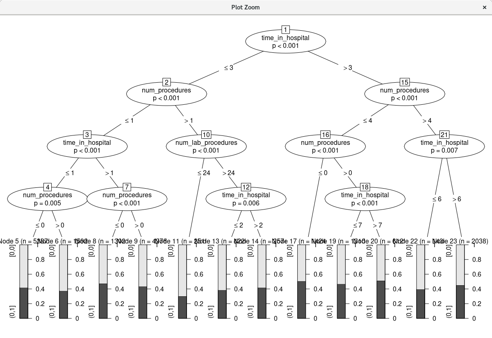

```R
# Rattle timestamp: 2022-02-22 11:30:34 x86_64-redhat-linux-gnu 

# Remap variables. 

# Transform into a factor.

  crs$dataset[["TFC_Readmission"]] <- as.factor(crs$dataset[["Readmission"]])

  ol <- levels(crs$dataset[["TFC_Readmission"]])
  lol <- length(ol)
  nl <- c(sprintf("[%s,%s]", ol[1], ol[1]), sprintf("(%s,%s]", ol[-lol], ol[-1]))
  levels(crs$dataset[["TFC_Readmission"]]) <- nl

#=======================================================================
# Rattle timestamp: 2022-02-22 11:30:34 x86_64-redhat-linux-gnu 

# Action the user selections from the Data tab. 

# The following variable selections have been noted.

crs$input     <- c("num_lab_procedures", "TFC_Readmission")

crs$numeric   <- "num_lab_procedures"

crs$categoric <- "TFC_Readmission"

crs$target    <- "time_in_hospital"
crs$risk      <- NULL
crs$ident     <- NULL
crs$ignore    <- c("gender", "num_procedures", "num_medications", "number_outpatient", "number_emergency", "number_inpatient", "number_diagnoses", "Readmission")
crs$weights   <- NULL

#=======================================================================
# Rattle timestamp: 2022-02-22 11:31:05 x86_64-redhat-linux-gnu 

# Action the user selections from the Data tab. 

# Build the train/validate/test datasets.

# nobs=101763 train=71234 validate=15264 test=15265

set.seed(crv$seed)

crs$nobs <- nrow(crs$dataset)

crs$train <- sample(crs$nobs, 0.7*crs$nobs)

crs$nobs %>%
  seq_len() %>%
  setdiff(crs$train) %>%
  sample(0.15*crs$nobs) ->
crs$validate

crs$nobs %>%
  seq_len() %>%
  setdiff(crs$train) %>%
  setdiff(crs$validate) ->
crs$test

# The following variable selections have been noted.

crs$input     <- "time_in_hospital"

crs$numeric   <- "time_in_hospital"

crs$categoric <- NULL

crs$target    <- "TFC_Readmission"
crs$risk      <- NULL
crs$ident     <- NULL
crs$ignore    <- c("gender", "num_lab_procedures", "num_procedures", "num_medications", "number_outpatient", "number_emergency", "number_inpatient", "number_diagnoses", "Readmission")
crs$weights   <- NULL

#=======================================================================
# Rattle timestamp: 2022-02-22 11:31:18 x86_64-redhat-linux-gnu 

# Decision Tree 

# The 'rpart' package provides the 'rpart' function.

library(rpart, quietly=TRUE)

# Reset the random number seed to obtain the same results each time.

set.seed(crv$seed)

# Build the Decision Tree model.

crs$rpart <- rpart(TFC_Readmission ~ .,
    data=crs$dataset[crs$train, c(crs$input, crs$target)],
    method="class",
    parms=list(split="information"),
    control=rpart.control(usesurrogate=0, 
        maxsurrogate=0),
    model=TRUE)

# Generate a textual view of the Decision Tree model.

print(crs$rpart)
printcp(crs$rpart)
cat("\n")

# Time taken: 0.07 secs

#=======================================================================
# Rattle timestamp: 2022-02-22 11:32:16 x86_64-redhat-linux-gnu 

# Decision Tree 

# The 'rpart' package provides the 'rpart' function.

library(rpart, quietly=TRUE)

# Reset the random number seed to obtain the same results each time.

set.seed(crv$seed)

# Build the Decision Tree model.

crs$rpart <- rpart(TFC_Readmission ~ .,
    data=crs$dataset[crs$train, c(crs$input, crs$target)],
    method="class",
    parms=list(split="information"),
      control=rpart.control(minsplit=2,
           maxdepth=2,
        usesurrogate=0, 
        maxsurrogate=0),
    model=TRUE)

# Generate a textual view of the Decision Tree model.

print(crs$rpart)
printcp(crs$rpart)
cat("\n")

# Time taken: 0.06 secs

#=======================================================================
# Rattle timestamp: 2022-02-22 11:32:57 x86_64-redhat-linux-gnu 

# Decision Tree 

# The 'rpart' package provides the 'rpart' function.

library(rpart, quietly=TRUE)

# Reset the random number seed to obtain the same results each time.

set.seed(crv$seed)

# Build the Decision Tree model.

crs$rpart <- rpart(TFC_Readmission ~ .,
    data=crs$dataset[crs$train, c(crs$input, crs$target)],
    method="class",
    parms=list(split="information"),
      control=rpart.control(minsplit=1,
           maxdepth=2,
        usesurrogate=0, 
        maxsurrogate=0),
    model=TRUE)

# Generate a textual view of the Decision Tree model.

print(crs$rpart)
printcp(crs$rpart)
cat("\n")

# Time taken: 0.07 secs

# List the rules from the tree using a Rattle support function.

asRules(crs$rpart)

#=======================================================================
# Rattle timestamp: 2022-02-22 11:33:31 x86_64-redhat-linux-gnu 

# Action the user selections from the Data tab. 

# Build the train/validate/test datasets.

# nobs=101763 train=71234 validate=15264 test=15265

set.seed(crv$seed)

crs$nobs <- nrow(crs$dataset)

crs$train <- sample(crs$nobs, 0.7*crs$nobs)

crs$nobs %>%
  seq_len() %>%
  setdiff(crs$train) %>%
  sample(0.15*crs$nobs) ->
crs$validate

crs$nobs %>%
  seq_len() %>%
  setdiff(crs$train) %>%
  setdiff(crs$validate) ->
crs$test

# The following variable selections have been noted.

crs$input     <- c("time_in_hospital", "num_lab_procedures",
                   "num_procedures")

crs$numeric   <- c("time_in_hospital", "num_lab_procedures",
                   "num_procedures")

crs$categoric <- NULL

crs$target    <- "TFC_Readmission"
crs$risk      <- NULL
crs$ident     <- NULL
crs$ignore    <- c("gender", "num_medications", "number_outpatient", "number_emergency", "number_inpatient", "number_diagnoses", "Readmission")
crs$weights   <- NULL

#=======================================================================
# Rattle timestamp: 2022-02-22 11:33:46 x86_64-redhat-linux-gnu 

# Decision Tree 

# The 'rpart' package provides the 'rpart' function.

library(rpart, quietly=TRUE)

# Reset the random number seed to obtain the same results each time.

set.seed(crv$seed)

# Build the Decision Tree model.

crs$rpart <- rpart(TFC_Readmission ~ .,
    data=crs$dataset[crs$train, c(crs$input, crs$target)],
    method="class",
    parms=list(split="information"),
      control=rpart.control(minsplit=4,
           maxdepth=4,
        usesurrogate=0, 
        maxsurrogate=0),
    model=TRUE)

# Generate a textual view of the Decision Tree model.

print(crs$rpart)
printcp(crs$rpart)
cat("\n")

# Time taken: 0.10 secs

#=======================================================================
# Rattle timestamp: 2022-02-22 11:34:10 x86_64-redhat-linux-gnu 

# Conditional inference tree. 

# Build a conditional tree using the party package.

library(party, quietly=TRUE)

# Build a ctree model.

crs$rpart <- ctree(TFC_Readmission ~ ., data=crs$dataset[crs$train,c(crs$input, crs$target)], control=ctree_control(minsplit=4, maxdepth=4))

# Generate summary of the ctree model.

print(crs$rpart)

# Time taken: 0.54 secs

#=======================================================================
# Rattle timestamp: 2022-02-22 11:34:14 x86_64-redhat-linux-gnu 

# Plot the resulting Decision Tree. 

# We use the party package.

plot(crs$rpart)
```
OUTPUT
```R
Summary of the Conditional Tree model for Classification (built using 'ctree'):

     Conditional inference tree with 12 terminal nodes

Response:  TFC_Readmission 
Inputs:  time_in_hospital, num_lab_procedures, num_procedures 
Number of observations:  71234 

1) time_in_hospital <= 3; criterion = 1, statistic = 231.328
  2) num_procedures <= 1; criterion = 1, statistic = 129.466
    3) time_in_hospital <= 1; criterion = 1, statistic = 48.919
      4) num_procedures <= 0; criterion = 0.995, statistic = 10.029
        5)*  weights = 5387 
      4) num_procedures > 0
        6)*  weights = 1592 
    3) time_in_hospital > 1
      7) num_procedures <= 0; criterion = 1, statistic = 18.63
        8)*  weights = 13021 
      7) num_procedures > 0
        9)*  weights = 4976 
  2) num_procedures > 1
    10) num_lab_procedures <= 24; criterion = 1, statistic = 49.367
      11)*  weights = 2510 
    10) num_lab_procedures > 24
      12) time_in_hospital <= 2; criterion = 0.994, statistic = 9.432
        13)*  weights = 4224 
      12) time_in_hospital > 2
        14)*  weights = 2574 
1) time_in_hospital > 3
  15) num_procedures <= 4; criterion = 1, statistic = 69.86
    16) num_procedures <= 0; criterion = 1, statistic = 18.203
      17)*  weights = 14241 
    16) num_procedures > 0
      18) time_in_hospital <= 7; criterion = 1, statistic = 30.153
        19)*  weights = 13108 
      18) time_in_hospital > 7
        20)*  weights = 6129 
  15) num_procedures > 4
    21) time_in_hospital <= 6; criterion = 0.993, statistic = 9.149
      22)*  weights = 1434 
    21) time_in_hospital > 6
      23)*  weights = 2038 

Time taken: 0.54 secs

Rattle timestamp: 2022-02-22 11:34:12 franciscoporrata
======================================================================
```
GRAPH

